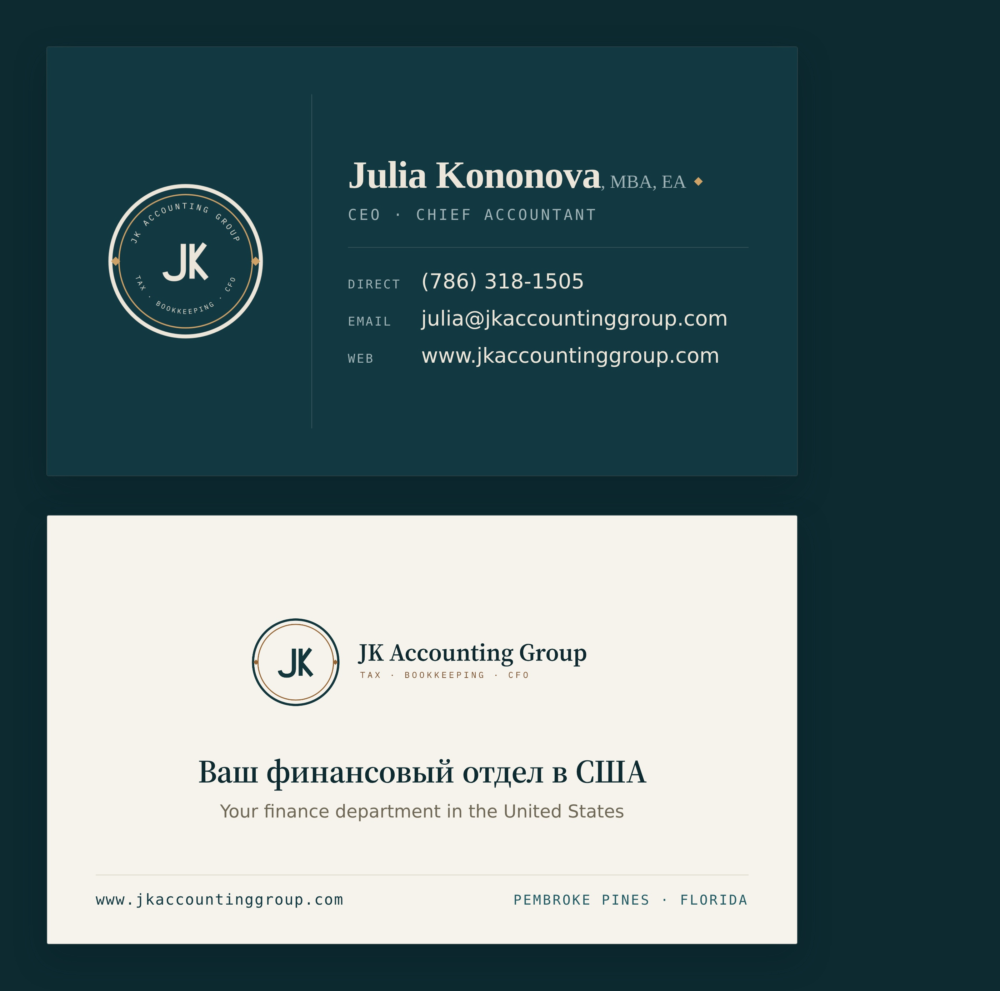

# Business card — Julia Kononova

Julia's two-sided business card, built entirely from the
[brand design system](../../../../../brand/JK-Brand-Guide.md). Exported to JPEG so
it can live in a phone's camera roll and be sent on WhatsApp — and at a size a
printer can still work from.



## The two sides

**Front — the deep-teal "moment panel"** (brand guide §7). Medallion reversed at
left, the details at right: deliberately the same *mark-left / details-right*
grammar as the [firm email signature](../../../email-branding/signatures/julia.html),
so the card and the email footer read as one object.

**Back — ivory.** The horizontal lock-up over the firm's positioning line in
Russian and English. **The card speaking Russian is itself the proof** of the
bicultural promise, so no claim about languages spoken is printed.

## Files

| File | What it is |
|---|---|
| `exports/julia-kononova-business-card-front.jpg` | **Front**, 2100 × 1200 |
| `exports/julia-kononova-business-card-back.jpg` | **Back**, 2100 × 1200 |
| `exports/julia-kononova-business-card.jpg` | Both sides on one image — the one to keep on a phone |
| `julia-kononova-card.html` | Source. Edit here, then re-export. |
| `build.mjs` | The export — deterministic, no network. |

2100 × 1200 is the US trim size (3.5 × 2 in) at **600 dpi**: sharp when zoomed on
a phone, and safe to hand to a printer. The brand's print spec is 1050 × 600 at
300 dpi (guide §8) — this is exactly 2× it.

## Re-exporting

```
node projects/marketing/collateral/assets/business-card/build.mjs
```

Chromium comes from the pre-installed Playwright browsers; nothing to install.
Fonts come from the committed Cyrillic-subset embed
([`brand/design-system/fonts-cyrillic-embedded.css`](../../../../../brand/design-system/fonts-cyrillic-embedded.css)),
and the logos are referenced from [`brand/logo/`](../../../../../brand/logo/) —
**never copied into this folder** (CLAUDE.md: brand is shared and central). So the
render needs no network and is reproducible.

Two implementation details worth knowing before you edit the HTML:

- `JK-medallion-reversed-1024.png` is **baked on `#123841`**, which is exactly the
  front panel's color — that is why the seal sits seamlessly on it and is never
  boxed. Change the panel color and you get a visible square.
- `JK-lockup-horizontal-2048.png` is baked on **white**, so on the ivory back it is
  composited with `mix-blend-mode: multiply`. That drops the white into the ivory
  and keeps the mark on the field directly, as the logo rules require.

## Printing it

The source is **trim size, no bleed**. Before sending to a printer, add the
0.125 in bleed the brand guide asks for (3.75 × 2.25 in) and convert to CMYK —
or ask for the bleed version to be generated.

## Where every value came from

Nothing on this card was invented.

| On the card | Source |
|---|---|
| Name, credentials, direct line, email | [`projects/sops/firm-identity.md`](../../../../sops/firm-identity.md) §2 |
| Website, Pembroke Pines · Florida | `firm-identity.md` §1 |
| **"CEO · Chief Accountant"** | The **email-signature** title. Proposals and engagement letters say *Chief Accountant* only; `firm-identity.md` §2 says both are correct in their own place — and a card is the signature's twin, so it carries the signature's title. |
| «Ваш финансовый отдел в США» / "Your finance department in the United States" | [`../../../positioning.md`](../../../positioning.md) — *"we become their finance department"* / «мы становимся их финансовым отделом». The RU is the settled wording, not a translation made here. |

**No booking link is printed.** Both booking URLs currently return 500
(`positioning.md`), and a printed card cannot be corrected later — so the card
carries the website only.
