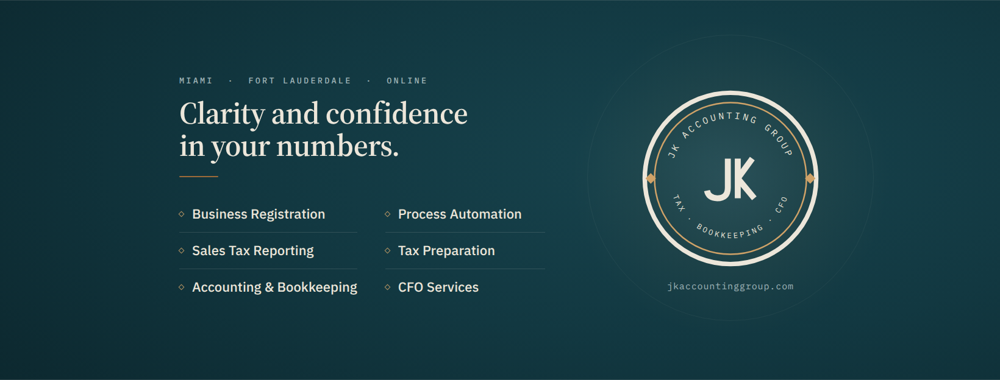

# Facebook cover — JK Accounting Group

On-brand cover photo for the firm's Facebook Page. Deep petrol-teal panel (the
brand's "dark moment" register) with the six headline services, the Medallion,
and the site URL — built entirely from the [brand design system](../../../../../brand/JK-Brand-Guide.md).

## Files

| File | What it is |
|---|---|
| `jk-facebook-cover-1640x624.png` | **The upload.** Facebook's recommended high-res cover size. |
| `jk-facebook-cover-3280x1248.png` | 2× archival export (extra sharpness / future use). |
| `jk-facebook-cover.html` | Source. Edit copy/layout here, then re-export (see below). |

## Uploading to Facebook

Use `jk-facebook-cover-1640x624.png`. Facebook displays the cover at **820×312**
on desktop and **640×360** on mobile, so it crops differently per device.

- All text and the Medallion sit inside the **central mobile-safe band** — nothing
  important is lost on phones.
- The **bottom-left corner is kept clear** because the round profile picture overlaps
  the cover there on desktop.

## Copy on the asset

- **Kicker:** `MIAMI · FORT LAUDERDALE · ONLINE`
- **Headline:** *Clarity and confidence in your numbers.* — in the firm's own web voice
  ("clarity and confidence", "understand your numbers"). Swap the `.headline` text to change it.
- **Services (kept verbatim from the previous cover):** Business Registration ·
  Sales Tax Reporting · Accounting & Bookkeeping · Process Automation · Tax Preparation · CFO Services
- **URL:** `jkaccountinggroup.com`

## Design system used

- **Palette:** Petrol Teal `#123841` / Deep Teal `#0D2A31` / Darkest `#091F24`;
  Soft Ivory `#ECE6DA` (text), muted `#9FB3B6` (labels); Warm Bronze `#9C6A39` /
  light `#CFA268` as the single sparing accent. ~60/32/8 teal/ivory/bronze.
- **Type:** Source Serif 4 (headline) · IBM Plex Sans (services) · IBM Plex Mono
  (kicker + URL) — the brand's mono-kicker → serif-headline → sans-body rhythm.
- **Logo:** the approved reversed Medallion (`brand/logo/svg/JK-medallion-reversed.svg`),
  inlined — never boxed, recolored, or redrawn.

## Regenerating the PNG

The HTML is a fixed 1640×624 stage. Screenshot the `.stage` element at that size
(2× device scale for the hi-res copy). Any headless-browser screenshot tool works;
the fonts load from Google Fonts, so render with network access (or embed the
woff2 as base64 for an offline render).

## Prompt for an AI image generator (ChatGPT)

This code-rendered asset is higher fidelity than an AI generator for a
text-and-logo cover (exact logo, fonts, and hex values). **NotebookLM does not
generate images.** ChatGPT *can*, but it will not reproduce the real Medallion
and tends to garble text — best used for an atmospheric background you then
composite the real logo onto. Prompt:

> Create a professional Facebook cover image, 1640×624 px (2.63:1 wide banner),
> for a boutique US accounting firm. Mood: calm, senior, premium, trustworthy —
> "quiet command." NOT a stock photo, NOT a desk/laptop/handshake scene, NO people
> or faces, NO navy-and-gold corporate cliché.
> Background: deep petrol-teal field with subtle depth (soft radial glow, faint
> concentric ring). Exact colors: petrol teal #123841, deep teal #0D2A31, darkest
> #091F24, soft ivory #ECE6DA (text), muted teal-gray #9FB3B6 (labels), warm bronze
> #9C6A39 / light bronze #CFA268 used very sparingly as the single accent
> (~60% teal / 32% ivory / 8% bronze).
> Typography (elegant, flat, crisp — no shadows, no gradient on text): a small
> uppercase wide-tracked monospaced label "MIAMI · FORT LAUDERDALE · ONLINE"; a
> refined serif headline "Clarity and confidence in your numbers."; a short bronze
> underline; then a clean two-column sans-serif list of six services with tiny
> bronze diamond markers: Business Registration, Sales Tax Reporting, Accounting &
> Bookkeeping, Process Automation, Tax Preparation, CFO Services.
> On the right: a circular medallion seal — double ring (ivory outer, thin bronze
> inner), a connected "JK" monogram in ivory, small bronze diamonds left/right,
> curved text "JK ACCOUNTING GROUP" (top) and "TAX · BOOKKEEPING · CFO" (bottom);
> below it, small monospaced "jkaccountinggroup.com".
> Keep all text and the logo within the central 68% of the width; keep the
> bottom-left corner clear. High-resolution flat vector style, editorial, minimal.
