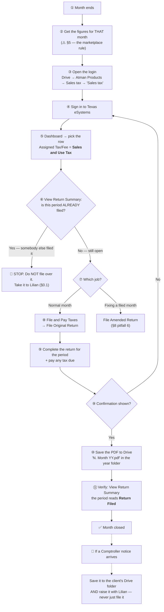

# Atman Parts — Texas Sales Tax (monthly)

> **Status:** Active · **Client:** ATMAN PARTS LLC · **Owner of SOP:** Lilian ·
> **Started:** Aug 2026 · **Last updated:** 2026-08-17
>
> The firm files this client's **Texas Sales and Use Tax return every month**, on the
> Texas Comptroller's **eSystems / WebFile** portal, using the credentials kept in the
> client's Google Drive folder. The client does not file it — we do.
>
> **Client data lives in the firm's systems, never in this repo.** The portal login, the
> taxpayer number, the WebFile numbers, the security answers, the filed returns and every
> figure live in **Google Drive** and are reached from the links in §9. This file holds the
> *procedure only*.
>
> 📋 **In review · Aug 2026 — Lilian. And PROVISIONAL by design.** Written 2026-08-17 at her
> request, from her own screenshots of that morning's session. **Awaiting her sign-off**, and
> the questions in §10 are open with her. **Remove this note when she signs off.** Tracked on
> [`FOLLOW-UPS.md`](../../FOLLOW-UPS.md) row 41.
>
> ⏳ **It becomes final when eBay is connected to QuickBooks.** Julia is going to make that
> connection; **the reports change with it**, and Lilian will hand over the resulting method,
> at which point §5 and §10.3 are rewritten. Everything else here — the access, the click path,
> the deadline, the penalties, the checks — **stands and is usable today.**
>
> 🔍 **What is verified here, and what is not.** The navigation in §2 and the screens in
> §2A were captured from a **real filing session on 2026-08-17** (Lilian's own screenshots)
> and are safe to follow. **The return-entry screens themselves were not captured**, and
> **how this client's figures are derived has never been written down** — see §5 and §10
> before you type a number into a return.

## The process at a glance

**The loop:** this repeats every month, on its own clock. It is **not** part of the
bookkeeping close — but unlike a zero return, **it does need figures** (§5), so it is the
one sales-tax filing in the firm that can be blocked by the books.

## §0. Who does what

1. **The firm files it — but we are not the only one who can, and in July we were not the one
   who did.** The login sits in the client's Drive folder and the work is ours.
   🔴 **On 2026-08-17 Lilian opened the portal to file July 2026 and found it already
   submitted.** She did not file it, and neither did anyone else at the firm.
   **Who filed it is not established** — Lilian's read is that **the client did it himself**,
   which is plausible (it is his taxpayer account and he can reach it) but has not been
   confirmed with him. **This is a live coordination gap, not a curiosity:** two parties can
   reach the same account and there is no agreement about who files. That is how a month gets
   filed twice, or not at all because each side assumed the other did it.
   **Until it is settled — always check the period before filing (§2, and §1.2).**
2. 🔴 **Nothing reminds anyone to do this.** Checked in Double on 2026-08-17: this client has
   **no recurring sales-tax task** — no task tagged `monthly sales tax`, nothing on a monthly
   cadence. The only thing carrying the job today is somebody remembering. **Every other
   monthly filing the firm runs has a reminder; this one does not** — see §10 item 1, it is
   the first thing to fix.
3. **The account is the client's, the credentials are in our Drive.** The eSystems profile
   is the client's own taxpayer account. The name in the top-right of the portal is **not**
   one of ours — that is expected, not a sign you signed in to the wrong place.
4. **Anything a Comptroller notice says goes to Lilian.** Filing a notice into Drive is not
   handling it.

## §1. Before you file: what you need in hand

1. **The eSystems login** — portal address, username, password, the three security answers,
   and the taxpayer / WebFile numbers. All of it is in **one Google Doc** in the client's
   Drive: `Atman Products > Sales tax > Sales tax`. Open it from §9.
2. **Which month you are filing — and whether it is still open.** One return per calendar
   month, in sequence. Two places tell you where you are, and they should agree:
   - the Drive year folder (§2 step 8) — the last PDF in it;
   - the portal's own **View Return Summary** list (§2A Screen 3) — **the authority.**

   ⚠️ **Read the portal list before you file, not after.** It does not only tell you which
   month is next — it tells you whether **somebody else has already filed it**. That has
   happened here (§0.1), so on this client it is a required check, not a nicety.
3. **The figures for that month** — total sales, taxable sales, and any taxable purchases
   the business made without paying tax. ⚠️ **Read §5 before you work these out.** This
   client sells on **eBay**, and Texas treats marketplace sales differently from the
   client's own sales; getting that backwards misstates the return in both directions.

**You do not need anything from the client.** Both the access and the figures come from
systems the firm already holds.

## §2. The monthly filing, step by step

> 🛑 **First, every time: check the period is not already filed.** Sign in, open
> **Transaction History → View Return Summary**, and look at the period you are about to file.
> If it already reads `Return Filed`, **stop and take it to Lilian** — do not file an original
> on top of it (§8.10). This is here because it happened: July 2026 was already filed by
> someone outside the firm when Lilian went to file it (§0.1).

1. **Open the login doc** and get the credentials (§1, §9).
2. **Sign in to Texas eSystems.** The exact sign-in address is in the login doc — use that
   one. (`comptroller.texas.gov` → *eSystems/Webfile* reaches the same place.)
3. **On the eSystems Dashboard, find "My Taxpayer Accounts".**
   ⚠️ **This business is listed TWICE** — same name, same taxpayer number, two rows. They
   are told apart only by the **Assigned Tax/Fee** column:
   - `Franchise Tax` — **not this procedure** (§7);
   - `Sales and Use Tax` — **this one.**
4. **Click the `Sales and Use Tax` row.** The next page names the tax type back at you —
   **check it says `Tax Type: Sales and Use Tax`** before going on.
5. **Choose `File Original Return`** under *File and Pay Taxes*, then **Continue**.
   - *Filing a month that was already filed?* That is **File Amended Return**, not this
     one (§8 pitfall 6).
6. **Select the period** and complete the return for it.
   - ⚠️ **Check the period before you submit.** The period is a 4-digit code — `2607` is
     **July 2026** (§2A Screen 3). A return filed against the wrong month leaves the month
     you meant still open, still accruing penalty (§4).
   - The figures and the marketplace treatment: **§5**.
7. **Submit, and pay any tax due.** *Make a Payment Only* is a separate menu item, for
   paying without filing — a normal month does both in one pass.
   **Submitting is not the end** — you are not done until steps 8 and 9.
8. **Save the filed return as a PDF** into the client's Drive year folder (§9), named to
   match what is already there: **`N. Month YY.pdf`** — `7. July 26.pdf`, `6. June 26.pdf`.
   `N` is the **sequence within that year folder**, not the calendar month number (the 2025
   folder starts at `1. November 25.pdf`, because November was the first period filed).
   **Match the folder, don't rename the history** — the numbering is the only index anyone
   has of what has been filed.
9. **Verify it landed.** Go back and choose **Transaction History → View Return Summary**
   (§2A Screen 3). The period you just filed should read **`Return Filed`**. This takes ten
   seconds and is the only thing that distinguishes "I submitted it" from "it is filed".

## §2A. The screens

Captured 2026-08-17. Three screens are documented; the return-entry screens after them are
**not** — see §10.

**Screen 1 — eSystems Dashboard**
- Top banner carousel (Comptroller announcements) — ignore it.
- **My Taxpayer Accounts** — a table: `Taxpayer/Vendor #` · `Assigned Account Name` ·
  `Assigned Tax/Fee` · `Delete`. **Two rows for this client** (Franchise Tax · Sales and
  Use Tax). 🔴 **Never touch the `Delete` (trash) icon** — it unassigns the tax account from
  the profile.
- `+ ASSIGN TAX/FEES` (top right) adds a tax account to the profile. Not part of a normal
  month.
- Below it, **eSystems Services** — a long list of unrelated state systems (Ag/Timber,
  Coin-Operated Machines, IFTA…). Nothing here is used for this filing.

**Screen 2 — Sales and Use Tax**
- A box confirming `Taxpayer:` · `Address:` · **`Tax Type: Sales and Use Tax`**.
- Seven options in three groups; pick one, then **Continue**:

  | Group | Options |
  |---|---|
  | **File and Pay Taxes** | `File Original Return` · `File Amended Return` · `Make a Payment Only` |
  | **Account Self-Service** | `Request a Duplicate Sales Tax Permit` · `Change Mailing Address and Contact` |
  | **Transaction History** | `View Return Summary` · `View Transaction History` |

- **Continue stays greyed out until an option is selected** — that is the control, not a
  broken page.
- `Return to eSystems Menu` goes back to Screen 1.

**Screen 3 — Select a Period**
- Reached from `View Return Summary` (and the same period-picker shape precedes a filing).
- Columns: `Period` · `Period Ending` · `Due Date` · `Balance` · `Description`.
- **The period code is `YYMM`** — `2607` = July 2026, `2512` = December 2025. This is the
  single most useful thing on the screen and nothing on the page explains it.
- `Balance: Closed` + `Description: Return Filed` is a period that is done and paid.
- **The Due Date column is the state's own answer to the weekend rule** (§3): period `2511`
  shows **Dec 22, 2025** and `2605` shows **Jun 22, 2026**, because 20 December 2025 and
  20 June 2026 were both Saturdays.

## §3. The deadline

| | Date |
|---|---|
| **Statutory due date** | The **20th of the month following** the period — July's return is due **20 August** |
| **If the 20th is a weekend or a legal holiday** | It moves to **the next business day**, automatically — no extension is requested |
| **Our internal reminder** | ⚠️ **None exists** (§0.2) |

📌 **The next one that moves: period `2608` (August 2026) is due Monday 21 September 2026**,
because 20 September 2026 is a Sunday.

*Due date and the weekend rule verified against the Texas Comptroller, and visible in this
client's own account (§2A Screen 3).*

## §4. What it costs

Filing costs nothing, and Texas **pays you a little** for doing it on time. The money in
this procedure is almost entirely the cost of being late.

1. **Timely filing discount — 0.5% of the tax due, in your favour.** Deducted on the
   return when it is filed **and paid** by the due date. It is the state's standing discount
   for permitted taxpayers, not something to negotiate.
2. **Late filing — $50, flat.** Assessed on **each** report filed after the due date,
   **regardless of whether any tax was owed**. A quiet month filed late costs $50.
3. **Late payment — 5%, then 10%.** 5% penalty on tax paid 1–30 days late; a further 5%
   (10% total) beyond 30 days. Interest starts after 60 days.

**Bottom line:** on time, the return pays for itself twice over. A month skipped costs $50
before any tax is even counted — and the $50 lands on a zero month just as hard.

*(A **prepayment discount** of 1.25% also exists for taxpayers who prepay an estimate of
the period's liability. **The firm does not use it for this client** and it is out of scope
here — do not start prepaying to chase it without Lilian.)*

## §5. ⚠️ The eBay problem — read this before you enter a figure

**This is the one thing about this client's return that a careful bookkeeper will get wrong
by being careful.**

Atman Parts sells on **eBay**. Under Texas law a **marketplace provider** (eBay) collects
and remits the tax on sales made through it, and the **marketplace seller** (our client)
does not. But the seller's return is **not** simply "everything except eBay":

- **Marketplace sales still go into Total Sales** — item 1 on the return.
- **They come OUT again at Taxable Sales** — item 2 — where the marketplace has certified
  it collects and remits.

So the two mistakes sit on opposite sides of the same line, and both look reasonable:

1. **Leaving eBay out of Total Sales entirely** — the return then understates the
   business's gross receipts and stops matching the books, the bank and the return.
2. **Leaving eBay inside Taxable Sales** — the client pays tax the marketplace has
   already paid.

Two things that go with it: the client **keeps their permit and keeps filing** even in a
month where every single sale went through the marketplace; and the client must **retain
records of the marketplace sales**, which is the firm's reason to hold the eBay figures
rather than only the bank.

> 🔴 **What is NOT established, and must not be guessed:** **how the firm actually derives
> this client's monthly figures** — which report, from eBay or QuickBooks or the bank, and
> whether the business has any non-marketplace sales at all. Nobody has written it down
> (§10 item 2). The rule above tells you **where each figure belongs**; it does not tell you
> **where to get it**. If you are filing this month and you do not know, **ask Lilian** —
> do not reconstruct it from the last filed PDF and hope.

> ⏳ **And it is about to change — do not write the derivation down yet.** Julia intends to
> **connect eBay to QuickBooks** for this client. Once that is done **the reports come out
> differently**, so whatever anyone works out today about where the figures come from would be
> obsolete almost immediately. _(Lilian, 2026-08-17 — the detail is not available yet; she will
> hand it over once the connection is made, and **§5 and §10.2 get rewritten from it then.**)_
> **Until then this section is the rule, not the recipe.**

*Rule: Texas Tax Code §151.0242(d) — a marketplace seller who accepts the provider's
certification in good faith **excludes** those sales from its report; the Comptroller's own
guidance places them in item 1 and out of item 2. Sources in §9.*

## §6. Filing history — what the record shows

1. **The account starts at period `2511` (November 2025).** Nothing earlier appears in the
   portal's return summary, and the Drive 2025 folder holds only November and December.
2. **Eight back periods were filed in one day.** Nov 2025 → Jun 2026 were all filed on
   **2026-07-16** as an onboarding catch-up. Several of the earlier ones carried
   late-filing penalties; May and June 2026 did not.
3. 🔴 **Period `2607` (July 2026) was filed — but NOT by the firm.** Lilian opened the portal
   on **2026-08-17** to file it and found it already submitted. **Who filed it is not
   established**; her read is that the client did it himself. See §0.1 — this is the reason
   the "already filed?" check now opens §2.
4. **Every period from `2511` to `2607` reads `Closed` / `Return Filed`.** As of
   2026-08-17 there is **no gap and no open balance** — this account is current. ⚠️ **What
   that does not tell you is who filed each one.** The eight catch-up periods were the firm's
   (2026-07-16); July was not; the ones in between have not been checked.

## §7. The other account on this login — Franchise Tax

The same profile carries a **Franchise Tax** account for the same LLC, and the login doc
holds a separate **Franchise Tax WebFile number** for it.

- **It is not covered by this SOP**, and it is not monthly — the Texas franchise report is
  **annual, due 15 May**.
- **A Texas LLC below the no-tax-due threshold still has an annual filing obligation** (the
  Public Information Report); the separate "No Tax Due Report" form was retired in 2024.
  Missing it can cost the entity its right to transact business in Texas.
- 🔴 **Whether the firm files this, and whether it has been filed, is NOT established** —
  it has been an open question on this client since July 2026. **Do not assume the sales-tax
  cadence covers it.** Raise it with Lilian (§10 item 3).

## §8. Common pitfalls

1. **Picking the wrong row on the dashboard.** Franchise Tax and Sales and Use Tax are the
   same business name, one above the other (§2 step 3).
2. **Filing against the wrong period.** `2607` is July 2026, not "the 26th of July" and not
   period 7 of anything. The month you meant stays open and keeps accruing (§2A Screen 3).
3. **Thinking a quiet month needs no return.** It does — and the $50 late penalty lands on
   a zero return exactly as hard as on a big one (§4).
4. **Getting the eBay figures backwards** — in *or* out of the wrong line. §5.
5. **Stopping at "submitted".** Without the PDF in Drive and the `Return Filed` check, the
   next person cannot tell the month was done (§2 steps 8–9).
6. **Using `File Original Return` to correct a filed month.** That is `File Amended
   Return`. The original is already on the account and does not get overwritten by a second
   original.
7. **Assuming the 20th.** Four of the twelve months a year land on a weekend; the portal's
   own Due Date column is the answer (§3).
8. **Filing a Comptroller notice and moving on.** It goes to Lilian the same day (§0.4).
9. **Renaming the Drive history to be tidy.** The `N.` numbering restarts per year folder
   and is the only filing index — match it, don't fix it (§2 step 8).
10. 🔴 **Filing an original on a period somebody else already filed.** On this client that is
    a real risk, not a theoretical one — July 2026 was filed by someone outside the firm
    (§0.1). **Check View Return Summary first, every month**, and if the period already reads
    `Return Filed`, stop and take it to Lilian rather than filing over it.

## §9. Contacts & links

| What | Where |
|---|---|
| 🔑 **The login** (portal address · user · password · security answers · taxpayer and WebFile numbers) | [`Atman Products > Sales tax > Sales tax`](https://docs.google.com/document/d/1vVZxsEdYCqnhyxCrpQbk-Fo0nB0JgBA3EcwZ7UBWfjw/edit) — a Google Doc in the client's Drive. **Everything needed to sign in is in this one document.** |
| **Texas eSystems / WebFile** — the portal | [comptroller.texas.gov/taxes/file-pay](https://comptroller.texas.gov/taxes/file-pay/) · **the exact sign-in address is in the login doc above** — use that one |
| **Filed returns, by year** | [Atman Products → Sales tax](https://drive.google.com/drive/folders/1QyyT14O-gNpn8Sn0_OuQ-LtGeL764xtG) — a folder per year (`2025`, `2026`) |
| **The client's whole Drive folder** | [Atman Products](https://drive.google.com/drive/folders/1j28nmUpb7u18MLzVO8punGFAbXBXcxJs) *(filed under "Atman Products" — a name variant of "Atman Parts", same client)* |
| **The client in Double** | [app.doublehq.com/close?cid=763909](https://app.doublehq.com/close?cid=763909) |
| **TX rules — marketplace providers & sellers** | [Marketplace Providers and Marketplace Sellers](https://comptroller.texas.gov/taxes/sales/marketplace-providers-sellers.php) · [Texas Tax Code §151.0242](https://texas.public.law/statutes/tex._tax_code_section_151.0242) |
| **TX rules — due dates, discounts, penalties** | [Sales and Use Tax due dates](https://comptroller.texas.gov/taxes/sales/due-dates.php) · [Reporting and payment FAQ](https://comptroller.texas.gov/taxes/sales/faq/report-pay.php) |
| **TX rules — franchise tax** (§7) | [Franchise Tax](https://comptroller.texas.gov/taxes/franchise/) |
| **What the firm knows about this client** | [`../client-intelligence/clients/atman-parts.md`](../client-intelligence/clients/atman-parts.md) |

## §10. Not yet written down

Recorded so the gaps are visible rather than discovered mid-task. **None of these blocks
this month's filing** — except item 3, which blocks the *figures* if you do not already
know them.

1. 🔴 **Who actually files this — us or the client?** The firm believes it owns this filing;
   **July 2026 was filed by somebody else** (§0.1), and Lilian's read is that it was the
   client. **Nobody has asked him.** Until this is settled the firm cannot know whether a
   month is covered, and **both duplicate filings and missed ones are possible**. This is the
   first question on this client — ahead of item 2, because a reminder for work someone else
   is already doing solves nothing.
2. 🔴 **There is no reminder.** No recurring Double task, no Routine, nothing. The firm's
   other monthly sales-tax client has one; this client does not (§0.2). **The fix is one
   recurring task on the Double client, tagged `monthly sales tax`, due around the 10th** —
   early enough that a missed reminder is still recoverable. Needs Lilian's go-ahead
   (creating tasks in Double is a write), **and it should wait on item 1.**
3. ⏳ **Where this client's monthly figures come from — deliberately unwritten, for now.**
   Which report is pulled, from which system, and how marketplace sales are separated from any
   direct sales (§5). **Julia is going to connect eBay to QuickBooks, and the reports come out
   differently after that**, so documenting today's method would be documenting something
   about to be replaced. **Lilian will hand over the new method once the connection is made;
   §5 and this item get rewritten from it — that is what turns this SOP from provisional into
   final.** _(Lilian, 2026-08-17.)_
3. **The franchise-tax position** (§7) — do we file it, and is it current? Open since
   July 2026.
4. **The return-entry screens.** §2A stops at the period picker. **Next time you file,
   capture the screens after it** — the item-by-item return, the confirmation page — and
   extend §2A. That is the cheapest moment to do it, and it is the difference between this
   SOP being a map and being a click path.
5. **The email map.** What the Comptroller sends after a submission — sender, subject,
   which inbox it reaches, and whether a confirmation email arrives at all. Nothing is
   recorded, so the saved PDF is currently the only receipt.
6. **The filing frequency as the state assigned it.** Monthly is what the account shows,
   but Texas assigns frequency by volume and **can change it**. Nobody has recorded the
   assignment or watched for a change notice.
