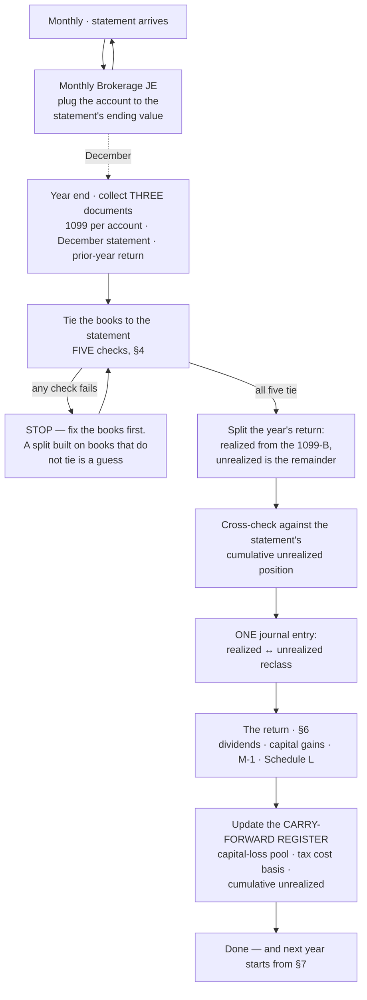

# Managed brokerage & investment accounts — monthly close, year-end close, and the tax return

> **Status:** 🟡 **Draft — in review (2026-09-09)** · **Owner of SOP:** Julia · **Last updated:** 2026-09-09
>
> **In review.** Written from the first full year-end worked end to end (a C-corporation with two
> managed accounts at one broker, FY2025). **Reviewer: Julia.** Remove this note once signed off.
> The tax-treatment section (§6) is the part to read hardest — it records what a filed return
> actually did, and one thing that return got wrong.
>
> ⏳ **The standalone Atlas render is not built yet** — deliberately, so the content is settled
> first. It is team-facing in the Knowledge Hub already (designed page + animated process flow).
> Build the standalone with the [`sop-authoring`](../../.claude/skills/sop-authoring/render/)
> engine at sign-off, and add it to the index row then.
>
> **No client data here.** Figures, account numbers and statements live in the firm's client
> systems (Google Drive / Double / QuickBooks). The **working paper for one client's return** —
> where the figures DO live — goes in [`projects/tax-returns/`](../tax-returns/).

**What this covers.** Any client whose books include a **brokerage or managed investment
account**: how the account is carried in QuickBooks month to month, what has to be collected at
year end, how the year's investment return is split into its taxable and non-taxable halves, and
how each half lands on the return. **It is an every-year procedure and the year-end half is the
part that gets forgotten**, because eleven months of the year the monthly entry is enough.

---

## The process at a glance



---

## §0 · Does this SOP apply to this client?

Ask three questions. **Any "yes" means the whole SOP applies.**

1. Does the chart of accounts carry an account whose name contains **brokerage, investment,
   securities, portfolio, advisory** or a broker's name?
2. Does the client receive a **Consolidated Form 1099** (a 1099-DIV and 1099-B in one booklet)
   from a broker?
3. Is there a **monthly journal entry** in the books whose source is a brokerage statement?

**One more question decides how much work year end is:**

4. **Does the firm have live access to the account, or only the statements?** Where we have only
   the statements — the common case, because these are the client's personal-banker
   relationships — **every figure in this SOP comes from a document somebody has to request.**
   Put the request in the December close checklist, not in January.

---

## §1 · The mental model — read this before anything else

**The books carry the account at MARKET VALUE.** The monthly entry plugs the QuickBooks account
to whatever the statement says the account was worth at month end. That is deliberate and it is
correct for the client's own reporting — the balance sheet shows what the portfolio is actually
worth.

**Three consequences follow, and all three are the reason this SOP exists:**

- **1A. The balancing line of that entry is not "gain".** It absorbs, in one number, everything
  the account did that was not income or fees: **securities sold at a profit or a loss
  (realized)** *and* **securities that simply moved in price and are still held (unrealized)**.
  It is a plug, and a plug is not a tax figure.
- **1B. Only ONE of those two halves is taxable.** A gain the client has not realised is not
  income and never appears on a return. A realized gain or loss is a capital item with rules of
  its own. **Splitting them is the whole job at year end**, and it cannot be done from the books
  alone — the books do not know which is which.
- **1C. The split is a YEAR-END job, not a monthly one.** Do not try to split it every month;
  there is no monthly document that supports it, and a monthly guess compounds. Eleven months of
  the year the plug is the right answer.

> 🔑 **Say this to anyone who asks why the P&L shows a big "investment income" number the client
> did not receive in cash:** most of it is the portfolio going up on paper. It is real, it belongs
> on the client's own financial statements, and it is not taxed until something is sold.

---

## §2 · The monthly close

1. **Get the statement.** Where the firm has no direct access, request it through whatever channel
   the client uses (the portal, email). **Chase it — a missing month cannot be reconstructed from
   the next one**, because the next statement gives only its own period's movement.
2. **Post one journal entry per month, with one block per account.** Each block:

   | Line | Account | Side | Source on the statement |
   |---|---|---|---|
   | 1 | **Dividend Income** | Credit | The statement's **Income** for the period |
   | 2 | **Bank Fees & Charges** *(or an Investment Management Fees account)* | Debit | The statement's **Fees** for the period |
   | 3 | **Investment Income/Loss** | Debit **or** Credit | ⚠️ **the plug — see §1A** |
   | 4 | **The brokerage asset account** | Debit **or** Credit | Whatever makes the account equal the statement's **ending value** |

3. **Two accounts, two blocks, one entry.** Where a client has several accounts at the same
   broker, keep a separate block per account inside the one monthly entry. It costs nothing and it
   is what makes the year-end reconciliation possible per account.
4. **Cash moving in or out is NOT the plug.** A transfer between the client's own accounts, or a
   deposit from the operating bank account, is a transfer — post it as one. If it goes through the
   plug the year-end split will be wrong by that amount and nothing will flag it.
5. **Label the entry so it can be found**: `Journal Entry (MM-YYYY Brokerage)` or similar. At year
   end somebody has to list twelve of them.

> ⚠️ **A month with no entry is invisible.** Nothing in QuickBooks says "the March statement was
> never booked". The year-end tie in §4 is what catches it — which is another reason not to skip it.

---

## §3 · Year end — the THREE documents, and what each is for

**None of these is optional and they answer different questions.** Request all three together.

| # | Document | Where it comes from | What only it can tell you |
|---|---|---|---|
| **1** | **Consolidated Form 1099** — *one per account* | The broker, usually mid-February | **The tax figures.** Dividends by IRS box, the realized gain/loss split short vs long term, wash sales, foreign tax withheld, and the management fees for the year |
| **2** | **The December (year-end) statement** | The broker, early January | **The book figures and the ties.** Beginning and ending account value, income and fees for the year, the year's **change in investment value**, whether cash moved, and the **cumulative unrealized position** |
| **3** | **The prior-year FILED return** | The firm's own copy | **The opening position** — last year's cumulative unrealized, the capital-loss pool, and how the firm presented all of this last time |

**Three things about these documents that have already cost time:**

- ⚠️ **A "1099" is per account, but a "statement" may not be.** One year-end statement can cover
  every account the client holds at that broker — its summary pages will say something like
  `Managed(2)`. **Check the account count before chasing a second file that does not exist.**
- ⚠️ **The 1099 arrives weeks after the statement**, and a **CORRECTED** 1099 can arrive weeks
  after that (mutual funds reclassify). **Note the version you worked from**, and if a corrected
  one lands after the return is filed, that is an amendment question, not a filing error.
- ⚠️ **The broker's own PDFs can defeat text extraction.** They routinely carry fonts with no
  Unicode map, which come out as `/uniXXXX` glyph names — a document that looks unreadable is
  usually just this, and decoding the glyph names recovers it. Blank pages in a return PDF, on the
  other hand, are usually **genuinely blank** — supporting statements that were never included in
  that copy. **Ask for the complete file rather than assuming the statements do not exist.**

---

## §4 · The FIVE ties — do these before computing anything

**Every one of these must pass before the split in §5 is worth doing.** They take ten minutes and
they are what turns the year-end figure from a derivation into a reading.

| # | Check | Book side | Statement side |
|---|---|---|---|
| **1** | **Opening value** | The brokerage account at **last** 31 December | The statement's **Beginning Account Value, year-to-date** |
| **2** | **Closing value** | The brokerage account at **this** 31 December | The statement's **Ending Account Value** *(use **with accruals** if both are shown, and use the same one every year)* |
| **3** | **Income for the year** | The **Dividend Income** account | The statement's **Income, year-to-date** |
| **4** | **Fees for the year** | The **fees** account | The statement's **Fees, year-to-date** — and the 1099's own fee schedule, which should agree |
| **5** | **The year's investment movement** | **Investment Income/Loss**, parent **and** every sub-account, added together | The statement's **Change in Investment Value, year-to-date** |

**Plus one line that is not a tie but answers the question everyone asks next:**

- 🔎 **`Net Deposits / Withdrawals`, year-to-date.** This is the proof of whether the client put
  money in or took money out. **Zero means the whole change in value is investment performance**,
  and the roll-forward can be trusted. A non-zero figure that is only a **transfer between the
  client's own accounts** nets to zero across the accounts — check the pair before treating it as
  funding.

**If a check fails, stop and fix the books.** In order of likelihood: a month was never booked; a
deposit or withdrawal went through the plug instead of being posted as a transfer; the "with
accruals" and "without accruals" values were mixed between years; an entry was posted to the wrong
account of a pair.

> ✅ **When all five tie, the monthly work is proved correct for the whole year** — including any
> months you cannot see, because the statement's year-to-date roll-forward covers them.

---

## §5 · The split, and the one journal entry

### 5A · The arithmetic

```
  Change in Investment Value for the year        (statement, §4 check 5)
− Net realized gain/(loss) for the year          (the 1099-B totals, ALL accounts, short + long)
─────────────────────────────────────────────
= UNREALIZED gain/(loss) for the year
```

**That is the whole computation.** The realized half comes from a tax document; the unrealized
half is what is left. Do it **per account and in total** — the total is what goes on the return,
the per-account figures are what let you find an error.

### 5B · The cross-check that makes it safe

```
  Cumulative unrealized at LAST year end          (the prior-year working paper, or last year's return)
+ Unrealized for THIS year                        (from 5A)
─────────────────────────────────────────────
≈ Cumulative unrealized at THIS year end          (the December statement's own Unrealized Gain/Loss Summary)
```

**These will be close but not identical, and that is expected.** The statement's unrealized total
**excludes positions for which the broker has no cost basis** and its realized figures **omit wash
sales from the last business day of the period** — both are printed on the statement itself. **A
gap of a few tens or hundreds of dollars on a seven-figure portfolio is the normal residual. A gap
of thousands is an error — go back to §4.**

### 5C · The entry

**One entry, dated 31 December, moving the plug into its two named halves.** Nothing else changes:
net income does not move and the balance sheet is untouched. It exists so that next year's
preparer can read the two figures instead of deriving them.

| | Debit | Credit |
|---|---|---|
| **Investment Income/Loss** *(realized)* — brought to the 1099-B net figure | `<amount>` | |
| **Investment Income/Loss : Unrealized Gain/Loss from Investment** — brought to the §5A figure | | `<amount>` |

*(Signs reverse when the year's unrealized movement is a loss and the realized half a gain.)*

**Use a parent account with a named sub-account**, so the P&L shows the split without a second
report. `Investment Income/Loss` as the parent (realized), `Unrealized Gain/Loss from Investment`
as its child.

### 5D · What NOT to adjust

⛔ **Do not force the book Dividend Income to equal the 1099.** They will differ, and neither is
wrong: **the statement measures income over its own statement periods; the 1099 uses the payment
date and the IRS's classifications.** The books follow the statement, the return follows the 1099,
and the difference is a book-to-tax timing item that belongs on Schedule M-1 — not in a journal
entry. **Chasing it to zero corrupts a set of books that currently ties to the statement exactly.**

---

## §6 · The tax return

> 🛑 **Read the current-year form and instructions from irs.gov before entering anything that
> changes a figure.** Line numbers move and Schedule C of Form 1120 has been renumbered before.
> The section references below are the law and are stable; the **line numbers are the part to
> re-verify each year.** Last verified against the **2024** forms, 2026-09-09.

### 6A · Form 1120 (C-corporation) — where each piece lands

| What it is | Source | Where it goes | Watch for |
|---|---|---|---|
| **Ordinary dividends** | 1099-DIV **box 1a** | **Schedule C**, then page 1 **line 4** | 🔴 **The DRD — see §6B. This is the one worth money.** |
| **Capital gain distributions** | 1099-DIV **box 2a** | **Schedule D**, capital gain distributions line | They are **long-term**, always, however long the fund was held. **They are not dividends** — do not leave them in line 4 |
| **Nondividend distributions** *(return of capital)* | 1099-DIV **box 3** | **Nowhere on the return** | Not income. It **reduces the cost basis** of the position — record it in the carry-forward register (§7) |
| **Realized gains and losses** | 1099-B totals, per account | **Form 8949 → Schedule D** | Wash sales are **already inside** the reported gain/loss — do not adjust again |
| **Net capital LOSS** | Schedule D | 🛑 **Not deductible — see §6C** | Schedule D Part III must come out at **0** to page 1 line 8 |
| **Interest** | 1099-INT | page 1 **line 5** | ⚠️ **A portfolio of bond and money-market FUNDS pays DIVIDENDS, not interest.** No 1099-INT is normal and is not a missing document |
| **Foreign tax withheld** | 1099-DIV **box 7** | Deduct it, **or** credit it on Form 1118 | For a small amount, deduct — Form 1118 is not worth the preparation. **It is often not in the books at all**, having been netted inside the account |
| **Investment management fees** | The 1099's fee schedule *(ties to the books, §4 check 4)* | An ordinary deduction | ✅ **Deductible for a corporation** under §162. The §67(g) suspension that kills this deduction on a **1040** is an individual rule and does not apply |
| **The corporation's own federal income tax** | The books | ⛔ **NOWHERE — never deductible, §275(a)(1)** | 🛑 **Not a timing question.** Cash basis does not make it deductible in the year paid, and accrual does not make it deductible in the year owed. It is added back on **Schedule M-1 line 2**, whatever the basis. ⓘ **STATE income tax IS deductible** *(page 1 line 17)* — that is the distinction people reach for |
| **Unrealized gain or loss** | §5A | 🛑 **Schedule M-1 — and the line depends on the SIGN. See §6D** | This is the single most-likely thing to be copied wrongly from last year |

### 6B · 🔴 The dividends-received deduction — do not default to "Other dividends"

**A C-corporation may deduct a percentage of dividends it receives from domestic corporations**
(§243 — **50%** for a less-than-20%-owned payer, **65%** at 20% or more). On Schedule C those go on
the **first lines, which carry a percentage column**. There is also a catch-all line near the
bottom — **"Other dividends" — which carries NO percentage and therefore no deduction.**

⚠️ **Putting the whole dividend figure on the catch-all line is the easy, silent mistake, and it
has already happened on a real filed return** (FY2024: the entire dividend total went to Other
dividends; total special deductions came out at zero).

**What to do instead, in order:**

1. **Look at what the account actually holds.** A statement names the strategy. **Domestic equities
   are the DRD candidate.** Cash, money-market and bond funds are essentially never.
2. **A mutual fund or ETF is a RIC**, and its dividend qualifies **only to the extent the fund
   reports it** as eligible under §854(b). **The consolidated 1099 does not report this.** It comes
   from the fund's own tax-information letter, or by asking the broker.
3. **Check the holding period — §246(c).** The stock must be held **more than 45 days during the
   91-day period beginning 45 days before the ex-dividend date.** 🛑 **This bites hardest exactly
   where the DRD looks biggest**: a portfolio that was rebuilt late in the year can fail the test
   on the very dividends that made it worth checking.
4. **If eligibility cannot be established, use the catch-all line — but write down that you asked
   and what the answer was.** An untaken deduction with a reason is a decision; an untaken
   deduction with no note is next year's repeat.

> ⓘ **"Qualified dividends" on the 1099 is not the same test.** That box exists for individuals'
> tax rates. It is a useful **shortlist** — it points at the domestic-equity dividends — but it is
> not the DRD answer.

### 6C · A corporate capital loss is not deductible — and the pool must be tracked

- **§1211(a):** a corporation deducts capital losses **only against capital gains.** A net capital
  loss deducts **nothing** in the year it arises. *(This is not the $3,000 individual rule — there
  is no equivalent for a corporation.)*
- **§1212(a):** the loss is carried **back 3 years and forward 5**, and in the year it is used it
  is treated as a **short-term** loss whatever its original character.
- 🛑 **The return does not record the pool anywhere.** Schedule D has a line for a carryover being
  *used*, and when there are no gains to absorb it, **that line stays blank and the loss leaves no
  trace on the filing at all.** If the firm does not track it, it is lost.
- ✅ **So it goes in the carry-forward register (§7), with the year it arose and the year it
  expires.** Then on the first return with capital gains, it is entered on Schedule D's unused
  capital-loss-carryover line, oldest year first.

### 6D · Schedule M-1 — the two lines, and the sign trap

**Two separate book-to-tax differences arise every year from these accounts, and they go on
different lines:**

1. **The unrealized gain or loss.**
   - 🟢 **A book unrealized GAIN** → **line 7**, *income recorded on books this year not included
     on this return*.
   - 🔴 **A book unrealized LOSS** → **line 5**, *expenses recorded on books this year not deducted
     on this return*.
   - **Itemize it with a plain label** — `Unrealized Gains/Losses` — so the reviewer can see what
     it is. *(A real filed return used exactly that wording on line 5 for a loss year.)*
   - 🛑 **This is the trap.** The line depends on the **sign, which flips between years**. A
     preparer who copies last year's placement will put a gain on the loss line, and the return
     will still balance internally while being wrong. **Check the sign before choosing the line,
     every single year.**
2. **The non-deductible capital loss** → **line 3**, *excess of capital losses over capital gains*.
   That line exists for exactly this and needs no itemisation.
3. **The dividend timing difference** (§5D) — the book/1099 gap, plus any return of capital — is a
   third, usually small item. Put it with the unrealized on the same side, or itemise it
   separately if it is large enough to explain.

**The M-1 has to come out at page 1's taxable income before special deductions. If it does not,
one of the three items above has the wrong sign.**

### 6E · Schedule L — a presentation defect to fix

**In QuickBooks a brokerage account is usually set up as a *Bank* type account.** It therefore
rolls into **Schedule L line 1, Cash** — which is where a real filed return put it.

⚠️ **A portfolio of equities and funds is not cash.** It belongs on the **Other investments** line,
with the supporting statement. It changes no tax, but it materially misstates the balance sheet the
client and any lender reads. **Reclassify it on the return** *(and consider changing the QuickBooks
account type, which is the durable fix — but only with the bookkeeper, because the type change
affects the bank-feed and reconciliation behaviour)*.

**Also on Schedule L:** the **beginning column is copied from last year's filed return, never
recalculated from QuickBooks.** Where the two disagree — and they can, if last year's return
adjusted something the books never carried — the return governs, and the difference is written into
the working paper so nobody re-derives it next year.

**Schedule M-3** replaces M-1 at **$10 million** of total assets. Below that, M-1.

### 6F · The same facts on other return types

| | What changes |
|---|---|
| **Form 1120-S** | There is **no DRD**. Dividends and capital gains are **separately stated on Schedule K** and must **not** sit inside ordinary business income. The capital loss **passes through to the shareholders**, where the individual rules apply — it is not trapped at entity level. The M-1 treatment of the unrealized figure is the same, where Schedules L and M-1 are required at all |
| **Form 1065** | As 1120-S: separately stated, passed through, no DRD |
| **Form 1040** | Dividends to **Schedule B**, capital gains to **Schedule D** with the **$3,000** net-loss limit and an **unlimited** carryforward. 🛑 **Investment management fees are NOT deductible** (§67(g), through 2025) — the opposite of the corporate answer in §6A, and the contrast is why that row spells it out |

---

## §7 · The carry-forward register — what next year needs from this year

**Write these into the client's working paper in
[`projects/tax-returns/`](../tax-returns/) every year.** They are the entire opening position, and
every one of them is expensive to reconstruct.

- [ ] **Cumulative unrealized gain/(loss) at year end** — the statement's figure, and the running
      book total. Next year's §5B cross-check needs it.
- [ ] **Tax cost basis of the portfolio** = book carrying value **−** cumulative unrealized. The
      one figure that reconciles the balance sheet to the tax basis.
- [ ] **Capital-loss pool** — each year's unused loss, with the year it arose and the year it
      expires (§6C).
- [ ] **Cumulative return of capital** received, which reduces basis and which nothing else records.
- [ ] **The DRD answer** — what the broker or fund said about §243/§854(b) eligibility, and whether
      the holding-period test was met. Whether or not the deduction was taken.
- [ ] **Which value convention was used** — "with accruals" or "without" (§4 check 2). Changing it
      between years breaks the roll-forward.
- [ ] **Any Schedule L or M-1 presentation the return took that the books do not carry**, so next
      year's beginning column can be copied rather than re-derived.

---

## §8 · Common pitfalls

1. **Treating the monthly plug as "gain".** It is realized *and* unrealized together, plus anything
   posted to it by mistake. §1A.
2. **Copying last year's Schedule M-1 line.** The line depends on the **sign**, and the sign flips.
   §6D.
3. **Sending the whole dividend figure to "Other dividends"** and taking no DRD without ever asking
   whether one was available. §6B.
4. **Expecting the 1099 and the statement to agree.** They will not, they are measuring different
   things, and forcing them together breaks a set of books that ties. §5D.
5. **Deducting a corporate capital loss.** It deducts nothing, and the carryforward leaves **no
   trace on the filed return** — so if the firm does not write it down, it is gone. §6C.
6. **Assuming no 1099-INT means a missing document.** Bond and money-market **funds** pay
   dividends. §6A.
7. **Splitting monthly.** There is no monthly document that supports it. §1C.
8. **Posting a deposit or withdrawal through the plug.** It corrupts the year-end split silently,
   and only §4's `Net Deposits / Withdrawals` line catches it.
9. **Skipping a month's statement.** Nothing in the books flags it; only the §4 ties do.
10. **Leaving the portfolio in Schedule L "Cash".** No tax effect, a materially wrong balance
    sheet. §6E.
11. **Working from a 1099 without checking whether a CORRECTED one has since arrived.** §3.
12. **Chasing supporting statements that were never in the PDF you were given.** Blank pages in a
    return copy are usually genuinely blank — ask for the complete file. §3.

---

## §9 · Where things live

| | |
|---|---|
| **The client's statements and 1099s** | The client's document-exchange channel and the firm's Drive — **never this repo** |
| **The figures for one client's return** | [`projects/tax-returns/<client>/<year>-<form>.md`](../tax-returns/) — the only place in the repo that holds them |
| **What the firm knows about the client** | [`projects/client-intelligence/clients/`](../client-intelligence/clients/) — **no figures** |
| **The client's monthly bookkeeping runbook** | `projects/sops/<client>-bookkeeping-review.md` — should link here for the year-end half |
| **Form 1120-S procedure** | [`form-1120s-preparation.md`](./form-1120s-preparation.md) |
| **Form 1040 procedure** | [`form-1040-preparation.md`](./form-1040-preparation.md) |

---

## Appendix · Blank year-end worksheet

📗 **There is an Excel version, and it is the better one:** [`assets/Form-1120-Preparation-Worksheet.xlsx`](./assets/Form-1120-Preparation-Worksheet.xlsx) — tab **5 · Investments** is this appendix with the arithmetic live, the ties self-checking, and the split feeding Schedules C, D and M-1 automatically. Use the workbook for a real year; the text below is for reading, for a client whose return is not a 1120, and for when you want the shape without opening Excel.

Copy this into the client's working paper and fill it in. **Do not fill it in here.**

```
CLIENT: <name>              TAX YEAR: <year>           BROKER: <name>
ACCOUNTS: <last-4>, <last-4>            1099 version: ORIGINAL / CORRECTED <date>

THE FIVE TIES (§4)                          BOOKS            STATEMENT        ✅/⚠️
1  Opening value (last 31 Dec)              ..............   ..............   ....
2  Closing value (this 31 Dec)              ..............   ..............   ....
3  Income for the year                      ..............   ..............   ....
4  Fees for the year                        ..............   ..............   ....
5  Change in investment value               ..............   ..............   ....
   Net deposits / withdrawals YTD:  ..............   (transfer between own accounts? Y/N)

THE SPLIT (§5)
   Change in investment value               ..............
   less  1099-B net realized                ..............
   =     UNREALIZED for the year            ..............
   Cross-check: prior cumulative .......... + this year .......... = ..........
                statement cumulative ..........      residual ..........  ✅/⚠️

THE ENTRY (§5C)   DR Investment Income/Loss ..........  CR Unrealized ..........

THE RETURN (§6)
   1099-DIV box 1a  ..........  → Sch C line ....   DRD eligible? ..........
   1099-DIV box 2a  ..........  → Sch D (long-term)
   1099-DIV box 3   ..........  → basis reduction, not income
   1099-DIV box 7   ..........  → deducted / credited
   1099-B  ST ..........  LT ..........  net ..........  → Sch D, to page 1 = ..........
   Management fees  ..........  → deducted
   M-1: unrealized ..........  on line 5 / line 7  (SIGN CHECKED: ....)
        capital loss ..........  on line 3
        dividend timing ..........
   Schedule L: portfolio shown as Cash / Other investments

CARRY FORWARD (§7)
   Cumulative unrealized ..........   Tax cost basis ..........
   Capital-loss pool: <year> .......... expires <year>;  <year> .......... expires <year>
   Cumulative return of capital ..........
   DRD answer: ..........................................
   Value convention: with accruals / without
```
