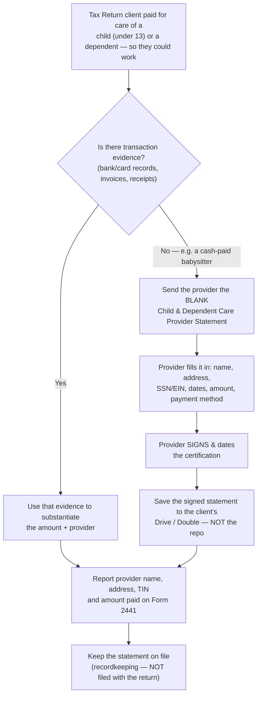

# SOP: Child & Dependent Care — Provider Statement (substantiating the credit)

> **Status:** Active · **Owner:** Lilian · **Last updated:** 2026-07-27
>
> **Where client data goes:** the **completed, signed** statement — with the
> provider's name, address, SSN/EIN, and the dollar amount — is **sensitive**. It
> lives in the **client's Drive / Double** folder, **never** in this repo. This
> SOP keeps only the reusable procedure and the **blank** template
> ([`assets/child-dependent-care-provider-statement.pdf`](./assets/child-dependent-care-provider-statement.pdf)).

When a Tax Return client paid for the care of a child or dependent (e.g. a
**babysitter** for a child under 13) so the client could work, those costs may
qualify for the **Child and Dependent Care Credit** on the client's return. To
claim it, the IRS requires the **care provider's name, address, and taxpayer ID
(SSN or EIN)** plus the **amount paid**. When there is **no transaction trail**
(the babysitter was paid in cash, no invoices, no bank/card record), we ask the
provider to complete and **sign** this statement. The signed statement is our
**substantiation** — it documents the amount paid, the method of payment, and the
provider's ID so the credit can be claimed and defended if the IRS asks.

---

## The process at a glance

A dependent-care cost with **no payment evidence** → send the provider the
**blank** statement → the provider fills it in and **signs** it → save the signed
copy to the client's systems → use it to report the provider + amount on **Form
2441** and keep it on file (it is **not** filed with the return).

## §0. When to run this

1. **Trigger:** a Tax Return client had **child- or dependent-care expenses**
   during the tax year (typically a **babysitter / in-home caregiver** for a
   child under 13) **and there is no clean transaction record** of the payments
   (cash, no invoices).
2. **Goal:** obtain a **signed statement from the care provider** so the firm can
   substantiate the amount paid, the payment method, and the provider's taxpayer
   ID — the pieces the **Child and Dependent Care Credit** (Form 2441) needs.
3. **Only when evidence is missing.** If the client already has bank/card records
   or invoices that prove the payments, use those; this statement is the fallback
   for the **no-paper-trail** case.

## §1. Why this form exists — the tax background

1. **The credit.** Paying someone to care for a **qualifying person** — a child
   **under 13**, or a spouse/dependent who can't care for themselves — **so the
   taxpayer (and spouse, if filing jointly) can work or look for work** can earn
   the **Child and Dependent Care Credit**.
2. **How it's claimed.** On **Form 2441**, attached to the client's Form 1040. The
   form requires the **care provider's name, address, and taxpayer identification
   number** — an **SSN** for an individual (a babysitter), an **EIN** for a
   business (a daycare).
3. **Why the signed statement.** When the client paid in cash with no records,
   the provider's **signed** statement is what documents (a) **how much** was
   paid, (b) **how** it was paid, and (c) the provider's **ID**. It gives the
   claimed figure evidentiary weight if the return is ever examined.
4. **It is NOT filed.** This statement is **recordkeeping only** — it is kept in
   the client's file and is **not** attached to or filed with the tax return (the
   form says so at the bottom). What goes on the return is the information **from**
   it, entered on Form 2441.

## §2. What you need before you start

You need, in hand:

1. The **blank template** —
   [`assets/child-dependent-care-provider-statement.pdf`](./assets/child-dependent-care-provider-statement.pdf).
2. The **tax year** the care applies to.
3. A way to reach the **care provider** (the babysitter/caregiver) to have them
   complete and **sign** it — and, ideally, the amounts/dates the client says they
   paid, so the client and provider figures can be cross-checked.
4. The **client's Drive / Double** folder open, to file the signed copy.

## §3. Have the care provider complete the statement

Send the provider the **blank** PDF and ask them to fill in every field and
**sign**. The fields, and what each is for:

**3A. Provider Information** (the person or business who was paid)

1. **Provider Name** — the caregiver's legal name.
2. **Business Name (if applicable)** — only if the provider operates as a business
   (a daycare); leave blank for an individual babysitter.
3. **Street Address** and **City, State, ZIP** — the provider's address (Form 2441
   needs it).
4. **Phone Number**.
5. **SSN or EIN** — the provider's **taxpayer ID**: an **SSN** for an individual,
   an **EIN** for a business. This is the single most important field — Form 2441
   requires it.

**3B. Care Recipient Information**

1. **Child / Dependent Name** — the qualifying person who was cared for.
2. **Dates Care Provided (From – To)** — the period of care within the tax year.

**3C. Payment Information**

1. **Total Amount Paid for Tax Year** — the total the client paid this provider
   during the tax year.
2. **Method of Payment** — Check · Cash · Electronic · Other (this is the whole
   point when the payments were **cash**).

**3D. Certification — the signature is what matters**

1. The provider **signs and dates** the certification and prints their name,
   certifying the information is true and correct.
2. **An unsigned statement is not substantiation.** Do not file it until it is
   signed — the signature is what gives it weight.

## §4. After it's signed — where it goes and how it's used

1. **Save the signed statement** to the **client's Drive / Double** folder for the
   tax year — **never** commit it to this repo (it carries the provider's SSN and
   the client's figures).
2. **Use the information on Form 2441** — the provider's name, address, and
   SSN/EIN, and the amount paid — when preparing the return.
3. **Keep it on file** as the supporting document. It is **not** sent to the IRS
   with the return; it is produced only if the credit is later questioned.

## §5. Related consideration — in-home caregivers (household-employment flag)

Not part of this form, but **flag it** when the caregiver worked **in the client's
home**: paying an in-home babysitter/nanny above the IRS annual threshold can make
the **client a household employer** (the "nanny tax"), with its own payroll/Schedule
H obligations — a separate matter from claiming the credit. If the amounts look
large or the arrangement looks like ongoing in-home employment, **raise it with
Julia** rather than assuming it's only a credit question. (Verify the current-year
threshold when it comes up; don't rely on a number from memory.)

## §6. Common pitfalls

- **No signature = no substantiation.** The value of the statement is the
  provider's **signed** certification. Collect it signed and dated, or it doesn't
  do its job.
- **Missing the provider's TIN.** Form 2441 needs the provider's **SSN or EIN**.
  If the provider won't give it, the credit is at risk — the taxpayer must show a
  **due-diligence** effort to obtain it. Don't leave that field blank silently;
  escalate.
- **Individual vs. business ID.** An individual babysitter uses their **SSN**; a
  daycare/business uses its **EIN** — not interchangeable.
- **Don't file it with the return.** It's recordkeeping; only the data goes on
  Form 2441. Filing the statement itself is unnecessary.
- **Never commit the completed form.** The signed copy holds an SSN and dollar
  figures — it stays in the client's systems. Only the **blank** template lives in
  the repo.

## §7. Links & references

| What | Where |
|---|---|
| Blank template (this repo) | [`assets/child-dependent-care-provider-statement.pdf`](./assets/child-dependent-care-provider-statement.pdf) |
| IRS Form 2441 (Child and Dependent Care Expenses) | [irs.gov/forms-pubs/about-form-2441](https://www.irs.gov/forms-pubs/about-form-2441) |
| IRS Publication 503 (Child and Dependent Care Expenses) | [irs.gov/forms-pubs/about-publication-503](https://www.irs.gov/forms-pubs/about-publication-503) |
| Completed, signed statement | The **client's Drive / Double** folder (never the repo) |

## Appendix — the blank template

The blank, copy-out form is committed at
[`assets/child-dependent-care-provider-statement.pdf`](./assets/child-dependent-care-provider-statement.pdf).
It is a one-page statement the care **provider** completes and signs:

- **Tax Year**
- **Provider Information** — Provider Name · Business Name (if applicable) · Street
  Address · City, State, ZIP · Phone Number · **SSN or EIN**
- **Care Recipient Information** — Child / Dependent Name · Dates Care Provided
  (From – To)
- **Payment Information** — Total Amount Paid for Tax Year · Method of Payment
  (Check / Cash / Electronic / Other)
- **Certification** — Provider Signature · Date · Printed Name

Keep the committed copy **blank**. Fill a fresh copy per client and store the
completed, signed version in that client's systems.
