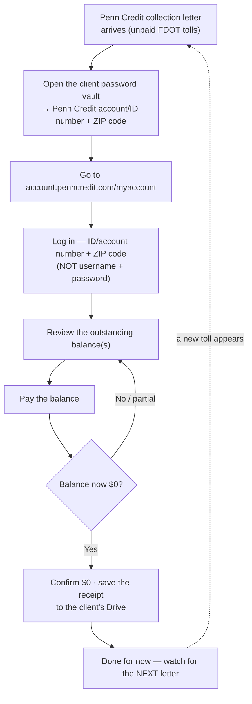

# SOP: Deep Tech — FDOT Toll Debts in Collection (Penn Credit)

> **Status:** Draft · **Owner:** Lilian · **Last updated:** 2026-07-22
>
> 🔍 **Draft / in progress (Jul 2026):** started from what we know so far — the
> login method, the portal, and the recurring pay-down pattern. Who funds the
> payment and how status is checked are still to be captured on the next real
> run (see §6). Remove this note once the process has been run end-to-end and
> confirmed.

The procedure for clearing **Deep Tech Development Group LLC**'s unpaid **Florida
Department of Transportation (FDOT) toll** charges that were referred to the
collection agency **Penn Credit**. When a Penn Credit collection letter arrives,
this is how JK logs in and pays the balance down so the letters stop.

> **Where client data goes:** the Penn Credit **account / ID number**, the **ZIP
> code**, and any **dollar amounts** are sensitive — they live in the client's
> **password vault** (a Google Doc) and the client's **Google Drive**, **not** in
> this repo. This SOP keeps only the reusable procedure and points to where the
> sensitive values live.

---

## The process at a glance

A collection letter arrives → log in with the **ID number + ZIP code** → review
the balance → pay it → confirm it reads **$0**. It is **not one-and-done**: new
toll items keep appearing, so each new letter restarts the loop.

## §0. When to run this

1. **Trigger:** a **Penn Credit** collection letter arrives about Deep Tech's
   unpaid **FDOT tolls** (or the client forwards one).
2. **Goal:** clear the balance so the collection letters stop.
3. **This recurs — do not assume it's closed.** Paying one balance to zero has
   **not** stopped new toll amounts from appearing later. Treat **every new
   letter** as a fresh pay-down.

## §1. What you need before you start

You need, in hand:

1. The latest **Penn Credit collection letter** (for the account/reference number
   and the amount).
2. The Penn Credit **account / ID number** — from the client **password vault**.
3. The **ZIP code** on the account — same vault.
4. The client's **Google Drive** folder open, to save the payment receipt.

> **Login is not a username + password.** The Penn Credit portal asks only for an
> **identification / account number + ZIP code**. Both are in the vault.

## §2. Log in and review the balance

1. Go to **account.penncredit.com/myaccount**.
2. Enter the **account / ID number** and **ZIP code** from the vault.
3. Open the account and read the **current outstanding balance(s)** — there may be
   more than one toll item.
4. Cross-check the amount against the letter.

## §3. Pay and confirm

1. Pay the outstanding balance through the portal.
2. Confirm the balance now reads **$0**.
3. Save the **payment confirmation / receipt** to the client's Drive folder (never
   the repo).
4. If it doesn't reach **$0** (a partial payment, or a second item), repeat
   §2–§3 until it does.

## §4. What you pay

- **Whose funds pay the toll?** To confirm — whether the firm pays on the
  client's behalf or the client funds it, and by what method.
- **Amount:** varies per letter — read it **live** in the portal; never write a
  figure into this file (it's sensitive and it changes).

## §5. Where things live — links

The login values (**account/ID number + ZIP code**) are in the client's
**password vault** — use the button above. It's a Google Doc holding **all** of
this client's logins, so **search inside it** for the **Penn Credit** entry; it
isn't a file that opens straight to that one password.

| What | Where |
|---|---|
| Penn Credit portal | [account.penncredit.com/myaccount](https://account.penncredit.com/myaccount) |
| Payment receipts | The client's **Google Drive** folder |

## §6. Still to capture (next real run)

- [ ] **Who funds** the payment, and the method used.
- [ ] Whether Penn Credit sends any **email confirmation** (or only physical
  letters), and whether status can be checked online.
- [ ] Whether the underlying FDOT tolls can be **stopped at the source** (the
  vehicle / SunPass account) so new items stop appearing.
