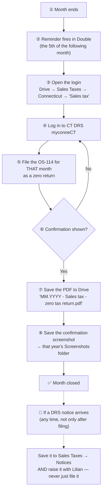

# Ecoorganic — Connecticut Sales Tax (monthly OS-114)

> **Status:** Active · **Client:** ECOORGANIC USA LLC · **Owner of SOP:** Lilian · **Started:** Aug 2026 · **Last updated:** 2026-08-13
>
> The firm files this client's Connecticut **Sales and Use Tax Return (Form OS-114)**
> **every month**, and it currently goes out as a **zero tax return**. The client does
> not file it — we do, on the firm's own myconneCT login.
>
> **Client data lives in the firm's systems, never in this repo.** The portal login, the
> filed returns, the confirmation screenshots and any DRS notice live in **Google Drive**
> and are reached from the links below. This file holds the *procedure only*.
>
> 🔍 **Written from the outside, not from a real filing session — §9 lists what is still
> missing.** The monthly cycle in §2 is complete and safe to follow; there is no
> screen-by-screen walkthrough of myconneCT and no map of what DRS emails, because nobody
> has captured them yet. **If you are the next person to file, capture them** — §9 says how.
>
> ⚠️ **Two things about this client are unsettled — read §6 before you tell anyone
> anything.** Why the return is zero has never been written down, and there is a
> nine-month hole in the 2025 filing record with two unopened DRS notices beside it.
> **Neither is a reason to stop filing.** Keep the monthly cycle running exactly as
> below; §6 is about what you may *say*, not what you do.

## The process at a glance

**The loop:** this repeats every month, on its own clock. It is **not** part of the
bookkeeping close and does not wait for the books — a zero return needs no figures from
QuickBooks. The bookkeeping runbook is
[`ecoorganic-bookkeeping-review.md`](./ecoorganic-bookkeeping-review.md); the two only
touch at the reviewer's monthly checklist, which confirms this filing happened.

## §0. Who does what

1. **The firm files it.** The login is the **firm's**, not the client's, so filing this is
   ours. **Never bounce it to the client** — the credentials are ours, not his, and
   handing it back to him is how a month gets missed.
2. **The reminder lives in Double**, as a recurring task on this client due the **5th of
   the month after the period** (so 5 August for July). That date is deliberately early —
   see §3.
3. **Anything a DRS notice says goes to Lilian.** Filing a notice into Drive is not
   handling it (§5).

## §1. Before you file: what you need in hand

You need exactly two things. Both are already set up; nothing has to be requested from the
client.

1. **The myconneCT login** — portal address, username and password. It is in **one Google
   Doc** in the client's Drive: `Sales Taxes > Connecticut > Sales tax`. Open it from the
   **Contacts & links** table in §8.
   - *The same myconneCT credentials also appear in the client's master `Ecoorganic
     Passwords` doc one folder up.* Either works; the `Sales tax` doc is the one kept
     beside the filings.
2. **Which month you are filing.** One return per calendar month, in sequence. Check the
   Drive year folder (§2 step 4) for the last month filed — that, not memory, tells you
   where you are.

**You do NOT need:** the books, a P&L, a bank statement, or anything from the client. A
zero return reports no figures. If you find yourself waiting on QuickBooks to file this,
stop — you are conflating it with the bookkeeping close.

## §2. The monthly filing, step by step

1. **Open the login doc** and get the myconneCT credentials (§1).
2. **Log in to CT DRS myconneCT** — [portal.ct.gov/drs-myconnect](https://portal.ct.gov/drs-myconnect).
3. **File the OS-114 for the period, as a zero return.**
   - ⚠️ **Check the period before you submit.** A return filed against the wrong month
     leaves the month you meant still open — and still accruing a late penalty (§3). The
     return is filed against a *period*, and picking the wrong one is the single easiest
     mistake to make here.
   - **Submitting is not the end** — you are not done until you have the confirmation and
     have saved both artifacts below.
4. **Save the filed return as a PDF** into
   [Sales Taxes → Connecticut → *the year*](https://drive.google.com/drive/folders/1080Kf9czucrD6vf09cu8lADjdlHumd8j),
   named exactly `MM.YYYY - Sales tax - zero tax return.pdf` — for example
   `07.2026 - Sales tax - zero tax return.pdf`. **Keep the name exactly.** The
   naming is what makes a missing month visible at a glance in the folder listing — it is
   the only index anyone has of what has been filed.
5. **Save the confirmation screenshot** into that year's **`Screenshots`** subfolder. The
   PDF does not carry the submission timestamp; this screenshot is the only proof of
   **when** the return went in.

### What it costs

There is **nothing to pay** on a zero return — no tax is due, and CT charges no fee to
file. The only money in this procedure is the penalty for *not* doing it:

1. **Late filing — $50.** Connecticut's penalty is **15% of the tax due or $50, whichever
   is greater**. On a zero return the 15% is nothing, so **the $50 floor is what lands** —
   a full $50 for a return that takes minutes.

**Bottom line:** a skipped month costs $50 and buys nothing. There is no such thing as a
month too quiet to file.

## §3. The deadline, and why our reminder is earlier

| | Date | Whose |
|---|---|---|
| **Statutory due date** | The **last day of the month following** the period — July's return is due **31 August** | CT DRS |
| **Our internal reminder** | The **5th of the month after the period** — 5 August for July | The firm (Double) |

**Treat the 5th as the deadline, not the 31st.** The whole point of the internal date is
that a missed reminder is still recoverable with weeks to spare. If you are reading this
after the 5th, you are not late — but do it today.

*(Due date and penalty verified against CT DRS on 2026-08-12; sources in §8.)*

## §4. Filing history: what the record shows, and the hole in it

Read this before assuming the back years are clean. Everything here is **what the Drive
folder contains**, which is not the same as what was filed — **myconneCT's own filing
history is the authority, and nobody has opened it.**

1. **Through 2024: filed QUARTERLY.** Those returns sit loose in the `Sales Taxes` root,
   named by quarter — `4Q 2023`, then `1Q`/`2Q`/`3Q`/`4Q 2024`. All four 2024 quarters are
   there.
2. 🔴 **Then nothing at all for 01.2025 – 09.2025 — nine months, in any frequency.** After
   `4Q 2024` the next filing of any kind is **10.2025**: no 1Q/2Q/3Q 2025 quarterly return,
   and no monthly return before October. **This is a gap in the record, not a proven gap in
   filing.** But it fits the delinquency notice below far better than anything else does.
3. **From 10.2025: MONTHLY**, one zero return per month, continuously through **07.2026**.
   When or why DRS changed the frequency is **not recorded** — observed from the filings,
   not established.
4. **The Drive record lags the filings.** The 10–12.2025 returns were only *uploaded* in
   April–May 2026. Upload dates are not filing dates, so this tells you the folder runs
   behind the work — it does **not** establish when those returns were actually filed.
5. **Two DRS notices sit unopened** in the `Notices` subfolder: a **Delinquency Notice
   dated 12.2025** and a **Proposed Assessment dated 01.2026**. Neither has been opened, so
   the period, the amount and whether either was resolved are all unknown. **A proposed
   assessment left unprotested becomes final**, which makes this live work, not history.

6. 🔑 **The firm already called the state about this account — read that first.** A note
   titled **`04.06.2026 CT state call - sales tax account`** exists on this client among the
   records migrated from the firm's previous practice platform. **April 2026 sits inside the
   window** the gap and both notices fall in, so it may already answer what the rest of this
   section asks. *(Its **content has not been read** — those migrated notes are gated on a
   permission question for Lilian. This records that the note exists, not what it says.)*

**This is on the firm's open-loops list** (Ecoorganic / CT sales tax). The next action, **in
this order**:

1. **Read the 04.06.2026 CT state-call note** — the firm's own record of what the state
   already told us comes before asking the state again.
2. **Log in to myconneCT** and read the account's own filing history and balance for
   **01.2025 – 09.2025**.
3. **Open the two notice PDFs.**

**Do not conclude anything about those nine months from the Drive folder alone**, and do not
treat a period as unfiled until step 2 says so — the returns may have been filed and simply
never saved here.

## §5. When a DRS notice arrives

1. **Save it** to [Sales Taxes → Notices](https://drive.google.com/drive/folders/1ReFw-i3D8LDVOAzT6PfjqYgFa6A9cwZK).
2. **Raise it with Lilian, the same day.** A notice is never just filed and forgotten.
3. **Read what it actually is before acting.** The two kinds already in that folder mean
   different things and are easy to confuse:
   - a **Delinquency Notice** says a return DRS expected has not arrived — the fix is
     usually to file the missing period;
   - a **Proposed Assessment** is DRS's own estimate of what you owe because they had no
     return to go on. **It carries a deadline to respond, and it becomes final if nobody
     protests it.** This is the one that turns into real money by being ignored.

## §6. Open questions: what NOT to represent

**Keep filing exactly as in §2.** Nothing here changes the procedure — it changes what you
are allowed to *say* about it.

1. ⚠️ **Why the return is zero has never been recorded.** This is an operating business
   with revenue, so "zero" is a deliberate filing position, not an absence of activity —
   plausibly because the client's installation/construction work falls outside
   Connecticut's taxable-services net, or because taxable sales sit with a general
   contractor. **Neither is confirmed.**
2. ⚠️ **Zero *tax* is not the same as zero *sales*.** DRS says Form OS-114 reports **both
   taxable and nontaxable sales** — gross receipts go on the return and the nontaxable
   portion comes off as a deduction. So a business with revenue and no taxable sales would
   normally file showing **receipts with a deduction**, not a blank return. **Whether these
   returns are blank or already carry gross receipts has not been checked** — nobody has
   opened one.

⏸️ **Lilian has parked both, deliberately** _(2026-08-13: "déjalas pendientes de resolver... cuando
vamos a este tema, me puedes preguntar y lo vemos")_. **They are not a to-do list waiting on her,
and nobody should chase her for them.** The moment to raise them is when someone is **actually
working this client's sales tax** — then ask, and record what she says here.

**Until then:** file as before, and do **not** explain to the client, or to
DRS, *why* it is zero. **Nothing here says the position is wrong** — it says nobody has
written down why it is right, which is a different problem and not one a covering
bookkeeper should try to solve mid-filing. These two questions live here; they are also
carried on the firm's open-loops list, in the client's Client Intelligence file, and as a
pointer row in the bookkeeping runbook's Open decisions log so a reviewer reading only that
log still sees them.

## §7. Common pitfalls

1. **Assuming a quiet month needs no return.** It does. A zero return is required "even if
   no sales were made or no tax is due", and skipping it costs $50 (§2).
2. **Filing against the wrong period.** The month you meant stays open and keeps accruing.
   Check the period on screen before submitting (§2 step 3).
3. **Stopping at "submitted".** Without the PDF *and* the screenshot in Drive, the next
   person cannot tell the month was filed — and the folder is the only index that exists.
4. **Reading a gap in the Drive folder as a missed filing.** It has lagged by months before
   (§4). Check myconneCT's own filing history before concluding a month was missed —
   **and equally, do not assume a gap is only a filing lag.** It is a question either way.
5. **Filing a DRS notice and moving on.** A proposed assessment goes final if nobody
   protests it (§5).
6. **Waiting on the bookkeeping close.** This filing needs no figures. Treating it as part
   of the close is how it slips to the end of the month.
7. **Sending the client to file it.** The login is ours (§0).

## §8. Contacts & links

| What | Where |
|---|---|
| **CT DRS myconneCT** — the state's information page for the system | [portal.ct.gov/drs-myconnect](https://portal.ct.gov/drs-myconnect). **The address you actually sign in at is in the Drive doc below** — use that one. |
| **The login** (portal address + firm's user/password) | [`Sales Taxes > Connecticut > Sales tax`](https://docs.google.com/document/d/1FaiTyqEnm-eDsxbx1ZH8UdSAgqq6zSMwK_2z2orbk9U/edit) — a Google Doc in the client's Drive. *(The same credentials are also in the master `Ecoorganic Passwords` doc one folder up.)* |
| **Filed returns, by year** | [Sales Taxes → Connecticut](https://drive.google.com/drive/folders/1080Kf9czucrD6vf09cu8lADjdlHumd8j) — a folder per year, each with a `Screenshots` subfolder |
| **DRS notices** | [Sales Taxes → Notices](https://drive.google.com/drive/folders/1ReFw-i3D8LDVOAzT6PfjqYgFa6A9cwZK) |
| **The whole sales-tax folder** | [Sales Taxes](https://drive.google.com/drive/folders/1z-YELZhZxnBPlr-gBg7xhuf2xHdTwCJL) — the 2023–2024 quarterly returns sit loose in its root |
| **CT rules — filing requirement, due date, penalty** | [Sales and Use Tax Information](https://portal.ct.gov/drs/sales-tax/tax-information) · [Form O-88, OS-114 instructions](https://portal.ct.gov/-/media/DRS/Forms/2022/SUT/O-88_0722.pdf) *(07/2022 revision)* |
| **The client's bookkeeping runbook** | [`ecoorganic-bookkeeping-review.md`](./ecoorganic-bookkeeping-review.md) |

## §9. Not yet written down

Recorded so the gaps are visible rather than discovered mid-task. **None of these blocks
the monthly filing.**

1. **The myconneCT screens.** This SOP has no screen-by-screen walkthrough, because nobody
   has written one — the steps in §2 are the shape of the job, not a click path. **Next
   time you file, capture the screens** (the confirmation screenshot you already save is
   one of them) and add a §2A here. That is the cheapest moment to do it.
2. **What DRS emails after a submission** — sender address, subject shape, whether a
   confirmation email arrives at all, and which inbox it reaches. No email map exists for
   this filing, so the confirmation screenshot is currently the only receipt.
3. **The client's CT sales-tax registration number and filing frequency as DRS has it
   assigned** — never recorded here, and it is what would settle §4's quarterly-to-monthly
   question. It is visible inside myconneCT — when someone reads it, **record it in the
   client's Drive folder, never in this file** (a full registration number is a secret).
