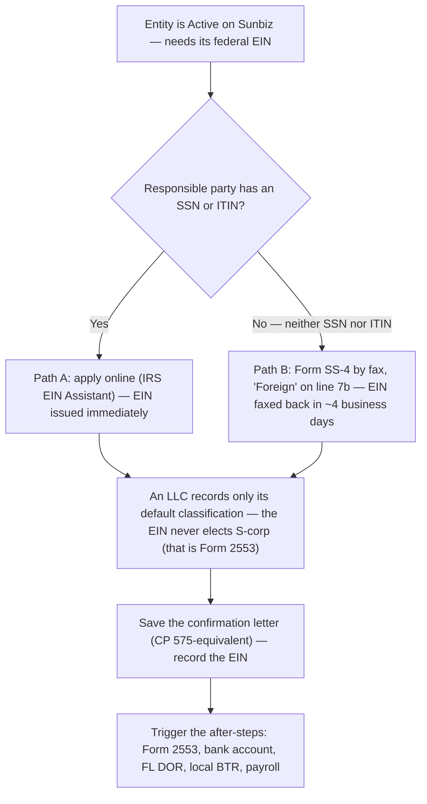

# SOP: Federal EIN Application (IRS Form SS-4) — after the entity is active on Sunbiz

> **Status:** Active · **Owner:** Julia · **Last updated:** 2026-08-14

The complete, self-contained procedure for getting a **federal EIN** (Employer
Identification Number) from the IRS for a company that is **already formed and
active on Sunbiz**. This is **Part 2** (the federal step) of the firm's Florida
company-formation flow — **Part 1**, the Sunbiz filing itself, is
[`florida-company-formation-sunbiz.md`](./florida-company-formation-sunbiz.md).

> **Scope note:** starts the moment the entity shows **Active** on Sunbiz and you
> have its exact legal name and formation date. Everything to obtain the EIN
> lives here — the go/no-go decision, both application paths, the answers people
> get wrong, and the after-steps.

> ⚠️ **The two paths are not the same form.** The online EIN Assistant and the
> paper Form SS-4 ask **different questions** — the online tool asks excise
> screening questions the paper form doesn't have, and the paper form asks for
> things the online tool never requests (the start **day**, the closing month, the
> employee counts, a signature). **Don't fill one from the other's answers.** The
> side-by-side is [§1.5](#15-the-online-application-and-the-paper-ss-4-ask-different-questions).

> **Where client data goes:** the client's real legal name, address, the
> responsible party's SSN/ITIN, the filled-in SS-4, and the assigned EIN are
> **sensitive** and belong in **your client systems** (Google Drive / Double /
> QuickBooks) — **not** in this repo. Copy the blank intake at the bottom into
> the client's folder there and fill it in. This repo keeps only the reusable
> procedure + the blank template.

> 💵 **The EIN is free, direct from the IRS.** Never use a paid "EIN filing"
> site — they charge for a free government service and become an unnecessary
> middleman holding the client's data. Apply only through IRS.gov, fax, mail, or
> the IRS phone line below.

---

## The process at a glance

Once the entity is **Active on Sunbiz**, getting its federal EIN forks on one
question — does the responsible party have an **SSN or ITIN**? If yes, apply
online and the EIN is issued on the spot; if not (a foreign owner), fax **Form
SS-4** with **"Foreign"** on line 7b and the EIN comes back in a few days. Both
paths end the same way: an LLC records only its default classification (the EIN
never elects S-corp), then save the confirmation, record the EIN, and trigger
the after-steps.



## 0. Intake — gather these before you touch the application

The whole application is answerable from these. Get them all first; the online
tool **times out after 15 minutes of inactivity and cannot be saved** (see §2),
so you do not want to be hunting for an answer mid-flow.

> **Where the answers come from — the client's Business Intake Form.** The firm
> sends every new client a **Business Intake Form** up front, and its answers feed
> this application. Pull the values from the client's **completed** intake form
> rather than re-interviewing; the working sheet in the appendix is just to
> transcribe the few fields this filing needs. If the form is missing something
> this filing requires (e.g. the responsible party's SSN/ITIN), that is the one
> thing to go back to the client for.

1. **Exact legal name** of the entity — spelled **exactly** as it appears on
   Sunbiz (including "LLC" / "Inc." / "Corp."). The IRS name must match Sunbiz.
2. **Sunbiz document number** and **formation/effective date** (this is the
   "date the business started," line 11).
3. **Entity type** as formed on Sunbiz: **LLC** (single- or multi-member) or
   **Corporation** (Inc./Corp.). → drives §4A.
4. **Number of LLC members** (if an LLC).
5. **Will this entity elect S-corp?** (very common here) → does **not** change the
   **entity-type** answer (§4A), and flags the separate Form 2553 step (§4B). It
   does **not** by itself change the employee answer — see §4E: the standing
   answer stays **"no employees"** unless owner payroll actually starts within the
   next 12 months.
6. **Responsible party**: the one individual who owns/controls the entity, plus
   their **SSN or ITIN** (or the fact that they have **neither**). → this is the
   go/no-go decision in §1. See §4C for who qualifies.
7. **US mailing address** and **physical (principal business) address**, with
   **county** and state.
8. **Reason for applying** — for a new FL company this is "Started a new
   business."
9. **Expected employees in the next 12 months** — **the firm's standing answer is
   "no employees"** (`-0-` on paper, **No** online) unless payroll genuinely starts
   now; see the rule in §4E. If there *will* be payroll, you also need the **first
   date wages will be paid**.
10. **Principal activity / line of business** (what the company actually does) — and with it the
    **two questions that decide line 16**, because nothing on the form prompts either and the
    client will not volunteer them (§4F): **(a) do they MAKE it, or INSTALL/apply it on the
    customer's property?** (→ Manufacturing / Construction, which override everything else);
    **(b) if neither, WHO BUYS IT** — the general public, or other businesses and trades?
    (→ Retail vs Wholesale). Ask both while you have the client.
11. **Closing month of the accounting year** — almost always **December**.
12. **Is the firm filing on the client's behalf?** → then, **on the paper SS-4**, the
    **Third-Party Designee** block is filled in **every time**, from the firm's fixed set of
    values in §4D, and the **client signs the form** or the authorization is void. You need
    **nothing from the client** for the block itself; it is all ours. ⚠️ **The online path has
    neither** — no designee block and no signature (submitting is the attestation); there it is
    a **radio button** saying you are a third party applying on the entity's behalf (§2). Which
    path you are on is decided in §1, after this list.

---

## 1. The go/no-go decision — does the responsible party have an SSN or ITIN?

This single fact decides which path you take. Resolve it **before** anything
else.

- **✅ Responsible party HAS a valid SSN or ITIN** → **Path A: apply online**
  (§2). EIN issued **immediately**, on screen, same session. This is the default
  and by far the fastest.
- **❌ Responsible party has NEITHER an SSN nor an ITIN** (common for a foreign
  owner) → you **cannot use the online tool**. Use **Path B: Form SS-4 by fax or
  mail** (§3). Fax turnaround is ~4 business days.

> ⚠️ **Two different tests — don't mix them up.** *Which path* you take depends on
> the **responsible party's** ID (this section). *Where you send it*, and whether
> the phone line is even available, depends on **where the ENTITY is** — not where
> its owner lives. A Florida company that actually operates from its Florida
> address is a **domestic** filing and the international phone line is **not** open
> to it (§3).

> **Frequent JK situation — foreign owner, no SSN/ITIN.** You do **not** need to
> wait for the owner to get an ITIN before the company can get its EIN. File
> **Form SS-4 by fax** with **"Foreign"** on line 7b (see §3). Getting an ITIN
> (Form W-7) is a separate, slower track and is **not** a prerequisite for the
> EIN.
>
> A wording note worth knowing: the instructions condition "Foreign" on the party
> having *"and is **ineligible** to obtain"* an SSN or ITIN. In practice a foreign
> owner with no US filing requirement can't obtain an ITIN yet, and the firm files
> "Foreign" rather than stalling the company behind a W-7. If the person already
> **has** an SSN or ITIN, it must be used.

---

## 1.5. The online application and the paper SS-4 ask DIFFERENT questions

Both paths get you the same EIN, but they are **not the same interview**. People
get caught out by assuming the paper form is just "the online tool printed" — it
isn't. Fill each one from its own source.

> **How to read this table.** The **paper column is authoritative** — it's the
> actual Form SS-4 (Rev. 12-2025) and its instructions, line by line. The
> **online column** is our screen-by-screen record of the EIN Assistant as walked
> in **July 2026** (§2). The IRS changes that tool without notice, so where the
> table says a question *isn't asked online*, read it as **"not present in the
> July-2026 walkthrough"** — confirm on screen, and update §2 when it moves.

| What's asked | 🖥️ Online EIN Assistant | 📄 Paper Form SS-4 |
|---|---|---|
| **Responsible party's ID** | **A valid SSN or ITIN is mandatory** (the instructions say *"SSN, EIN, or ITIN"* — the EIN case is for government entities, §2). No `Foreign` equivalent exists, which is what makes this path unusable for a foreign owner | **Line 7b accepts `Foreign` or `N/A`** — an entry is required, but it doesn't have to be a number |
| **Business start date** | **Month + Year only** | **Line 11 — month, DAY, and year** (the day is not asked online) |
| **Closing month of accounting year** | Not asked | **Line 12 — required** (usually `December`) |
| **Employees** | In the July-2026 walkthrough, a single **yes/no**: *"Have, or expect to have, employees who will receive Forms W-2 in the next 12 months?"* — note **only the "No" branch has been walked**; a "Yes" may well open follow-ups §2 doesn't record | **Line 13 — three separate counts** (Agricultural / Household / Other), plus **Line 14** (Form 944 election) and **Line 15** (first wage date) |
| **…and how the firm answers it** *(firm policy, not IRS text — see the sources note at the foot)* | **No** — unless payroll starts now (§4E) | **Same rule, written out**: `-0-` in all three boxes of line 13, line 14 **skipped**, line 15 **`N/A`** (§4E) |
| **Excise / special-activity screening** | **Four yes/no questions**: ≥55,000 lb highway vehicle · gambling/wagering · Form 720 · alcohol, tobacco or firearms *(they sit in a block of five with the employee question above)* | **None of these exist on the form.** Don't go looking for them |
| **Business activity** | A **category dropdown + a scripted follow-up** per category (the matrix in §2) | **Line 16** — a checkbox from a short list, **plus Line 17**, free text describing the actual line of merchandise or services |
| **Prior EIN** | Not asked | **Line 18 — required**, plus the previous EIN if there was one |
| **"Care of" / executor / trustee** | Not asked | **Line 3** |
| **State/country of incorporation** | Captured as the state where the articles are filed | **Line 9b** — state **or foreign country** |
| **LLC organized in the US?** | Implicit in the state question | **Line 8c** — an explicit yes/no |
| **The firm acting for the client** | A **radio button**: *"I am a third party applying for an EIN on behalf of this LLC"* | A full **Third-Party Designee block** (name, address, phone, fax) — **and the client must sign** the form. See §4D |
| **Signature** | None — submitting is the attestation | **Required**: name, title, signature, date, applicant's phone, applicant's fax |
| **Fixing a mistake** | **Impossible after submit** — you must start a whole new application | Just correct the paper before you send it |
| **How the EIN arrives** | **On screen immediately** + downloadable PDF | **Fax-back in ~4 business days**, or mail in ~4–5 weeks |

### The three that actually bite

1. **A foreign responsible party kills the online path — full stop.** The
   instructions are explicit that the principal officer, member or owner *"must
   have a valid taxpayer identification number (SSN, EIN, or ITIN) **in order to
   use the online application**"*, and the tool has no "Foreign" equivalent.
   Decide this in §1 **before** anyone opens the assistant, or you'll lose the
   session finding out.
2. **The paper form needs answers the online tool never asked for.** If you did an
   online application for a sister company and are now doing a paper one, you are
   **missing** the exact start day, the closing month, the employee counts, the
   first wage date, and Line 17. Collect them from §0 first.
3. **The paper form has no excise screening, and the online tool has no signature.**
   Neither is an oversight — they're just different instruments. Don't try to
   reconcile them.

---

## 2. Path A — Apply online (responsible party has SSN/ITIN)

### ▶ Start here — exactly where to go and what to click

1. **Open the IRS EIN page:**
   <https://www.irs.gov/businesses/small-businesses-self-employed/apply-for-an-employer-identification-number-ein-online>
   *(if that link ever changes, search **"IRS apply for an EIN online"** — it's the
   official IRS.gov page; never use a paid look-alike site.)*
2. Click the **"Apply Online Now"** button → it launches the **EIN Assistant** in a
   new window (allow pop-ups).
3. On the assistant's intro screen, click **"Begin application"** → you land on
   **Step 1 · Legal Structure**, the wizard documented below.

**Know these rules of the tool before you start:**

- **Availability:** the EIN Assistant is only open on a published schedule
  (Eastern time), **not 24/7** — recent hours run roughly **Mon–Fri early morning
  to after midnight, with more limited weekend hours**. Check the current window
  on the IRS page before you sit down to file; the IRS changes it periodically.
- **One session, no saving:** it **times out after 15 minutes of inactivity**
  and cannot be resumed. Have every §0 answer in front of you.
- **One EIN per responsible party per day** — online, phone, fax, or mail. If
  you're setting up several entities for the same person, you can only get one
  per calendar day.
- **Principal business must be in the US or a US territory**, and the
  responsible party must have a valid **SSN, ITIN, or EIN**.
- **Result:** the EIN appears **on screen immediately**. **Download and save the
  EIN Confirmation Notice PDF** (the online equivalent of the **CP 575**) right
  then — this is the client's proof of EIN and you may not get another copy
  easily.

### The wizard, screen by screen (verified 2026-07)

The tool is a **6-step wizard** with a progress bar at the top:
**1 Legal Structure → 2 Identity → 3 Addresses → 4 Additional Details →
5 Review & Submit → 6 EIN Assignment.** All required fields are marked `*`. A
language selector sits in the top-right header, but treat the tool as
English-only.

**Step 1 — Legal Structure.**
- *"What type of legal structure is applying for an EIN?"* — choose the entity's
  **legal** form as filed on Sunbiz: **Limited Liability Company (LLC)** or
  **Corporations** (this option's help text notes it "includes S corporations…").
  A confirm box explains the choice. → **Do not try to make the S-election here**
  (see §4A/§4B).
- **LLC path** → *"How many member(s) are in the LLC?"* + *"state/territory where
  the business is physically located"* (**Florida (FL)**).
  - A confirm box states the default: **single-member = disregarded entity**;
    **multi-member = partnership**. It explicitly points to **Form 8832**
    (corporate status) or **Form 2553** (S-corp status) if you want to change it
    — confirming that the EIN app itself does **not** elect S-corp (§4B).
- *"Why is the … requesting an EIN?"* → **Started a new business** (other options:
  Hired employees, Banking purposes, Changed type of organization, Purchased
  active business).

**Step 2 — Identity.** *"Please tell us about the Responsible Party"* —
*"Must match IRS records or this application cannot be processed."*
- **SSN/ITIN** (required), **First / Middle / Last name**, Suffix.
- **Your role:** *"I am one of the owners, members, or the managing member"* **or**
  *"I am a third party applying for an EIN on behalf of this LLC."* → pick the
  third-party option when the firm is filing for the client (§4D).

**Step 3 — Addresses.** Mailing + physical business address (with county/state).

**Step 4 — Additional Details (two screens).**

*Screen 4a — "Tell us about the LLC":*
- **Legal name** (must match articles of organization). ⚠️ For an LLC the field
  **may not contain the endings "Corp" or "Inc"**; only `-` and `&` are allowed.
- **Trade name / DBA** (only if different) — may not contain "LLC", "LC", "PLLC",
  "PA", "Corp", or "Inc".
- **County** and **State/Territory** where the LLC is located.
- **State/Territory where the articles of organization are (or will be) filed**
  (Florida).
- **Start date** (Month / Year) = the Sunbiz formation date.
- Then five yes/no triggers — for a typical small company all are **No**:
  1. Own a **highway motor vehicle ≥ 55,000 lbs** taxable gross weight?
  2. Involve **gambling / wagering**?
  3. Need to file **Form 720** (Quarterly Federal Excise Tax)?
  4. **Sell or manufacture alcohol, tobacco, or firearms**?
  5. **Have, or expect to have, employees who will receive Forms W-2 in the next
     12 months?** ← **the firm's standing answer is No** (§4E). Answer **Yes**
     only when payroll is genuinely starting now — it flags the Form 941/940
     obligations.

*Screen 4b — "Provided Business Activity and Services":* pick the one **category**
that best fits, then answer its **follow-up** (see the matrix below). Most JK
service clients land on **Other → Consulting** or **Other → Service**.

| Category | Follow-up question / options |
|---|---|
| Accommodations | Casino hotel / Hotel / Motel / Other |
| Construction | "Do you focus on a single construction trade (concrete, framing, roofing, electrical, plumbing, HVAC, flooring, etc.)?" Yes/No |
| Finance | Commodities broker / Credit card issuing / Investment advice / Investment club / Investment holding / Mortgage broker / Mortgage company / Portfolio management / Sales financing / Securities broker / Trust administration / Venture capital / Other |
| Food Service | Bar / Bar and restaurant / Catering / Coffee shop / Fast food / Full service restaurant / Ice cream shop / Mobile food service / Other |
| Health Care | "Does your establishment include medical practitioners with an M.D. or D.O. degree?" Yes/No |
| Insurance | Insurance carrier / Insurance agent or broker / Other |
| Manufacturing | Free text: "specify the type of goods you manufacture and the primary materials used (e.g. 'wood furniture')" |
| Real Estate | Rent/lease property I own / Use capital to build property / Sell property for others / Manage real estate for others / Other |
| Rental & Leasing | Rent/lease/sell real estate / Rent or lease goods (+ specify goods) / Manage real estate for others |
| Retail | Internet-only / Storefront / Direct sales / Auction house / Other |
| Social Assistance | Nursing home / Shelter / Youth services / Other |
| Transportation | "Do you primarily transport cargo or passengers?" Cargo / Passengers / Support activity |
| Warehousing | (selecting it advances to the next step) |
| Wholesale | "Do you own or take title to the goods you sell?" Yes/No |
| **Other** | **Consulting / Manufacturing / Organization (religious, environmental, social/civic, athletic…) / Rental / Repair / Sell goods / Service / Other (+ specify)** |

**Step 5 — Review & Submit.** A read-only summary of every answer —
*"if any of the information below is incorrect, you will need to start a new
application"* (there is no going back to edit after submit). Also choose:
- **"How would you like to receive your EIN Confirmation Letter?"**
  - ✅ **"Receive letter digitally in the next step"** — view/print/**save the PDF
    immediately** (requires a PDF reader; not mailed). **Always pick this.**
  - "Receive letter by mail (allow up to 4 weeks)" — mailed to the address given.
- Click **Submit EIN Request**.

**Step 6 — EIN Assignment.** *"Congratulations! Your EIN has been successfully
assigned."* The screen shows **Your EIN Details** — the **EIN assigned**, **Legal
name**, **Name control** — and a **Download EIN confirmation Letter [PDF]** button
plus **Print Page**.
- 👉 **Download the PDF and Print/Save the page now** — this CP 575-equivalent
  letter is the client's official proof of EIN and is not easily re-issued (a
  147C by phone is the only replacement). Store it in the client's system, not
  this repo (§5).

---

## 3. Path B — Form SS-4 by fax / mail / phone (no SSN or ITIN)

Use this when the responsible party has **neither an SSN nor an ITIN**. Complete
**Form SS-4** (Rev. December 2025 or later).

> **Before you start:** this form asks for things the online tool never does — a
> full start **day**, the closing month, three employee counts, a first wage date,
> and a signature. Read [§1.5](#15-the-online-application-and-the-paper-ss-4-ask-different-questions)
> so you collect them once instead of twice.

- Form: <https://www.irs.gov/pub/irs-pdf/fss4.pdf>
- Instructions: <https://www.irs.gov/instructions/iss4>

### SS-4 line-by-line (the lines that matter)

| Line | What to put |
|---|---|
| **1** | Legal name of the entity — **exactly** as on Sunbiz |
| **2** | Trade name / DBA (only if operating under a fictitious name) |
| **3** | Executor / administrator / trustee / "care of" name — only if someone else receives the entity's tax mail. If you fill it, **lines 4a–4b become that person's address** |
| **4a/4b** | Mailing address. If it's outside the US, give city, province/state, postal code and the **country spelled out in full** — the IRS says *don't abbreviate the country name* |
| **5a/5b** | Physical street address — **only if different from 4a/4b**. ⚠️ **No P.O. box allowed here.** So if line 4a *is* a P.O. box, 5a/5b are **mandatory**, not optional. If they genuinely match 4a/4b, leave 5a/5b **blank** — this is the one place the SOP departs from the instructions' general *"enter 'N/A' on the lines that don't apply"*, because line 5a's own rule is "only if different" |
| **6** | **County and state** where the principal business is located — *"the entity's primary physical location."* **Always filled for a new business**, regardless of what 4a–5b say — it is not part of the address comparison. (The form's *Do I Need an EIN?* table drops line 6 for a few narrow applications — e.g. banking-purpose-only, a pension-plan administrator, a withholding agent, a foreign person applying under the withholding regs, a state/local reporting agency — none of which is this SOP's scope) |
| **7a** | Responsible party's **name** — a **natural person**, never a company, and the one who genuinely controls the entity (see §4C). Their nationality and residence are **not** requirements |
| **7b** | Their **SSN or ITIN** — or, when they have neither and are ineligible to obtain one, write **`Foreign`**. The Dec-2025 instructions sanction both spellings: *"Enter 'foreign' or N/A on line 7b if the responsible party doesn't have and is ineligible to obtain an SSN or ITIN. **An entry is required.**"* → **the box can never be left blank**, but it doesn't have to hold a number. If the person already has an SSN/ITIN, you must use it |
| **8a–8c** | Is it an LLC? number of members? **was it organized in the United States?** **8b trap:** an LLC **owned solely by an individual and their spouse in a community-property state** who **choose** to treat it as a disregarded entity enters **`1`** on 8b, not 2 — otherwise 8b is the actual member count. (the test runs on the **spouses' domicile**, not the LLC's state of formation — Florida is not a community-property state, so this only reaches **spouse-members domiciled in one**) |
| **9a** | Type of entity — Corporation (enter the form number, e.g. 1120) / Partnership / etc. For an LLC, this reflects how it's **taxed** (see §4A) |
| **9b** | If a corporation, the **state or foreign country** where incorporated |
| **10** | Reason for applying → "Started new business" (+ specify the type of business). *"Check only one box. **Don't enter 'N/A'. A selection is required.**"* ⚠️ **The type goes here SHORT** — *"If you check this box, enter the type of business being started"* — it is one small line on the form, not the place for the full description. The long version belongs on **line 17**, and the two plus line 16 have to agree: see **§4F** |
| **11** | Date business started = **Sunbiz formation/effective date** — month, **day** and year. You don't need the Articles PDF in hand: the date is public and free on Sunbiz, so **look it up rather than estimate**. Never enter a date earlier than formation |
| **12** | Closing month of accounting year. **This is a MONTH, not a date** — write `December` for a calendar-year filer. Spell the month out to avoid a bare "12" being misread. Note the entities that **can't** choose freely: partnerships (required year), personal service corporations and REMICs (calendar), most trusts (calendar) |
| **13** | Highest number of employees expected in the next 12 months — **three separate boxes**: Agricultural / Household / **Other** (Other is where nearly every business goes). Enter **`-0-`** in the ones that don't apply. **The firm's standing answer is `-0-` in all three** unless payroll is genuinely starting now — see §4E for the rule and why a number costs you |
| **14** | **Form 944 election.** Only if payroll tax will be ≤ **$1,000/year** (≈ **$5,000 or less** in total wages; $6,536 in US territories). ⚠️ **Checking it locks you in**: *"you must continue to file Form 944 … until the IRS instructs you to file Form 941."* **Usually leave unchecked.** And if line 13 is all zeros, **skip line 14 entirely** |
| **15** | First date wages or annuities were paid. ⚠️ **If the business doesn't plan to have employees, enter `N/A`** — the instructions say so explicitly. **Don't leave it blank** |
| **16** | Principal activity — one checkbox. *"**You must check a box.**"* Use **Other** (and specify) if none of the listed ones fits. ⚠️ **One box, and it must be the PRINCIPAL activity** — a business with two activities forces a choice, and the choice is not free (**§4F**) |
| **17** | Principal line of merchandise/services — free text describing what the company actually does, in more detail than 16. *"**An entry is required.**"* e.g. checked Construction on 16 → *"General contractor for residential buildings"* on 17. **This is where the full description goes**, not line 10 (**§4F**) |
| **18** | Has this entity ever applied for an EIN before? (No, for a new entity). If yes, write the previous EIN |
| **Third-Party Designee** | If the firm is applying for the client, complete this block so the IRS releases the EIN to the firm; the **client signs** the form (see §4D) |
| **Signature block** | Name and title, signature, date, **applicant's telephone**, applicant's fax. **A foreign phone number is fine** — the instructions say nothing about the applicant's phone at all, so **no US number is required**; writing it in full international form with the country code (`+380 44 123 4567`) is firm practice, so the IRS can actually dial it. **Foreign applicants may have any duly authorized person sign** (the instructions name a division manager as an example). For **Path B, always give a return fax number** — with **no** Third-Party Designee named that is how the EIN comes back; with one named (always, for us — §4D) it goes to the **designee's** fax instead, and the paper notice is mailed to the taxpayer |

### Where to send it

> 🚨 **The routing test is about the ENTITY, not the responsible party.** The IRS
> wording is *"If you have a legal residence, principal place of business, or
> principal office or agency in one of the 50 states or the District of
> Columbia…"* — **"you" is the applicant entity on line 1**, and the test is three
> factual questions about that entity, not about who owns it.
>
> **In the normal JK case a Florida company is bucket A** — it operates from a
> Florida address, which is exactly the county and state you just wrote on
> **line 6**. **Line 6 is the tell** — and specifically a **50-states-or-DC**
> location: a US-territory or foreign primary physical location answers line 6 too,
> and those are **bucket B** (see the phone bullet). If you can honestly name the
> entity's Florida primary physical location, it is **bucket A even when every
> owner lives abroad**
> — the owner's nationality and residence never enter this test. The one case that
> isn't bucket A is a company with **no real US presence at all**: a Sunbiz
> registration whose only US address is the registered agent's, with the office and
> operations abroad. There none of the three tests is met and it belongs in bucket
> B. Decide it on the **entity's** facts, note the call in the client file, and
> don't let the owner's residence decide it in either direction.

**A. The ENTITY has a legal residence, principal place of business, or office in
one of the 50 states or DC** — ✅ **this is the normal JK case**: a Florida
company **operating from its Florida address**, whatever the owner's nationality
or residence:

- **Fax:** **855-641-6935** — include a **return fax number** and the IRS
  faxes the EIN back, generally within **~4 business days**. ⚠️ **Which fax it goes to depends
  on the designee block:** with a Third-Party Designee named (always, for us) it goes to the
  **designee's** fax — see §4D.
- **Mail:** Internal Revenue Service, **Attn: EIN Operation, Cincinnati, OH
  45999** — allow **~4–5 weeks**.
- **Phone: not available.** The 267-941-1099 line is for applicants with **no** US
  presence. A Florida company doesn't qualify, no matter where its owner lives.

**B. The ENTITY has no legal residence, principal place of business, or office in
any state or DC** (a genuinely foreign entity, or one in a US territory):

- **Fax:** **855-215-1627** (from within the US) or **304-707-9471** (from
  outside the US). Return fax → EIN generally within **~4 business days**.
- **Mail:** Internal Revenue Service, **Attn: EIN International Operation,
  Cincinnati, OH 45999**.
- **Phone: 267-941-1099** (not toll-free), **Mon–Fri, 6 a.m.–11 p.m. Eastern** —
  but **only for the *international* half of this bucket.** ⚠️ **The phone test is
  narrower than the fax test.** Fax bucket B is "no presence in **any state or
  DC**"; the phone requires no presence *"in the United States **or U.S.
  territories**."* So an entity in a **US territory** (Puerto Rico, USVI, Guam…)
  faxes and mails as bucket B yet **cannot call**. *(That same location test also
  governs the online application, so a territory entity is location-eligible for
  it — but only if its responsible party has an SSN or ITIN, which by definition
  isn't the case if you're reading §3.)* The caller
  must be authorized and able to answer every SS-4 line — **fill out the SS-4
  first**, then call; the EIN can be issued on the call.

> **Fax is the practical default for a Florida company with a no-SSN owner:** ~4
> business days vs. ~4–5 weeks by mail, and you keep a paper trail. Bucket **A**,
> fax **855-641-6935**.

---

## 4. The answers people get wrong

### 4A. LLC classification — what the "entity type" answer really means

For an **LLC**, the EIN application is **not** where you choose how the company
is taxed for real — it only records the **default**:

- **Single-member LLC** → default **disregarded entity** (owner reports the
  activity on their own return).
- **Multi-member LLC** → default **partnership** (Form 1065).

Technically a single-member LLC with **no employees and no excise tax** isn't
*required* to have its own EIN — but **always get one anyway**: you need it for a
business bank account, to elect S-corp, to issue/receive 1099s, and to keep the
owner's SSN off vendor paperwork.

### 4B. S-corp election is a SEPARATE step — the EIN app never makes it

This matters for almost every S-corp client (and everything the
reasonable-compensation work depends on):

- **Obtaining the EIN does not make the entity an S-corp.** Selecting
  "S Corporation" (or "Corporation") in the online interview does **not** create
  the election — the IRS will still expect **Form 2553**.
- **Sequence:** form on Sunbiz → **get the EIN (this SOP)** → **file Form 2553**
  to elect S-corp status.
- **2553 deadline:** generally within **2 months and 15 days** of the entity's
  formation/effective date (or the start of the tax year the election is to take
  effect). Missed it? **Rev. Proc. 2013-30** late-election relief is usually
  available — file 2553 with the reasonable-cause statement. Track this
  deadline the moment the EIN is in hand.
- An **LLC electing S-corp** does this via Form 2553 alone (it's treated as also
  electing corporate classification); you do **not** pick "S corporation" as the
  entity type when getting the EIN — record it as the LLC it is.

### 4C. Who the "responsible party" is

- Must be a **natural person** (an individual), not another company — the one who
  **ultimately owns or controls** the entity and directs its funds and assets
  (the true principal owner/officer/member, general partner, grantor, or
  trustor).
- **Only one** responsible party per EIN. Use **their** SSN/ITIN (or "Foreign"
  on paper if they have neither).
- For a multi-owner entity, pick the individual who genuinely controls it; the
  IRS expects the real principal, not a nominee.

### 4D. Third-Party Designee — when the firm applies for the client

> 🏛️ **The firm's standing answer: YES, and the block is always filled the same way.**
> *(Lilian's rule, recorded 2026-08-14 — firm policy, not an IRS requirement.)*
> When JK prepares the SS-4, **we name ourselves as Third-Party Designee every time.**
> It is what makes the IRS release the EIN to us instead of only mailing it to the
> client, and without it we cannot even ask about the filing. **Fill the four fields
> below — do not improvise them per client**, because the two things that
> go wrong (the matching trap, and a fax nobody watches) both come from improvising.

| Field | What goes in it |
|---|---|
| **Designee's name** | **Lilian Gonzalez** — **always her, not "whoever prepared the form."** She is the one who calls the IRS; Julia very rarely does *(Lilian, 2026-08-14)*. The name in this block is the name the IRS will speak to, so it should be the person who will actually be on the phone |
| **Address** | **11347 SW 13 Street, Pembroke Pines, FL 33025** — the **firm's** address. ⚠️ **Never write the client's address here** — see the matching trap below |
| **Telephone** | **(754) 286-1478** — Lilian's direct work line *(the number on her [email signature](../marketing/email-branding/signatures/lilian.html); if it ever changes, that file is the source of truth)* |
| **Fax** | **(786) 866-6298** — the JK Accounting company fax |

> **Why the fax is the field that actually matters on Path B.** The EIN comes back
> **by the same method it was requested** — so on a faxed SS-4, the designee's fax is
> where the number arrives. A wrong or unwatched fax number does not fail loudly; the
> EIN simply never shows up and everyone assumes the IRS is slow.
>
> ⓘ **The four values above are the firm's own details** — the full sheet, including who
> may sign which authorization, is [`firm-identity.md`](./firm-identity.md).
> **They are written here on purpose:** Lilian's decision, 2026-08-14, on the basis that
> the address is the firm's registered address and therefore public. Note
> that the firm's **document letterhead** convention is different — proposals and
> engagement letters carry only *"Pembroke Pines, Florida"* and the main line
> **786-318-1505**. A government form needs the full street address and a working fax;
> a letterhead does not. **That difference is deliberate — never "fix" it.**

If JK completes and submits the application **on the client's behalf**:

- **Paper SS-4:** fill in the **Third-Party Designee** block (the four fields above)
  so the IRS releases the EIN to the firm — and the **client (the
  responsible party) signs** the form.
- **Online:** the tool is meant to be completed by someone authorized to receive
  the EIN for the entity; enter the client's responsible-party info with the
  client's authorization.
- The designee's authority to receive the EIN **ends once the EIN is assigned** —
  it is not ongoing power of attorney.
- ⚠️ **The matching trap.** *"If the third-party designee's address or telephone
  number **matches** the address or telephone number of the taxpayer, the
  application **must be mailed or faxed**."* It matches on **either** the address
  **or** the phone — and the likely collision is the firm appearing as the line-3
  "care of" address *and* in the designee block. Use the **client's own** phone
  and address in the taxpayer lines and the **firm's** in the designee block.
  Practically this costs you the **phone** route (the online wizard has no
  designee block at all — there it's the third-party radio button in §2), which
  matters only for a bucket-**B** entity that could otherwise have called.
  ⚠️ **Two ways the firm's own standing block above walks into this**, both of them
  natural mistakes: (1) the client has **no US address of their own** and someone puts
  the firm's mailing address on **line 3 / 4a** as well — now the taxpayer address and
  the designee address are the same; (2) **Lilian is the one filling the form**, so her
  direct line gets written into the **signature block's "Applicant's telephone number"**
  too — now the phones match. Either one is enough to trigger it. The applicant's phone
  is the **client's**, and the applicant's address is the **client's**.
- **The designee block is void without a signature** — *"You must complete the
  signature area for the authorization to be valid."*

#### The designee dies the moment the EIN is issued — what replaces it

The instructions are explicit: *"The designee's authority terminates at the time the
EIN is assigned and released to the designee."* So the block above covers the
application **and nothing after it**. Two situations follow, and they need different
paper:

| You need to… | Use | Who can be named |
|---|---|---|
| Ask about a **pending** application, or receive the EIN | The **Third-Party Designee block** above. Nothing else is needed while the application is open | **Anyone** — no credential required |
| **Be told things** about the entity after the EIN exists — call and ask, receive notices | **Form 8821** (Tax Information Authorization) | **Anyone.** ✅ **This is Lilian's form** |
| **Act** for the client — argue a position, sign, agree, resolve | **Form 2848** | ⚠️ **Only someone eligible to practice before the IRS** — for this firm, **Julia** (Enrolled Agent). **A 2848 naming Lilian is not valid** |

> ⚠️ **The form that fits our own habit is the 8821, not the 2848.** Lilian is the one who
> calls the IRS, and Form 2848 says *"You may only name individuals who are **eligible to
> practice** before the IRS as representatives"* — attorney, CPA, enrolled agent, an officer
> or employee **of the taxpayer**, a family member, and a couple of narrow others. She is
> none of those. Form 8821 has **no such restriction** (*"any individual, corporation, firm,
> organization, or partnership you designate"*) and lets the designee *"inspect and/or
> receive … confidential information **verbally** or in writing"* — which is exactly what a
> status call is. What it will **not** do is let her *"speak on your behalf … advocate your
> position … execute waivers, consents, closing agreements; or represent you in any other
> manner."* The moment the call turns into arguing rather than asking, it needs **Julia on a
> 2848**. Who may sign what, per person, is in §4 of [`firm-identity.md`](./firm-identity.md).
>
**The 8821 route is explicitly contemplated for this** — its instructions list **"Form
SS-4, Application for Employer Identification Number"** among the specific uses the IRS
does **not** record on the CAF, so it is filled the same shape as the 2848 below: the
SS-4 matter named, and the **line 4 specific-use box checked**.

> ⚠️ **But not yet — the 8821 has the same missing-TIN problem as the 2848.** It also
> wants the taxpayer's identification number, so **neither form works while the EIN is
> still pending.** "Form SS-4" appears on the 8821's specific-use list because an
> **assigned** EIN's SS-4 record is still a matter you can be authorized to see — not
> because an 8821 can chase an application that has no number yet. **That window belongs
> to the designee block above, and to nothing else.**

**The Form 2848 for an EIN matter is a *specific-use* POA, and it is not filled in the
ordinary way.** The IRS instructions give the entry verbatim:

| Line | What to put |
|---|---|
| **3 — Description of Matter** | `EIN Application` |
| **3 — Tax Form Number** | `Form SS-4` |
| **3 — Year(s) or Period(s)** | `Not Applicable` |
| **4** | ✅ **check the box** — *"Applications for an EIN"* is on the instructions' own list of specific uses the IRS **does not record on the CAF** |
| **5a** | leave alone. It only *modifies* the default acts (Intermediate Service Provider access, substituting a representative, disclosure to third parties, signing a return, "Other"). **Calling and receiving information is already granted by line 3** — the POA *"authorizes the listed representative(s) to inspect and/or receive confidential tax information and to perform all acts … with respect to matters described in the power of attorney."* |

Three consequences worth knowing before you rely on it:

1. **It is not in the CAF, so it does not come up when you call.** *"If you check the
   box on line 4, mail or fax Form 2848 to the IRS office handling the specific
   matter"* — for an EIN that is the **EIN Operation**, not the Memphis/Ogden CAF fax
   in the Form 2848 instructions. *(That an assistor will take the fax while you are on
   the line is ordinary practice, not something the instructions state.)*
2. **Two separate 2848s, never one.** The line 4 checkbox governs the **whole form**.
   Mix the EIN matter with the client's ordinary tax matters on one 2848 and **none** of
   it gets recorded on the CAF. File the specific-use one now, and a normal one — EIN in
   line 1, line 4 unchecked — once the number exists.
3. **A 2848 cannot replace the designee while the EIN is still pending.** Line 1 wants
   the taxpayer's identification number, and the entity has none yet. **The Instructions
   for Form 2848, the Instructions for Form SS-4 and Pub. 947 were all searched
   (2026-08-14) and none of the three says what to enter when no number has been
   assigned.** That gap is exactly why the designee block exists — so fill it in, every
   time, rather than planning to send a POA later.

### 4E. The employee question — the firm's answer is **No** unless payroll starts now

This is the question people either skip or over-answer. What it asks for is **an
estimate, not a commitment** — on paper the instructions ask for the number
*"expected by the applicant in the next 12 months."*

**It is the same question on both paths**, so this rule governs both: **line 13**
on the paper SS-4 (three counts) and the **yes/no** *"Have, or expect to have,
employees who will receive Forms W-2 in the next 12 months?"* in the online EIN
Assistant (§2, screen 4a).

> 🏛️ **The firm's standing answer: NO.** *(Julia's rule, recorded Aug 2026.)*
> On every EIN application — paper **or** online — we answer that the company does
> **not** expect employees (**`-0-`** in all three boxes on line 13, **No** on the
> online screen) **unless there is a specific reason not to**: the client is
> hiring, or starting owner payroll, **right from the start**. The reason is
> narrow and practical — **a "yes" opens employment-tax filing obligations the
> company doesn't have yet**, and answering "no" costs the client nothing if they
> hire later.

**What a "yes" actually triggers.** A number greater than zero (or "Yes" online)
tells the IRS to open an **employment-tax filing requirement** on the account: it
will start expecting **Forms 941** quarterly and **940** annually — and it sends
notices when a return it expects doesn't arrive. That's the whole risk.

**The asymmetry is what decides it:**

| | You say yes / put a number you weren't sure about | You say no / `-0-` and they hire later |
|---|---|---|
| What happens | IRS opens the 941/940 requirement and waits for returns that don't exist | **Nothing** |
| Consequence | Non-filing notices to chase down and resolve | They just start filing 941 when wages are actually paid |
| Fix needed | Yes — calls and time | None |

Hiring later needs **no new EIN**. The instructions say so under line 10:
*"Don't apply if you already have an EIN and are only hiring employees."*

**The special situations — the only times we answer yes:**

1. **Payroll is genuinely starting now.** The client already has someone to hire,
   or is putting the owner on payroll from the outset. Put the honest number and
   give line 15 the real or expected first wage date.
2. **An S-corp that starts owner payroll right away** ⚠️. A shareholder who works
   in the business **is an employee** and needs a reasonable salary — the payroll
   the [reasonable-compensation work](../reasonable-compensation/) depends on
   existing (see §4B for the Form 2553 sequence). **But "we intend to elect S-corp
   at some point" is not by itself a reason to answer yes**: if no wages will
   actually be paid in the next 12 months, the standing answer stands and the
   client simply starts filing 941 when the salary begins.

**On paper, "no" still has to be written out** — `-0-` in each of the three boxes
(never blank), **skip line 14 entirely**, and put **`N/A`** on line 15. The three
boxes are not interchangeable:

| Box | Who | Return it drives |
|---|---|---|
| **Agricultural** | Farm workers | Form 943 |
| **Household** | Domestic workers in a private home (nanny, cleaner) | Schedule H |
| **Other** | **Everything else — where ~99% of clients go** | Forms 941 / 940 |

Fill every box; put `-0-` in the ones that don't apply — which, under the rule
above, is normally **all three**.

⚠️ **`-0-` answers this form, not the S-corp's salary obligation.** It is a
statement about the next 12 months on the EIN application only. Once the Form
2553 election is effective — normally from formation (§4B) — a shareholder
working in the business still owes themselves a reasonable salary, and the
payroll filings start then. See the
[reasonable-compensation work](../reasonable-compensation/).

### 4F. Lines 10, 16 and 17 describe the SAME business — write them together

Three different lines ask what the company does, in three different shapes, and
people fill them in isolation. They land on the IRS account together, so they have to
agree.

| Line | What it actually asks for | Shape |
|---|---|---|
| **10** | *"If you check this box, enter the **type of business being started**"* | **Short.** One small line next to the checkbox |
| **16** | *"the one box … that best describes the **principal activity**"* — *"You must check a box"* | **A single checkbox**, from the IRS's fixed list |
| **17** | *"describe the applicant's principal line of business **in more detail**"* — *"An entry is required"* | **Free text.** The full description |

**Write them in the order 17 → 10 → 16.** Get the true, complete description down on
17 first; compress *that* into the short type for 10; then pick the one box on 16 that
the description actually supports. Doing it the other way round is how a business ends
up described three different ways on one form.

> **Worked example.** A studio that both **designs interiors** and **sells decorative
> wall plaster and related materials**:
> **17** = `Design services and retail sale of decorative wall plaster and related
> materials` · **10** = `Design services and retail of decorative wall materials` ·
> **16** = the whole problem, below.

**The hard part is line 16, because it is single-choice and most small businesses do
two things.** There is no "mostly X, some Y" on this form. Decide it on **where the
revenue actually comes from**, not on what the business calls itself:

**Two questions, in this order** — the first can override the second entirely:

**Q1 — Do they DO something to it? Make it, or put it on the customer's wall?**

- ⚠️ **They apply / install it on the customer's property → Construction**, even if they
  sell the materials too. The instructions say construction *"also includes special trade
  contractors"*, and a wall-finishing or installation trade is one. **Ask this before
  anything else** — nothing on the form prompts it, the client says "we sell plaster", and
  nobody asks who puts it on the wall.
- ⚠️ **They MAKE what they sell → Manufacturing** (*"the mechanical, physical, or chemical
  transformation of materials … into new products"*, assembly included). A company that
  blends or produces its own material is a manufacturer that also sells, not a seller.

**Q2 — If neither: who buys it?** Because the SS-4 has **three** selling boxes, not one:

- **The general public** — a store, direct, mail-order, online → **Retail** (*"selling
  merchandise to the general public from a fixed store; by direct, mail-order, or
  electronic sales"*).
- ⚠️ **Other businesses — contractors, designers, trade buyers, resellers** →
  **Wholesale–other** (*"selling goods in the wholesale market generally to other
  businesses for resale on their own account, goods used in production…"*). **This is the
  box people miss**, and it is a real trap for a specialist-material business whose
  customers are trades rather than walk-ins. A studio can *feel* retail and sell
  wholesale.
- **Arranging a sale of goods they never own**, or buying on commission →
  **Wholesale–agent/broker**.
- **Nobody buys goods at all — it is a service** the IRS's list doesn't name (design,
  consulting, most professional work) → **Other**, with the activity written in.

**Why it is worth getting right rather than guessing:** line 16 establishes the
activity on the IRS's record of the account. It is not a cosmetic field.

> **On the online path this section mostly disappears.** The EIN Assistant has **no
> line-10 text box** — you pick "Started a new business" and write nothing — and the
> activity is a **category dropdown plus a scripted follow-up** instead of lines 16/17
> (the matrix is in §2). The *decision* above is the same; only the boxes change. See
> [§1.5](#15-the-online-application-and-the-paper-ss-4-ask-different-questions).

---

## 5. After you have the EIN

1. **Save the confirmation** in the client's system:
   - Online → the downloaded **EIN Confirmation Notice PDF** (CP 575 equivalent).
   - Fax → the **fax-back** page from the IRS.
   - Keep it in the client's Drive/Double folder — the client will need it for
     the bank, and the mailed **CP 575** is hard to replace (an EIN verification
     letter, **147C**, is the only re-issue and must be requested by phone).
2. **Record the EIN** in the client record (Double / QuickBooks / Drive) — never
   in this repo.
3. **Trigger the next steps** the EIN unlocks (all outside this SOP):
   - **Form 2553** if electing S-corp (§4B) — mind the deadline.
   - **Business bank account.**
   - **FL Dept. of Revenue** registration (sales & use tax / reemployment tax) if
     the activity requires it.
   - **Local Business Tax Receipt** (see
     [`hollywood-broward-business-tax-receipt.md`](./hollywood-broward-business-tax-receipt.md)
     for the Hollywood/Broward version).
   - **Payroll setup** if there will be employees.

---

## 6. Common pitfalls

- **Name mismatch with Sunbiz.** Even a punctuation difference causes downstream
  headaches — copy the legal name **exactly**.
- **Applying before Sunbiz is Active.** Get the entity formed and the formation
  date first; the IRS asks for it.
- **Assuming a foreign owner needs an ITIN first.** They don't — fax the SS-4
  with **"Foreign"** on line 7b (§3). The ITIN track is separate and slower.
- **Thinking the EIN made the S-election.** It didn't — **file Form 2553** (§4B).
- **The 15-minute online timeout.** Have all §0 answers ready; you can't save and
  return.
- **One EIN per responsible party per day** — plan multi-entity days accordingly.
- **Not saving the confirmation letter.** Download/keep it immediately;
  replacement is a phone-only **147C**.
- **Paying a third-party "EIN service."** It's free from the IRS (see top).
- **Filling the paper SS-4 from an online application's answers** (or the reverse).
  They ask different questions — see [§1.5](#15-the-online-application-and-the-paper-ss-4-ask-different-questions).
  The paper form needs a start **day**, a closing month, employee **counts**, a
  first wage date and a signature that the online tool never asked you for.
- **Answering "yes" to the employee question "just in case."** It opens an
  employment-tax filing requirement and earns non-filing notices. The firm's
  standing answer is **No / `-0-`** unless payroll is starting now — on the paper
  line 13 **and** on the online screen (§4E).
- **Leaving line 15 blank when there's no payroll.** The instructions say enter
  **`N/A`**, not nothing.
- **Checking line 14 casually.** The Form 944 election **locks you in** until the
  IRS releases you, and the threshold (≈$5,000 of wages) is tiny.
- **Leaving line 6 empty because 5a/5b were skipped.** Line 6 is county + state and
  is **always required for a new business** — it isn't part of the address
  comparison.
- **Putting a P.O. box on line 5a.** Not allowed. And if line 4a is a P.O. box,
  5a/5b stop being optional.
- **Naming a US resident as responsible party just to have an SSN for 7b.** The
  responsible party is a statement of fact about who controls the entity, signed
  under penalties of perjury. Write **`Foreign`** on 7b instead (§4C).
- **Reusing the firm's phone or address in both the taxpayer lines and the
  designee block.** It forces the application to mail/fax only (§4D). The two natural
  versions: the client has no US address so the firm's goes on line 3/4a as well, or
  the person filling the form writes **their own** work number in the applicant's
  signature block.
- **Leaving the Third-Party Designee block empty because "the client can just call."**
  They usually can't and won't, and without it the IRS will neither release the EIN to
  us nor discuss the filing. The firm fills it **every time** (§4D).
- **Writing the full business description on line 10.** It wants the **type** in short
  form; the description belongs on line 17, and line 16 has to agree with both (§4F).
- **Picking line 16 without asking whether the client INSTALLS what they sell.**
  Applying materials on a client's property is **Construction**, not Retail — and
  nothing on the form prompts the question (§4F).
- **Routing Path B on where the OWNER lives instead of where the ENTITY is.** A
  Florida LLC with a foreign owner is a **domestic** filing — fax **855-641-6935**,
  and the 267-941-1099 phone line is **not** open to it (§3).

---

## 7. Contacts & links

| Who | For | Link / number |
|---|---|---|
| IRS — Apply for an EIN online | Path A (SSN/ITIN) | <https://www.irs.gov/businesses/small-businesses-self-employed/apply-for-an-employer-identification-number-ein-online> |
| IRS — Form SS-4 (PDF) | Path B form | <https://www.irs.gov/pub/irs-pdf/fss4.pdf> |
| IRS — Instructions for Form SS-4 | Line-by-line | <https://www.irs.gov/instructions/iss4> |
| IRS — Where to file SS-4 | Fax/mail addresses | <https://www.irs.gov/filing/where-to-file-your-taxes-for-form-ss-4> |
| IRS — SS-4 fax (50 states + DC) | Domestic fax — **the ENTITY** has a US place of business (a Florida company operating from its Florida address — §3) | **855-641-6935** |
| IRS — SS-4 fax (international) | **The ENTITY** has no place of business in any state or DC (§3) | **855-215-1627** (in US) · **304-707-9471** (outside US) |
| IRS — EIN by phone (international only) | **The ENTITY** has no presence in the US **or its territories** — *not* available to a US company with a foreign owner, nor to a US-territory entity | **267-941-1099**, Mon–Fri 6 a.m.–11 p.m. ET (not toll-free) |
| IRS — Business & Specialty Tax Line | 147C re-issue, EIN questions | **800-829-4933**, Mon–Fri 7 a.m.–7 p.m. local |
| IRS — mail (domestic) | Domestic SS-4 by mail | Internal Revenue Service, Attn: EIN Operation, Cincinnati, OH 45999 |
| IRS — mail (international) | International SS-4 by mail | Internal Revenue Service, Attn: EIN International Operation, Cincinnati, OH 45999 |
| Sunbiz (Division of Corporations) | Confirm the entity is Active + exact legal name | <https://search.sunbiz.org/Inquiry/CorporationSearch/ByName> |

---

## Appendix — Blank intake (copy into the client's file in YOUR system)

> Copy this block into the client's folder in Drive/Double/QuickBooks and fill it
> there **from the client's completed Business Intake Form**. **Keep filled-in
> client data — SSN/ITIN, addresses, the EIN — out of this repo.**

```
EIN Intake — <legal entity name>

Entity (must match Sunbiz)
- Exact legal name (as on Sunbiz):
- Sunbiz document #:
- Sunbiz status:  ☐ Active   (must be Active before applying)
- Formation / effective date (= "business start date"):
- Entity type:  ☐ Single-member LLC  ☐ Multi-member LLC (# members: ___)  ☐ Corporation (Inc./Corp.)
- Will elect S-corp?  ☐ No  ☐ Yes → file Form 2553 after EIN (deadline: 2mo 15d from formation)

Responsible party  (the individual who owns/controls the entity)
- Name:
- SSN / ITIN:  ☐ Has SSN  ☐ Has ITIN  ☐ Has NEITHER  → determines path:
      • Has SSN/ITIN → PATH A: apply online (same-day EIN)
      • Has neither  → PATH B: SS-4 by fax "Foreign" on line 7b (~4 business days)

Addresses
- Mailing address:
- Physical / principal business address (+ COUNTY):

Business details
- Reason for applying:  ☐ Started a new business  ☐ Other: ____
  → write them in the order 17 → 10 → 16 (§4F):
- Full description (line 17, free text — write this FIRST):
- Type of business (line 10, SHORT — compressed from line 17):
- Q1 — do they DO something to it?  ☐ Install/apply it on the customer's property → Construction
       ☐ Make/produce it themselves → Manufacturing   ☐ Neither → go to Q2   (§4F)
- Q2 — who buys it?  ☐ The general public → Retail   ☐ Other businesses / contractors / trade → Wholesale–other
       ☐ They arrange sales of goods they never own → Wholesale–agent/broker
       ☐ Not a goods business → ⚠️ CHECK THE FORM'S OWN LIST FIRST, don't jump to Other. Line 16 also
         names Real estate · Rental & leasing · Transportation & warehousing · Finance & insurance ·
         Health care & social assistance · Accommodation & food service. **Other is for an activity
         genuinely not on the form** (design, consulting, most professional services) (§4F)
- Principal activity (line 16 — ONE checkbox, chosen from the description above):
- Employees expected next 12 months  ☐ NO — the standing answer: "-0-" / "No" (§4E)
      ☐ YES — payroll starts now (say why: ____________)  →  Agricultural: ___  Household: ___  Other: ___
- First wage date (line 15 — enter "N/A" if no payroll planned): ____
- Closing month of accounting year (a MONTH):  ☐ December  ☐ Other: ____
- Applicant's phone (foreign OK — include country code): ____
- Return FAX number (the CLIENT's — the fallback if no designee is named; see the designee block below): ____

Filing
- Firm filing on client's behalf?  ☐ No  ☐ Yes → Third-Party Designee block + client signs
      Designee block (the firm's standing values — §4D, nothing needed from the client):
      ☐ Name: Lilian Gonzalez  (always her — she is the one who calls the IRS)
      ☐ Address: 11347 SW 13 Street, Pembroke Pines, FL 33025   ← the FIRM's, never the client's
      ☐ Phone: (754) 286-1478   ☐ Fax: (786) 866-6298
      ⚠️ TWO fax fields on this sheet — they are not the same one:
         • THIS one (designee) is where the EIN arrives WHEN a designee is named — which for us is always
         • the "Return FAX number" above, in the applicant lines, is the CLIENT's — where it would
           arrive if no designee were named. Keep the firm's fax out of the applicant lines: not
           because of the matching trap (that is address-or-telephone only), but because the two
           fields answer different questions and duplicating ours makes the sheet unreadable
      ☐ Checked that neither the address NOR the phone matches what's in the taxpayer lines
- Routing bucket (about the ENTITY, not the owner):  ☐ A — entity has a US place of business (a FL company operating from its FL address = A; see §3)  ☐ B — entity has none
- Path used:  ☐ Online   ☐ Fax A: 855-641-6935   ☐ Fax B: 855-215-1627 / 304-707-9471   ☐ Mail   ☐ Phone 267-941-1099 (bucket B, and NOT a US-territory entity)

Result  (store in client system, NOT the repo)
- EIN assigned:
- Date assigned:
- Confirmation saved?  ☐ Online PDF (CP 575 equiv.)  ☐ Fax-back page   Location: ____
- Next: ☐ Form 2553 (if S-corp)  ☐ Bank account  ☐ FL DOR (sales/reemployment)  ☐ Local BTR  ☐ Payroll

Notes / open questions:
```

_Sources: IRS "How to apply for an EIN," "Apply for an EIN online," and "Where to
file your taxes for Form SS-4"; IRS EIN telephone guidance for international
applicants. **The line-by-line content in §1.5 (paper column) and §3 is taken
directly from Form SS-4 and its Instructions, both Rev. December 2025** (read in
full, 2026-08-10); quoted phrases come from that text. **§4E is different** — the
line-13 wording is quoted, but its *consequences* (that a non-zero count opens the
941/940 filing requirement and draws non-filing notices, and the
Agricultural→943 / Household→Schedule H / Other→941+940 mapping) are **the firm's
own operating knowledge**, not statements in the instructions — as is the
standing answer itself (**No / `-0-` unless payroll starts now**), which is a firm
policy decision recorded from **Julia** in **Aug 2026**, not an IRS rule. **§4D's
standing designee block is the same kind of thing** — the four values (Lilian's name,
the company address, her direct line, the company fax) are a **firm policy
recorded from Lilian on 2026-08-14**, not anything the IRS prescribes; only the quoted
matching-trap and signature rules around them are instruction text. **The reason the
designee is always Lilian** (she, not Julia, is the one who ends up on the phone with
the IRS) and **the decision to write the firm's own address and fax into this file**
(the address is the company's registered address, public on Sunbiz) are both hers, same
date. **§4D's Form 2848
subsection** is taken from the **Instructions for Form 2848 (Rev. September 2021)**,
read in full 2026-08-14 — the line 3 entry, the "Applications for an EIN" specific-use
listing, the CAF consequence and the *Authority Granted* sentence are all quoted from
it; that the specific-use fax goes to the **EIN Operation** follows from the
instruction's *"the IRS office handling the specific matter"*, and that an assistor
takes the fax mid-call is **operating practice, not instruction text**. **The designee/fax routing is PART quotation, PART our reading, and the split matters.** Quoted from
the SS-4 instructions' Third-party designee paragraph: *"EINs are released to authorized third-party
designees by the method they used to obtain the EIN (online, telephone, or fax); however, the EIN
notice will be mailed to the taxpayer."* That establishes **who** it is released to, **by what
medium**, and that the paper notice goes to the taxpayer. It does **not** literally say **which fax
number field** the IRS dials — that the release goes to the **designee block's** fax rather than the
applicant's return-fax line is **the firm's reading of it**, and it is the reason §4D treats the
designee fax as the one that matters. If a Path B EIN ever fails to arrive, **this inference is the
first thing to re-test**, not the last. The statement
that **no source says what to enter in line 1 when no EIN has been assigned** is a
bounded negative: the Instructions for Form 2848, the Instructions for Form SS-4 and
Pub. 947 were searched on 2026-08-14 and none addresses it — it is not a claim that
nothing anywhere does. **In §4F**, the descriptions of what lines 10, 16 and 17 ask for
are quoted from the SS-4 instructions (read 2026-08-14), as is *"construction … also
includes special trade contractors."* **The rest of §4F is the firm's method**: writing
them in the order 17 → 10 → 16, deciding line 16 by where the revenue actually comes
from, and treating an installer of wall finishes as a special trade contractor — the
IRS names plumbing, HVAC, electrical, carpentry, concrete and excavation, not wall
finishing, so that last step is our reading and not a quotation. The online-wizard
walkthrough in §2, and therefore the online column of §1.5, was verified on screen
in **July 2026** — the IRS changes that tool without notice, so re-check it and
update §2 when it moves. Verify fax numbers, hours, and mailing addresses against
the official IRS pages before filing — the IRS changes them periodically._
