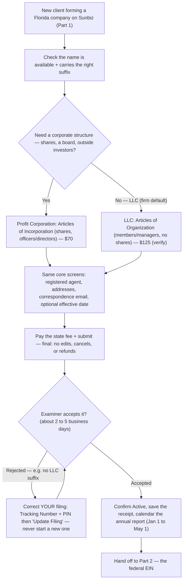

# SOP: Florida Company Formation on Sunbiz (Articles of Incorporation / Organization)

> **Status:** Active · **Owner:** Julia · **Last updated:** 2026-08-03

The procedure for **forming a company with the State of Florida** on Sunbiz
(Division of Corporations) — the **first** step of the firm's end-to-end company
setup. This is **Part 1**; once the entity shows **Active** on Sunbiz, hand off to
[`ein-application-irs.md`](./ein-application-irs.md) (Part 2 — the federal EIN),
which is the immediate next step.

> **Coverage note:** the **Florida Profit Corporation** path (Articles of
> Incorporation) is documented **screen by screen, verified from a real filing**
> (§3). The **LLC** path (Articles of Organization) is a **framework stub** (§4)
> — file one and capture the screens to complete it.

> **Where client data goes:** the client's real corporate name, addresses,
> registered-agent details, officer/director/member names, share count, and the
> assigned document number are **sensitive** and belong in **your client systems**
> (Google Drive / Double / QuickBooks) — **not** in this repo. Copy the blank
> intake at the bottom into the client's folder there and fill it in. This repo
> keeps only the reusable procedure + the blank template.

> 🏛️ **File directly on the official state site.** Start at
> <https://dos.fl.gov/sunbiz/start-business/>. Skip third-party "formation
> services" that mark up the state fee and insert a middleman between the client
> and their own filing. The only money that should change hands is the state fee
> (§7), paid to Florida.

---

## ⚠️ The name MUST carry its entity suffix — the state will never add it for you

**This is the single most common reason a formation filing is rejected.** Type the
suffix into the name field yourself, every time.

| Entity | The name **must** contain | Authority |
|---|---|---|
| **LLC** | **"Limited Liability Company"** — or **"L.L.C."** — or **"LLC"** | [Fla. Stat. §605.0112](https://codes.findlaw.com/fl/title-xxxvi-business-organizations/fl-st-sect-605-0112/) |
| **Profit Corporation** | **"Corporation"**, **"Company"**, **"Incorporated"** — or **Corp.** / **Co.** / **Inc.** | Fla. Stat. §607.0401 |

**Sunbiz rejects a filing whose name lacks the suffix. It does not add it for you —
and that is deliberate, not an oversight:**

1. **The Articles are the organizer's signed declaration, not a document the state
   drafts.** You sign electronically affirming the facts are true (false information
   is a third-degree felony, Fla. Stat. §817.155). The Division **examines** what you
   declared; it does not **author** it.
2. **The statute allows three different spellings, and you choose which** —
   `LLC` vs `L.L.C.` vs `Limited Liability Company`, with or without a comma
   (*Sunshine Bakery LLC* / *Sunshine Bakery, LLC*). The state cannot guess.
3. **The full name has to clear the distinguishability check.** Adding a suffix
   unilaterally could collide with an entity already on file.

> 🔑 **Whatever you type becomes the entity's EXACT legal name** — the string that
> must match on the **EIN**, the **bank account**, and **every contract**. Getting it
> right at filing is cheaper than any later fix.

**If the client wants to trade under a name without the suffix** (e.g. market as
"Sunshine Bakery"), that is legitimate — but the route is a **Fictitious Name (DBA)**
registration under Fla. Stat. §865.09, filed *after* formation, **not** a
suffix-less legal name. See §2.

- Florida requires **publishing a legal notice in a newspaper** before registering
  the fictitious name.
- **A DBA gives no liability protection by itself** — it is branding. The LLC is what
  protects. Many owners do both.
- A fictitious name **may not end in "LLC" or "Inc."** unless it matches the actual
  registered entity type.

**Operating under a suffix-less name without a DBA is the genuinely risky case** —
the suffix is what puts third parties on notice they are dealing with a
limited-liability entity, so contracts signed without identifying the entity invite
a claim that the owner contracted **personally**. Sign as the entity, always.

*Rejected because of the name? Don't start over — see §5.*

---

## The process at a glance

Forming a Florida company on Sunbiz (the firm's **Part 1**) turns on one choice —
**LLC or Profit Corporation**. The two file different Articles, but then share the
same core screens (registered agent, addresses, correspondence email) and the
same finish: pay the state fee, confirm **Active**, calendar the annual report,
and hand off to **Part 2** (the federal EIN). *S-corp is a tax election made
later — it changes nothing on the Sunbiz filing.*



## 0. Intake — decide and gather before filing

The filing is one uninterrupted online form; gather everything first.

> **Where the answers come from — the client's Business Intake Form.** The firm
> sends every new client a **Business Intake Form** up front, and its answers feed
> this filing (and Part 2, the EIN). Pull the values from the client's
> **completed** intake form rather than re-interviewing; the working sheet in the
> appendix is just to transcribe the fields this filing needs. If the form is
> missing something this filing requires, that is the one thing to go back to the
> client for.

1. **Entity type** — **LLC** or **Profit Corporation (Inc./Corp.)**? → drives the
   whole form. See §1. (Tie to whether the client will elect **S-corp** — that
   changes nothing on the state filing but sets up Part 2 + Form 2553.)
2. **Proposed name** — **checked for availability** on Sunbiz (must be
   *distinguishable*; §2) and **carrying the right suffix** — **LLC / L.L.C. /
   Limited Liability Company** for an LLC, **Corp / Inc. / Incorporated / Co.** for
   a corporation. **The state never adds it for you** (see the callout at the top);
   decide the exact spelling now, because it becomes the entity's legal name.
3. **Registered agent (RA)** — an individual **or** a company (not the entity
   itself) with a **Florida street address** (no PO box) who will **sign**.
4. **Principal place of business** — a **street** address (no PO box) — and a
   **mailing address** (may be the same).
5. **Correspondence email** — where the filing receipt and **every future annual-
   report notice** will go. Choose a monitored inbox (often the firm's).
6. **Incorporator / organizer** — the person submitting the filing (name +
   address).
7. **Corporation only:** number of **authorized shares** (cannot be zero),
   **officers/directors** (list now — see §3), and **corporate purpose** (usually
   "any and all lawful business").
8. **LLC only:** **members** and whether **member-managed or manager-managed**;
   the **managers/authorized representatives** (§4).
9. **Effective date** preference — immediate, or a chosen date (see the **Jan 1**
   tax tip in §2).
10. **Payment** — credit card, debit (Visa/MC only), or a prepaid Sunbiz E-File
    account (§7).

---

## 1. Entity choice — LLC vs Profit Corporation

Both are formed on Sunbiz; the state form differs (§3 vs §4).

- **LLC** — the firm's most common default: flexible, member/manager-managed, no
  shares, no stated corporate purpose required. Files **Articles of
  Organization**.
- **Profit Corporation** — shares, a board of directors + officers, a stated
  purpose. Files **Articles of Incorporation**. Used when the client wants/needs a
  corporate structure (investors, specific governance, certain professional
  setups).
- **S-corp is a tax election, not an entity type.** Either an LLC **or** a
  Corporation can elect S-corp — that happens **after** formation and **after** the
  EIN, on **Form 2553** (see the EIN SOP §4B and the
  [`reasonable-compensation`](../../.claude/skills/reasonable-compensation/) skill,
  which the S-corp owner-salary work depends on). Nothing about the S-election
  appears on the Sunbiz filing.

---

## 2. Before you file — shared prerequisites & rules

- **Name availability + the suffix.** Search Sunbiz first — the name must be
  **distinguishable** from existing entities:
  <https://search.sunbiz.org/Inquiry/CorporationSearch/ByName>. Search the name
  **with the suffix already attached** ("Sunshine Bakery LLC"), because that full
  string is what gets examined. A **corporation** name must include a suffix
  (**"Corp", "Inc.", "Incorporated", "Co.",** etc.); an **LLC** name must include
  **"LLC" / "L.L.C." / "Limited Liability Company"**. ⚠️ **The state never adds the
  suffix for you** — see the callout at the top of this SOP for why, and §5 if a
  filing was already rejected over it.
- **Trading under a different name = a Fictitious Name (DBA), not a suffix-less
  legal name.** Form "Sunshine Bakery LLC", then register "Sunshine Bakery" as a
  DBA under Fla. Stat. §865.09 (a newspaper legal notice is required first). A DBA
  is branding — it carries **no** liability protection of its own, and it may not
  end in "LLC"/"Inc." unless it matches the real entity type. See §10 for the link.
- **Registered agent rules.** The RA needs a **Florida street address** (PO box not
  accepted). The RA **types their name to sign**; the signature **must be an
  individual** (if a company serves as RA, a person signs for it). **An entity
  cannot be its own RA.** A false signature is **forgery under Fla. Stat. §831.06**.
- **Effective date (optional).** You may set an effective date — Florida allows up
  to **5 business days before** or **90 days after** the filing date.
  - 🗓️ **Jan 1 tax tip:** for an entity formed **late in the year**, specifying a
    **January 1 effective date** starts the entity's first tax year clean on Jan 1
    and avoids a stub/short first-year return. Decide this with the tax treatment
    in mind before filing.
- **Payment processor.** Card payments run through **NIC Services, LLC dba Tyler
  Payment Services**. The receipt comes from **noreply@finit.tylertech.com**; the
  bank statement shows **"NIC DOS DIVISION OF CORP."** **Keep the receipt** — it
  helps locate/reconcile the filing.
- **Supported browsers:** Chrome, Edge, Firefox, Safari, Opera.
- **⛔ Submissions are final.** Per the disclaimer: once submitted, the Articles
  **cannot be changed, removed, canceled, or refunded** — review everything first.
  If a filing is **rejected**, you get a **Tracking Number + PIN** by email; use
  the **"Correct …"** path to fix and resubmit **your** filing rather than starting
  over — the full procedure is **§5**.
- **Beneficial Ownership (BOI / FinCEN) — federal, not part of Sunbiz.** Sunbiz
  only posts a *notice* of the requirement. **Current status (verify — still being
  finalized):** under FinCEN's **March 2025 interim final rule**, entities
  **formed in the US ("domestic reporting companies") and US persons are EXEMPT**
  from BOI reporting; only **foreign reporting companies** (formed abroad, then
  registered to do business in a US state) must report, and they don't report US
  persons. → A company **formed in Florida is domestic**, so it is currently
  exempt **even if foreign-owned**. Re-check **fincen.gov/boi** before advising a
  client, since this rule is not yet final.

---

## 3. Path A — Florida Profit Corporation (Articles of Incorporation)

Verified screen by screen, 2026-07.

### ▶ Start here — exactly where to go and what to click

1. **Open the Sunbiz start page:** <https://dos.fl.gov/sunbiz/start-business/>
2. Click **"Start E-Filing."**
3. Under **Start E-Filing**, choose the entity type — **"Profit Corporation"**
   *(for an LLC, choose **"Limited Liability Company"** and follow §4 instead).*
4. On the Profit Corporation page, click the **"File or Correct Florida Profit
   Articles of Incorporation"** button.
5. That opens the **disclaimer screen** (§3.0) → accept it → **"Start New Filing"**
   → the filing form (§3.1 onward).

### 3.0 Disclaimer screen
"This form creates a Florida Profit Corporation **OR** corrects your rejected
online filing." Two sides:
- **File Articles of Incorporation** → check **"I have read and accept the terms
  of this disclaimer…"** → **Start New Filing**.
- **Correct Articles of Incorporation** → enter the **Tracking Number + PIN** from
  the rejection email → **Update Filing**. *(Use this only to fix a rejected
  filing.)*

### 3.1 Filing Information
- **Effective date** (optional, MM/DD/YYYY) — see the §2 Jan 1 tip.
- **Required filing fee: $70.00.** Options: **Certificate of Status +$8.75**,
  **Certified Copy +$8.75** (both optional — see §7).
- **Corporate Name** — *must include a suffix* ("Corp", "Inc.", "Incorporated",
  etc.). Confirm availability first (§2).
- **Corporate Stock Shares** — the number of authorized shares. **Cannot be zero**
  (a common default is a round number such as **100** or **1,000**; Florida does
  not require a par value on this form).

### 3.2 Principal Place of Business
A **street** address (Address / Suite / City / State / Zip / Country).

### 3.3 Mailing Address
Check **"Mailing address same as principal address"** or enter a separate one.

### 3.4 Registered Agent
- **Name** (Last / First / Initial / Title) **— OR — a Business to serve as RA**
  (must be **different** from the entity being filed).
- **Address** in **FL** (**PO box not acceptable**), Suite, City, Zip.
- **Registered Agent Signature** — the RA **types their name** to sign; must be an
  **individual** name and made with the individual's full knowledge/permission (or
  it is **forgery, §831.06**). Do not enter the new entity's name as its own RA.

### 3.5 Corporate Purpose
- Check **"Corporate purpose is 'Any and all lawful business'"** for the usual
  case. **Do not** check it for a **Professional Association** — instead list the
  specific purpose (max **240 characters**).

### 3.6 Correspondence Name and E-mail Address
- **Name**, **E-mail**, **Re-enter E-mail.** ⚠️ This is where **this filing's
  receipt and all future annual-report notices** are sent — enter it carefully and
  use a monitored inbox.

### 3.7 Officer / Director Name and Address
> **List every officer/director now.** This is **required to open most bank
> accounts and to obtain a workers'-comp exemption.** After filing, **any change
> requires an amendment that cannot be filed online and costs an extra $35.00** —
> so get this right the first time.
- Per person: **Title** (P, VP, etc.), **Name** (Last / First / Initial / suffix)
  **— OR — a Business Name to serve as Officer**; **Street Address / City / State
  / Zip / Country.** Repeat for each officer/director.

### 3.8 Incorporator Name and Address
- **Name / Address / Suite / City-State-Zip.**
- **Electronic Signature of Incorporator** — affirms the facts are true; **false
  information is a third-degree felony under Fla. Stat. §817.155**; acknowledges the
  annual-report requirement.

### 3.9 Notice of Annual Report (read + acknowledge)
The corporation must file an **Annual Report between Jan 1 and May 1 every year** to
stay **Active**; the **first** report is due Jan 1–May 1 of the **year after
formation**; **$150** fee, **$400 late fee** after May 1; reminders go to the §3.6
email. See §7.

### 3.10 Payment → Submit → Confirmation *(screens pending)*
Pay by card (NIC/Tyler) or prepaid account, review, and submit. **Once submitted it
cannot be changed or refunded (§2).** *Capture the payment, submission, and
confirmation screens on the next filing to finish this section.* On success the
entity posts to Sunbiz with a **document number** (and the receipt from
noreply@finit.tylertech.com).

---

## 4. Path B — Florida LLC (Articles of Organization) — framework (screens pending)

Entry: Sunbiz → **Start a Business → Start E-Filing → Limited Liability Company**.
The flow mirrors §3 (disclaimer → form → payment) but the form differs — capture it
on the next LLC filing. **Key differences from the Corporation form:**

- **No shares** and **no required corporate purpose.**
- Instead of officers/directors, list **members and/or managers** and indicate
  **member-managed vs manager-managed** (the "Authorized Person(s)" / managers).
- Name must include **"LLC" / "L.L.C."** (not Corp/Inc.).
- **Fees differ** (verify on Sunbiz at filing): LLC formation is **$125.00** and
  the **LLC Annual Report is $138.75** (vs. $70 / $150 for a profit corporation).
- Registered agent, principal/mailing address, correspondence email, effective
  date, the "cannot be changed after submit" rule, and the annual-report cadence
  all work the **same** as the corporation (§2–§3).

*To finish: file one LLC and capture the Articles of Organization screens, then
promote this from a stub to a full screen-by-screen like §3.*

---

## 5. If the filing is rejected — correct it, don't start over

A rejection is **not** a lost filing. Florida gives you a path back into **your own**
submission, and using it is the difference between a small fix and paying the state
fee a second time.

> **The most common trigger is the name** — missing the `LLC` / `Corp` suffix, or a
> name that isn't distinguishable. See the callout at the top of this SOP.

### 5.1 What arrives

The Division emails a **rejection notice** listing **every** reason the filing failed
(often more than one), and it carries the two credentials you need:

- **Tracking Number**
- **PIN**

⚠️ **Keep this email.** Without the Tracking Number + PIN there is no correction path
— you would have to file from scratch and pay again.

### 5.2 Your two options

| Option | What it does | Cost |
|---|---|---|
| **A — Correct it** *(normal case)* | Reopens **your** rejected filing to fix and resubmit | See the open question in §5.5 |
| **B — Abandon it & request a refund** | Reply to the rejection email asking for a refund, stating **to whom the check should be payable** and the **mailing address** | Refunds what you paid **minus the card processor's non-refundable convenience fee**; allow **~30 days** |

### 5.3 Correcting it — the steps

1. **Read the whole rejection email.** Fix **every** listed reason at once, or it
   comes straight back.
2. **Re-verify the corrected name on Sunbiz** — search it **with the suffix**
   attached to confirm it is still distinguishable:
   <https://search.sunbiz.org/Inquiry/CorporationSearch/ByName>
3. **Go back in through the same door:**
   <https://dos.fl.gov/sunbiz/start-business/> → **"Start E-Filing"** → your entity
   type (**"Limited Liability Company"** or **"Profit Corporation"**) → the
   **"File or Correct …"** button.
4. **⚠️ On the disclaimer screen, use the RIGHT-hand side.** This is where the
   mistake happens — the two sides look alike and do opposite things:

   | Side of the screen | What it does | Use it? |
   |---|---|---|
   | **File Articles …** → *Start New Filing* | A **brand-new filing from zero** — a new submission with its **own payment** | ❌ **No** |
   | **Correct Articles …** → *Update Filing* | Reopens **your** rejected filing | ✅ **Yes** |

5. **Enter the Tracking Number + PIN**, then click **"Update Filing."**
6. **Fix the name** (add the suffix) and review the rest of the form before
   resubmitting — submission is final again (§2).
7. **Resubmit.**

### 5.4 Don't wait

Correct it promptly. Whether the Tracking Number + PIN **expire** is not documented
on the public pages — assume the rejected filing does not wait for you indefinitely.

### 5.5 ❓ Open question — verify and record here

**Does resubmitting through "Correct Articles" charge the filing fee again?**

- **Not confirmed.** No official Division page states it either way.
- **Strong indication that it does not:** the Division's stated alternative to
  correcting is to **request a refund of what you already paid**, which implies the
  payment is held against the tracking number and applied to the corrected filing.
  That is an inference, **not a verified fact — do not state it to a client as
  settled.**
- **What IS certain:** starting a **new** filing instead (the wrong side of the
  disclaimer screen) is a new submission with its **own payment**.
- **How to settle it:** call the Division's **Internet Access** section at
  **850.245.6939**, or simply observe the payment screen on the next correction.

> 📝 **When someone confirms this, replace this subsection with the verified answer
> and note who confirmed it and when.**

---

## 6. Processing times — when the filing posts to Sunbiz

- **Roughly 2–5 business days** for an online filing; most 2026 sources put it at
  **~2–3 business days**.
- **There is no gap between approval and visibility.** The record posts the moment an
  examiner clears it — approved, **Active**, and searchable on Sunbiz at the same
  time. There is no extra waiting period afterwards.
- **Filings are worked strictly in the order received**, and **Florida offers no
  expedited processing** for formations. There is no way to jump the line.
- **Your "received" date is the date the card payment processed** — not the moment
  you started filling in the form. That timestamp sets your place in the queue.
- **Check the live queue, don't guess.** The Division publishes **daily** which
  received-date it is currently processing, by document type:
  → **<https://dos.fl.gov/sunbiz/document-processing-dates/>**
  Look for **"New Florida Business Entity Filings – Submitted Online."** The gap
  between that date and today is the real lag at that moment. *(Reference point: on
  26 Jun 2026 it was clearing filings received 23 Jun — about 3 days.)*
- Once approved, the **stamped Articles download free** from Sunbiz — there is no
  return mail to wait for.
- **An effective date overrides the approval date on the record.** If you set one
  (the Jan 1 tip, §2), the entity posts with **that** date, not the day the examiner
  cleared it.

> ⏱️ **Tell the client the whole runway, not just this step.** Formation is 2–5
> business days, **and then** Part 2 (the EIN) — which cannot start until the entity
> is **Active** — adds same-day (responsible party has SSN/ITIN) or **~4 business
> days** (fax "Foreign" path). Quote the sum.

---

## 7. Fees & annual upkeep

| Item | Profit Corporation | LLC *(verify)* |
|---|---|---|
| **Formation filing** | **$70.00** | **$125.00** |
| Certificate of Status (optional) | $8.75 | $5.00 |
| Certified Copy (optional) | $8.75 | $30.00 |
| **Annual Report** (due **Jan 1–May 1**) | **$150.00** | **$138.75** |
| Annual Report **late fee** (after May 1) | **$400.00** | **$400.00** |
| Officer/Director/member change after filing | $35.00 amendment (not online) | (amendment fee — verify) |

- **Annual report is how the entity stays Active** — miss the May 1 deadline and
  the **$400 late fee** applies; keep missing it and the state **administratively
  dissolves** the entity. **Calendar it the moment the entity is formed.**
- The first annual report is due the **year after** formation (Jan 1–May 1).

---

## 8. After filing → next steps

1. **Save the confirmation + payment receipt** and the **filed Articles / document
   number** in the client's system (not this repo).
2. **Confirm the entity is Active** on Sunbiz (search by name).
3. **Calendar the annual report** (Jan 1–May 1 every year; first one the year
   after formation).
4. **→ Part 2: get the federal EIN** —
   [`ein-application-irs.md`](./ein-application-irs.md) (do this once Active).
5. Then, as the activity requires: **Form 2553** if electing S-corp, **business
   bank account**, **FL DOR** (sales/reemployment tax, DR-1), **Local Business Tax
   Receipt** (see
   [`hollywood-broward-business-tax-receipt.md`](./hollywood-broward-business-tax-receipt.md)),
   and **payroll**.

---

## 9. Common pitfalls

- **Missing the entity suffix in the name** → **the #1 rejection reason.** The state
  **never** adds `LLC` / `Corp` for you (see the callout at the top). Type it in
  yourself, and search Sunbiz with the **full** name including the suffix.
- **Assuming a rejection means starting over** → it doesn't. Keep the rejection
  email: the **Tracking Number + PIN** reopen **your** filing (§5). Clicking *Start
  New Filing* instead creates a second filing with its **own payment**.
- **Fixing only one rejection reason** → the email lists them all; fix everything
  before resubmitting or it bounces again.
- **Promising a client a same-week company** → formation runs **~2–5 business days**
  and the **EIN can't start until Active** (§6). Quote the combined runway.
- **Confusing a DBA with the legal name** → a Fictitious Name is branding with **no**
  liability protection; the entity still needs its suffix in the legal name (§2).
- **PO box for the RA or principal address** → not accepted; use a street address.
- **Entity listed as its own registered agent** → not allowed.
- **Wrong/again-unmonitored correspondence email** → the client misses annual-
  report notices and drifts toward the $400 late fee / dissolution.
- **Zero shares** on a corporation → the form rejects it.
- **Forgetting officers/directors** → a later $35 amendment that can't be filed
  online. List them now.
- **Submitting with an error** → no edits/refunds; you must re-file. Review the
  whole form before paying.
- **Assuming a Florida-formed, foreign-owned company must file BOI** → currently it
  does **not** (domestic entity; §2) — but verify the current FinCEN rule.

---

## 10. Contacts & links

| Who | For | Link |
|---|---|---|
| Sunbiz — Start a Business | Entry point for all filings | <https://dos.fl.gov/sunbiz/start-business/> |
| Sunbiz — Corporation name search | Check the **full** name (with suffix) is distinguishable | <https://search.sunbiz.org/Inquiry/CorporationSearch/ByName> |
| **Sunbiz — Document Processing Dates** | **Which received-date the Division is clearing today** — the live queue, updated daily (§6) | <https://dos.fl.gov/sunbiz/document-processing-dates/> |
| Division of Corporations — Internet Access | Phone support for e-filing questions (rejections, corrections, whether a correction re-charges the fee — §5.5) | **850.245.6939** |
| Fla. Stat. §605.0112 | The statute requiring `LLC` / `L.L.C.` / `Limited Liability Company` in an LLC's name | <https://codes.findlaw.com/fl/title-xxxvi-business-organizations/fl-st-sect-605-0112/> |
| Sunbiz — Profit Corporation e-file | Articles of Incorporation | Start E-Filing → **Profit Corporation** |
| Sunbiz — LLC e-file | Articles of Organization | Start E-Filing → **Limited Liability Company** |
| Sunbiz — Fictitious Name (DBA) | Operating under a different name (Fla. Stat. §865.09) | Start E-Filing → **Fictitious Name Registration** |
| Sunbiz — Annual Report | Keep entity Active (Jan 1–May 1) | <https://dos.fl.gov/sunbiz/manage-business/> |
| FinCEN — Beneficial Ownership (BOI) | Verify current reporting rule | <https://www.fincen.gov/boi> |
| IRS EIN (Part 2) | Federal EIN after Active | [`ein-application-irs.md`](./ein-application-irs.md) |

---

## Appendix — Blank intake (copy into the client's file in YOUR system)

> Copy this block into the client's folder in Drive/Double/QuickBooks and fill it
> there **from the client's completed Business Intake Form**. **Keep filled-in
> client data — names, addresses, share counts, the document number — out of this
> repo.**

```
FL Formation Intake — <proposed entity name>

Decision
- Entity type:  ☐ LLC (Articles of Organization)  ☐ Profit Corporation (Articles of Incorporation)
- Will elect S-corp later?  ☐ No  ☐ Yes → Form 2553 after EIN (see EIN SOP §4B)

Name
- Proposed name (with suffix — LLC / Inc. / Corp.):
- Distinguishable on Sunbiz search?  ☐ Yes  ☐ No — alt name:

Addresses
- Principal place of business (STREET, no PO box):
- Mailing address:  ☐ Same as principal  ☐ Other:

Registered Agent
- RA name (individual) OR business:
- RA Florida street address (no PO box):
- RA will sign (individual)?  ☐ Yes

People
- Incorporator / organizer (name + address):
- Corp: officers/directors (Title + name + address, each):
- Corp: authorized shares (not zero):
- Corp: purpose  ☐ Any and all lawful business  ☐ Specific: ____
- LLC: members / managers; management  ☐ Member-managed  ☐ Manager-managed:

Filing details
- Correspondence email (annual-report notices — monitored inbox):
- Effective date:  ☐ Immediate  ☐ Date: ____  (Jan 1 tip if formed late in the year)
- Payment:  ☐ Credit card  ☐ Debit (Visa/MC)  ☐ Prepaid Sunbiz account

Result  (store in client system, NOT the repo)
- Filed / Active date:
- Sunbiz document number:
- Receipt saved?  ☐ Yes  Location: ____
- Annual report calendared (Jan 1–May 1, year after formation)?  ☐ Yes
- Next: ☐ EIN (Part 2)  ☐ Form 2553  ☐ Bank account  ☐ FL DOR  ☐ Local BTR

Notes / open questions:
```

_Sources: Sunbiz (Florida Division of Corporations) — Start a Business, Profit
Corporation Articles of Incorporation e-file screens verified directly by Julia;
Fla. Stat. §831.06 (RA signature) and §817.155 (false filing); FinCEN BOI interim
final rule (Mar 2025). Verify fees, forms, and the current FinCEN rule against the
official sources before filing._
