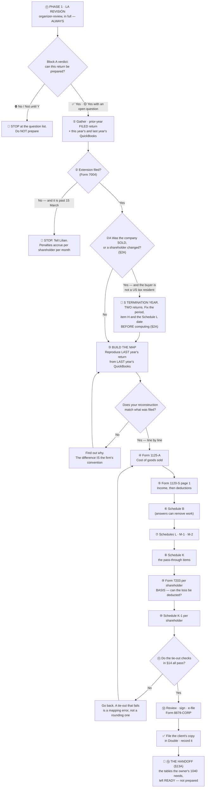

# Preparing a Form 1120-S (S-corporation return) — from QuickBooks to a filed return

> **Status:** 🟡 **DRAFT — in review with Lilian.** Written 2026-08-14 while preparing the
> firm's first 1120-S with a session assisting, and shaped by what a first-time preparer
> actually needed to be told. **Remove this note when Lilian signs it off.** ·
> **Owner:** Lilian · **Last updated:** 2026-08-23
>
> 🔵 **One part of this DRAFT is already FIRM POLICY and is not waiting on the sign-off: §5C-v**,
> Julia's rule on netting a shareholder's contributions against their distributions. **Read it
> before presenting any shareholder account** — it carries five gates, and three of them are
> conditions under which the netting is **not** neutral.

> **Client data lives in the firm's systems, not here.** Names, EINs, figures, balances and
> filled-in worksheets belong in Google Drive / Double / QuickBooks. This SOP carries the
> **procedure and the line map** only — every amount below is a placeholder.

> **The skill that maintains this, and that writes the next one:**
> [`tax-return-sop`](../../.claude/skills/tax-return-sop/). One SOP per form; this is the reference.

> **Who this is written for.** Someone preparing an S-corporation return **for the first
> time**, who knows bookkeeping but has not filled in a 1120-S. It explains *where each
> number comes from*, not just which box it goes in — because the boxes are the easy part.

---

## The process at a glance



🔗 **STEP ⓪ IS NOT OPTIONAL AND IT IS NOT PART OF THIS SOP.** Every return begins with **phase 1, la
Revisión** — the [`organizer-review` skill](../../.claude/skills/organizer-review/) run in full,
whose **Block A verdict is the gate into everything below** _(Lilian, 2026-08-20: "siempre, sin
preguntar")_. **The entry point for a live return is
[`tax-return-sop`](../../.claude/skills/tax-return-sop/) §4A**, and this SOP is what phase 2 opens.
⚠️ **Arriving here directly — "prepárame el 1120-S de X" — does not skip it.**

---

## §0C · 🗺️ THE MAP OF THE FORM — which page every schedule is on

**Read this before hunting for a line.** Form 1120-S is **five pages**, and **two** of its schedules —
**Schedule B and Schedule K** — are **split across a page break**, which is the single commonest reason
a preparer decides a line "is not on the form". ⓘ **Schedule L and the two M schedules are not split;
they simply do not get pages of their own.**

| Page | What is on it | Lines |
|---|---|---|
| **1** | **The header** (name, address, EIN, items **A–J**) · **Income** · **Deductions** · the result · tax and payments · the **signature** | 1a–6 income · 7–21 deductions · **22 ordinary business income** · 23–27 tax and payments · **28 refund / direct deposit** ⚠️ *(28c–28e are the routing number, account type and account number — page 1 does not stop at 27)* |
| **2** | **Schedule B** — *Other Information* | questions **1 to 11** |
| **3** | **Schedule B *(continued)*** at the top — then **Schedule K BEGINS** below it | B: **12 to 17** · K: **1 to 16f** |
| **4** | **Schedule K *(continued)*** at the top — then **the whole of Schedule L** | K: **17a, 17b, 17c, 17d, 18** · L: **1 to 27** |
| **5** | **Schedule M-1** and **Schedule M-2**, one above the other | M-1: 1–8 · M-2: 1–8 |

🔑 **Three things the page layout does, and each costs time the first time:**

1. **Schedule B is split.** Questions 1–11 on page 2, **12–17 on page 3**. The 1099 question (14a/b)
   is on page 3, not with the rest.
2. **Schedule K is split.** Lines 1–16f on page 3, **17a–18 on page 4**. ⚠️ **This is why line 17d
   and line 18 "cannot be found"** — they sit on a different page from the Schedule K everyone knows.
3. **Schedule L has no page of its own.** It shares page 4 with the tail of Schedule K. And **M-1
   and M-2 share page 5** — both of them, stacked.

🛠️ **How to navigate it in the software, rather than trusting this table:** every page carries its
number **printed in the top-right corner of the form face** (`Form 1120-S (2025) … Page 4`). In **ATX** the page buttons sit at the bottom of the
form window next to a **`Pages & Worksheets`** control that lists every page *and* every supporting
worksheet; other forms-based programs have an equivalent, under their own name.

⚠️ **Check this map against the year you are filing.** The IRS moves content between pages, exactly
as it renumbers Schedule B's questions (§6). _(Verified against the **2025** `f1120s.pdf` from
irs.gov, 2026-08-23.)_

🔑 **And this is a DELIVERY rule, not just a reading aid: every line table handed to a preparer
names the page it is on.** A table headed *"Schedule K"* sends someone to page 3 for a line that is
on page 4.

---

## §0A · Where every number comes from, and where it goes

**Read this before anything else.** Almost every mistake on a first return is a number taken
from the wrong place, or a number that reached the right box by the wrong route. There are only
**four sources**, and everything else on the return is computed from them.

### The four sources

| # | Source | What it feeds |
|---|---|---|
| **1** | **The Profit & Loss** | Page 1 income (lines 1a, 1b, 5) and the deductions on lines 7–13, 15–18 and 20. ⚠️ **Not line 14** (Form 4562, source 4), **not line 4** (Form 4797), **not line 2** (Form 1125-A), **not line 19** (Form 7205) |
| **2** | **The Balance Sheet** at year end | 1125-A line 7 · box **F** total assets · the whole **end** column of Schedule L |
| **3** | **LAST year's FILED return** | 1125-A line 1 · the **beginning** column of Schedule L · M-2 line 1 · every convention (§3) |
| **4** | **The depreciation schedule** | Form 4562 → page 1 line 14 → M-1 line 6a |

⚠️ **Source 3 is a return, not a system.** When the books and the prior return disagree, the
prior return wins and the books get adjusted — never the other way round.

### How the numbers travel

```
  ┌─ P&L ──────────────┐  ┌─ BALANCE SHEET ────┐  ┌─ PRIOR RETURN ─────┐  ┌─ DEPR. SCHEDULE ─┐
  │ revenue, discounts │  │ inventory subtotal │  │ 1125-A line 1      │  │ cost, method,    │
  │ most expenses      │  │ cash, fixed assets │  │ Sch L BEGINNING col│  │ life, in-service │
  │ (NOT 2,4,14,19)    │  │ liabilities,equity │  │ M-2 line 1         │  │ prior depr.      │
  └─────────┬──────────┘  └─────────┬──────────┘  └─────────┬──────────┘  └────────┬─────────┘
            │                       │                       │                      │
            │                       │  ┌────────────────────┘                      │
            │                       ▼  ▼                                           ▼
            │             ┌────────────────────┐                         ┌──────────────────┐
            │             │  FORM 1125-A       │                         │  FORM 4562       │
            │             │  1 ← prior return  │                         │  depreciation    │
            │             │  7 ← balance sheet │                         └────────┬─────────┘
            │             │  6 = 1+2+3+4+5     │                                  │
            │             │  8 = 6 − 7         │                                  │
            │             │  (solve for 2 when │                                  │
            │             │   8 is the known — │                                  │
            │             │   §4, never both)  │                                  │
            │             └─────────┬──────────┘                                  │
            │                       │                                             │
            ▼                       ▼                                             ▼
  ┌──────────────────────────────────────────────────────────────────────────────────────┐
  │  FORM 1120-S, PAGE 1                                                                 │
  │   1a,1b,5 ← P&L        2 ← 1125-A line 8      3 = 1c − 2       4 ← Form 4797         │
  │   7–13,15–18 ← P&L    14 ← Form 4562         19 ← Form 7205   20 = what is left      │
  │   21 = sum 7…20        22 = 6 − 21   ◄── THE NUMBER THE RETURN PRODUCES              │
  └──────────────────────────────────────┬───────────────────────────────────────────────┘
                                         │
             ┌───────────────────────────┴────────────────┐
             ▼                                            ▼
  ┌──────────────────────────┐                ┌────────────────────────────┐
  │  SCHEDULE K              │                │  SCHEDULE M-1              │
  │  1  ← page 1 line 22     │                │  1  ← book net income      │
  │  4,9,11,12a ← P&L items  │                │  3b ← non-deductible T&E   │
  │       that NEVER touched │                │  6a ← depreciation the     │
  │       page 1             │                │       books never recorded │
  │  16c ← non-deductible    │                │  8  = 4 − 7                │
  │  18 = 1…10 − (11…12e+16f)◄────────────────┼──  MUST EQUAL Sch K line 18│
  └────────────┬─────────────┘                └────────────────────────────┘
               │
       ┌───────┴────────┬──────────────────────┐
       ▼                ▼                      ▼
  ┌──────────┐   ┌─────────────┐        ┌──────────────┐
  │ K-1 each │   │ SCHEDULE M-2│        │ FORM 7203    │
  │ = Sch K  │   │ 1 ← prior yr│        │ per SHAREHLDR│
  │   × their│   │ 4 ← the loss│        │ decides how  │
  │   share  │   │ 5 ← 16c     │        │ much of the  │
  └──────────┘   └─────────────┘        │ loss is USED │
                                        └──────────────┘
```

### The three places one number must appear twice

These are where a beginner's return most often fails to tie:

1. **Total assets** — box **F** on page 1 **and** Schedule L line 15 (end column).
2. **Ordinary business income** — page 1 line **22** **and** Schedule K line **1**.
3. **Non-deductible expenses** — Schedule K line **16c**, and again as a reduction in Schedule
   M-2 and in each shareholder's basis. ⚠️ **This one is a trail, not an identity.** M-1 line
   **3b** is *travel and entertainment* specifically; other non-deductibles go on line 3
   itemised, and line 3 also carries timing differences. Items 1 and 2 above are exact
   equalities; this one you follow rather than tie.

---

## §0B · What this return actually is

**An S-corporation normally pays no federal income tax.** It files an information return that
says: *this is what the business earned, and here is how it splits between the owners.* Each
owner then reports their share on their own 1040, through a **Schedule K-1**.

Three consequences a first-time preparer needs to hold on to:

1. **The point of the whole exercise is line 22 of page 1** — *ordinary business income
   (loss)* — plus the handful of items that must travel to the owners **separately** rather
   than inside line 22. Everything else is bookkeeping around those.
   ⚠️ **Line 22, not 21.** For tax years from 2023 the IRS inserted a new line 19 (the energy
   efficient commercial buildings deduction, Form 7205) and everything below it moved down by
   one. Anything you read — a checklist, a memory, an older SOP — that says "line 21" is
   describing **2022 or earlier**. Schedule K line 1 on the current form settles it: it says
   *"(page 1, line 22)"*.
2. **Some income and expenses never enter line 22.** Interest income, dividends, capital
   gains, §179, charitable contributions and a few others are **separately stated**: they go
   on **Schedule K** and straight to the K-1s, because each owner's own tax treatment of them
   differs. Sweeping them into line 22 is the classic beginner error.
3. **A loss is not automatically deductible by the owner.** It is limited by that owner's
   **basis** — §12. This is where a return that "looks finished" is often wrong.

> 🔑 **THE RULE THAT GOVERNS EVERYTHING BELOW: the return is not a copy of the P&L.**
> It is the P&L **regrouped** into the form's fixed categories, **plus** the adjustments where
> tax law and bookkeeping disagree. Every dollar in the books lands somewhere on the return —
> but almost never in the order QuickBooks shows it.

---

## §1 · Gather this before you start

You cannot prepare from the current year alone. **Half of this list is about the prior year**,
and that is deliberate — see §3.

- [ ] **The prior year's FILED return** (the whole package: federal, any state, the K-1s).
      Get it from the client's `Tax Return Filed` folder in Double.
      ⚠️ **Read it through the redactor** — `tools/redact-doc/` — never open the PDF directly.
      One year only. The rule and its limits are in the
      [`double-mcp`](../../.claude/skills/double-mcp/) skill.
- [ ] **This year's Profit & Loss** from QuickBooks — full year, **accrual** unless the client
      is on cash basis.
- [ ] **This year's Balance Sheet** as of the last day of the year.
- [ ] **LAST year's Profit & Loss and Balance Sheet.** Not optional. §3 is built on them.
- [ ] **The depreciation schedule** — the prior year's Form 4562 detail, or the fixed-asset
      register: cost, date placed in service, method, life, and depreciation taken so far.
- [ ] **Each shareholder's ownership percentage**, and whether it changed during the year.
- [ ] **Whether the shareholders put money in or took money out** during the year, and whether
      those were **capital contributions** or **loans** — they are not the same thing (§12).
      ⚠️ **Ask for the GROSS figures, not the account's net movement.** Books normally carry one
      equity account per shareholder and net everything inside it, so `+50,000` is equally
      consistent with *contributed 50,000, took nothing* and with *contributed 90,000, took
      40,000*. **Those two produce the same Schedule L and different everything else** —
      the **ANALYSIS** needs the two figures separately — Schedule K 16d, the K-1's box 16 code D,
      M-2 line 7 and Form 7203 are all driven off them, and 🔵 **the firm's netting policy (§5C-v)
      cannot even be TESTED without them.** Schedule L is the only one the net satisfies, which is
      why the gap survives so long unnoticed. _(How the return is then PRESENTED is §5C-v's
      question, never the books'.)_
- [ ] **The GENERAL LEDGER for the year** — the one report that answers "what actually happened
      in this account", which no P&L or balance sheet can. Get it once, for every account, rather
      than returning for accounts one at a time.
      🔴 **When the BOOKS' period is not the RETURN's period** — a terminated election, a mid-year
      sale, a change of accounting period — **it stops being a supporting document and becomes the
      source you build from**, because it is the only report that shows the true-up entries sitting
      around the cut. ⓘ **Not every short period needs that**: where the books start and stop with the
      return, an ordinary P&L is fine. **See §5B-i part 4.**
- [ ] **Confirmation that Form 7004 (the extension) was filed**, if you are past 15 March.

> ⚠️ **Check the BASIS printed on every export, and check that they agree with each other.**
> QuickBooks reports carry cash-or-accrual as a per-report toggle, and the footer is the only
> place it is stated. A general ledger exported on **cash** while the P&L and balance sheet were
> exported on **accrual** is a different set of books, and nothing in the file warns you.
> **Compare account totals across the two before relying on either.** They coincide only for a
> client with no receivables and no payables — which is common enough in this practice to make
> the mismatch look harmless right up until the year it is not. And keep §6's separate point in
> view: **the report's basis is a toggle; the entity's tax accounting method is what was elected
> and filed.** The two answer different questions.

### Intake questions for the client

Ask these **before** you start, not when you are stuck:

1. Did the business **buy or sell any equipment or vehicles** this year?
2. Did any shareholder **put money in or take money out**? Was it a loan or a contribution?
3. Are there **loans to or from the company** — and did they change?
4. Did the company **take a physical inventory count** at year end?
5. Did anything change about the **business itself** — a new state, a new line of business, a
   closed location, a shareholder joining or leaving?
6. Are there **financial accounts outside the United States**?
7. Were **Forms 1099** required, and were they filed?

---

## §2 · Gate: the extension

**Check this first, because it cannot be fixed later.**

The 1120-S for a calendar year is due **15 March** of the following year (the next business day
if that is a weekend or holiday). **Form 7004** extends it **six months**, to **15 September**.

- The firm files 7004 for **most clients as a matter of course** *(Lilian, 2026-08-14)* — but
  **confirm it for this client**, do not assume.
- ⚠️ **The extension extends the FILING, not the paying.** An S-corp usually owes no federal
  tax, so this is rarely a money problem — but it is not a rule you get to ignore.
- 🛑 **If no extension was filed and the deadline has passed, stop and tell Lilian.** The
  late-filing penalty on an S-corp is charged **per shareholder, per month** and climbs fast.
  Confirm the current rate against the IRS instructions rather than quoting one from memory.

---

## §2A · 🔴 GATE: **WAS THE COMPANY SOLD, OR DID A SHAREHOLDER CHANGE?** — the S termination year

**Run this immediately after the extension gate and before any figure.** 🔑 **It decides how many
returns exist, what period this one covers, which date the balance sheet carries, and how the year's
result is split.** ⛔ **Every one of those is impossible to fix once the figures are keyed**, and a
session that computes first will compute the wrong period.

> 💡 **Written from the Gossip Miami 2025 return (Aug 2026), where this question stayed open for six
> days while the figures were built twice.** ✅ **Nothing computed was wasted — because both periods were
> carried side by side — but the SHAPE had to be rebuilt from scratch when the answer arrived.**
> **This section is so the next one does not.**

### ① The three questions that open it

| Ask | Why |
|---|---|
| **Did anyone acquire shares this year who is NOT a US citizen or resident?** | 🔴 **An S corporation may only be owned by US individuals and certain trusts and estates.** The election dies **automatically** on the day an ineligible person acquires a share — §1362(d)(2). **Nobody files anything; it just ends** |
| **Did the shareholders revoke the election?** | A different route to the same place — §1362(d)(1) |
| **Did the company acquire a second class of stock, too many shareholders, or an ineligible entity shareholder?** | Same result, different trigger — §1361(b) |

🛑 **THE FIRST ONE IS THE TRAP, BECAUSE NOBODY VOLUNTEERS IT.** A client says *"we sold the business"*
and everyone starts computing. ⛔ **Ask who the buyer is and whether they are a US tax resident**, in
those words. ⚠️ **It is not a rude question and it is not optional** — it is the difference between one
return and two.

> ⓘ **AN LLC THAT LOSES ITS S ELECTION DOES NOT BECOME "A NORMAL LLC AGAIN".** Electing S status
> carries a **deemed election to be classified as a corporation** (Reg. §301.7701-3(c)(1)(v)(C)), and
> **that second election survives the first.** 🔑 **So the buyer is left holding a C CORPORATION** —
> one that pays its own tax — **not a disregarded single-member LLC.** ⚠️ **Tell whoever is advising the
> buyer's side, if anyone is.**

### ② If the election terminated: there are TWO returns, and usually only ONE is yours

| | **The S short year** | **The C short year** |
|---|---|---|
| Period | 1 January → **the day BEFORE** the terminating event | the day of the event → the end of the calendar year |
| Form | **Form 1120-S** — *this* return | **Form 1120** |
| Taxed | passes through to the shareholders on K-1s | at the entity, 21% |
| Whose job | ours, for our client | 🔴 **whoever controls the company now** — ask, never assume |
| EIN | 🛑 **the same on both** | 🛑 **the same on both** |

🛑 **SAY THIS OUT LOUD TO WHOEVER SIGNS.** Our return carries **item H(5)**, which announces the
termination. **From the moment it is filed the IRS expects a Form 1120 for the rest of the year under
that EIN.** ⛔ **We are not engaged for it and we should not quietly prepare it** — but **the new owner
may not know it exists**, and unfiled, the notices reach a company our client used to own.
**Raise it; let the partner decide what, if anything, is said.**

### ③ 🔑 HOW THE YEAR IS SPLIT — and the rule most people get backwards

**Something has to decide which income and expenses belong to each short period. There are two methods
and they give completely different answers.**

| | Method | What it does |
|---|---|---|
| **A · Pro rata, per DAY** — §1362(e)(2) | the **general default** | **Ignores when things happened.** Takes the whole year's result and gives each period its share of the *days* |
| **B · Normal accounting rules — "closing the books"** — §1362(e)(3) | by **election** | **Cuts the books on the date** and reports what each period actually did |

🛑 **AND THE THIRD THING, WHICH IS THE ONE THAT ACTUALLY GOVERNS A SALE: §1362(e)(6)(D).**
**Where 50% or more of the stock is sold or exchanged during the S termination year, the pro-rata
method is NOT AVAILABLE and closing the books is compulsory** *(Reg. §1.1362-3(b)(3))*. ✅ **So on an
ordinary sale of the business there is nothing to elect, nothing to sign, and no consent to obtain from
a buyer nobody has spoken to.**

> 🔑 **WHY THIS MATTERS SO MUCH, IN ONE LINE:** under method A the return reports a **per-day fraction of
> a full year**, which is not a real result of anything. **On the pilot the two methods gave 36,990 and
> 51,452 for the same line 22.** ⛔ **Getting this wrong is not a presentation error.**
>
> 🛑 **AND DO NOT REASON YOUR WAY TO THE RIGHT ANSWER BY THE WRONG ROAD.** A session on the pilot argued
> *"nobody made a §1362(e)(3) election, so the books cannot be closed"* — and that argument **fails**,
> because **(e)(6)(D) is a second door to the same method** and it does not need an election at all.
>
> ⛔ **AND A CORRECTION THIS SOP CARRIED UNTIL 2026-08-27:** it used to say the (e)(3) election *"is made
> by a statement attached to the very return you are preparing, so nothing has been foregone."*
> 🔴 **That is WRONG.** **Reg. §1.1362-6(a)(5), as recited by the IRS in PLR 201507011:** *"The statement
> must be filed with the corporation's return for the **C short year**."* — **the Form 1120, which on a
> sale is the BUYER'S return, not yours.** ⚠️ **So on a sale you could not make that election on the
> 1120-S even if you wanted to** — and §1362(e)(3)(B) would also need the **buyer's** consent.
> ✅ **Three independent reasons the election route is closed on a 50%+ sale. Any one is enough.**

> ### ✅ WHERE TO READ THE 50% RULE WHEN THE LEGAL-TEXT SITES ARE BLOCKED — the route that worked
>
> **The firm's environment refuses law.cornell.edu, the eCFR, uscode.house.gov, govinfo, govregs and
> federalregister, and irs.gov does not host the CFR.** 🔑 **irs.gov's own PRIOR-PUBLICATION archive
> does carry the rule, in plain English, and nobody had tried it:**
>
> | Source | What it gives |
> |---|---|
> | **Pub. 589, *Tax Information on S Corporations*, Rev. 1995 (and 1994), p. 18** — `irs.gov/pub/irs-prior/p589--1995.pdf` | *"**The pro rata allocation cannot be made if 50% or more of the corporation's stock is sold or exchanged during the S termination year.**"* — and the whole of §1362(e) in plain English, including the five items an (e)(3) election statement must contain |
> | **PLR 201507011** — `irs.gov/pub/irs-wd/201507011.pdf` | recites the current statute: *"except as provided in § 1362(e)(3) and § 1362(e)(6)(C) and (D)"* — **proof that (6)(D) is still there** |
> | **Reg. §1.460-4(k)(3)(v)(D)** via **IRB 2004-34** | lists (6)(D) among the provisions under which *"the S corporation's books are **closed**"* — **proof of what it DOES** |
>
> ⚠️ **Pub. 589 is OBSOLETE — discontinued after 1995, and parts of it are stale** *(it still says "more
> than 35 shareholders")*. ⛔ **Never cite it alone.** ✅ **Cite it for the CONTENT and the other two for
> currency** — that combination is what makes it usable, and it is a route worth remembering for any
> S-corporation question the blocked sites would otherwise own.

### ④ What changes on the return itself — the checklist

| | |
|---|---|
| **The tax-year boxes on page 1** | 🛑 **THE SINGLE MOST IMPORTANT ENTRY.** *"For calendar year 2025 or tax year beginning ___, ending ___"* — **a short period is stated HERE and nowhere else.** ⛔ **Leave it blank and the return claims to be a full calendar year**, contradicting every figure on it. **It lives on the software's return-header screen, not on the form face** |
| **Item H(1) "Final return"** | ⛔ **DO NOT CHECK** unless the company **ceases to exist** — the instruction says so in those words: *"if this is the corporation's final return and **it will no longer exist**"*. **A company that was sold still exists** |
| **Item H(5) "S election termination"** | ✅ **CHECK IT.** This is the box that describes the return |
| **"Final K-1"** | ✅ **Check it for a shareholder who disposed of her ENTIRE interest.** ⚠️ **The instructions mention this box only in the H(1) bullet, so there is no instruction squarely on a sale** — you are checking it on the shareholder's facts. ⛔ **It does not oblige you to check H(1)** |
| **Item I, number of shareholders** | **Count who held shares during *this* return's tax year.** 🔑 **A buyer who acquired on the day AFTER the S short year ended was never a shareholder during it and gets NO K-1 from us** |
| **The allocation between shareholders** | ✅ **Usually a plain pro-rata split with no election.** 🔑 **The §1362(e) cut does not split a year between PEOPLE — it ENDS the year**, so each shareholder held their percentage for every day of it. ⛔ **A §1377(a)(2) election is for a shareholder exiting *within* a tax year and does not apply** |
| **Schedule L** | see ⑤ |
| 🔴 **A TERMINATION-NOTICE STATEMENT** | 🛑 **REQUIRED, and easy to miss because the H(5) box feels like it covers it.** The instructions, *Termination of Election*, item 1, verbatim: *"…**Attach to Form 1120-S for the final year of the S corporation a statement notifying the IRS of the termination and the date it occurred.**"* 🛠️ **One short statement naming the terminating event and its date.** ⛔ **Ticking the box is not the statement** |
| **The due date** | see ⑥ |

### ⑤ 🔵 THE SCHEDULE L DATE — the instruction reads one way and means another

**The instruction, verbatim:**

> *"If the S election terminated during the tax year and the corporation reverted to a C corporation,
> the year-end balance sheet should generally agree with the books and records at the end of the
> **C short year.** However, if the corporation **elected under section 1362(e)(3)** to have items
> assigned to each short year under normal tax accounting rules, the year-end balance sheet should
> agree with the books and records at the end of the **S short year**."*

🔑 **The rule follows the METHOD, and here is why the default looks strange until you see it.** Under
the **pro-rata** method **the books are never closed on the cut date at all** — the return's figures are
a per-day slice of the whole year, so **no balance sheet exists at that date.** The only real one is at
the end of the C short year. ✅ **Under the closing-of-the-books method a real balance sheet DOES exist
on the cut date**, and that is the one the instruction then asks for.

🛑 **So on a SALE of 50% or more — where (e)(6)(D) makes closing the books compulsory — the balance
sheet goes on the CUT DATE, even though no §1362(e)(3) election was made.** The instruction names the
method by the election that usually produces it; here the same method arrives by a different door.
⚠️ **The alternative reading prints a balance sheet dated months after the return's own income
statement ends, for a company that by then belonged to somebody else.**

🛠️ **Attach a one-line explanatory footnote either way** — *"S termination year under §1362(d)(2);
items assigned to each short year under §1362(e)(6)(D); balance sheet at the end of the S short
year"* — **so the reader is not left wondering.** ⛔ **Do NOT attach a §1362(e)(3) election statement
for a rule that is not elective.**

### ⑥ 🔴 THE DUE DATE — it is NOT the ordinary 1120-S date, and it depends on a return you are not filing

**The instruction, verbatim:** *"If the S corporation election was terminated … file Form 1120-S for the
S corporation's short year **by the due date (including extensions) of the C corporation's short year
return**."*

| Step | |
|---|---|
| Find the **C short year's** end | usually 31 December |
| Form 1120 is due | **the 15th day of the 4th month** after it — 15 April for a December end |
| With a Form 7004 | **+6 months** — ✅ *Instructions for Form 7004 (Rev. 12-2025): "The automatic extension period for time to file is generally 6 months", the only exceptions being certain Forms 1041 and **June-30** C corporations. **The old five-month rule for December year-ends is gone*** |
| 🔴 **But only if somebody actually extended it** | **and that is normally the BUYER's side, not ours** |

🛑 **TWO TRAPS, AND THE PILOT WALKED INTO BOTH.**
**①** **The Form 7004 the firm filed before anyone knew about the cut extends a return that does not
exist** — an ordinary calendar-year 1120-S. ⛔ **Do not assume it covers the short period.**
**②** **The branch with MORE time is the one where our extension may not work.** 🔑 **So work to the
EARLIEST candidate date, not the most favourable one**, and say so in writing to whoever signs.
⚠️ **And check whether the original date has already passed** — the Form 1120-S late-filing penalty runs
**per shareholder per month**, and on a small company it is not small.

### ⑦ ⛔ WHAT NOT TO DO

- ⛔ **Do not check "Final return" because it is the last 1120-S the company will file.** That is not what
  the box asks.
- ⛔ **Do not put the post-sale receipts into the S short year because "the services were pre-sale".**
  The reasoning is sound and it is **not available**: a tax year that has ended cannot take in a later
  receipt, and on the cash method the receipt falls when the money arrived. ⚠️ **The real-world problem
  it identifies is genuine — money for the sellers' work landing, after closing, in accounts the buyer
  never controlled, and now legally the C corporation's income — but that is a matter between the
  parties, not something a return can fix. Raise it; do not solve it on the form.**
- ⛔ **Do not compute anything before the answer to ① is known.** ✅ **If it cannot be got quickly, carry
  BOTH periods side by side in the working paper** — that is what saved the pilot. **Every figure of the
  short period stood unchanged when the answer came; only the shape had to be rebuilt.**

## §3 · 🔑 BUILD THE MAP FROM THE PRIOR YEAR — before you fill in anything

**This is the most important section in this SOP, and it is the step a beginner skips.**

Every firm, and every client, has conventions about how the books map onto the form: which
QuickBooks account feeds which line, what gets grouped, what is netted. **Those conventions are
not written down anywhere. They are encoded in last year's filed return.**

So before touching this year:

1. Open **last year's P&L and Balance Sheet**, and **last year's filed return**.
2. **Reconstruct last year's page 1 from last year's P&L**, on paper or in a spreadsheet.
3. **Compare, line by line, against what was actually filed.**
4. **Every difference is information.** Do not "fix" it and do not average it — find out *why*
   it is different. That reason is the convention you must repeat.
5. Only when your reconstruction reproduces the filed return do you have a trustworthy map.

**What this catches, in one real example (a Shopify client, 2026-08-14).** The ending-inventory
line on the return did not equal the QuickBooks `Inventory` account. It equalled
`Total for Other Current Assets` — the `Inventory` account **plus a Shopify Clearing Account**.
Using the Inventory account alone broke the cost-of-goods schedule and drove **purchases
negative**, which is impossible. Nobody could have guessed that convention; reproducing the
prior year revealed it in ten minutes.

> ⚠️ **A number that reconciles is not the same as a number that is right.** Reproducing the
> prior year proves your **map** is right. It does not prove the underlying figures are — the
> client's cost basis, their inventory count, their classifications are separate questions.

### 🔑 3A · With more than one owner, CHECK EVERY PRIOR-YEAR K-1 FOR THE "FINAL K-1" BOX

**Firm rule (Lilian, Aug 2026).** Before you decide how many shareholders this year has, open
**each** Schedule K-1 from the prior return and look at the **`Final K-1`** checkbox at the top
right.

**A ticked `Final K-1` means that shareholder is out.** It is the previous preparer's explicit
statement that it was that person's last K-1 from this company — so **this year they are not a
shareholder, they get no K-1, and they are not counted in page 1 box I.** You do not need to
reconstruct the sale, find the transfer document, or reason it out from the balance sheet: the
prior return already answered it, and answering it any other way risks contradicting a filed
position.

**Do this before anything shareholder-related** — it decides box I, how many K-1s exist, how many
Forms 7203 you prepare, and whether the year needs a per-day allocation at all. A two-owner company
whose second K-1 was final last year is a **one-owner company this year**, allocating 100%, with no
per-day arithmetic to do.

⚠️ **Two things the box does not tell you, and neither one changes the answer above:**

- **The departed shareholder's capital account may still be sitting on the balance sheet.** Books
  do not clear themselves. Under the sweep-into-retained-earnings convention (§8A) this changes no
  figure — the equity total is what it is — but it is worth knowing whose money it is, because the
  buyer's **outside basis** (what they paid for the shares) is not in the company's books at all,
  and it decides the gain or loss when the company eventually liquidates.
- **The rest of the prior return may not agree with the box.** A truly final K-1 would normally
  show zero shares at end of year and a below-full allocation percentage. If it shows the
  shareholder still holding shares at 31 December, **note it and move on — the box governs.**
  Report the inconsistency to Lilian rather than resolving it yourself, and never as a criticism
  of a closed return (§3's rule above).

> 🛑 **Reproducing the prior year is NOT auditing it.** A filed return is closed. You are
> reading it as an answer key to learn the conventions, not to find fault with it. If you do
> spot something that looks wrong, raise it with Lilian — do not change this year's approach on
> your own initiative, because consistency between years is itself a tax position.

---

## §4 · Form 1125-A — cost of goods sold

**Fill this in first.** Its line 8 feeds page 1. The form points there itself — it says *"Enter here and on Form **1120**,
page 1, line 2, **or the appropriate line of your tax return**"*, and for an S-corp the
appropriate line is page 1 line 2. Skip it entirely if the client sells no
goods.

| Line | What it is | Formula, or where you read it |
|---|---|---|
| **1** | Inventory at beginning of year | 📖 **read** · `= line 7 of LAST year's 1125-A`. The prior return governs — never a system, never a recalculation |
| **2** | Purchases | 📖 read **if the books track them** · ƒ **calculated** `= line 8 + line 7 − line 1` when they do not — see 4A |
| **3** | Cost of labor | 📖 read · direct production labour only. Most retail and e-commerce clients have none |
| **4** | Additional §263A costs | 📖 read · almost always blank for a small business taxpayer |
| **5** | Other costs | 📖 read · whatever the firm's convention puts in cost of sales beyond purchases |
| **6** | Total | ƒ `= line 1 + line 2 + line 3 + line 4 + line 5` |
| **7** | Inventory at end of year | 📖 **read** off the **balance sheet** — but read the trap in 4B |
| **8** | **Cost of goods sold** | ƒ `= line 6 − line 7` → carry to **page 1, line 2** |

### The identity — and how to use it

```
line 1  +  line 2  −  line 7  =  line 8
```

> ⚠️ **That is the SHORT form, and it holds only while lines 3, 4 and 5 are all zero.** The form
> itself is `line 8 = line 6 − line 7` where `line 6 = lines 1+2+3+4+5`. So **before using any
> rearrangement below, look at lines 3, 4 and 5 and confirm they are empty** — line 5 in particular
> is *"whatever the firm's convention puts in cost of sales beyond purchases"* and is not always
> blank.
>
> 🛑 **The one that bites is solving for PURCHASES.** `line 2 = line 8 + line 7 − line 1`
> **overstates purchases by (line 3 + line 4 + line 5)** whenever any of them is populated — and
> unlike the negative-purchases case below, **this error comes out looking perfectly plausible**,
> so nothing catches it. The full form is `line 2 = line 8 + line 7 − line 1 − line 3 − line 4 −
> line 5`.

You will usually **know three of the four** and solve for the fourth. Rearranged, every version of
it:

```
line 8  =  line 1 + line 2 − line 7        ← cost of goods sold, when purchases are known
line 2  =  line 8 + line 7 − line 1        ← PURCHASES, when cost of goods sold is known
line 7  =  line 1 + line 2 − line 8        ← ending inventory, when both others are known
line 1  =  line 8 + line 7 − line 2        ← only ever a CHECK; line 1 is copied, never solved
```

Which one is the unknown depends on how the client's books work:

- **Purchases recorded to an asset account** (perpetual): you know 1, 2 and 7 → **solve for line 8**.
- **Purchases expensed, cost of sales estimated** (periodic): you know 1, 7 and 8 → **solve for
  line 2**.

> 💡 **Why "purchases" is so often the one you solve for.** In a periodic setup nobody ever adds
> up the purchase invoices for the year — the bookkeeping records what was *bought* into an asset
> account and what was *sold* as an estimate, and the return needs a purchases figure that is
> consistent with both. Solving for it guarantees the schedule balances. **It is a derived figure,
> not a measured one** — which is exactly why an ending inventory read off the wrong account
> shows up here as an impossible number.

🛑 **If the figure you solve for comes out NEGATIVE, your map is wrong.** Negative purchases are
not a thing. Go back to §3 — you are almost certainly reading the wrong account into line 7.

### ⚠️ The line 7 trap

**"Inventory at end of year" is not automatically the account called `Inventory`.**

On some clients the return's inventory line is a **subtotal** covering more than that one
account. The Shopify example above is `Inventory` **plus** the Shopify Clearing Account, which the
QuickBooks balance sheet already presents as one line: `Total for Other Current Assets`.

**Read line 7 off the balance sheet section that the PRIOR RETURN used** — §3 tells you which
one. Do not decide it from the account's name.

### ⚠️ What a SOLVED line 2 actually contains — and why it is not "what they bought"

**The most reasonable objection a preparer can raise is: "but the client bought nothing this year,
so why is there a number in purchases?"** It deserves a real answer, because the instinct behind it
is right and the conclusion is wrong.

**Line 2 is not a claim about purchase invoices.** When you solve for it, it is *whatever makes the
schedule balance* given the other three. And you are not free to override it: put a zero in line 2
while keeping the prior year's line 1, the books' line 7 and the books' line 8, and the schedule
does not add up. **The identity has four slots and three of them are locked** — line 1 by the prior
return, line 7 by the balance sheet (which Schedule L line 3 must also equal), line 8 by the P&L.
Whichever one you refuse to move, another one absorbs the difference.

So a solved line 2 is a **measurement**, not an assertion — and what it measures is:

```
line 2  =  (value that entered inventory-land from anywhere other than a sale)
```

**Decompose it before you accept it.** When the client's line 7 and line 8 are subtotals covering
more than one account (the trap above), split the solved figure along the same seams:

```
line 2  =  [ COGS acct + ending Inventory acct − beginning Inventory acct ]   ← the GOODS side
         + [ the other accounts swept into lines 7 and 8 ]                    ← the ARTIFACT side
```

The artifact side has nothing to do with buying anything — it is the year's movement in whatever
non-inventory account the convention parks inside line 7, plus whatever non-purchase cost the
convention parks inside line 8. It can easily be the **majority** of a small solved line 2.

_(The pilot: a Shopify client whose line 7 includes the Shopify **Clearing Account** and whose line
8 includes **Shopify Selling Fees**. In a year the client bought no stock, a small solved line 2 decomposed to
**roughly two thirds artifact** — selling fees plus the clearing account's growth — and one third on
the goods side. Most of "purchases" was not goods.)_

**Then ask what the goods side means.** If the client truly bought nothing, the Inventory account
should have fallen by exactly the cost of goods sold. A residual says one of three things, and they
are worth telling apart:

1. **Goods really were bought — and often they never touched the inventory account at all.** The
   important case is **pass-through / drop-shipped stock**: goods the client buys and has shipped
   straight to the customer. Their cost is posted **directly to cost of sales**, correctly, because
   they never sit in a warehouse. **Cost of sales therefore rises with no matching inventory
   movement — which is exactly the shape that surfaces in line 2.** Also here: a small reorder,
   freight capitalised into stock, a customer return put back on the shelf.
2. **The cost-of-sales estimate is off** — where cost of sales is a *percentage of sales* rather
   than a measured cost, it will never agree with the goods movement by construction.
3. **Something was posted to Inventory that is not stock** — a reclass, a correction, a plug.

**Ask for the inventory account's ledger detail — and the cost-of-sales account's as well.** One
without the other cannot separate case 1 from case 3, because case 1 leaves no trace in the
inventory account at all. The residual is small; the reason it exists is not.

> 🗣️ **"The client bought nothing this year" and "there are purchases in the ledger" are BOTH
> usually true, and neither person is wrong.** The client means *we did not restock the warehouse*.
> The ledger means *goods cost was incurred*. Between them sits the pass-through business, which
> is invisible from the inventory account and obvious from the cost-of-sales account. **Ask which
> one they mean before you treat the discrepancy as an error** — and, once resolved, write down
> which vendors are pass-through, because the same question returns every year.
>
> _(Pilot: the entire goods-side residual turned out to be **two invoices from one vendor**,
> booked straight to cost of sales, for the product line the client resells as an intermediary. The
> owner's "nothing was purchased" was accurate about her own inventory and the ledger was accurate
> about the return. Nothing needed correcting.)_

⚠️ **A physical count that produced no journal entry is not in the books.** When a client says
they counted the stock and corrected errors, check that an adjusting entry actually exists. If the
inventory account's only movement all year is the cost-of-sales relief, then **ending inventory is
just opening inventory minus cost of sales** — arithmetic, not a count — and whatever the count
found is still wrong on the balance sheet you are about to put on Schedule L. The count may
instead have been used to *set* the unit quantity inside the year-end entry, which is fine; **ask
which, rather than assuming the count reached the books.**

🔑 **The sign is the alarm, and this is the whole diagnostic.** A **negative** line 2 is impossible
and means the map is wrong — go back to §3. A **small positive** line 2 is the healthy outcome:
the map is right, and the number is now a question about the books rather than about the return.
_(Same client, same year: reading line 7 off the `Inventory` account alone instead of the subtotal
produced a **negative** line 2. Reading it off the subtotal produced a **small positive** one. One
is a stop sign and the other is a lead.)_

### Line 9 — the checkboxes

- **9a — the valuation method.** ⚠️ **Six boxes on the current form, not three.** The old three
  are cost · lower of cost or market · other; the November 2024 revision added **non-incidental
  materials and supplies**, **the AFS §471(c) method** and **the non-AFS §471(c) method**, for
  tax years beginning after 2023. Those last three are exactly the small-business inventory
  methods our clients are most likely on. **Copy what was ticked last year — but check whether
  a box now exists that did not exist then**, and if so raise it rather than ticking it
  yourself. Changing the method is a formal election, not a preference.
- **9b–9d** — subnormal goods, LIFO. Normally all "no" for these clients.
- **9e — do the §263A rules apply?** Normally **no** for a small business taxpayer.
- **9f — did the method of determining quantities, cost or valuation change?** If you answer
  "yes" here you have a problem to escalate, not a box to tick.

---

## §5 · Form 1120-S page 1

### 5A · Header

| Box | What goes in it | Source |
|---|---|---|
| Name, address | The company | Prior return |
| **A** | S election effective date | Prior return |
| **B** | Business activity code | Prior return |
| **C** | Schedule M-3 attached? | No — M-3 starts at **$10 million** of total assets |
| **D** | Employer identification number | Prior return, or the client's Double record |
| **E** | Date incorporated | Prior return |
| **F** | **Total assets** | 📖 **read** off the balance sheet — the `Total for Assets` line. **It is not a calculation.** But it has two free cross-checks, and both must hold: `= current assets + fixed assets + other assets`, **and** `= total liabilities + total equity`. ⚠️ **It goes in TWO places on the return** — here in the header **and** on **Schedule L line 15** (end-of-year column) — and they must be the same number. It is also what the $250,000 question in Schedule B measures (§6) |
| 🔴 **G** | 🛑 **ANSWER IT — `Yes` or `No`. DO NOT LEAVE IT BLANK.** *"Is the corporation electing to be an S corporation **beginning with this tax year**?"* 🔑 **Answer it because it is a factual question on a return someone signs** — not because the software will stop you. ⚠️ **The instructions say nothing about the item being mandatory and nothing about what a blank does**, and **ATX raises no in-form diagnostic for one** *(Lilian, 2026-08-20 — one return, one version)*. ⛔ **Whether a blank G survives e-file validation is NOT established** — that return has not been transmitted. **Treat this as a vendor observation, never as an IRS rule.** **Almost always `No`**: an existing S corporation elected in an earlier year. **`Yes` only where THIS year is the first S year.** 🔑 **And `Yes` attaches work:** *"If 'Yes,' **attach Form 2553** if not already filed."* The 2553 is generally due within **2 months and 15 days** of the start of the year the election takes effect, so **a 2553 filed with the 1120-S is normally a LATE election** — relief is requested on the 2553 itself under *Relief for Late Elections*. ⛔ **Do not tick `Yes` merely because the company is young.** The question is about the ELECTION's first year, not the company's | **For `No`:** an accepted **prior-year 1120-S** exists, so the election predates this year. **For `Yes`:** the **Form 2553** — its effective date is also what goes in item **A**. ⚠️ **Item A is corroboration, not proof** — a prior return prepared elsewhere can carry an item A that is impossible *(a date before the company was incorporated)*; if the two disagree, **record the disagreement and answer G from the prior return's existence.** 🔑 **Not to be confused with Schedule K-1 item G, *"Current year allocation percentage"*** — which equals the ownership percentage **only if no shareholder or interest changed during the year**; otherwise it is a per-day weighted figure. Different item, different form |
| **H(1)** | 🛑 **Final return** | **Only tick this if this is the LAST year the company exists.** A company that closes *next* year is not a final return *this* year. Ticking it early tells the IRS the entity is gone |
| **H(2)–(5)** | Name change · address change · amended · S election termination | Normally all unticked |
| **I** | Number of shareholders | Count the K-1s |

### 5B · Income — lines 1 to 6

| Line | What it is | Formula, or where you read it |
|---|---|---|
| **1a** | Gross receipts or sales | ƒ **built account by account — see 5B-i, which is the whole method.** The one-line version: `= every trade-or-business revenue account, INCLUDING the ones that look like pass-throughs, MINUS discounts and other contra-revenue`. ⛔ **Customer refunds are NOT subtracted here — they are line 1b.** 🔴 **Leaving 1b blank and taking them off inside 1a is the SILENT version: 1c comes out right, the return foots, and line 1a is understated with nothing to catch it** (§5B-i part 2). ⛔ **Never read a P&L subtotal** |
| **1b** | Returns and allowances | 📖 read · the refunds-to-customers account |
| **1c** | Balance | ƒ `= 1a − 1b` · ✅ equals the P&L's total income **less anything in it that belongs on Schedule K** (interest, dividends, capital gains) **or on lines 4 and 5**. 🛑 **This equality does NOT hold when the books' period is not the return's period** — use §5B-i part 4's two-step proof instead, and ⛔ never close the gap by moving something onto line 1a |
| **2** | Cost of goods sold | 📖 Form 1125-A line 8 |
| **3** | Gross profit | ƒ `= 1c − 2` · ✅ equals the P&L's gross profit **only when line 2 equals the P&L's cost of sales** — in the periodic case (§4) it comes off the 1125-A instead |
| **4** | Net gain (loss), Form 4797 | 📖 read · gain or loss on selling business equipment. Zero in most years |
| **5** | Other income (loss) | 📖 read · **trade-or-business income only** — see the warning below |
| **6** | Total income | ƒ `= 3 + 4 + 5` |

> ⚠️ **Line 5 is NOT "everything else on the P&L".** Interest income, dividends and capital
> gains are **portfolio income** and go on **Schedule K**, not here. If you put bank interest
> on line 5 you have understated Schedule K and overstated ordinary income.

### 5B-i · 🔑 How to BUILD line 1a from a Profit & Loss — the account-by-account method

**This section exists because a preparer looked at a real P&L, looked at the figure on line 1a, and
could not get from one to the other** _(Lilian, 2026-08-22)_. The old one-line formula named three
things — sales, discounts, shipping — and a real P&L has accounts that are none of them.

#### 1 · Start at `Total for Income`, never at `Total for Sales`

🔴 **The subtotal named after sales is the single most misleading number on a QuickBooks P&L.** It is
the total of **one parent account and its sub-accounts** — and a contra-revenue account sitting at
the *same indent level*, one row above it, is **outside** that subtotal while still being **inside**
`Total for Income`.

*(Invented illustration — the shape, not any client's figures.)*

```
Income
    Discount                  (4,000)   ← same level as Sales, OUTSIDE "Total for Sales"
    Sales                    200,000
        Cash Sales                 0    ← sub-account, INSIDE "Total for Sales"
    Total for Sales          200,000    ⛔ NOT line 1a — see the two ways it goes wrong below
    Service charge income      5,000    ← outside it too
    Tips                      15,000    ← outside it too
Total for Income             216,000    ✅ THIS is the block line 1a is built from
```

**The subtotal is 200,000. Line 1a is 216,000. Two different mistakes lead there:**

- **Copy the subtotal** → **200,000**, which misses the surcharge and the tips entirely (20,000) and
  has *not* been reduced by the discount (4,000). **Understated by 16,000.**
- **Copy the subtotal and then reduce it by the 4,000 discount** → **196,000**. ✅ **The discount subtraction
  itself is right** — the discount really is outside that subtotal, so taking it off is the one
  correct step. **The answer is still 20,000 short**, because the surcharge and the tips were never
  in the subtotal either. `196,000 + 5,000 + 15,000 = 216,000`.

🔑 **The lesson is not "subtract the discount" or "don't".** The subtotal named after sales is
**neither gross revenue nor net revenue** — it is one account's total. There is no adjustment that
turns it into line 1a.

🛑 **So: never copy a subtotal. List the accounts and add them yourself.**
⚠️ **Line 1a equals `Total for Income` only when there are no refunds, nothing belonging on
Schedule K, and nothing belonging on page 1 lines 4 or 5** — which is true of this illustration and of many small service clients, and false the
moment a bank-interest or customer-refund account appears. **The general proof is part 4 step 2; this
shortcut is the special case of it.**

#### 2 · Put every income account through three questions

| # | Question | If yes |
|---|---|---|
| **1** | Does it belong on **Schedule K** instead? *(interest, dividends, capital gains, rental income)* | ⛔ **Out of line 1a entirely** — §5B's warning above |
| **2** | Is it **contra-revenue at the point of sale** — a discount, a package redemption? | ✅ **Inside line 1a, and it must REDUCE it.** ⚠️ **Look at the sign the P&L prints.** Most print it negative, so adding the column already reduces 1a — **confirm the total went down.** If it prints positive, subtract it. ⛔ **Never both** |
| **2b** | Is it a **return, a refund, a rebate or an allowance**? | ⛔ **Line 1b, not line 1a.** The instruction for line 1b, verbatim: *"Enter cash and credit refunds the corporation made to customers for returned merchandise, **rebates, and other allowances made on gross receipts or sales**."* **Two different things go wrong, and the SILENT one is the dangerous one** — see below |
| **2c** | Is it a **gain on selling business property**, or **other trade-or-business income that is not sales** — a `Miscellaneous income`, `Gain on sale`, insurance-recovery or scrap account? | ⛔ **Not line 1a.** Gains on business property go to **page 1 line 4** (Form 4797); other trade-or-business income goes to **page 1 line 5**. ⚠️ **Both are inside `Total for Income`**, so they must be carried in the proof — see part 4 |
| **3** | Everything else in the income block | ✅ **Inside line 1a** — see the note below on money collected for someone else |

🛑 **The two ways refunds go wrong, and why only one of them is ever caught:**

| What the preparer does | line 1a | line 1c | Caught? |
|---|---|---|---|
| Subtracts refunds inside 1a **and leaves 1b blank** | **understated** by the refunds | ✅ **correct** — because `1c = 1a` and the refunds came off already | 🔴 **Only ONE check catches it, and it exists because of this.** §14's check on these lines is **internal** — `1a − 1b = 1c` — and it passes identically whether or not the refunds were taken out of 1a, because both sides move together; every other tie-out runs off **1c or below**. **So §14 now carries a check that compares line 1a to the books account by account** *(and line 1b to the refunds account)*. ⛔ **Skip that one and the return foots, the P&L agrees, and line 1a is understated with nothing to surface it.** ✅ **The Schedule B question that asks whether receipts AND assets were both under $250,000 is measured on it** *(question 11 on the 2025 form — ⚠️ find it by its wording, §6)*: the instructions define *total receipts* as starting from *"Gross receipts or sales (page 1, line 1a)"*. ⚠️ **Whether the §448(c) / §163(j) gross-receipts test is measured on 1a or on 1c (net of returns) is NOT settled here** — the 1120-S instructions only cross-refer to §448(c), and the regulation could not be read. **Check it before relying on either** |
| Subtracts refunds inside 1a **and also puts them on 1b** | understated | **understated** too — deducted twice | 🟡 usually, because 1c stops agreeing with the books |

🔑 **So the rule is not "don't double count" — it is `refunds NEVER touch line 1a`, full stop.**

🔑 **"But that money isn't really ours" — the test is what the BOOKS DID with it, not who it morally
belongs to.** Tips are owed to the workers and sales tax is owed to the state, yet one is in line 1a
and the other is not, and the reason is mechanical:

- **It never reached the P&L** — collected straight into a **liability** account, as sales tax is under
  the net method (§5C-ii). ⛔ **Then it is not revenue and there is nothing to put on line 1a**, and
  remitting it is not a deduction either. **Both, or neither.**
- **It is sitting in the income block** — as tips and card surcharges are here. ✅ **Then it is in line
  1a, and what is paid out is a DEDUCTION.** *(Sales tax under the gross method behaves exactly this
  way — which is why the same account can be in or out on two different clients.)*

⛔ **So never decide this from the account's name or from who the money is destined for. Find out which
account it was credited to.**

#### 3 · ⚠️ The accounts that look like pass-throughs, and are not

**A revenue account is not excluded because the money "belongs to someone else" in spirit.** ⛔ **And
the test is NOT "did the company collect it"** — the company collects sales tax too. **The test is the
mechanical one above: which account was it credited to.**

| Account | In line 1a? | The rule, and the thing to check |
|---|---|---|
| **Tips** collected through the company's own system and paid on to workers | ✅ **Yes** | 🔴 **And then GO AND FIND THE PAYOUT.** If the tips are income and the payout is not deducted anywhere, ordinary income is overstated by the whole of them. **Check whether the payout is booked separately or is buried inside a wages / contract-labour account** — and say which you found |
| **Card surcharges charged to the customer** *(a "bank fees income" account)* | ✅ **Yes** | The processor's fee is a **separate deduction**. ⛔ Never net the two — that is the same gross-not-net rule as §5C-ii |
| **Shipping charged to the customer** | ✅ **Yes** | The carrier's cost is a separate deduction |
| **Sales tax collected** | ❌ **No, under the net method** | §5C-ii — the company is a collection agent. ⚠️ Under the **gross** method it *is* in revenue and the remittance is deducted. **Both, or neither** |

#### 4 · 🛑 A P&L FOR A DIFFERENT PERIOD THAN THE RETURN CANNOT BE THE SOURCE — ONLY THE LEDGER CAN

⚠️ **This is NOT "a P&L cannot be run for a short period" — QuickBooks will happily run one for any
date range, and you should run it.** The hazard is different and it is worse, because it is silent:

1. **The P&L you were handed is almost certainly the full year.** Nobody rebuilds it for a cut nobody
   knew about when they exported it. **Check the date range in the header before using any figure.**
2. 🔴 **A cut in the middle of a quarter lands inside the periodic TRUE-UP ENTRIES**, and a date-range
   P&L simply includes or excludes each one depending on the day it was posted — with no warning. A
   quarterly true-up can be a large fraction of that quarter's revenue, so a cut one day either side
   of it changes the answer enormously. **The general ledger is what lets you SEE those entries**,
   decide what belongs in the period, and say why.

🔑 **So: run the report for the exact period, AND open the ledger around the cut.** The ledger is not
a formality here — it is the only thing that shows you what the date range silently did.

**So whenever the BOOKS' period is not the RETURN's period:**
⚠️ **That is the real condition, not "a short period" as such.** Where a first year or a dissolution
year happens to have books that start and stop with the return, **the P&L is a perfectly good source
and rebuilding from the ledger is wasted, error-prone work.** The rebuild is for the case where the
books run past the cut — a terminated election, a mid-year sale, a change of accounting period.

1. **Build line 1a from the GENERAL LEDGER**, summing each revenue account's transactions up to and
   including the last day of the period.
2. **Then use the P&L to PROVE it**, with this identity — ⚠️ **and it needs BOTH carve-outs, or it
   will not close and the SOP will have sent you looking for an account that is not missing:**
   **In two steps, and keep them separate — mixing a period figure with a full-year P&L is how this
   proof stops closing:**
   ```
   STEP 1 — rebuild the full year from your period figure (period arithmetic only):
       line 1a for the period  +  the same accounts' movement AFTER the cut
       =  full-year line 1a
   🛑 **Total the after-the-cut movement FROM THE LEDGER, the same way you totalled the period.**
   ⛔ **Never derive it as `full year − period`** — that makes STEP 2 close by construction and the
   whole proof proves nothing. **The point is that two independent counts agree.**

   STEP 2 — prove the full year against the P&L (full-year figures only):
       full-year line 1a
         −  full-year line 1b
         +  full-year page 1 lines 4 and 5        (gains, other trade-or-business income)
         +  any Schedule K item that actually sits INSIDE Total for Income
       =  the P&L's Total for Income
   ```
   ⚠️ **Check WHERE the Schedule K items sit before adding anything back.** QuickBooks usually puts
   interest and dividends under **Other Income**, which is **below** `Total for Income` — and capital
   gains are often not on the P&L at all. **When they sit below it, that third term is ZERO**, and
   adding them anyway breaks the proof by their amount.
   🔑 **Why 1b is SUBTRACTED and the rest are ADDED, because the signs are the whole check:** you are
   walking **from line 1a TO `Total for Income`**, and `Total for Income` contains things line 1a does
   not. The refunds are in it **as a negative**, so you subtract them; the gains, the other income and
   any Schedule K item inside the subtotal are in it **as positives**, so you add them. **It is §5B's
   line 1c note, read in the other direction.**
   ⚠️ **If it still does not agree to the cent, an account was missed** — most often one whose entries
   are all quarterly journal entries and therefore easy to overlook.
   ⛔ **Never close the gap by folding interest or refunds into line 1a.** That is the error §5B's own
   warning exists to prevent, and this identity is the place a preparer is most tempted to commit it.
3. 🔑 **Ask which accounts move at all.** Where revenue is trued up **quarterly** from an outside
   system, the true-up accounts are identical in both figures and **only the bank-fed account
   differs.** That is a useful check and a warning at once — see below.

#### 5 · 🔴 REVENUE THAT ARRIVES THROUGH PERIODIC TRUE-UPS — and the cut that lands where they stop

🔑 **A very common shape, not one client's oddity: retail, salons, restaurants, clinics — anywhere a
POS or booking system sits beside the bank feed.** The bank feed builds most of the books, and the
outside system supplies the rest through a **journal entry** every month or quarter.

**What that entry typically does, and it is worth knowing because it is why step 1 below works:** it
**reverses the bank-only sales already booked**, puts **the system's real sales** in their place, and
adds **the things the bank never saw — cash takings, tips, card surcharges, discounts.** 🔴 **So those
accounts are fed by NOTHING ELSE.** A period whose entry was never made leaves them **empty by
construction** — no error, no gap in the bank feed, nothing that looks wrong.

**When revenue is reconciled to an outside system periodically — quarterly Vagaro/Square/Shopify
true-ups — the months after the last true-up carry ONLY what reached the bank.** No cash sales, no
tips, no surcharges, no discounts. **Where the costs of those months ARE complete** — bank-fed wages,
rent, subscriptions — the tail shows **full costs against partial revenue**, and the return understates
income by an amount nobody can see on the face of the P&L.

🛑 **CHECK THAT PREMISE BEFORE USING THE RATIO — it is the one that fails quietly.** In a business that
**pays in cash** (tips handed to staff, day labour, cash purchases), the tail's **costs are incomplete
too**, and the ratio loses its direction entirely: it can move either way, or not at all. ⛔ **In a
cash-paying business the payout ratio is not a test at all** — go straight for the outside system's
report.

> 🛑 **BEFORE YOU RUN EITHER TEST: CHECK WHETHER THE NAME YOU ARE SEARCHING FOR BELONGS TO MORE THAN
> ONE ACCOUNT. It is not a rare edge case — a true-up client is where it happens.**
>
> **A real ledger held TWO accounts both called `Cash Sales`: an ASSET one sitting beside the
> bank account, and an INCOME sub-account under `Sales`.** 🔴 **A search on the name returns both,
> interleaved, with two independent running balances** — and a session read the income account's
> quarter-end reversals as if they explained the asset account's balance, **and published the wrong
> mechanism.**
>
> 🛠️ **The habit that prevents it: work from the GENERAL LEDGER'S ACCOUNT-SECTION HEADERS, never from
> a name search.** The headers tell you how many accounts there are and **what part of the balance
> sheet or P&L each one sits in** — which is the thing the name does not tell you. ✅ **Two accounts
> with one name is a legitimate chart of accounts** *(a parent and a sub, or an asset and its income
> mirror)*; ⛔ **treating them as one is not.**
>
> 🔑 **And a running balance is the cheap check:** an account's balance column restarts at each new
> account. **If your "one account" appears to reset partway through, you are reading two.**

🛠️ **DETECTION 1 — THE LEDGER TEST. Thirty seconds, no judgement, and it is the one to run first,
because it finds the mechanism rather than a symptom:**

1. **List the transaction TYPES feeding each revenue account.** An account fed **only** by
   `Journal Entry` is a true-up account — it receives nothing from the bank feed and is **empty by
   construction** in any period whose entry was never made.
2. **List the MONTHS those entries exist for.** Monthly or quarterly, they should run to the end of
   the period you are filing.
3. 🔴 **Compare against the months the business actually TRADED** — which the bank-fed accounts show:
   sales deposits, wages, supplies.

> **A trading month with no true-up entry = revenue missing from the return.**

🔑 **This test needs no premise and has no false direction** — it either finds a missing entry or it
does not. ⛔ **The ratio below is a SYMPTOM test and is far weaker; run this one first and let it
decide whether the ratio is even worth computing.**

#### 4 · 🔴 AND LOOK FOR THE PLUG — the account that holds what the true-up could not place

**A true-up that cannot reconcile the system to the books has to put the difference somewhere.** Very
often that somewhere is **an asset account**, and 🔑 **the journal entry's own DESCRIPTION says what
it is.** *(A real one, with the system and the amount changed: **"<system> net revenue ($XXX,XXX)
exceeds QBO booked revenue by…"**. 🛑 **Read the descriptions on the true-up entries — they are
written by the bookkeeper and they are the most honest sentence in the file.**)*

🛠️ **Then track that account QUARTER BY QUARTER, because the SHAPE is the finding.** A plug that sits
at a few hundred for two quarters and then jumps to five figures is not a bigger version of the same
thing — **something upstream stopped working, and the jump dates WHEN.**

> 🛑 **AND HERE IS THE TRAP, WHICH COST A REAL SESSION A PUBLISHED WRONG ANSWER: the cause you find
> first is usually the one you can SEE, and the quarterly shape is what disproves it.**
> On that return the monthly entry capturing cash ran January to April and then **stopped**, and the
> plug read roughly **400 · 1,500 · 30,000** across the three quarters *(figures rounded, system
> anonymised)*. **The obvious story — "the entries stopped, so the cash piled up" — is disproved by
> the Q2 figure itself**, because ⚠️ **the Q2 true-up covers APRIL, MAY AND JUNE.** If May and June had
> gone uncaptured, Q2's plug would already be large. **It was not.**
> ✅ **So the evidence dates the failure to Q3, and the stopped entry is a COINCIDENT FACT, not a
> demonstrated cause.**
> 🔑 **The general rule: a quarterly plug is a QUARTERLY measurement. Check that your proposed cause
> falls inside the quarter that actually moved** — the quarter boundaries are the only dating evidence
> you have, and they are usually enough to kill a plausible story.

🛑 **What a plug is NOT: an asset.** Calling it one asserts the company still holds the money. **It is
the bookkeeper saying *"the system says this came in, the bank never saw it, and I do not know where
it went."*** ⚠️ **On the return it can only resolve two ways, and they pull OPPOSITE:** **money the
owners took → a DISTRIBUTION** *(Schedule K 16d up, total assets down, the M-2 cap bites harder)*, or
**money paid out in cash → a DEDUCTION** *(line 20 up, line 22 down)*. ⛔ **You cannot split it by
guessing, and the proportions are not evidence.** 🛠️ **Ask.**

⚠️ **State the result the way it actually is** (`method.md` rule 1b). **FACT:** the account is fed only
by those entries and one is missing. **FACT:** the business traded that month, per the bank-fed
accounts. **INFERENCE:** it therefore generated the same kinds of revenue it generated every other
month. ⛔ **You have not seen that period's report** — so ask for it, and say the estimate is an estimate.

🛠️ **DETECTION 2 — the payout ratio, and it costs one division:** compute the **payout ratio** *(the main cost of
sales — contract labour, commissions — divided by revenue)* **for each trued-up period and again for
the untrued-up tail.**

🛑 **Compare like with like, or the test means nothing.** ⚠️ **A one-month tail against QUARTERLY
averages is not a fair comparison** — a quarter averaging 66% can be made of months at 50% and 85%,
so the tail can look anomalous on ordinary monthly noise, or look fine while hiding a real gap.
**Compute the ratio MONTH BY MONTH wherever the books allow it**, and compare the tail months against
the monthly series. Where only quarterly figures exist, **say so and treat the result as weaker.**

🛑 **Then: the test is whether the tail falls OUTSIDE THE RANGE of the trued-up periods — not whether
the step looks big.** ⚠️ **Say the range out loud first**, because these ratios move a lot between
quarters on their own, and a step that impresses you may be smaller than the normal spread.
_(On the pilot: the trued-up quarters ran **56.1% · 67.6% · 66.6%** — an internal spread of 11.5
points — and the tail came in at **76.7%**. The step from the nearest quarter is only 9.1 points,
**smaller than the normal spread**, so the step proves nothing. What does the work is that 76.7% is
**above every trued-up quarter**, and in the same direction the missing-revenue theory predicts.
⚠️ **And that pilot has the weakness this section just described** — one month against three quarterly
averages. It is corroboration for a theory that already had a documented cause (**no Q4 export
exists**); **it would not have been enough to raise the theory on its own.**)_

⚠️ **It is an INDICATOR, not a measurement, and it can be silent.** Missing revenue **pushes the
ratio UP**, so the false negative is a tail that was genuinely **high-margin** — its true ratio sits
below the range, the missing revenue lifts it back **into** the range, and the test says nothing.
**Never treat a passing ratio as evidence that the tail is complete**, and never let it replace
getting the report.
⛔ **Do not "fix" it by estimating the missing revenue** — get the outside system's report for the
untrued-up period and rebuild it the way the other quarters were built. **If it cannot be obtained,
say the figure is understated and by roughly how much, rather than presenting it as complete.**

### 5C · Deductions — lines 7 to 21

**The mapping rule, which is the whole skill:** lines 7 to 19 are **named categories the IRS
wants to see separately**. Line 20 is **everything left over**. So you work **top down** — place
each expense that has its own line, then group the remainder.

| Line | Category | Typical QuickBooks accounts |
|---|---|---|
| **7** | Compensation of officers | Salaries paid to **officers** — not to every shareholder-employee (§5C-i). Form 1125-E is required at **$500,000 or more** of total receipts |
| **8** | Salaries and wages | Everyone else's wages — **and only actual wages**. See 5C-i |
| **9** | Repairs and maintenance | |
| **10** | Bad debts | |
| **11** | Rents | Office, warehouse, storage, equipment rental |
| **12** | Taxes and licenses | **Taxes the COMPANY BEARS** — including **state** income/PTE tax on the corporation; **federal** income tax never — payroll taxes, business licences, local taxes. Not income tax, and ⚠️ **not sales tax collected from customers** — see 5C-ii |
| **13** | Interest | Loan and credit-card interest. Often sits under "other expenses" in the P&L |
| **14** | Depreciation | **From Form 4562** — see §5D |
| **15** | Depletion | Rare |
| **16** | **Advertising** | ⚠️ Has its own line. Do not leave it in "other deductions" |
| **17** | Pension, profit-sharing plans | |
| **18** | Employee benefit programs | Health insurance, other benefits |
| **19** | Energy efficient commercial buildings deduction | Form 7205. **Normally blank** — but it is why the lines below moved |
| **20** | **Other deductions** | **The remainder** — attach a statement itemising it |
| **21** | Total deductions | ƒ `= sum of lines 7 through 20` |
| **22** | **Ordinary business income (loss)** | ƒ `= line 6 − line 21`. **This is the number the return exists to produce** |

**How to build line 20 without missing anything:**

```
total expenses per the P&L
  −  everything you placed on lines 7–19
  −  the non-deductible portion of any expense (see §9)
  =  line 20
```

Then **itemise** it in the attached statement. If your line 20 does not equal that subtraction,
you have either double-counted or dropped an account.

### 5C-vi · 🔴 MONEY THE ENTITY COLLECTS FOR SOMEBODY ELSE — tips, gratuities, pass-throughs

> 🛑 **FIRST, READ WHAT THIS SECTION DOES AND DOES NOT REOPEN, because §5B-i part 3 looks like it
> says the opposite.**
> **§5B-i part 3 answers:** *money that IS sitting in the income block — where does it go?* ✅ **Line 1a**,
> and it says in terms that **the test is NOT "did the company collect it"** — it is which account the
> money was credited to.
> **This section asks the question BEFORE that one:** *should it have been in the income block at all,
> and if it was, where is the matching payout?*
> 🔑 **They do not conflict, and the default is part 3's.** Money in the income block is line 1a
> revenue. ⛔ **Case (c) below — "it never reached the entity" — is available ONLY on positive evidence**
> from outside the books: the outside system's own report, or the processor's settlement statements,
> showing the money was never remitted to the company. **The absence of a payout is not that evidence,
> and neither is anyone's sense of whose money it is.**

**Where an entity collects money that belongs to its workers, three things can be true and they lead
to opposite answers. Do not guess which.**

| | What happened | Effect on the return |
|---|---|---|
| **(a)** | The entity collected it **and paid it on**, inside its ordinary payments to those people | ✅ **Income and deduction both present. Nothing to do** |
| **(b)** | The entity collected it and **paid it out in cash, unrecorded** | 🔴 **The deduction is MISSING — income is overstated** |
| **(c)** | 🔑 **It never reached the entity at all** — handed straight to the worker, or split out by the processor — **but the outside system reported it and the true-up booked it as income** | 🔴 **The INCOME ENTRY ITSELF is wrong. Income overstated, and there is no deduction to look for** |

🛑 **THE REASONING TRAP, and it is the one a careful person falls into:** *"if it had been paid inside
the ordinary payments, the books would have said so — they don't, so it wasn't paid."*
⛔ **That does not follow.** A payment to a worker is deductible whether it is pay, pay plus tips
passed on, or tips alone. ✅ **So the absence of a label is NOT evidence.**

> 🛑 **⛔ EVERYTHING ABOVE ASSUMES THE WORKERS ARE NOT EMPLOYEES. Settle that first — it changes
> the answer, not just the paperwork.**
> **If they are NON-EMPLOYEES** *(independent contractors, booth renters, 1099 recipients)*: the whole
> payment is contract labour, **the 1099 total is the same however it is made up**, nothing obliges
> anyone to label the tip portion, and the paragraph above holds.
> **If they are EMPLOYEES, none of that is true**, and **three separate things** follow — ⛔ **keep them
> apart, because only the first is about a deduction:**
>
> 1. **REPORTING.** Tips an employee reports are **wages** — **§3121(q)** — so they belong on the **W-2**
>    and carry **FICA**.
> 2. 🛑 **DEDUCTION — and this is where the section's own framing has to be applied.** ✅ **Only tips the
>    COMPANY collected and paid on are the company's expense**, and those belong on **page 1 line 8**
>    *(salaries and wages)*, ⛔ **not inside line 20's contract labour.** ⛔ **Tips a customer handed the
>    employee directly are §3121(q) wages for reporting and FICA and are deducted NOWHERE — the company
>    never had that money.** ⚠️ **Do not put reported cash tips on line 8 as an expense the company never
>    incurred.**
> 3. ✅ **A CREDIT MAY BE AVAILABLE — the employer CLAIMS it, it is not something owed.** **Form 8846**,
>    *Credit for Employer Social Security and Medicare Taxes Paid on Certain Employee Tips* (§45B) —
>    the employer's 7.65% on creditable tips, part of the general business credit. 🔴 **On an S
>    corporation the form is MANDATORY to claim it and the amount goes on Schedule K** — the 2025 form's
>    line 6 says so in terms: *"Partnerships and S corporations, report this amount on Schedule K."*
>
> 🛑 **THE CREDIT REACHES ONLY TWO LINES OF BUSINESS. Read them before telling anyone it is available** —
> *(quoted from the **2025 Form 8846**, page 2, "Who Should File", read off irs.gov)*:
> **(a)** *"Providing, delivering, or serving **food or beverages** for consumption if tipping of employees
> for delivering or serving food or beverages is customary."*
> **(b)** 🆕 *"Providing **barbering and hair care, nail care, esthetics, or body and spa treatment
> services**, if tipping of employees for providing such services is customary."*
> 🔑 **(b) IS NEW.** The same page's *What's New*: *"For tax years beginning after 2024, the tax credit
> was extended to certain beauty service businesses."* ⛔ **It does NOT reach delivery, valet, hotels,
> transport, gig work or any other tipped trade.**
> ⚠️ **And the wage floor differs between them** — creditable tips are reduced by the shortfall to
> **$5.15/hour** for food and beverage but to **$7.25/hour** for beauty services, so an identical salon
> and restaurant do not get the same credit. **Take both figures from the current year's Form 8846, never
> from memory.**
> ⓘ **One thing this SOP does NOT state, because it could not be read here:** whether §45B carries a
> statutory gross-receipts condition on the newly-added establishments. **It is not on the 2025 Form
> 8846 or its instructions.** ⛔ **Read §45B(b) before relying on either answer.**
>
> ⚠️ **Separately — a LARGE FOOD-AND-BEVERAGE establishment may also owe Form 8027**, the tip-allocation
> report. ⛔ **That is a food-and-beverage-only filing and is NOT extended to beauty services.**
>
> 🔴 **A tip payout found sitting in a contract-labour account on an EMPLOYER's books is not a
> bookkeeping detail — it is an unfiled payroll question, and it goes to whoever owns payroll before this
> return is finished.**

**What IS evidence:**

- 🔍 **The pass-through account never empties.** If the entity collected the money and paid it on in
  cash, there must be an entry taking it back out — an expense, or a debit to the income account
  itself. **A collection account that only ever goes UP has never been settled in the books.**
- 🔍 **The payout ratio.** Payments to the workers ÷ revenue. **A ratio well above the trade's normal
  commission rate is consistent with (a)** — the tips are inside. ⚠️ **Consistent with, not proof of.**
  🛑 **AND YOU CANNOT USE THIS RATIO FOR TWO THINGS AT ONCE. §5B-i part 5 reads a HIGH ratio as
  MISSING REVENUE; this section reads a HIGH ratio as TIPS INSIDE THE PAYMENTS. One symptom, two
  opposite conclusions — so on any client where both questions are open, the ratio settles NEITHER.**
  🔑 **Order of operations:** run **§5B-i part 5's detection 1** (the ledger test — does a true-up
  entry exist for every trading month?) and settle the revenue question **first**. **Only once the
  revenue side is closed does a high ratio say anything about tips.** ⛔ **Never quote the ratio in
  support of one theory while the other is still open** — say instead that the ratio is not available
  as evidence here, and go and ask.

🛠️ **ONE question settles all three** — ask it of whoever keeps the books:

> *"When the system reported one of these, did the money reach the company's bank account, or go
> straight to the worker? And if it reached the company, how was it passed on — inside the ordinary
> payment, or in cash?"*

### 5C-iii · 🛑 Distributions hide inside ONE capital account per shareholder

**The books almost always carry a single equity account per shareholder, holding contributions and
distributions netted together.** That is normal, correct bookkeeping — nothing requires the split,
and the balance sheet only ever needs the net.

**But the return needs both halves, and only Schedule L is satisfied by the net:**

| Where it goes | Net enough? |
|---|---|
| Schedule L equity | ✅ yes — one figure |
| **Schedule K line 16d** · **K-1 box 16 code D** | ❌ the ANALYSIS needs gross — 🔴 **but see §5C-v: the firm may PRESENT them netted** |
| **Schedule M-2 line 7** | ❌ same — a line of its own, *after* the combine |
| **Form 7203** | ❌ **both**, and distributions come off basis BEFORE losses (§12) |

🔑 **So you cannot prepare an S-corp return from the balance sheet. Open the shareholder's ledger
and total the debits and the credits separately.** A net movement of `+50,000` is equally consistent
with *contributed 50,000, took nothing* and with *contributed 90,000, took 40,000* — and those two
produce a different Form 7203, a different M-2, and a different K-1.

🛑 **THE SPLIT IS ALWAYS MANDATORY, EVEN WHERE THE RETURN IS PRESENTED NETTED (§5C-v).** You cannot
apply the firm's netting policy without it — its own test is *"are the contributions larger than the
distributions?"*, which is unanswerable from a net figure. **Split first. Decide the presentation
second.**

### 5C-iv · ⚠️ A debit in a capital account is not automatically a distribution

Total the debits, then **look at them**. They divide into three kinds, and only the last two are
distributions:

1. **ROUND TRIPS — money in and straight back out.** Look for an outflow sitting beside an inflow
   of similar size within a few days, or on the same day. That is the owner moving funds, not
   taking profit: a deposit of 50,000 followed three days later by a withdrawal of 49,000 is a
   a **contribution of 1,000**, not a contribution of 50,000 plus a distribution of 49,000. **Netting
   those is right.**
2. **Transfers to the owner's personal accounts** with no matching inflow. Distributions —
   ⚠️ **unless the company carries a shareholder loan**, in which case a payment out may be a
   **repayment of that loan**, which is **Schedule K line 16e**, not 16d, and reduces **debt
   basis** rather than stock basis. §1's intake question about loans to or from the company is
   what tells you; **a repayment misclassified as a distribution also loses the taxable gain that
   arises when prior losses had already reduced debt basis.**
3. **PERSONAL SPENDING on the company card or account** — groceries, fuel, a restaurant, a
   personal subscription. 🔑 **These are the ones that settle the question**, because they cannot
   be netted against anything: nobody round-trips a supermarket run. **A bookkeeper who posts them
   to the owner's equity account instead of an expense account has already classified them
   correctly** — and has kept a personal expense out of your deductions.

🛑 **AND THIS IS WHY A BLANK SCHEDULE M-2 LINE 7 LAST YEAR IS NOT PRECEDENT.** §3 says repeat the prior year's
conventions — but read what the convention actually *was*. "The prior return showed no
distributions" is not a convention; it is a **result**. The convention behind it might have been
*net the round trips*, which is a rule you can apply again, and applying it to a different year can
correctly produce a very different answer.

**A start-up year and a wind-down year are economically opposite, and the return should show it.**
An owner funding a new company is a large net contributor whose few outflows are usually round
trips; the same owner in the closing year is drawing money out systematically and buying groceries
with it. **Same account, same convention, opposite result.** Do not carry a zero forward because
last year had one, and do not treat the difference as evidence that one of the two returns is
wrong.


### 5C-v · 🔵 FIRM POLICY — net the account and report distributions at ZERO, where the tests are met

> 🔑 **Julia's decision, 2026-08-20, and it is firm policy rather than a per-return judgement:**
> **where a shareholder's contributions for the year EXCEED their distributions, net the two and
> report distributions as ZERO.** **"At least"** for the case that prompted it — **S-corporation
> owners who took no reasonable salary.** _(Relayed by Lilian; the pilot is the **Gossip
> Miami LLC** 2025 return, recorded in its working paper at **§4 decision 5**. ⚠️ **An earlier version
> of this line said "decision 8" and named no client — in that paper decision 8 is the undeposited cash
> sales, not the distributions presentation. Corrected 2026-08-27, and the client is now named so the
> reference can be checked.)_

#### 🛑 THE SCOPE GATE — all five, checked BEFORE netting, on the GROSS figures

**Netting is not available because the owner also contributed. It is available when every one of
these is true.** ⚠️ **Work them in order and stop at the first failure — a failed gate means the
return is prepared GROSS, which is always a correct presentation.**

| # | The condition | How you check it | If it fails |
|---|---|---|---|
| **1** | **That shareholder's** contributions for the year **exceed** their distributions | the gross split of **that one** capital account (§5C-iii), with the debits classified per §5C-iv, and the credits screened for **loans** (below) | ⛔ **gross.** The test is **per shareholder** — one owner's contributions never offset another's distributions |
| **2** | The corporation has **no accumulated E&P** | **Schedule B** — any C-corporation history at all | ⛔ **gross, absolutely.** See the boundary below |
| **3** | **AAA before distributions ≥ the distributions** — i.e. Schedule M-2 **line 6 computed gross** is at least the gross distributions | compute M-2 gross first: line 1 + lines 2/3 − line 5 | ⛔ **gross.** Netting is **not** neutral here — see below |
| **4** | This client's prior return ran **capital contributions through M-2 line 3** | last year's filed Schedule M-2 (§8A, §14) | ⛔ **gross.** On the textbook convention there is nothing on line 3 to absorb the reduction |
| **5** | The owner **took no reasonable salary** | payroll for the year | 🟡 **ASK JULIA.** Her words are *"**at least**"* for that case, which leaves the salaried owner **undecided**. ⛔ **Do not decide it on a return** |

🔴 **Three cases the policy does NOT cover, and none of them may be inferred:**

- **A year with distributions and no contributions.** Gate 1 fails — *"exceed"* means exceed.
  ⛔ Nothing in §7 or §12 licenses a blank 16d on its own.
- **A LIQUIDATING year.** §5C-v governs **§1368 distributions only.** A liquidating distribution is
  a §331 exchange, does not travel through Form 7203 line 6 at all, and the derivation below does
  not describe it. ⛔ **Out of scope until worked.** _(This matters here: Kolo's 2026 is its final
  year.)_
- **A state that computes something off distributions** — nonresident-shareholder withholding, a
  composite return. ⛔ Check the state before netting. _(Florida has neither, which is why the pilot
  is safe and the doctrine is not.)_

🛑 **The credits must be screened, not just totalled.** §5C-iv disciplines the **debits**; nothing
disciplines the **credits**, and the test is computed on them. **A shareholder LOAN booked to equity
would pass gate 1 and net away a real distribution** — and that is not neutral at all: a loan and its
repayment are **§1368 line 16e** and move **debt** basis, not stock basis. Form 7203 line 2's own
instruction: *"**Don't include any loans to the S corporation.**"*

**What that means on the forms**, once all five gates pass. One net contribution, and nothing on the
distribution lines:

| Line | Netted presentation |
|---|---|
| **Schedule K 16d** · **K-1 box 16 code D** | **0 / blank** |
| **Schedule M-2 line 7** | **0** — ⚠️ in most software it **pulls from K 16d**; zero it there, do not type over line 7 |
| **Schedule M-2 line 3** *(other additions)* | the **net** contribution |
| **Form 7203 line 2** | the **same net figure**, ➕ **plus any stock the shareholder ACQUIRED during the year** — 🔴 typed on the **K-1 input screen**, not on Form 7203 |
| **Form 7203 line 6** | **0** |
| **Schedule L** | unchanged — it always held the net |

⚠️ **Form 7203 line 2 is not only contributions.** Its caption is *"Basis from any capital
contributions made **or additional stock acquired** during the tax year"* — **stock bought from
another shareholder never touches the corporation's capital account**, so it is not in the netted
figure and **must be added to it**. Netting the account and then typing the net alone drops that
basis.

✅ **Both returns must carry the identical presentation.** If the shareholder's 1040 is prepared
elsewhere, **say so in writing to whoever prepares it** — a K-1 with box 16D blank and a Form 7203
line 2 at the gross figure is a mismatch nobody will catch.

#### Why it is arithmetically neutral — and exactly where that neutrality STOPS

✅ **Form 7203 — neutral unconditionally.** Lines 2 and 5 fall by the distributions and line 6 falls
by the same, so **line 7 onward — including the ending basis that opens next year — is identical.**
Holds in a loss year and an income year alike, and with a prior-year suspended loss.

✅ **Schedule L — never moves.** It always held the net.

🛑 **Schedule M-2 — NEUTRAL ONLY WHERE GATE 3 PASSES, AND THIS IS THE TRAP.** The claim *"line 6
falls by the distributions, line 7 falls by the same, so line 8 is unchanged"* is true **only while
line 6 is at least as large as the distributions.** The instructions: the AAA *"is zero, and
distributions can't reduce the AAA below zero"* — the excess *"aren't entered on Schedule M-2"* at
all. **This SOP's own §10 rule 5 says it: AAA can go negative from losses; it cannot be driven
negative by distributions.**

**A worked counter-example, entirely inside the policy's scope** — contributions 50, distributions
40, beginning AAA 0, loss 60:

| | Gross | Netted |
|---|---|---|
| M-2 line 3 | 50 | **10** |
| M-2 line 6 | (10) | (50) |
| M-2 line 7 | **0 — capped, the 40 never lands** | 0 |
| **M-2 line 8** | **(10)** | **(50)** |

**A 40 difference, and line 8 no longer equals Schedule L line 24.** 🔑 **Gate 3 exists for exactly
this**, and it is the *loss year with the owner still taking money* — the fact pattern the policy is
aimed at.

✅ **Julia's own condition disposes of the basis risk automatically.** A distribution above basis is a
**capital gain** (§1368(b)(2)) — but stock basis cannot start below zero, so **whenever contributions
are at least as large as distributions, Form 7203 line 7 is NON-NEGATIVE by construction** (exactly
zero where they are equal and the opening basis is zero). The rule cannot create a hidden gain.
🔑 **That is why the condition is "contributions exceed distributions" and not merely "the owner also
contributed."**

🛑 **THE ONE HARD BOUNDARY — ACCUMULATED E&P. DO NOT APPLY THIS RULE TO A FORMER C CORPORATION WITH
AE&P.** The Form 1120-S instructions: an S corporation **with** AE&P *"must maintain the AAA to
determine the tax effect of distributions"*, because under **§1368(c)** a distribution exceeding the
AAA is a **DIVIDEND to the extent of the AE&P** (beyond that it returns to §1368(b)). **Netting
suppresses that ordering entirely and can turn taxable dividend income into nothing — that is not
presentation, it is tax.** ⚠️ **Check Schedule B for C-corporation history before netting.**
ⓘ **The same ordering runs through PTEP and the OAA**, so a corporation carrying tax-exempt income in
the OAA is also outside the neutrality — treat gate 2 as *"a plain AAA-only company, nothing else in
the ordering."*

🔴 **And the suppressed item would not even be on the K-1 to be missed.** Schedule K **line 17c** is
*"Dividend Distributions Paid From Accumulated Earnings and Profits"*, and its instruction is
explicit: *"**Report these dividends to shareholders on Form 1099-DIV. Don't report them on
Schedule K-1.**"* 🛑 **So netting on an AE&P company does not merely misplace a figure — it removes
an information return the corporation owed**, and the shareholder never sees the income at all.

#### ⚠️ What the netted return ASSERTS — say it to the client before anyone signs

**Two statutory lines, on two returns:**

1. **The corporation's return states that no distributions were made**, when money did reach the
   shareholder. Line 16d's own instruction is affirmative — *"**Enter the total distributions
   (including cash) made to each shareholder**…"*
2. **The shareholder's Form 7203 line 2** — *"Basis from any capital contributions made"* — states
   the **net**, which is smaller than what he actually contributed. **He signs that under penalties
   of perjury.**

ⓘ **The books are unchanged and still show both directions**, which is what an examination reads.

ⓘ **And the FIRM's own exposure, stated once and factually, because it is information for the
decision rather than an argument against it:** a Schedule K-1 furnished to a shareholder is an
information return (**§§6721/6722**), and the preparer's position on it sits under **§6694** and
**Circular 230 §10.22**. 🔑 **Which is why the gates above are gates and not preferences.**

#### 🔴 One thing this rule does NOT do, and it is the thing it was reached for

**Netting does not reduce reasonable-compensation exposure, and on examination it probably worsens
it.** The fact pattern is untouched: cash reached a shareholder-employee who took no salary. What
changes is only that the marker is no longer visible on the face of the return — and
*"reported no distributions while the money went to an officer with no salary"* is a **worse**
posture than *"reported it, and documented why there was no salary."*

🔑 **So do not let the netting substitute for the documented reasonable-compensation position.**
Whatever defends it — a loss year, a wind-down, hours not worked, a market-rate analysis — **still
has to be written down.** _(Recorded here because the policy's stated purpose is the salary case;
the analysis is the firm's, and the decision is Julia's.)_

⚠️ **And it poisons the NEXT analysis if nobody knows.** A reasonable-compensation study reads prior
distributions off the filed **K-1 box 16D** — which under this policy reads **zero**. 🔑 **On a
netted client, distributions come from the shareholder's capital-account ledger, never from the
return.**

ⓘ **A multi-shareholder consequence worth naming:** a **non-pro-rata** distribution is the visible
marker of a possible **second class of stock** (§1361(b)(1)(D)). Suppressing it on the return removes
the marker without removing the problem.

#### How this sits with the rest of §5C

- **§5C-iii still governs the ANALYSIS** — split the account gross, always. The policy's own test
  cannot be applied to a net figure.
- **§5C-iv still governs WHAT the debits are.** Round trips, distributions, personal spending —
  🔑 **that classification decides the distributions TOTAL, which is what the test compares against
  the contributions.** Getting it wrong gets the test wrong.
- **The blank-prior-year rule in §5C-iv above still stands, and is NOT support for netting.** *"Last
  year reported no distributions"* remains a **result**, never a convention. ⛔ **Reach the zero
  through the gates in this section, never by copying a prior year.**


### 5C-ii · ⚠️ Line 12 is tax the COMPANY bears — sales tax collected is not one

**Line 12 is `Taxes and licenses`, and an account named `Taxes Paid` is not automatically it.**
The test is not the account's name — it is **who the tax belonged to**.

| What it is | Line 12? |
|---|---|
| The employer's share of payroll taxes | ✅ yes |
| Business licences, local occupational taxes, state franchise tax | ✅ yes |
| Sales tax **collected from customers and remitted** | ❌ **no — it was never the company's** |
| **State** income or PTE tax on the corporation | ✅ yes |
| **Federal** income tax | ❌ no |

**Why sales tax is different: the company is a collection agent, not a taxpayer.** The money
belonged to the customer and passed through to the state. **Check which method the books use, and
the return follows it:**

- **Net method** (the normal one) — tax collected is credited to a **liability**, never to
  revenue. It is not income, so remitting it is **not a deduction**. Nothing about it reaches the
  P&L or the return at all.
- **Gross method** — tax collected is inside revenue. Then the remittance *is* deducted, because
  the receipt was included. **Both, or neither. Never one without the other.**

**How to tell in one look:** find the year's sales tax collected and see which account it was
credited to. A **liability** account means net method.

🔎 **Then ask what an amount sitting in a sales-tax expense account actually IS.** Under the net
method, a debit there did not come from remitting the tax — something else put it there, and it is
usually one of two things:

1. **A genuine overpayment the company bore** — it paid the state more than it collected, out of
   its own money. That is a real cost. ⚠️ **But before deducting it, ask whether it is
   RECOVERABLE.** An overpayment the state will refund is a **receivable, not an expense**;
   writing it off says the company has given up on it. **The deduction and the refund claim are
   mutually exclusive** — decide which, and if the entity is closing, decide it *before* the
   state account is closed, because afterwards the choice is made for you.
2. **A plug** — a residual somebody wrote off to make the payable balance.

**Read the sales-tax accounts as a FAMILY, not one at a time**, parent and sub-accounts together.
A negative (debit) balance across the family is the overpayment, stated by the ledger itself with
no arithmetic needed. _(Pilot: the parent sat at a **debit** balance after the year's remittances while the sub-account
carried the tax collected — the two netting to the overpayment, which **neither account showed
alone.**)_

🛑 **And check a clean-up entry against its own description.** One that says it clears a balance
**to zero** is a testable claim: recompute the balance it leaves. _(Same client: the entry was
posted **twice**, and the tell was that with one copy the family nets to zero — as the entry said
it would — while with two it lands on the **opposite sign**. The entry failed its own stated
purpose by exactly one copy of itself.)_

### 5C-viii · 🔴 NO PAYROLL AND BIG DISTRIBUTIONS — the reasonable-compensation exposure, and how to raise it

**When lines 7 and 8 are ZERO and Schedule K line 16d is large, stop and look. 🛑 It is the
best-known exposure on an S-corp return, and the return itself gives no warning of it.**

#### Why it happens and why the IRS cares

**An S corporation's profit passes through and the owner pays income tax on it — but NOT social
security and Medicare tax.** 🔑 **Wages carry both halves of FICA, about 15.3%** — of which the **12.4% social security half stops
at the wage base** and the **2.9% Medicare half has NO ceiling** *(plus 0.9% more above the employee's
Additional Medicare threshold, which the employer does not pay)*.
So taking everything as a distribution and nothing as salary avoids that 15.3%. **The IRS position
since Rev. Rul. 74-44 is that a shareholder who WORKS in the business must be paid reasonable
compensation as wages first**, and it **recharacterises distributions as wages** where none was.

#### 🛠️ The test, and it runs off two lines you already have

> **Is Schedule K line 16d material while lines 7 and 8 are zero, AND did any shareholder work in the
> business?** ⚠️ **If yes to both, the position has to be written down before the return goes out.**

🔴 **Then go looking for the aggravating fact, because it is usually there and it is usually inside
`Contractors`: PAYMENTS TO THE OWNERS THEMSELVES.** 🛠️ **Filter the contract-labour ledger by each
shareholder's name.** Money paid to an owner for services, out of the company, with no W-2, is **the
exact substitution the IRS looks for** — and it is far stronger evidence against a no-payroll position
than the distributions are, because it shows the company itself treated them as workers.
⚠️ **And it FORKS the 1099 question rather than simply adding to it.** If the contractor
characterisation **stands**, a **1099-NEC was owed** (Schedule B 14a/14b). If it does **not**, a
**W-2 was owed and a 1099 would have been the wrong form.** 🔑 **Either way something was not
filed** — ⛔ **but never write that a 1099 was owed to a shareholder-employee for services**, because
under the theory being argued it was not.

#### What the exposure actually costs

| | |
|---|---|
| Recharacterised wages | **~15.3% FICA** on whatever is recharacterised *(the 12.4% part capped at the wage base, the 2.9% part not)*. ⚠️ **State the NET, not the gross:** recharacterised wages are **deductible by the company**, so pass-through income falls by the same amount and part of the FICA is bought back in income tax. ⛔ **The penalties are not** |
| The filings that were never made | **941 · 940 · W-2** — failure-to-file, failure-to-deposit and late-payment penalties, often a large fraction of the tax |
| 🆕 **§199A** | 🔴 **W-2 wages of ZERO is what caps the shareholders' own QBI deduction** (§11D) — the limit **phases in above $197,300 / $394,600 and bites in full above $247,300 / $494,600** (2025). **The no-payroll position can throw away up to 20% of the pass-through income.** ⚠️ Below the threshold it costs nothing |

🛑 **AND WHERE THE COMPANY HAS BEEN SOLD, IT IS AN INDEMNITY QUESTION, NOT ONLY A TAX ONE.** The
liability is the **company's**, and the company now belongs to the buyer. ⚠️ **Read what the sellers
warranted about taxes** — a share purchase agreement routinely warrants that all taxes are paid in
full for every year of the company's existence. **If it is there, they gave it.**

#### ⛔ What the preparer does — and does not do

**Lines 7 and 8 stay at what the books and the payroll filings say. Zero stays zero.** ⛔ **A preparer
does not invent a salary, and does not reclassify distributions unilaterally.**
🔗 **Three places in this firm already carry part of this, and §5C-viii is the entry point to them:**
**§5C-v** — *netting contributions against distributions does NOT reduce reasonable-compensation
exposure*; **§15 pitfall 9**; and the firm's [`reasonable-compensation` skill](../../.claude/skills/reasonable-compensation/),
**which is the tool that actually produces the defensible figure and the write-up this section
demands.** ⛔ **Do not build the analysis by hand here — run that skill.**

🛠️ **What the preparer owes is the WRITE-UP**, to whoever signs: **who did what work · why the
contractor model · what was paid to owners and how it was booked · what the three routes cost** —
(a) file as computed and document the position, (b) late-file payroll and reclassify part of the
distributions, (c) reclassify only the owner payments already found. 🔑 **An undocumented position is
the one that loses.** 🛑 **The decision belongs to whoever signs the return, and it gets recorded.**

### 5C-i · ⚠️ Line 8 is WAGES — not the "payroll" accounts

**A QuickBooks account called `Payroll Expenses` is not automatically wages**, and this is the
single easiest way to put a number on line 8 that should never have been there.

What actually lands where:

| What it really is | Where it goes |
|---|---|
| Gross wages paid to non-officer employees | **Line 8** |
| Gross wages paid to an **OFFICER** | **Line 7** — the line is *Compensation of officers* |
| Gross wages paid to a shareholder-employee who is **not an officer** | **Line 8**. ⚠️ Shareholder-employee and officer are not the same thing; they coincide in a one-owner company and not always otherwise |
| The employer's share of **payroll taxes** | **Line 12** (taxes and licenses) |
| The **payroll platform's fee** — Gusto, ADP, a subscription | **Line 20**, other deductions. It is a service the company bought |

> 🔑 **THE TEST THAT SETTLES IT — and state it in full, because the short version misleads.**
> Wages are reported to the IRS on **W-2s** and the quarterly **941s**, and the return has to
> agree with them. But the agreement is not with line 8 alone:
>
> ```
> total W-2 wages  =  line 7 (officer compensation)
>                   +  line 8 (salaries and wages)
>                   +  1125-A line 3 (cost of labor, if any)
>                   −  any employment credits claimed
> ```
>
> ⚠️ **Comparing W-2s to line 8 by itself will look wrong whenever an officer is on payroll** —
> and a preparer who "fixes" that by moving officer compensation onto line 8 has undone the very
> rule this section teaches. **A company that ran no payroll at all shows zero on both 7 and 8** —
> not the balance of an account whose name happens to contain the word "payroll".

⚠️ **And watch the parent-versus-child trap.** In QuickBooks `Payroll Expenses` is often a
**parent** with `Wages & Salary` and `Payroll Tax` underneath it. Line 8 takes the **`Wages &
Salary` child**; the payroll tax goes to line 12. **Taking the parent's `Total for…` line puts
the payroll taxes on the wages line and empties line 12.** Reproducing the prior year (§3) shows
you which one that client's return used.

_(Worked example: a client's 2024 return took the `Wages & Salary` child to line 8 and the
`Payroll Tax` child to line 12 — never the parent subtotal. In 2025 the same client had stopped
payroll, so the parent carried only a platform subscription and **line 8 was correctly zero**.)_

> 📝 **Name it `Payroll Fees` on the line 20 statement, and merge it with any account already
> called that.** Firm convention (Lilian, Aug 2026). The line 20 statement is free text, so the
> platform fee needs a caption — and "payroll" anywhere near line 8 is what caused the problem in
> the first place. A client whose chart already carries a `Payroll Fees` account **combines the
> two into one line**: the platform's subscription and the platform's fees are the same kind of
> cost, and two near-identical captions on the same statement invite the next preparer to move
> one of them back to line 8.

### 5D · Depreciation — line 14

- Comes from **Form 4562**, which you prepare from the client's depreciation schedule.
- **A full year for an asset placed in service last year is larger than its first part-year.**
  A beginner expecting "the same as last year" will understate the deduction.
- **No new assets this year means no new elections** — no §179 and no bonus depreciation
  decisions to make. Just continue the existing schedule.
- ⚠️ **If the books recorded no depreciation at all**, the deduction still belongs on the
  return. On a **book-basis** Schedule L it becomes a book-to-tax difference on **Schedule M-1**
  line 6a (§9); on a **tax-basis** one it is already inside Schedule L and M-1 line 1 instead.
  **Pick one — see the fork below.**

> 🖥️ **IN ATX: enter the assets in the `Fixed Assets` tab — NOT on Form 4562 itself.**
> Standing reminder (Lilian, Aug 2026), and it applies **every time this form comes up**. The
> 4562 in ATX is a **computed output**: it is assembled from the asset register, and typing into
> it either refuses or produces a figure the register does not support, which then disagrees with
> Schedule L line 10b. **Add or edit each asset in `Fixed Assets` — cost, date placed in service,
> method, life — and let ATX write the 4562, page 1 line 14 and the accumulated-depreciation
> figure from it.**
>
> 🔎 **A book/tax depreciation difference that appears SUDDENLY is usually a MISSING ENTRY, not a
> tax position — ask why the gap exists before building the bridge.** Depreciation is normally
> posted to the books by a year-end journal entry. When it is posted, book and tax agree and there
> is nothing to reconcile; when nobody posts it, a difference appears out of nowhere. **Open the
> books and look for the entry before deciding it is a permanent feature of this client.**
> _(Pilot: the prior year had a single 31-December entry debiting a `Depreciation` expense account
> and crediting the three accumulated-depreciation accounts — book and tax matched exactly. The
> following year, with the company winding down, the entry was simply never made and the account
> is not in the P&L at all. Nothing about the client changed; the bookkeeping did.)_
>
> ⚠️ **And the corollary, which is the trap: a prior year showing NO difference does not tell you
> which convention it used — it tells you the two figures coincided.** A blank M-1 line 6a can mean
> *there was no difference* or *nobody recorded anything*, and only the books distinguish them. So
> a prior return with book depreciation equal to tax depreciation is **silent** on the fork below;
> do not read it as evidence either way.
>
> ✅ **The cleanest resolution is usually a journal entry, not a return decision.** Post the year's
> depreciation to the books and the fork disappears — Schedule L matches the books again, M-1
> line 1 is genuinely *per books*, and there is no difference left to reconcile. It is also what
> should have happened anyway.

#### The entry itself — and it is broken out per asset

**Firm rule (Lilian, Aug 2026).** The chart of accounts carries **one accumulated-depreciation
account per fixed asset**, so the entry is **not** a single credit — it is **one credit line per
asset**, each for that asset's own share of the year's deduction:

```
31 December <year>
  Dr  Depreciation (expense)                       <the year's total>
      Cr  Accumulated depreciation — <asset 1>         <asset 1's share>
      Cr  Accumulated depreciation — <asset 2>         <asset 2's share>
      Cr  Accumulated depreciation — <asset 3>         <asset 3's share>
```

⚠️ **A single lump credit is wrong even though it totals correctly.** Each asset's accumulated
depreciation has to stand on its own, because that is what **Schedule L line 10b** is built from,
what the **net book value per asset** on the balance sheet depends on, and — the one that costs
money — what the **gain or loss on disposal** is computed from when an asset is sold or the company
liquidates. Lump it, and the year an asset leaves you cannot say what its basis was.

🛑 **If the entity's FIRST year was a SHORT year, the MACRS percentage tables are off the table —
literally.** Pub 946 ch. 4 opens: *"**You cannot use the MACRS percentage tables to determine
depreciation for a short tax year.** A short tax year is any tax year with less than 12 full
months."* A company incorporated mid-year has one, so **every** figure that year and every figure
derived from it afterwards comes from the **remaining-basis** computation (adjusted basis at the
start of the year × the applicable rate — Pub 946's *"simplified method"*), never from Table A-1.
⚠️ **Checking a later year against the table will therefore show a "discrepancy" that is not one**,
and Pub 946 counts a short year in **whole months, counting a partial month as whole** — its own
example treats a corporation incorporated **15 March** as having a **10**-month year.

🔑 **Where the per-asset amounts come from: the tax software's fixed-asset register, NOT the
printed Form 4562.** The filed 4562 shows the **total** on line 17 or line 22 — the split lives in
the asset list (ATX: the `Fixed Assets` tab). ⚠️ **The asset-detail statement that prints with the
return may only carry cost, date placed in service and recovery period** — enough to identify the
assets, not enough to split the deduction. **Open the register.**

#### ❓ Why the ASSET accounts are not in this entry

**Everyone preparing their first one expects the asset account to be credited** — write the
computer down, credit `Computer Equipment`. **It must not be, and the reason is what makes
Schedule L fillable at all.**

🔑 **The asset account holds ORIGINAL COST and never moves until the asset LEAVES the company.**
Depreciation goes to a second account beside it — a **contra-asset**, `Accumulated depreciation`,
which accumulates everything written off so far. The two are always read as a pair:

```
  <Asset> ........................  cost      ← set once. NEVER changes.
  Accumulated depreciation ....... (taken)    ← grows every year
                                   ───────
  Net book value                    the rest  ← what the balance sheet shows
```

**Credit the asset directly and you destroy three things at once:**

1. **The cost disappears**, and with it any way to tell a cheap old asset from an expensive
   nearly-written-off one — both collapse to the same small number.
2. **Gain or loss on disposal becomes unprovable**, because it is `proceeds − (cost − accumulated)`
   and you no longer hold either input separately.
3. 🛑 **Schedule L cannot be completed.** Line **10a** asks for *cost* and line **10b** asks for
   *accumulated depreciation* — **two separate figures the form demands side by side.** Net them
   into one account and there is nothing to put on 10b.

ⓘ **So the entry has exactly two kinds of line and no asset account among them:** one **debit** to
the depreciation *expense* (page 1 line 14, reducing this year's income), and one **credit per
asset** to that asset's *accumulated depreciation* (balance sheet, never reversed).

📌 **The asset accounts move on DISPOSAL, and then both sides go together** — credit the asset for
its full original cost, debit the accumulated depreciation for everything taken, and the difference
and the two are cleared together. **That is the entry a final return needs**, and it is the reason
the per-asset split above is not a formality.

🛑 **But the books entry is NOT the tax computation.** On a **sale**, gain = amount realized −
adjusted basis, and **selling expenses go on the BASIS side** — Form 4797 line 21 is *"Cost or
other basis **plus expense of sale**"* — while line 22 uses **depreciation allowed or allowable**,
the *tax* figure, which equals the contra account only when the books carried tax depreciation.
Scrapping or abandonment is an ordinary loss on **Form 4797 line 10**. ⛔ **On a LIQUIDATION there
are no proceeds and §336(a) deems a sale at FAIR MARKET VALUE** — do not compute a full write-off
loss because no cash came in.
⚠️ **And read §336(d)(1) properly, because relatedness alone does NOT disallow a loss.** The test is
**related person (§267)** *AND* **(the distribution is not pro rata *OR* the property is
disqualified)** — *disqualified* meaning acquired in a **§351** transaction or as a **contribution
to capital** within the **5 years** before the distribution. 🔑 **In a single-shareholder S
corporation the middle prong cannot be met** — one owner at 100% makes every distribution pro rata
— **so the whole question collapses to how the assets were ACQUIRED.** Purchased assets are not
disqualified; contributed ones are.

**If the register is unreachable** — the client cancelled the subscription, the engagement ended —
**record the entry as a pending instruction in the return's working paper (§15A) with the total,
the account names and the amounts left blank**, so whoever regains access can post it without
rebuilding the analysis. **It does not block the return**: the deduction is already on page 1 line
14 either way. It is the *books* that are waiting.

> **Then check where the number lands — and WHICH check applies depends on a fork you have to
> settle deliberately (§9):**
>
> - **Tax-basis Schedule L** (what tax software usually does, driving 10b from its own register):
>   **10b must move by exactly the line 14 figure**, retained earnings is net of it, and there is
>   **no** M-1 line 6a depreciation adjustment. ⚠️ The filed Schedule L will then **not equal
>   QuickBooks** by the year's depreciation.
> - **Book-basis Schedule L** (the literal reading of *"per Books"*): **10b does not move at all**,
>   Schedule L matches the books, and the depreciation appears as an **M-1 line 6a** adjustment.
>
> **Both reach the same M-1 line 8.** What is not allowed is mixing them. **Repeat whichever the
> prior return used**, and if the prior year's book and tax depreciation happened to coincide —
> so the prior return does not reveal which — say so in the working paper (§15A) rather than
> leaving the next preparer to guess.

---

## §6 · Schedule B — the questions

⚠️ **The question numbers move between tax years. Find each one by its wording, not its
number.**

Most are yes/no facts about the company. Three are worth calling out:

1. **Accounting method** — accrual or cash. ⚠️ **Take it from the PRIOR RETURN, not from
   QuickBooks.** A QuickBooks report's basis is a per-report toggle someone can flip; the
   entity's *tax* accounting method is what was elected and filed, and it carries forward. If
   the report basis and the prior return disagree, **do NOT resolve it by looking at a footer** —
   the filed return governs, and you key what it says.
   🔑 **But be clear which of two situations you are in, because only one of them is a question for
   Lilian.** ⓘ **Accrual BOOKS with a CASH return is the ordinary case, not a problem** — it is
   exactly what Schedule M-1 exists to bridge, and §9A step 0 tells you to treat it as a signal to
   go hunting for the adjustments. 🛑 **Escalate to Lilian when the TAX METHOD ITSELF is unclear or
   contradicted** — the prior return is missing, its Schedule B answer conflicts with how it was
   actually prepared, or someone proposes changing method (which needs Form 3115).
   ⛔ **And never "fix" a basis mismatch by re-exporting the reports on the other basis.** It cannot
   change what the entity elected, a package's cash toggle leaves journal-entry accruals behind, and
   it hides the liabilities the M-1 is found from — **§9A step 0 has the full answer, and the one
   legitimate use of the toggle.**
2. 🟢 **"Are total receipts AND total assets both under $250,000?"** *(question 11 on the 2025 form —
   ⚠️ **find it by its wording**, the numbering moves)*. If **yes**, you are **not required** to
   complete **Schedule L** or **Schedule M-1**.

   🛑 **THIS IS THE QUESTION SOMEBODY WILL ASK YOU TO USE AS AN ESCAPE ROUTE — usually when a
   balance sheet is hard to build. Four things, before you answer it:**

   - 🔴 **BOTH halves must be true. One failure kills it.** *"(a) total receipts … less than
     $250,000"* **AND** *"(b) total assets at the end of the tax year … less than $250,000."* **A
     company with 40,000 of assets and 600,000 of receipts answers NO.**
   - 🔑 **"Total receipts" is DEFINED, and it is not the P&L's revenue.** Verbatim from the 2025
     instructions: *"Gross receipts or sales (page 1, line 1a). All other income (page 1, lines 4 and
     5). Income reported on Schedule K, lines 3a, 4, 5a, and 6. Income or net gain reported on
     Schedule K, lines 7, 8a, 9, and 10. Income or net gain reported on Form 8825, lines 2, 21, and
     22a."* ⛔ **It is GROSS. Deductions never enter it**, so a company that loses money can still
     be far over the line.
   - 🛑 **SCHEDULE M-2 IS NOT EXEMPTED — EVER.** The instructions grant the exemption to **Schedule L
     and Schedule M-1 only**; M-2 is not mentioned. ⓘ **One nuance, because the instructions say
     something adjacent that is NOT the same thing:** on Schedule M-2 column (a) they state that *"an S
     corporation **without AE&P doesn't need to maintain the AAA** in order to determine the tax effect
     of distributions… Therefore, it is **recommended** that the AAA be maintained by all S
     corporations."* ⛔ **That is about MAINTAINING the account, not about FILING the schedule** — the
     schedule is still required. **So answering yes removes the easy pages and leaves the hard one.**
   - ⛔ **It is not a way out of a problem in the books.** 🔑 **Not filing a schedule does not answer
     a question about what the books MEAN** — and page 1 **item F still asks for total assets**. **A
     disclosure you are allowed to omit is not a disclosure you were right to omit**, and a reviewer
     who later asks why the balance sheet was dropped is asking about the books, not about the page.

   - **The firm's practice is to complete them anyway** when the prior year did, because they
     give continuity between years and the balance sheet is your best proof that nothing was
     mapped wrong. ✅ **Nothing forbids completing them when excused**, and the M-1 is the only check
     that proves the books and the return reconcile (§9B) — **skipping it loses the check, not just
     the page.**
   - ⚠️ **Being excused from Schedule M-1 does not remove the adjustments themselves.** A
     non-deductible expense still changes line 22 whether or not you disclose the
     reconciliation.
3. **Were Forms 1099 required, and were they filed?** Answer honestly — but **do not answer it from
   memory or from the client's recollection.** Run the test in §6B.

### 6B · 🛑 The 1099 question (14a/14b) — run it off the ledger, BY PAYEE

**This is a Yes/No that a signed return asserts under penalties of perjury, and it is answered
wrong more often than any other question on Schedule B.** Four mistakes cause almost all of it.

🔑 **The test is per PAYEE for the year, not per account and not per payment.** Group the ledger's
transactions by the **`Name` / vendor column** and total each payee across the whole year. **Four
$200 payments to one person is a 1099; one $500 payment to each of four people is not.** An
account total tells you nothing either way.

⛔ **Mistake 1 — looking only at `Contract Labor`.** The question is about **all** Forms 1099. The
biggest exposure is usually **RENT**, which is **1099-MISC box 1** at $600+ paid in a trade or
business, and people skip it because they think "1099 = contractors". Sweep **every** account that
can carry a reportable payment: contract labor, professional fees, rent, commissions, and any
"other/uncategorized" bucket.

⛔ **Mistake 2 — asking what the payment WAS instead of who RECEIVED it.** The exemption is about
the **payee's tax classification**, never the kind of service. **Professional fees are among the
most commonly reportable payments there are** — an accountant, a consultant, a designer, a
bookkeeper all get a 1099-NEC at $600+ **unless the payee is a corporation.** So "it's professional
fees, it doesn't need one" is backwards reasoning that happens to land right only when the payee
happens to be incorporated.
⛔ **And an LLC is not a corporation.** It may be taxed as a sole proprietorship, partnership
**or** corporation, and only the last is exempt. **The name cannot tell you — the W-9 does.** By
contrast `Inc` / `Corp` in the payee name is a reliable signal, and government bodies are exempt.

⛔ **Mistake 3 — assuming an electronic payment shifts the duty.** Card and third-party-network
payments (PayPal, Venmo-for-business, a marketplace) are reported by the **processor** on a 1099-K,
so the payer is relieved. **Zelle is NOT one of them** — it is bank-to-bank, issues no 1099-K, and
**the payer's own 1099 obligation stands in full.** A ledger full of Zelle payments is a ledger
full of live 1099 duties.

⛔ **Mistake 4 — reading the account NAME instead of the arrangement.** The instructions except
*"payments for **merchandise, telegrams, telephone, freight, storage, and similar items**"*, and
they also make **rent** of $600+ reportable in box 1. **So an account called `Storage Rent` sits on
top of a genuine fork, and it has more than two branches.** Storing the client's **inventory** — no
identified space, a bill that moves with volume — is **excepted**. A **lease of identified space**
is **box 1 rent**. **Predominantly fulfilment work** (pick/pack, kitting, returns) is on **neither**
list: the exception names *storage*, not order fulfilment, so treat it conservatively as a service
on the **1099-NEC**. A contract that genuinely does both, separately priced, is **prorated**.
**What decides it is the signed agreement — its title, its premises clause and its fee schedule —
read with one full invoice showing how the charge is computed**, never the chart of accounts.
⛔ **And a payee's NAME is not evidence either** — `LLC` is not a usable signal of tax status. The same trap runs the other way:
freight and merchandise are excepted no matter how large.

**The rest of the exception list, because people rebuild it from memory and get it short:**
corporations *(but see the five carve-outs below)* · **merchandise, freight, storage and similar** ·
rent paid to a **real-estate agent or property manager** (*they* file, not you) · **tax-exempt
organizations** · the **United States, a state, D.C., a U.S. territory or a foreign government** ·
wages to employees (those are a W-2).

🛑 **Six things are reportable EVEN WHEN THE PAYEE IS A CORPORATION**, and writing the exemption
as "corporations, except legal fees" is how the list gets lost:

| Reportable to a corporation | Where |
|---|---|
| **Attorneys' fees** for the attorney's own services | **1099-NEC box 1** (§6041A(a)(1)) |
| **Gross proceeds paid to an attorney** — a settlement, *not* their fee | 1099-MISC **box 10** (§6045(f)) |
| **Medical and health care payments** | 1099-MISC **box 6** |
| Substitute payments in lieu of dividends or tax-exempt interest | 1099-MISC box 8 |
| Cash purchases of **fish for resale** | 1099-MISC box 11 |
| Payments by a **federal executive agency** for services | 1099-NEC box 1 — *never a private client's problem, but it is on the list* |

⚠️ **The medical one is the practical trap.** A business paying an incorporated clinic, physician
or lab **must** issue a 1099-MISC, and it is skipped constantly because "it's a corporation" feels
like the end of the analysis.

⚠️ **Check the threshold for the YEAR you are filing.** It was **$600** through **TY2025**; the
One Big Beautiful Bill Act raised it to **$2,000 for payments made after 31 December 2025**, i.e.
from **TY2026**, with inflation indexing after that. Applying the new figure to an older year, or
the old figure to a newer one, flips the answer.

**Two things that are NOT payments and must be excluded before you conclude anything:** a
**journal entry** sitting in an expense account (a reclass, an accrual, a deposit moved to rent) is
not cash to a payee, and a **transaction with no vendor** needs identifying rather than counting —
it is as likely to be an internal entry as a real payment.

📌 **How you actually PROVE a payee is exempt: Form W-9, LINE 3a** *(a line, not a box — and it was
renumbered from `3` when line 3b was added in the Rev. March 2024 form)*. That is where the payee
declares its federal tax classification, in **seven** boxes: individual/sole proprietor ·
C corporation · S corporation · partnership · trust/estate · LLC · **Other**.

🛑 **The LLC rule has an exception that covers the commonest case you will actually see.** The form
says to check `LLC` and enter `C`, `S` or `P` — *"**unless it is a disregarded entity. A disregarded
entity should instead check the appropriate box for the tax classification of its owner.**"* So a
**single-member LLC** comes back with **`Individual/sole proprietor`** ticked and **no LLC letter at
all** — that is a correctly completed W-9, **not a malformed one**, and that payee is **NOT exempt.**
Reading it as an error is how a required 1099 gets skipped.

**A W-9 on file is what defends the decision not to file**; a name in the ledger is not.

📌 **What "look before you ask" means here:** the ledger answers *whether the threshold is met* — it does **not** answer whether the payee is exempt.
Ask the client only for the **W-9s** the test actually turns on.

### 6A · 🛑 The §163(j) pair — the question whose POLARITY was reversed in TY2019

**This is the one Schedule B answer that changes a number on page 1 — and the trap is that the
question was rewritten, so half of what is written about it online describes the opposite form.**

Two consecutive questions cover the **§163(j) business-interest limitation**. On the current form —
and on every revision from **TY2019** onward — they read:

- **Question 9** — *"Did the corporation have an election under section 163(j) for any real
  property trade or business or any farming business in effect during the tax year?"* → for these
  clients, **No**.
- **Question 10** — *"Does the corporation satisfy **one or more** of the following?"*, with
  **three** sub-parts:
  - **a** owns a pass-through entity with current or prior-year carryover **excess business
    interest expense**
  - **b** aggregate average annual gross receipts under §448(c) for the 3 preceding years are
    **MORE THAN $31 million** *(TY2025 figure — it is indexed, check it each year)* and the
    corporation has business interest expense
  - **c** is a **tax shelter** and has business interest expense

  → for these clients, **No**.

🛑 **READ THE FOLLOWING SENTENCE OFF THE FORM, NOT FROM MEMORY.** It says:

> *If "Yes," complete and attach **Form 8990**, Limitation on Business Interest Expense Under
> Section 163(j).*

**"Yes" TRIGGERS Form 8990. It does not exempt you from it.** Answering **No** is what leaves the
interest fully deductible on page 1 line 13.

> ⚠️ **The TY2018 form asked the OPPOSITE question**, and this is the single most likely thing to
> get wrong here. Verbatim from `f1120s--2018.pdf` — *"Does the corporation satisfy one of the
> following conditions **and** the corporation doesn't own a pass-through entity with current year,
> or prior year carryover, excess business interest expense?"*, with sub-part **(a)** *"aggregate
> average annual gross receipts … **don't exceed** $25 million, and the corporation isn't a tax
> shelter"* and sub-part **(b)** interest only from an electing real property or farming business
> or certain utilities — ending **"If 'No,' complete and attach Form 8990."**
>
> **Same question number, opposite meaning: there, "No" triggered the form; here, "Yes" does.**
> **TY2019 is the revision that flipped it**, and Form 1065's Q24 flipped in the same one, so the
> old wording is on **no form still in use** — there is nowhere left to go looking for it. A
> preparer who answers the current Q10 "Yes" because that is what the old form wanted has just
> attached Form 8990 and limited a deduction that was never limited.
>
> 🛑 **The general rule: for any question whose answer changes a figure, open the current-year PDF
> from irs.gov and read the question and its "If Yes" sentence off the form.** §0B already says
> this about page-1 line numbers; it is just as true here. **And when you make a claim about an
> OLDER form, pull that year too** — `irs.gov/pub/irs-prior/f1120s--<year>.pdf`.
>
> _(This paragraph has been wrong twice, and it is worth knowing how. First it stated the polarity
> backwards — caught 2026-08-17 by pulling the current form. The correction then dated the flip to
> **2023** and quoted the old ending as *"the corporation is not required to file Form 8990"* —
> both invented, because only the **current** PDF had been checked and the rest came from memory.
> The real flip is **TY2019**, four filing seasons earlier, and that quoted sentence has never
> appeared on a Form 1120-S. Caught 2026-08-18 by fetching TY2018/2019/2021/2022 from the IRS
> prior-year archive. **The shape of the trap was right both times; the detail supplied from memory
> was wrong both times.** Anyone amending a TY2019–TY2022 return under the "pre-2023" wording would
> have hit the very error this section exists to prevent, in the mirror direction.)_

**And it still fails by omission.** Leave Q10 **unanswered** and the software assumes the
limitation applies, wants Form 8990, and **the interest expense never reaches line 13.** Nothing
errors, nothing is flagged, the return is simply smaller.

⚠️ **You will meet this from the other direction.** In ATX, clicking the line 13 *Interest* field
does not open a plain input — it opens a worksheet, and this block is inside it. **That is not a
detour to click past on the way to typing a number: it is the gate.** Answer the pair, then
re-check that line 13 actually carries the number.

**The lesson worth more than the two questions:** on this return some Schedule B answers are not
disclosure — **they are switches.** Treat an unanswered question as a deduction you have not yet
claimed.

---

## §7 · Schedule K — what travels to the owners

Schedule K is the company's **total** of every item the owners report themselves. Each K-1 is
one owner's slice of it.

| Line | Item | Where it comes from |
|---|---|---|
| **1** | Ordinary business income (loss) | Page 1, line 22 |
| **2–3** | Rental income | Rare for these clients |
| **4** | Interest income | The P&L's interest income — the one you kept OFF page 1 line 5 |
| **5** | Dividends | |
| **7–8** | Capital gains | |
| **11** | Section 179 deduction | Only if elected this year |
| **12a** | Charitable contributions | Cash contributions (noncash is 12b) |
| **16c** | **Non-deductible expenses** | The disallowed half of meals, fines, and similar. ⚠️ Easy to forget — it reduces basis and AAA |
| **9** | Net §1231 gain (loss) | ⚠️ **Separately stated.** Only the *ordinary* part of a Form 4797 gain goes on page 1 line 4 (Part II, line 17); a net §1231 gain comes here instead |
| **14a/14b** | **Schedules K-2 / K-3** | Attach K-2 if there is any foreign activity — or tick the exception box. ⚠️ **This is what §1's foreign-accounts question is for.** Omitting them carries per-shareholder penalties, so do not skip it because the client "has nothing foreign" without confirming |
| **16d** | Distributions | Money paid out to shareholders during the year — 🔵 **or ZERO under the firm's netting policy, but ONLY where all five of §5C-v's gates pass.** ⛔ A year with distributions and no contributions fails gate 1: the zero is never available on its own |
| **17d** | **§199A / QBI information** — Schedule K line 17d *Other items and amounts*; on the K-1 it is **box 17, code V** | Attach the statement. **A loss year still produces QBI information** — a negative amount that carries forward for the owner |
| **17d** | **Gross receipts for §448(c)** — also line 17d, and on the K-1 it is **box 17, code AC** | ƒ **page 1 line 1c.** 🔴 **A SECOND item that lives under the same line 17d**, which is why the line needs an itemised statement. ⚠️ **Reproduce the prior return's convention** — if last year reported it, this year must. 🛠️ **On screen it is usually not "17d" at all:** software expands line 17 into the **K-1 code letters**, so look for the row reading `AC Gross receipts for section 448(c)` — ⛔ **`D Basis of energy property` is a different item; the form's sub-line "d" and the code letter "D" are unrelated** (§11A) |
| **18** | **Income (loss) reconciliation** | ƒ `= lines 1 through 10, less lines 11 through 12e and 16f`. **This is what Schedule M-1 reconciles to** — not page 1's ordinary income (§9) |

> 🛠️ **HOW LINE 17d IS ENTERED, because the box on the form face is often greyed out.** 17d is not one
> amount — it is *"Other items and amounts (attach statement)"*, a container holding several unrelated
> items, **each with its own K-1 code letter**. So a cell that refuses a number here is the software
> working correctly: it wants the items on a **detail or statement screen**, not a total typed on the
> form. ⚠️ **Which screen — one reached from Schedule K, or the code rows on each shareholder's K-1
> box 17 — is exactly what §11A's two-minute test settles, and it differs by program.**
> 🛑 **Whichever it is, enter it in ONE place only** (§11A): keyed at entity level *and* on the K-1s, a
> program that allocates reports it twice and raises no diagnostic.
> ⛔ **DO NOT VERIFY IT BY LOOKING AT THE 17d BOX ON PAGE 4 — in at least one program that box NEVER
> fills, and that is correct behaviour.** 🔑 **17d has no meaningful total**: it holds items carrying
> different code letters that cannot be added together *(gross receipts plus basis of energy property
> is not a number)*, so the detail belongs on the attached statement, not in a box on the form face.
> ✅ **The verification that works: PRINT the return and read the STATEMENT PAGES** — a statement for
> Schedule K line 17d should name the item and its amount. **Failing that, check each K-1 carries the
> code letter and the amount**, which is what the IRS and the shareholder actually need.
> ⛔ **And the form's sub-line "d" is unrelated to the K-1 code letter "D"** (*Basis of energy
> property*).

---

## §8 · Schedule L — the balance sheet

Two columns: **beginning of year** and **end of year**.

1. 🔑 **The beginning column is COPIED from last year's filed return. It is never
   recalculated.** If it does not match, stop — you have found either a mapping change or an
   error, and both need Lilian before you go on.
2. **The end column comes from the year-end balance sheet.** Total assets must agree with it
   to the dollar.
3. 🔑 **The heading says "per Books" and it means it.** If the books did not record something —
   depreciation, an accrual — Schedule L shows the books' figure, and the difference goes on
   **Schedule M-1**. Do not "correct" the balance sheet to tax figures.
4. **Equity mapping is a convention, not a calculation.** How the client's capital accounts are
   split between *capital stock*, *additional paid-in capital* and *retained earnings* on the
   form is whatever the prior return did. **Repeat it**, or the two years cannot be compared.

### 8A · ⚠️ The named shareholder accounts do NOT map to the line their name suggests

The books usually carry **one equity account per shareholder, under that person's name**. The
form has no such line, so every return has to decide where they go — and **the obvious guesses
are usually not what the prior return did.**

The three candidates, and what choosing each one *asserts*:

| Where they could go | What it means |
|---|---|
| **Line 19** — *Loans from shareholders* | The money is **debt**. It supports losses through **debt basis**, and it is a liability the company owes back |
| **Line 23** — *Additional paid-in capital* | The money is **contributed capital**, shown as its own equity line |
| **Line 24** — *Retained earnings* | The named accounts are **swept in with accumulated earnings**, and the form shows no separate contribution line at all |

🔑 **Read the prior return's lines 19, 22, 23 and 24 before you fill in any of them** — and read
the prior year's **K-1 box for *Loans from shareholder*** as the cross-check. A blank line 19
**and** blank K-1 loan boxes together say the money was treated as **contributed capital, not
debt** — which also settles §12's first question for you, and it is the fastest way to answer it.

⚠️ **The sweep-into-retained-earnings convention has a consequence on Schedule M-2, and it is the
part that breaks.** If the prior return put the shareholder accounts inside **line 24**, then
line 24 is no longer "accumulated earnings" — it is *earnings plus contributed capital*. For it
to keep agreeing with **M-2 line 8** (which §10 says it should), the contributions have to be
running through **M-2 line 3, other additions**. Check whether the prior return did that.

**If it did, repeat it — and know that it is not what the AAA is meant to hold.** Capital
contributions increase *basis*, not the AAA (§10). Raise it with Lilian rather than fixing it
silently: consistency with the prior year is itself a tax position (§15), and the difference is
usually invisible until the company makes a **distribution**, which is the one thing the AAA
actually decides.

_(Pilot: the prior return showed a nominal **capital stock** figure, line 23 blank, line 19 blank,
and two shareholders' **entire capital** inside line 24. A session
that assumed line 23 would have produced a Schedule L that did not balance, and one that assumed
line 19 would have turned equity into debt and changed both shareholders' basis analysis.)_

### 8B · A refundable deposit that "disappears" is usually a bookkeeping error, not an expense

When an asset like a **security deposit** goes to zero during the year with no matching expense
line, the instinct is to treat it as written off. **Ask what actually happened first**, because
the common answer is that nothing did.

A deposit that was **transferred to a new lease with the same landlord** is still an asset — the
company will still get it back. The books wrote it off; the facts did not. **That is a journal
entry, not a Schedule M-1 adjustment**, because a refundable deposit is an asset for books *and*
for tax and there is no book/tax difference to reconcile.

**Find the credit side before you conclude anything** — pull the account's ledger detail and see
what it was written off against. If it went to **rent**, then rent, the loss, Schedule L's
other-current-assets line and Schedule L's total assets are all carrying it.

🛑 **Then STOP and take it to Lilian — do not reverse it yourself.** Whether a deposit that has
moved to a new lease is an asset or an expense is a **position**, and positions are hers. A
session that finds the entry, reasons correctly that the deposit still exists, and quietly posts
the reversal has changed a filed-return figure on its own authority. **Present the entry, the
facts and the consequence; let her rule; then compute from her answer.** _(This happened: a
session recommended reversing exactly such an entry, and Lilian — who knew who had made it and
why — ruled that it stood. The analysis was sound and the decision was not the session's to
make.)_

---

### 8D · ⚠️ A TERMINATION YEAR — which date the balance sheet carries, and whether the books are even ours

> 🔴 **READ §2A FIRST.** It is the gate that decides the whole shape of a terminated year — two returns,
> the tax-year boxes, item H, the due date, and **which date this balance sheet carries.** ✅ **§2A ⑤
> answers the date question; this section is what remains once it is answered: whether the books for
> that date are even ours.**
>
> 🛑 **AND ONE CORRECTION TO WHAT THIS SECTION USED TO SAY.** It read *"show ONE balance sheet, at the end
> of the whole year"* and *"expect a page 1 that stops in October beside a Schedule L dated 31
> December."* ⛔ **That is the PRO-RATA case only.** **On a sale of 50% or more of the stock, closing the
> books is compulsory and the balance sheet goes on the CUT DATE** — so page 1 and Schedule L end on the
> **same** day, which is the intuitive result. **§2A ⑤ carries the reasoning.**

**On a return whose year was cut short because the S election ended, the income statement and the
balance sheet run to different dates, and it feels wrong until you see why.**

🔑 **The company did not stop existing on the day the election ended. What ended was its STATUS.** It
carried on — same EIN, same premises, same bank account — as a **C corporation** for the rest of the
calendar year. **So the company's YEAR is still January to December.** What splits in two is the tax
status, not the calendar.

**The IRS's answer: split the INCOME into two pieces, one per status — and put the balance sheet on
whichever date the SPLITTING METHOD actually closed the books.** The instruction, quoted:

> *"If the S election terminated during the tax year and the corporation reverted to a C corporation,
> **the year-end balance sheet should generally agree with the books and records at the end of the C
> short year.** However, if the corporation elected under section 1362(e)(3) …, the year-end balance
> sheet should agree with the books and records at the end of the S short year."*

🛑 **AND SAY THIS OUT LOUD, because it is the half a first-timer does not know exists: the C short
period is ITS OWN RETURN — a Form 1120, for the same EIN, taxed AT THE ENTITY LEVEL, with its own due
date.** ⛔ **This 1120-S covers the S short period only.** Whether the firm is engaged for that second
return is a separate question that has to be asked, not assumed.

💡 **The way to hold it in your head:** one shop that changes its tax STATUS mid-year. **The profit
splits into two pieces — one taxed to the owners, one taxed to the company itself.** ⓘ **Note it is the
STATUS that splits, not necessarily the ownership** — an election can terminate with no change of owner
at all.

🔑 **Then ask ONE question, and the balance-sheet date follows from it: were the books actually CLOSED
on the cut date?**

| The split method | Books closed on the cut date? | Schedule L carries |
|---|---|---|
| **Pro rata, per day** — §1362(e)(2) | ⛔ **No.** The figures are a per-day slice of the whole year, so no balance sheet exists at the cut date | **the end of the C short year** |
| **Closing the books** — by §1362(e)(3) election **or** compelled by §1362(e)(6)(D) on a 50%+ stock sale | ✅ **Yes** | 🔵 **the end of the S short year — the CUT DATE** |

⚠️ **So on a pro-rata year, expect a page 1 that stops in October beside a Schedule L dated 31 December:
they do not tie to each other and are not meant to.** ✅ **On a SALE — the common case — they end on the
same day and the return reads normally.**

#### 🔴 AND ASK THE QUESTION THE INSTRUCTION DOES NOT: are the books for that later date even OURS?

**The instruction says to report the balance sheet at the end of the C short year. It assumes somebody
kept those books. On a SALE, often nobody we can reach did.**

**After control changes hands, the buyer normally opens their own accounting.** The file the firm
holds keeps recording — but only the accounts **the SELLERS still controlled**, which they are usually
closing. ⚠️ **And a sale agreement can oblige them to empty and close those accounts — one did on the
pilot**, in a covenant requiring every company bank account emptied and closed before completion.
🛑 **So READ THE AGREEMENT'S CLOSING COVENANTS before trusting the year-end column** — do not assume
the covenant is there, and do not assume it is not. Where it is, what remains in the file is a
wind-down, not a business.

🔑 **So a year-end column built from that file can be, in plain terms, the SELLERS' remaining bank
accounts on 31 December — not the COMPANY's position on 31 December.** The trading the buyer did is
simply absent.

🛠️ **The test, before keying that column:** look at what the books contain for the period **after**
control changed.

| What you see there | What it means |
|---|---|
| Sales, wages, rent, supplies — **a business operating** | ✅ the books still cover the entity; the year-end column is real |
| 🔴 **A few late receipts, final payouts, bank charges, an accountant's fee, the card being paid down** | 🔴 **A WIND-DOWN.** The column describes the sellers' accounts, not the company |

🛑 **This does NOT change what the instruction prescribes — but it changes what the figure MEANS, and
that is a professional judgement, not a preparer's.** ⚠️ **Raise it with the person who signs**, in
these terms: *"the year-end column comes from a file that after the sale only sees the accounts the
sellers were closing; the earlier date is the last one our books describe completely. Which do we
present?"* **And record the answer** — this is exactly the kind of decision nobody remembers a year
later.

🛑 **The exception is keyed to an ELECTION — and do not talk yourself out of reading the law.** It is
tempting to reason *"nobody elected, so the exception cannot apply."* ⛔ **That reasoning has failed
in practice**, for three reasons worth knowing: a **50%-or-more stock sale may FORCE the closing of
the books with no election at all**; an (e)(3) election is made **by a statement attached to the very
return you are preparing**, so nothing has been foregone yet; and if there is **neither** an election
**nor** a mandate, the **pro-rata default** governs — which would make the short period's
*allocation* wrong, not merely its balance-sheet date. **Read §1362(e), §1362(e)(6)(D) and
Reg. §1.1362-3 before concluding anything.**

> ✅ **AND ON THE PILOT THAT READING WAS DONE, so the next session starts from the answer rather than the
> warning: §1362(e)(6)(D) DOES force the closing of the books on a 50%-or-more stock sale**, which is why
> **§2A ③** states it as the governing
> rule for a sale. ⛔ **The old instruction here to *"present the instruction's default meanwhile"* is
> WITHDRAWN** — on a sale, presenting the C-short-year date is presenting the wrong date.
> ✅ **AND THE SOURCING IS NO LONGER THIN.** The rule is stated verbatim in **Pub. 589 (Rev. 1995), p.
> 18**, corroborated as current by **PLR 201507011** and as books-closing by **Reg. §1.460-4(k)(3)(v)(D)**
> — all on irs.gov, and §2A ③ carries the route. 🟠 **Reading Reg. §1.1362-3(b) itself remains the right
> final step**, and the legal-text sites are still blocked to this environment.
>
> ⛔ **One more thing this section used to get wrong, corrected 2026-08-27:** an **(e)(3) election is NOT
> attached to the 1120-S you are preparing.** Reg. §1.1362-6(a)(5) puts the statement on the **C
> short-year return — the Form 1120** — which on a sale belongs to the buyer's side.

### 8C · 🔑 BUILD SCHEDULE L FROM THE LEDGER'S ACCOUNT BALANCES — and NAME the lines that are zero

**Schedule L is the one schedule where the risk is not a wrong number — it is a right number on the
wrong line.** The balance sheet still balances internally when an account is misplaced *within* a
side, and it fails by a puzzling amount when it crosses sides. So build it as a **mapping exercise**,
not by copying figures down a page.

**The method, in four steps:**

1. **List every balance-sheet account in the ledger, with its balance at the period end.** Assets,
   liabilities, equity — all of them, including the ones at zero.
2. **Assign each account to a Schedule L line**, writing down *which* line and *why*. An account
   nobody can place is a question, not a rounding difference.
3. **Type only the component lines.** ⚠️ **Lines 15 and 27 are COMPUTED** — `15 = sum of 1–14`,
   `27 = sum of 16–26` — and the software will not let you type them. **Page 1 item F** is computed
   from line 15 too. A preparer who "cannot type Total assets" has not hit a bug.
4. **A line reading *(attach statement)* is not a line you type either** — you type its **components
   on a detail screen** and the software totals them onto the form and builds the statement. On
   Schedule L that is **lines 6, 9, 14, 18, 21 and 25**.

> 🛑 **AND THE TABLE YOU HAND THE PREPARER LISTS THE ZERO LINES EXPLICITLY.** A Schedule L table that
> shows only the lines carrying an amount looks complete and is not: the reader goes looking for
> where their remaining account belongs, finds a plausible-sounding line the table never mentioned,
> and puts it there. **Say `0` and say why** — *"line 3 Inventories — 0, a service business"* — or at
> minimum state once that **every line not listed is zero**. _(This was a real failure: a table that
> silently omitted line 7 sent a number to line 7.)_

#### ⚠️ Line 7 vs line 19 — *Loans TO* and *Loans FROM* shareholders

**The two most confusable lines on the form**, because the names differ by one preposition and they
sit on **opposite sides of the balance sheet**:

| Line | Wording | What it asserts | Side |
|---|---|---|---|
| **7** | Loans **TO** shareholders | **The company LENT money to the owners.** They owe the company. A receivable | **ASSET** |
| **19** | Loans **FROM** shareholders | **The owners LENT money to the company.** The company owes them. A debt | **LIABILITY** |

🔑 **`TO` = money went OUT of the company · `FROM` = money came IN.** So an account named
`Loan from Owners`, `Due to shareholder`, or holding **owner deposits into the company**, belongs on
the **LIABILITY / EQUITY side — never line 7**, however much line 7 appears first when you scroll.
⚠️ **That is the rule this section settles: the SIDE.** *Which* line on that side — **19 loans from
shareholders**, or **23/24 as contributed capital** — is **§8A's question, and it follows the prior
return.**

🛑 **THE SIGNATURE OF THIS ERROR, AND IT IS WORTH MEMORISING: once both sides are keyed, the balance
sheet is out by EXACTLY TWICE a figure you recognise.** Putting a liability on the asset side adds it
above *and* leaves it missing below, so the gap is `2 ×` the amount. ⚠️ **Whenever lines 15 and 27
differ by exactly double something you have seen today, look for a number on the wrong side before you
look for a missing one.**
⚠️ **Scope it, or it misleads:** that is the arithmetic of a **single misplacement where the amount was
removed from its proper line**. An amount **duplicated** — left on line 19 *and* added to line 7 — gives
a gap of `1 ×`. ⛔ **So a 1× gap does not clear you.**
_(What was actually observed, stated as what it was: a Schedule L table that listed only the lines
carrying an amount **omitted line 7 entirely**, and a shareholder loan was keyed there instead of on
line 19 — total assets came out over by the amount. **The 2× gap is the arithmetic of what happens
once the liability side is keyed too; the return had not been keyed that far.**)_

⚠️ **Getting the side right is not the end of it.** Whether owner money in is **debt (line 19)** or
**contributed capital (lines 23/24)** is §8A's question, it follows the prior return, and it changes
the shareholder's **Form 7203 basis** (§12) — debt basis in Part II versus stock basis on line 2.
⛔ **Do not settle it from the account's name alone**, and note that a client may have asked for one
treatment while the books carry the other.

#### Which liability line — 16, 17 or 18

| Line | Takes | Not this |
|---|---|---|
| **16** Accounts payable | The **A/P account** — vendor bills entered as bills and not yet paid | ⚠️ **An A/P account netting to zero is still a fact, not an absent account.** Report 0 |
| **17** Mortgages, notes, bonds payable in **less than 1 year** | **Formal debt instruments** — a note, a bond, a mortgage — due within a year | ⛔ **Not a credit card.** A revolving card is not a note or a bond |
| **18** Other current liabilities *(attach statement)* | Everything else current: **credit-card balances**, **accrued expenses**, accrued wages, taxes payable | 🛠️ **Statement line** — type the components, not the total |

🔑 **A useful check on line 18, because it is where the M-1 items hide:** the accruals sitting in
line 18 are the same balances §9A step 1 tells you to hunt. **If a figure is on Schedule L line 18
and nowhere on Schedule M-1, one of the two is wrong** — either the accrual was reversed (so it is
not a liability) or its expense was deducted (so it needs an add-back).
## §9 · Schedule M-1 — where the books and the return disagree

This is the bridge: **book net income in at the top, the return's total income out at the
bottom.** If you understand this schedule, you understand why the return is not a copy of the
P&L.

| Line | What it does |
|---|---|
| **1** | Net income (loss) **per books** — straight off the P&L |
| **2** | Income on the return that the books did not record |
| **3** | **Expenses in the books that the return does not allow** — the common one is **3b, the 50% of meals that is not deductible** |
| **4** | Subtotal |
| **5** | Income in the books that is not on the return |
| **6** | **Deductions on the return that the books did not record** — the common one is **6a, depreciation** the bookkeeping never posted |
| **7** | Subtotal |
| **8** | **Result — must equal Schedule K line 18**, not page 1 line 22 (see below) |

> ⚠️ **M-1 line 8 is NOT page 1's ordinary income, and this trips people who assume it is.**
> The form says line 8 goes to **Schedule K, line 18** — which combines the ordinary income
> **and every separately stated item** (interest, dividends, capital gains, §179, charitable
> contributions). The two are equal **only when there are no separately stated items at all**.
> The moment the company has so much as bank interest, they differ — and a beginner who forces
> them to agree has misstated the return. **Reconcile M-1 to Schedule K line 18.**

**The two adjustments you will meet on nearly every small return:**

- **Meals at 50%** — the usual case. Half is not deductible: it adds back on M-1 line 3b **and**
  appears on Schedule K line 16c.
  ⚠️ **Not everything in a meals account is 50%.** Company recreational or social events for
  employees (§274(e)(4)) and meals *sold* to customers stay **100%** deductible. Look at what is
  actually in the account before halving it.
  ⏳ **And this rule has an expiry:** for tax years beginning after **2025**, §274(o) removes the
  employer-provided-meal deduction entirely. That is one filing season away — ⚠️ **It does NOT touch the ordinary 50% business- and travel-meal deduction**, which continues —
  do not read it as "meals stop being deductible". Re-check before applying this to a 2026 return.
- **Depreciation the books never recorded.** It deducts on line 6a.

> 💡 **A quick sanity check on the prior year:** the gap between last year's book net income and
> last year's **Schedule K line 18** *is* last year's M-1. If that gap is roughly half the prior year's meals,
> you have just confirmed both the convention and your understanding of it.

---

## §9A · 🔑 How to FIND the M-1 items — before you need them

**The M-1 is not a schedule you fill in at the end. It is a list you go looking for at the
beginning.** A preparer who waits until §9 discovers the adjustments by tripping over a number that
will not tie; a preparer who runs steps 1 to 6 below — after step 0's thirty-second check — arrives at §9 with the list already made.

⏱️ **It is about five minutes on a small return, and it is the same six steps every time.**

### 📋 The card — the whole method, at a glance

| | Step | What you are looking for |
|---|---|---|
| **0** | **Compare the two bases** — the export's footer against **Schedule B question 1 of last year's filed return** | Do they differ? Then adjustments exist and you are now *searching* |
| **1** | **Go to the LIABILITIES, not the expenses** | On a cash return, every accrued / payable / deferred balance is a candidate |
| **2** | **Filter the ledger to `Journal Entry` and read every one** | The bank generated everything else; this short list holds all the judgment |
| **3** | **Read the payee and the Split column** | No bank or card on the other side = **no money moved** |
| **4** | **Divide the account total by the monthly amount** | Fewer months than they operated = something missing; more = a duplicate |
| **5** | **Check whether the accrual was REVERSED** | One entry and no clearing = it was never paid |
| **6** | **Distrust a figure that matches the CONTRACT while the payments match nothing** | Someone typed it; the bank did not |

🛑 **Then, for every item found: TIMING or PERMANENT?** Only a permanent one reaches Schedule K
line 16c, M-2 line 5 and Form 7203.

### Step 0 · Establish which TWO bases you are working between

Two readings, thirty seconds:

1. **The footer of the export.** It states `Accrual Basis` or `Cash Basis` in plain text.
2. **Schedule B question 1 of last year's FILED return.** Cash or accrual.

🔑 **If they agree, expect almost no M-1. If they DISAGREE — accrual books, a cash return — then you
already know adjustments exist, before you have looked at a single account.** That change of posture
is half the method: you are now searching, not waiting to be surprised.

#### 🛑 "Could we just export the reports on the cash basis and make the mismatch go away?"

**No — and it is worth understanding why, because the instinct is a good one and the answer teaches
what the M-1 actually is.**

✅ **The premise is right:** QuickBooks *does* let you choose. Nearly every report carries an
**accounting-method toggle** in its customization panel, and there is a company-wide default in the
settings that decides what new reports open as. So a preparer really can hand you either version of
the same P&L.

⛔ **But switching it does not remove the mismatch, for three separate reasons — and the second one
is the dangerous one:**

1. **A tax accounting method is not a display setting.** It was **ADOPTED on the entity's first return
   — by filing it (§446) — and carries forward**; it lives on the return, not in the bookkeeping
   software. ⓘ **Say *adopted*, not *elected*:** someone told a method was "elected" goes hunting for an
   election statement that does not exist. Changing a dropdown changes what a *report* shows.
   **Changing the method itself needs Form 3115** (§15) — ⓘ *and note that under the **automatic**-change
   procedures a small S corporation would normally use, consent is **deemed granted** on filing; the form
   is required, waiting for an answer is not.* ⛔ **Nothing you do in QuickBooks changes what the company
   adopted.**

2. 🔴 **QuickBooks' "cash basis" is NOT the tax cash method, and it will quietly leave accruals
   behind.** ⛔ **Stated as the mechanism, not as a tested observation: nobody here has re-run a firm
   export both ways to confirm it, and this is QuickBooks' behaviour — not necessarily every package's.
   Verify it on the file in front of you.** The toggle works mostly by stripping out **unpaid invoices (A/R) and unpaid
   bills (A/P)**. **A manual journal entry that credits some other liability account is not
   reversed** — the software has no way to know that entry was an accrual rather than an ordinary
   posting. 🛑 **So the accrued rent, the accrued wages and the accrued taxes usually survive the
   conversion**, and you have a report that says `Cash Basis` in the footer and still is not one.
   ⚠️ **That is worse than the honest mismatch**, because it stops you looking.

3. **You would throw away evidence — and note this is the OPPOSITE half of reason 2, not a repeat of
   it.** ⚠️ **Whatever the toggle DOES remove** — the A/R and A/P driven balances — **leaves the balance
   sheet**, taking the **Schedule L line 16 and line 18 components** with it (§8C). **What it LEAVES
   BEHIND (reason 2) is the worse problem**, because that looks converted and is not. 🔑 **Between them
   you lose both ways: the balances you needed to see are gone, and the ones still there are
   mislabelled.**
   ⚠️ **And do not read this as settling which basis Schedule L is presented on** — **§5D** says that is a
   **fork you settle from the prior return** (tax-basis Schedule L, which most software produces, versus
   the literal reading of *"per Books"*), and **§8 point 3** carries the *per Books* rule itself. ⛔ **It
   is not a fork you settle with an export toggle.**

🔑 **And the thing to take away: the mismatch is NOT a defect to be engineered away. It is the normal
state of a small business, and Schedule M-1 is the IRS's own bridge for it.** Most small companies
keep **accrual books** — because that is how the software works best and how the owner sees what is
owed — and **file on the cash method**, because it is simpler and often better for them. ⛔ **If the
books and the return always agreed, Schedule M-1 would not need to exist.**

⚠️ **What IS a real problem — the one that comes up at THIS step:** the prior return answers **Cash**
on Schedule B question 1 but was actually **prepared from accrual figures** — the return contradicting
itself. ⓘ **§6 point 1 lists three escalation triggers, not one** — that, a **missing** prior return,
and **anyone proposing to change method**. All three are **Lilian's call, not a preparer's.**

✅ **The one genuinely useful thing the toggle buys you — a shortcut, with a warning attached.**
**Pull the P&L BOTH ways and compare them.** The accounts where the two versions differ are a
**first draft of your M-1 list**: they point straight at what to investigate.
⛔ **Treat it as a POINTER, never an answer** — by reason 2 above, the conversion misses
journal-entry accruals entirely, **so a small difference (or none at all) does not mean there is
nothing to adjust.** Steps 1 to 6 still have to be run.

### Step 1 · 🔑 Start at the LIABILITIES, not at the expenses

This is the shortcut, and it is the opposite of what most people do. Do not read the expense
accounts. Open the balance sheet and look at the debt accounts:

`Accrued Expenses` · `Accounts Payable` · `Accrued Wages` · `Payroll Liabilities` ·
`Taxes Payable` · `Deferred Revenue` — anything named **Accrued**, **Payable** or **Provision**.

🔑 **On a CASH-basis return, every balance sitting in one of those accounts is a candidate M-1
add-back.** That is the whole rule. The liability *is* the flag: the company owes it because the
books recorded an expense that no money has yet paid for.

⚠️ **It runs in the other direction too.** A `Deferred Revenue` balance on a cash return means cash
was collected and the books did **not** call it income — that is an M-1 item on the *income* side, and
it is missed far more often than the expense ones.

### Step 2 · Filter the ledger to `Journal Entry` and read every one

In a business whose books are built from a bank feed, nearly every real transaction is a `Check`,
`Expense`, `Deposit` or `Transfer`, carrying a payee and a bank account. **The bank generated it.**

**A `Journal Entry` was written by a person.** There are only a few reasons anyone writes one:

- an **accrual**
- a **true-up** from a system outside the bank feed (a POS or booking platform)
- a **reclassification** — moving something from one account to another
- **depreciation**
- a **correction**

🔑 **On a small return this is a handful of rows and five minutes of reading — and it is where every
piece of accounting judgment in the year lives.** Everything else is the bank copying itself. **If
there were time for only one procedure in a ledger review, this is the one.**

### Step 3 · Three columns tell you whether money actually moved

| Column | What to read |
|---|---|
| **Transaction type** | `Check`/`Expense`/`Deposit`, or `Journal Entry`? |
| **Name** (payee) | Is there someone who was paid, or is it empty? |
| **Split** (contra account) | 🔑 **The decisive one.** Is a **bank or card** account named? |

🔑 **With no bank or card account on the other side, no money left the company.** It is that
mechanical. A contra account that is a **liability** means an accrual; one that is **equity** means a
distribution or an owner-paid item (§5C-iii, §5C-iv).

### Step 4 · Divide, and count the months

For **every fixed monthly cost** — rent, insurance, a subscription, a loan payment:

```
account total for the period  ÷  the monthly amount  =  how many months?
```

Compare that against how many months the company actually operated in the period.

- **Fewer months than it operated** → an expense is missing, or a month was never recorded.
- **More** → something is duplicated, or an accrual was booked *and* the payment was booked too.

🔑 **One division per account, ten seconds each, and it catches far more than its cost.**

### Step 5 · Check whether the accrual was REVERSED

Look at the liability account's **activity**, not only its balance:

| What the account shows | What happened |
|---|---|
| **One entry, and nothing else** — the balance just sits there | 🔴 **It was never paid.** This is an M-1 item |
| **Two entries that cancel** — one creating, one clearing | ✅ Accrued then paid. **On the cash method it IS deductible** |
| Entries every month, each clearing the last | ✅ Routine month-end close. No adjustment |

### Step 6 · Distrust round numbers in a bank-fed account

Real payments carry cents and vary month to month. **Someone recording what is OWED writes the
contract figure, round; someone recording what was PAID copies the cheque, with its cents.** A
suspiciously clean number among dirty ones was almost always typed by a person.

### 🛑 And for every item you find, the last question is always the same

> **Is it TIMING, or is it PERMANENT?**

| | ⏳ **Timing** *(accrued rent, accrued wages, deferred revenue)* | 🚫 **Permanent** *(the disallowed half of meals, penalties, life-insurance premiums)* |
|---|---|---|
| Will it ever be deducted? | **Yes** — in the year it is paid | **Never** |
| M-1 line 3 | ✅ yes | ✅ yes |
| M-1 line 3b *(travel & entertainment)* | ⛔ no | ✅ yes, if it is meals/entertainment |
| **Schedule K line 16c** | ⛔ **NO** | ✅ **yes** |
| **M-2 line 5 — reduces the AAA** | ⛔ **NO** | ✅ **yes** |
| **Form 7203 — reduces the shareholders' basis** | ⛔ **NO** | ✅ **yes** *(line 8a — or **line 13** where a §1.1367-1(g) election is in effect, §12)* |

✅ **And this is not an inference — the instructions say it outright.** Form 1120-S, **Schedule K line 16c**:
*"Don't include separately stated deductions shown elsewhere…, capital expenditures, **or items for which the
deduction is deferred to a later tax year**."* 🔑 **A timing difference IS an item whose deduction is
deferred to a later year.** It is excluded from 16c by the line's own text.

🔑 **The reasoning behind that column, so it is remembered rather than memorised:** line 16c is for
money that **left the company and will never produce a deduction** — it made the shareholders poorer,
so their AAA and their basis must fall. **An accrual has not left the company at all.** The cash is
still there; the deduction is only waiting its turn.

⛔ **Putting a timing item in 16c reduces the shareholders' AAA and basis for money the company never
spent — and the error travels out of this return and onto their 1040s, where nobody will find it.**

> 📌 **Worked example — a real one, told without its figures because they are a client's.** Accrual
> books, a cash return *(step 0 flagged it before anything was opened)*. The balance sheet carried a
> single `Accrued Expenses` balance of **one month's rent** *(step 1)*. The `Rent` account held twelve
> rows for a twelve-month tenancy: eleven were `Check`s to the landlord out of the operating account,
> and one was a **`Journal Entry` with no payee and no bank account in the Split column** *(steps 2 and
> 3)* — its other side was that same liability. **Eleven payments plus one accrual is twelve months of
> rent for twelve months of occupancy** *(step 4)*, so the accrual was **correct on the books**. The
> liability had **one entry and was never reversed** *(step 5)*, and its amount was the **base rent exactly**,
> while the real cheques **varied month to month** as CAM and sales tax moved *(step 6)*. ⚠️ **Note what the
> step-6 signal actually was on this client, because it is not always cents:** every figure in the account was
> a whole dollar, so the tell was not a suspiciously clean number among dirty ones — it was **an amount that
> matched the CONTRACT figure while the payments around it did not match anything**. 🔑 **Read step 6 as
> "the accrual looks like the agreement, the payments look like the bank"**, and let the shape of the account
> tell you which form that takes.
> ✅ **Conclusion: that month was expensed on the books and never paid, so on the cash method it comes
> out of line 11** — as a **timing** difference, on M-1 line 3 only, **nowhere near 16c**.
> 🔴 **And the question the six steps could NOT answer, which is why it became an open item rather than
> a conclusion:** whether it was paid from *outside* the company's bank account — an owner's own money,
> or till cash that never reached the bank. **The ledger proves no money left the company's accounts.
> It cannot prove nobody else paid it.** ⚠️ **That distinction is the whole of
> [method.md](../pre-return-review/method.md) rule 1b:** the negative belongs to the search that
> produced it. **Ask; do not conclude** — and note that a *yes* makes the expense deductible on the
> cash method with no Form 3115 and no method change, which is a different route to the same figure as
> switching to accrual. ⛔ **The two must not be confused.**

---

## §9B · 🛠️ WHEN M-1 LINE 1 IS A CALCULATED FIELD — the fix is never to override it

**ATX computes Schedule M-1 line 1 (*net income per books*) by working BACKWARDS, and other packages
do the same:** it already knows line 8 (which must equal Schedule K line 18), so it subtracts whatever
adjustments you entered and shows the remainder as "book income". **Nothing about line 1 comes from
the books.**

🔴 **That means an M-1 with a MISSING adjustment still balances — and lies.** Line 8 is right, line 4
is right, and line 1 quietly reports a book income the books never showed.

🔑 **So the diagnostic is not "does the M-1 add up?" — it always will. It is: DOES LINE 1 EQUAL THE
NET INCOME ON THE P&L?** Compute the P&L's net income for the return's period independently, and
compare.

> 🛑 **RUN THE PRECONDITION FIRST, or the test tells you nothing.** This diagnostic assumes **line 8
> is already right** — it is back-solved *from* line 8, so a wrong line 8 makes line 1 wrong for a
> reason that has nothing to do with a missing adjustment. **So before reading the table below:**
> ✅ **page 1 line 22 = Schedule K line 1 = Schedule K line 18 = M-1 line 8** *(§14's tie-outs, run in
> that order)*. **If any of those disagree, fix that first and come back.**

> ⚠️ **AND SET A TOLERANCE BEFORE YOU LOOK, or you will chase rounding.** The return is filed in whole
> dollars and the software totals **rounded lines**, while your P&L net income comes off figures in
> **cents**. **A gap of a few dollars on a return with a long deduction statement is that, and nothing
> more.** *(Invented illustration — the shape, not any client's figures: the software shows **80,002**
> against a P&L net income of **80,000.15**. A two-dollar gap, entirely rounding, on a return whose
> real defect had already been fixed. **A missing add-back would have shown as thousands.**)*
> 🔑 **A missing adjustment is the SIZE OF THE ITEM, not a dollar or two.** **Rule of thumb: under
> about ten dollars, look at the rounding before you look for an item; anything larger, find the item.**

| If line 1 … | What is missing | Where it goes |
|---|---|---|
| **equals the P&L's net income** *(within the tolerance above)* | ✅ every adjustment is captured | nothing |
| **is HIGHER than the P&L's** | 🔴 **either** an **add-back** — a book expense the return did not allow *(the common case)* — **or** income the return picks up that the books never showed | **line 3** *(add-back)* · **line 2** *(income on Schedule K not on the books)* |
| **is LOWER than the P&L's** | 🔴 **either** a **deduction** the return allows that the books never recorded *(the common case)* — **or** book income the return does not tax | **line 6** *(deduction)* · **line 5** *(income on the books not on Schedule K)* |

🔑 **Why each direction has TWO answers, and it falls out of the arithmetic.** The software solves
`line 1 = line 8 − line 2 − line 3 + line 5 + line 6`. **Lines 2 and 3 push line 1 DOWN; lines 5 and 6
push it UP.** So a line 1 that is too high means *something on the 2/3 side is missing*, and a line 1
that is too low means *something on the 5/6 side is*. ⛔ **The direction tells you which SIDE, never
which LINE** — that comes from what the item actually is.

🛠️ **And the fix is to ENTER THE MISSING ITEM, never to override line 1.** Put the item on line 3 (or
6) and the software recomputes line 1 by itself, to the right figure. ⛔ **Overriding line 1 makes the
schedule balance while still omitting the item — the worst of both.**

⚠️ **Where on line 3 it goes, because this is a real trip-up:** line 3 has **named sub-lines** (3a
depreciation, 3b travel and entertainment) **and a blank itemisation area**. **Anything that is not
depreciation or travel-and-entertainment goes in the BLANK area** — an accrued expense the cash method
did not allow is the commonest. ⛔ **Do not force it onto 3b just because 3b is the box you can see:**
3b feeds the travel-and-entertainment disclosure and must equal the meals/entertainment disallowance
alone.

---

## §9C · 🛠️ WHERE THE M-1 LINE 3 ITEMS ARE ACTUALLY TYPED — the blank line nobody can find

🖥️ *(Screens below observed in **ATX 2025**, **2026-08-24**. A vendor fact, not an IRS one — next year's version may move things. §0C.)*

🛑 **This section exists because a preparer was told "put it in line 3's blank itemisation area",
looked at the form, and found FOUR different rows of dots** _(Lilian, 2026-08-24: "hay varios puntos
suspensivos en esa forma y no sé dónde ponerlo")_. **The instruction was true and useless. Here is the
route, click by click.**

### 🔴 The rule first: on the FORM you cannot type it at all

**Schedule M-1 line 3 prints on the form like this** *(Form 1120-S page 5)*:

```
3   Expenses recorded on books this year
    not included on Schedule K, lines 1
    through 12e, and 16f (itemize):
  a   Depreciation      $ ............          ← a NAMED sub-line
      ..........................               ← looks like the blank line. IT IS NOT TYPEABLE
  b   Travel and entertainment  $ ....          ← a NAMED sub-line
      [        blank box        ]  ← THE ONLY TYPEABLE THING, and it is a LINK
4   Add lines 1 through 3 .........
```

⚠️ **The dotted line under `a Depreciation` refuses input.** 🔑 **The one field that accepts a click is
the box UNDER line 3b** — and it does not take a number either. **It opens a worksheet.** *(In ATX it
carries a small green arrow, which is that program's mark for "this field links to a detail sheet".)*

### ✅ The worksheet it opens, and exactly which line to use

**Title bar: `Line 3, Sch M-1 (1120S) — Expenses Recorded on Books not Included on Sch K`.** Its rows,
in order:

| Row | Typeable? | What goes there |
|---|---|---|
| `Depreciation` | ✅ | book depreciation the return does not take |
| `1 Nondeductible portion of meals, travel and entertainment expenses` | ✅ | 🔴 **the meals disallowance — and NOTHING ELSE.** This row is what prints on **form line 3b** |
| `Personal use portion of rental expenses` | ✅ | |
| 🟢 **the FIRST unlabelled row, immediately below it** | ✅ **THIS ONE** | **a description on the left, the amount on the right** |
| three further unlabelled rows | ✅ | further items, one per row |
| `From other partnerships, estates, and trusts` · `Reduction of expenses for offsetting credits` · `(Loss) on dispositions of property with section 179 deductions` | ✅ | named, rarely used |
| *(shaded rows below)* | ⛔ **calculated** | do not try |
| `2 Total expenses on books not on Sch K` | ⛔ **calculated** | ✅ **this is what lands on form line 3** |

🛠️ **So: click the box under line 3b → the worksheet opens → go to the FIRST BLANK ROW UNDER
`Personal use portion of rental expenses` → type the description → type the amount in the box on the
same row.** ✅ **Close it. Form line 3 now shows the worksheet's total, and line 1 recomputes itself**
(§9B).

🔑 **Write a description that says WHY it is not deductible, not just what it is.** *"Accrued rent"*
names the expense; **"Accrued rent — not paid, cash method"** names the reason, and the reason is what
a reviewer needs. ⚠️ **The description prints on the return** where the software attaches an
itemisation, so it is written for a stranger.

⛔ **Do NOT put a second item on the meals row to make it fit.** 🔑 **That row prints on form line 3b,
which is *travel and entertainment* SPECIFICALLY** — every other nondeductible gets its own itemised
row and still reaches Schedule K line 16c. ⚠️ **Putting something else on the meals row overstates 3b
and destroys the trail §0A tells you to follow** *(and §0A is explicit that 3b → 16c is **a trail, not
an identity** — do not "fix" a difference by forcing them equal)*.

🛑 **AND THE SAME SHAPE IS EVERYWHERE ON THIS RETURN.** *"An itemise line whose typeable field is a
link, not a number"* is the normal design: **page 1 line 20** (other deductions), **Schedule L lines 6,
9, 14, 18, 21 and 25**, **Schedule K line 17d**, **M-1 lines 2, 3, 5 and 6**, **M-2 lines 3 and 5**.

✅ **The rule that saves most of the hunt: if a line says *(itemize)* or *(attach statement)*, stop
trying to type on the form — find the field that opens the detail sheet, and type there.**
⚠️ **But the rule does not fire on everything, so do not read a missing parenthetical as permission to
type:** **M-2 lines 3 and 5 carry NO *(itemize)* on the face of the form** and still open a detail
sheet, because the itemisation is required by the instructions rather than printed on the line.
🔑 **The reliable test is behavioural, not textual: if the line will not accept a number, it has a
sheet behind it.**

## §10 · Schedule M-2 — the AAA

### 10.0 · 🔑 WHAT THE AAA IS — explained for someone with NO accounting background

🛑 **This explanation is DELIVERED EVERY TIME a return with an M-2 is prepared, in full, unprompted.**
Lilian's standing instruction (2026-08-23): *"cada vez que hagamos un análisis de este tipo y haya que
completar un Schedule M-2, necesito que me hagas esta explicación… no simplemente de dónde sale, sino
qué significa ese número o cuál es el objetivo de este Schedule."* ⛔ **Where a figure comes from is
only half of it — say what it MEANS.**

#### The problem the AAA exists to solve

**An ordinary company (a C corporation) is taxed twice.** The company pays tax on its profit; then,
when it hands money to its owners, **the owners pay tax again** on the same money.

**An S corporation is taxed once** *(⚠️ **read that as "normally" — §0B: built-in gains tax and excess net passive income tax are the two exceptions that can fall on the entity itself**)* **— but the timing is strange, and that is where the AAA comes from.**
🔑 **The owners pay tax on the company's profit EVERY YEAR, whether or not they receive a cent of
it.** A company that earns 100,000 and leaves it all in the bank has still put 100,000 onto its
owners' personal tax returns, and they have paid on it out of their own pockets.

🔴 **So the company's bank account now holds money the owners have ALREADY paid tax on.** When it is
finally handed over — this year, or in five years — **taxing it again would be taxing it twice**,
which is the very thing being an S corporation is supposed to avoid.

**But money in a bank account has no label on it.** Looking at the balance, nobody can tell which
part has been taxed and which has not.

> 💡 **So the company keeps a running tally: "of everything that has passed through here, THIS MUCH is
> profit the owners have already been taxed on and have not yet received."**
> **That tally is the Accumulated Adjustments Account. Schedule M-2 is where it is reported.**

🔑 **The rule in one line — and it is what tells you where every M-2 figure belongs:** the AAA moves
by **everything the shareholders are TAXED on** *(up for income of any kind, down for losses and
deductions of any kind)*, **plus** money that left the company and produced **no deduction for
anyone**, **and never** by anything that was never taxed in the first place.

#### What each movement means — not just where it comes from

| What happens | Which way the tally moves | **Why — the meaning** |
|---|---|---|
| The company makes a **profit** | **UP** | The owners are being taxed on it **this year**, so from now on it is money they have already paid for |
| The company makes a **loss** | **DOWN** | It reduces what they have been taxed on. ⓘ **A loss CAN push the tally below zero** — that is normal and is why an opening balance is often negative |
| The company **hands money to the owners** | **DOWN** | They are collecting what they already paid tax on. The tally is being **used** |
| **Separately stated INCOME** — interest, dividends, capital gains *(M-2 line 3)* | **UP** | Same reason as profit: **the owners are being taxed on it this year too.** ⚠️ It is not inside page 1 line 22, which is why it needs its own line |
| **Separately stated DEDUCTIONS** — charitable, §179 *(part of M-2 line 5)* | **DOWN** | ⚠️ **NOT because "nobody got a deduction" — the OWNERS did get it.** It comes off because it reduces what they are **net taxed on** |
| The company spends on something **never deductible** *(the disallowed half of meals, fines)* — also line 5 | **DOWN** | 🔑 **That money left the company and gave NOBODY a deduction.** It cannot still count as "taxed profit available to hand out" — it is simply gone |
| The company receives **TAX-EXEMPT income** | **NOTHING to the AAA** ⛔ | It was never taxed, so it cannot join a pool of *taxed* profit. It goes to the **OAA**, column (d) — rule 7 |
| An owner **puts money IN** | **NOTHING** ⛔ | 🔑 **It was never profit and was never taxed as profit.** It raises that person's **basis** — a different account, on a different form, on their own return (§12). ⚠️ **This is the single most common confusion on this schedule.** 🔵 **BUT READ THE PRIOR RETURN FIRST:** some clients run contributions through **M-2 line 3** by convention (§10.1 rule 6, §8A), and **§5C-v's netted presentation puts them there deliberately** — repeat what that client's prior return did |

#### Two sentences that prevent most of the mistakes

🔑 **1 · The AAA belongs to the COMPANY. Basis belongs to a PERSON.** The AAA is one number for the
whole entity and **does not know who owns what**. Basis is a separate number **for each shareholder**,
kept on their own return, which the company's books do not contain. ⛔ **They are not two views of the
same thing, and they will not agree.**

🔑 **2 · The AAA decides PRESENTATION. Basis decides TAX.** How much of a distribution shows on
Schedule M-2 line 7 is an AAA question. **Whether that distribution costs a shareholder any tax is a
BASIS question** — §10B, and getting these two backwards is the classic error.
ⓘ **Scope it honestly: this holds for a company with NO accumulated E&P**, which is these clients and
is why §5C-v gate 2 exists. ⚠️ **Where there IS accumulated E&P the AAA also decides whether a
distribution becomes a DIVIDEND** (§1368(c), §10B) — there it carries a tax consequence of its own.

#### And why the tally cannot be driven below zero by a distribution

**You cannot take more "already-taxed money" out of the jar than the jar says is in it.** If the
owners take more than the tally holds, **the extra came from somewhere else** — and *somewhere else*
is each owner's own investment in the company — **on a company whose ONLY M-2 column is the AAA.**
**That is the cap on line 7 (§10A), and it is the return handing the question to the shareholder's
own tax return.** ⓘ **Where there are other columns the excess passes through them first** — PTEP,
then accumulated E&P, then the OAA. **§10A qualifies it.**

### 10.0b · 🔑 The mechanics, now that the meaning is in place

**Schedule M-2 is that pool's bank statement. That is all it is:** what was in it, what went in, what
came out, what is left. Everything below follows from that one idea.

| Line | What it does to the pool | Where the figure comes from |
|---|---|---|
| **1** Balance at beginning | what was in it on day one | 🔒 **last year's FILED return, its own line 8.** Copied, never recalculated. ⓘ **It can be negative** — losses do drive the AAA below zero |
| **2** Ordinary income from page 1, line 22 | **IN** — this year's profit | ƒ page 1 line 22. They are being taxed on it now, so it joins the pool |
| **3** Other additions | **IN** — the **separately stated INCOME** items | ƒ Schedule K's income lines that are not in line 22 — **interest (4), dividends (5a), capital gains (7/8a), other income (10)**. ⚠️ **Not "usually nothing"**: the instructions' own worked example puts K lines 4 and 5a here. ⛔ **Capital contributions do NOT belong here** — rule 6 below |
| **4** Loss from page 1, line 22 | **OUT** — this year's loss | ƒ page 1 line 22 when it is negative |
| **5** Other reductions | **OUT** — the **separately stated LOSS and DEDUCTION** items **plus** the nondeductible expenses | ƒ Schedule K's **line 2 loss, 12a charitable, 12e, §179** … **and line 16c**. ⚠️ **NOT just 16c** — the instructions' worked example adds all of them. 🔑 On 16c: that money left the company and will never produce a deduction for anyone, so it cannot sit in a pool of profit available to hand out tax-free. ⓘ **Entered as a positive; the form subtracts it** |
| **6** Combine lines 1 through 5 | the pool **before** paying anything out | ƒ |
| **7** Distributions | **OUT** — 🔴 **but capped at line 6** | See 10A |
| **8** Balance at end of tax year | what is left → **next year's line 1** | ƒ `line 6 − line 7` |

### 10.1 · The rules that follow from it

1. **Beginning balance = last year's ending balance**, from the filed return. Copy it.
2. Add the year's income, **or** subtract the year's loss — in **column (a)**, the AAA column.
3. Subtract **non-deductible expenses** (the same figure as Schedule K line 16c).
4. Subtract **distributions**.
5. **AAA can go negative from losses.** It cannot be driven negative *by distributions* — the
   excess simply never enters Schedule M-2. 🔵 **This is why §5C-v's netting has gate 3:** below
   that cap the netting is NOT neutral on line 8.
6. ⚠️ **Shareholder capital contributions do NOT increase AAA.** They increase *basis* (§12).
   Two different accounts that beginners merge. 🔵 **Some clients nonetheless run contributions
   through M-2 line 3 as a matter of convention** (§8A, §14) — that is the client's history, not
   the textbook rule, and §5C-v's **gate 4** confines the netting to those clients, because on the
   textbook convention there is nothing on line 3 for the netting to reduce.
7. ⚠️ **Nor does tax-exempt income.** It increases *basis* (§12's formula) but goes to the
   **Other Adjustments Account**, not the AAA. Same trap, different direction.
8. **Only column (a) normally carries anything.** The form has four: **(a) AAA** · **(b)
   shareholders' undistributed taxable income previously taxed** — a pre-1983 concept, almost never
   present · **(c) accumulated E&P** — 🔴 **zero for a company that was never a C corporation, and
   that zero is load-bearing** (the Schedule B question about a **former C corporation's net unrealized
   built-in gain** — ⚠️ **find it by its wording, not its number** (§6). **And a blank answer there is
   corroboration, not proof:** the conclusion rests on the company **never having been a C
   corporation**) · **(d) other adjustments account** — tax-exempt income and its expenses.

### 10A · 🛑 THE CAP ON LINE 7 — and the question it hands to the shareholder

**The pool cannot be emptied below zero by handing money out.** If the shareholders took 60,000 and
the pool holds 35,000, **line 7 shows 35,000 and line 8 shows zero.** ⓘ **On a company whose only
M-2 column is the AAA, the other 25,000 appears nowhere on Schedule M-2.** ⚠️ **On a company with
other columns it does:** the instructions' ordering sends the excess on to the **PTEP account**, then
**accumulated E&P**, then the **OAA** — so check which columns the client actually has before saying
it vanishes.

⛔ **Do NOT "fix" the difference, and do NOT copy Schedule K line 16d into line 7.** Both figures are
right: **the K-1 reports what the shareholders actually RECEIVED; the AAA absorbs only what it HAD.**

🔑 **What the cap actually is: the return telling the shareholder *"this part is not covered by the
AAA — go and check your own basis."*** The excess is not taxed on this return. It is tested on that
person's **Form 7203**, on their **1040** — see §10B, which is not optional.

### 10B · 🔴 DISTRIBUTIONS vs BASIS — RUN THIS EVERY TIME THERE IS A DISTRIBUTION

**The most consequential thing on this return that produces no error message, no diagnostic and no
red figure anywhere.** A preparer can file a perfect 1120-S and still have caused a misstatement —
**on somebody else's tax return.**

#### What "basis" is, in one paragraph

**Basis is what a shareholder has invested in the company for tax purposes. It is a PERSONAL number
that lives on THEIR return, not on the company's**, and the company's books do not contain it. It
starts at what they paid for their shares, and each year:

```
  opening basis
+ their share of the profit            ← they were taxed on it, so it is now theirs
+ their share of tax-exempt income
+ money they put in
− distributions they received          ← these come off BEFORE losses
− their share of nondeductible expenses
− their share of losses already deducted   ← these come off LAST
= closing basis
```

🛑 **The ORDER is not decoration — it is Reg. §1.1367-1(f), and Form 7203 Part I enforces it**
(line 6 distributions → line 8a nondeductibles → line 11 losses). **It is §12's order; use §12's.**
A shareholder who took money out has **less room left for a loss** than a straight subtraction
suggests.

#### 🔴 WHAT MAKES A DISTRIBUTION TAXABLE IS **BASIS**, NOT THE AAA

**This is the sentence to hold on to, and getting it backwards is the classic error** — one this SOP
made and had corrected in review, so it is written out in full.

**For a company with NO accumulated E&P — every S corporation that has never been a C corporation,
which is most of these clients — §1368(b) says:**

| | The shareholder's own **stock basis** | Consequence |
|---|---|---|
| **1** | The distribution is **within** their basis | ✅ **Tax-free** — ⚠️ **and their basis FALLS by the whole distribution** (§1367(a)(2)(A)) |
| **2** | 🔴 The distribution **exceeds** their basis | 🔴 **The excess is a CAPITAL GAIN on their 1040** — gain from the sale of property |

⛔ **THE AAA DOES NOT APPEAR IN THAT TEST AT ALL.** A distribution fully covered by the AAA is
**still** tested against basis, and **still** reduces it.

**Where the AAA does matter: §1368(c), and only when the company HAS accumulated E&P.** There the AAA
decides whether a middle tier is reached — up to the AAA it is treated as under (b); beyond the AAA
and up to the accumulated E&P it is a **DIVIDEND**; beyond that, back to (b). ⓘ **On a company with no
E&P there is no middle tier**, which is why §6's built-in-gain/E&P question carries so much weight.

> 🛑 **THE OPERATIONAL CONSEQUENCE, and it is the whole reason this section exists.** *"The AAA
> covers the distributions, so we are fine"* is **NOT a valid conclusion.** A company can have a
> large AAA while a particular shareholder has almost no basis — someone admitted recently, someone
> who took distributions in earlier years, someone whose suspended losses ate their basis. **That
> shareholder has a capital gain, and an AAA test would clear them.**
> ✅ **So: the AAA-versus-distributions comparison is a SCREEN that tells you how alarmed to be. It
> never clears anybody. The basis test is run whenever there is a non-dividend distribution.**

#### 🛑 The four questions — mandatory, in this order

1. **Did any money or property reach the shareholders this year?** No → done, say so.
   🔵 **Do NOT key this off Schedule K line 16d alone: on a NETTED return (§5C-v) 16d reads ZERO by
   design while money did reach them.** Read the **gross debits in each capital account** (§5C-iii).
2. **What is EACH shareholder's own stock basis before the distribution?** Source: **their
   prior-year Form 7203**, or its Part I reconstructed from prior K-1s. ⚠️ **If none exists, the
   reconstruction is SEPARATE WORK with its own time — scope it, do not absorb it silently.**
   ⛔ **There is no step that lets you skip this because "the AAA covered it."**
3. **Is that shareholder's distribution larger than their basis?** → 🔴 **the excess is a CAPITAL
   GAIN on their 1040**, and 🛑 **TELL THEM BEFORE THEY FILE.**
4. **Separately, for the ENTITY:** does the distribution exceed **M-2 line 6**? That decides the
   **cap on M-2 line 7** (§10A) — ✅ **and nothing else.** ⚠️ **Record the answer either way**, so the
   next reader can see it was looked at.

#### Why missing it is expensive

| | |
|---|---|
| 🔴 The shareholder **under-reports income** | Tax, plus interest, plus penalties — **personally** |
| 🔴 **The wrong return is not the one you prepared** | The 1120-S can be flawless and the damage still be yours |
| 🔴 **Form 7203 is required** of a shareholder who **receives a distribution**, claims a loss, disposes of stock, or receives a loan repayment | Not an optional schedule — and a distribution is one of the triggers |
| 🟠 It surfaces **years later** | Usually as an IRS notice, when fixing it is hardest |

⚠️ **And the trap that makes this worse on a company like these:** where the books hold **one pooled
`Draw` account** (§5C-iii), the per-shareholder split of the distributions is an **assumption**, so
the amount tested against each person's basis is an assumption too. **Settle the split before running
step 4, not after.**

### 10C · 🔑 HOW THE M-2 REACHES SCHEDULE L LINE 24 — and why the balance sheet will not balance until it does

**Tax software normally COMPUTES Schedule L line 24 (retained earnings) from the M-2 rather than
letting you type it** — click line 24 and it jumps you to the M-2. That is correct behaviour, and it
is where a first-time preparer gets stuck, because:

🔴 **The AAA is a TAX number and retained earnings is a BOOK number. They are not the same thing and
they are not supposed to agree.** The AAA runs on the return's method, excludes contributions and
starts from the prior return; retained earnings runs on the books' method, includes contributions
and starts from the ledger (§8, §8A).

🛠️ **So the M-2 worksheet in tax software usually carries EXTRA COLUMNS that are not on the IRS
form** — typically named something like *retained earnings unappropriated* or *timing differences*,
plus a *total retained earnings* column. ✅ **That bridge column is exactly where the book-versus-tax
difference goes, and it is what makes line 24 come out right.** Its opening balance is:

```
book retained earnings at the start   −   AAA at the start   =   the bridge column's opening balance
```

```
bridge opening  =  book retained earnings  −  (AAA + OAA + every other M-2 column)
```
⚠️ **Against ALL the M-2 columns, not the AAA alone** — rule 8 above.

and its movement for the year is everything that moved the books but not those columns (or moved them
by different amounts): **the book-versus-tax income difference · capital contributions · the portion
of distributions the columns could not absorb.**
⛔ **And one client-specific trap:** where the prior return **ran contributions through M-2 line 3**
(§8A, §10.1 rule 6), **they are already inside the AAA — do not count them again in the movement.**

> ✅ **THE DIAGNOSTIC — the program observed prints it at the foot of Schedule L: *"End of year
> balance sheet out of balance by …"*.** 🔑 **Once every account is confirmed assigned, that figure is
> what line 24 is missing.**
> 🛑 **BUT DO NOT REACH FOR THE BRIDGE COLUMN FIRST.** An out-of-balance Schedule L means assets ≠
> liabilities + equity, and **line 24 is only one of the possible causes.** ⛔ **Check §8C's test
> before anything:** is the gap **1× or 2× a figure you recognise**? Then an account is on the wrong
> line or the wrong side, and moving the bridge column would **bury** it.
> ✅ **Only once §8C's assignment check passes does the residue belong to the bridge column** — and
> **build it from its named components**, never as one lump chosen to make the difference disappear.

⛔ **Do not "fix" this by overriding Schedule L line 24 to make the balance sheet close** — that
breaks the M-2 link and hides a real difference. **Fix the bridge column.**

---

## §11 · Schedule K-1 — one per shareholder

Each K-1 carries that shareholder's **percentage share** of every Schedule K line.

- **How many K-1s there are was settled back in §3A**, by the `Final K-1` boxes on last year's
  K-1s. A shareholder whose prior-year K-1 was marked final gets **no K-1 this year** and is not
  counted in page 1 box I.
- **The percentage is ownership**, and if it changed during the year the allocation is done
  **per day, per share** — get help before attempting that by hand.
- ✅ **Tick `Final K-1` on any shareholder who left THIS year** — it is how next year's preparer
  will know, and §3A is the other half of the same habit. The box is the return's memory.
- ⚠️ **The S-corp K-1 has no capital account analysis** (that is the partnership K-1). Do not
  go looking for it.
- Box 16c and the §199A statement travel to the owner too — an owner whose K-1 is missing the
  QBI statement cannot complete their own return.

### 11A · 🛑 THERE IS NO "Schedule K" TO FILL IN — it is a TOTAL, and each figure is entered ONCE

**The single most common "I cannot find where to type this" on this return**, and it is not the
software's fault. The identity is:

```
Schedule K   =   K-1 of shareholder 1   +   K-1 of shareholder 2   +   …
```

**Schedule K is not a third thing you complete alongside the K-1s. It is their sum.** So a program
that shows you one K-1 per shareholder and no separate "Schedule K" screen is behaving correctly.

⚠️ **And it is not a separate FORM either.** Schedule K is printed on **Form 1120-S itself, after
Schedule B** *(pages 3–4 on the TY2025 form — ⚠️ **check the page numbers against the year you are filing**;
like the Schedule B question numbers (§6), the layout moves between years). In a forms-based program (ATX among them) that means it is
further down the **same** Form 1120-S tab already open — there is no tab to go looking for.

**Every Schedule K line falls into one of three categories, and they enter by three different doors:**

| | Which lines | Where it is entered |
|---|---|---|
| **A · Flows in from page 1** | **line 1** (ordinary income) — and **only** line 1 | 🚫 **Nowhere.** Already entered when page 1 was keyed. **Typing it breaks the link** |
| **A2 · Computed INSIDE Schedule K** | **line 18** (the reconciliation) | 🚫 **Nowhere.** ⚠️ **It does NOT come from page 1** — it is `lines 1–10 less 11–12e and 16f`, computed from Schedule K's **own** lines, **including separately stated items that never appear on page 1** (§7, §9). 🔑 It equals page 1 line 22 **only when there are no separately stated items at all** |
| **B · An ENTITY-level amount the program allocates** | **16c** nondeductible · **16d** distributions · **17d / code AC** §448(c) receipts · charitable contributions · §179 · every separately stated item | ✅ **Once**, as the company total — the program splits it by each shareholder's percentage |
| **C · A fact about ONE shareholder** | name · address · TIN · shares · **item G** the percentage · **item I** shareholder loans · the **`Final K-1`** box | ✅ **On that shareholder's own sheet.** These are never allocated |

🛑 **The rule that prevents the expensive error: enter each figure in ONE place only.** Entered at
the entity level *and* on the K-1s, a program that allocates will **double** it — a
distributions figure entered in both places is reported at twice its size — **and nothing will warn
you**, because both entries are valid input as far as the software is
concerned.

🛠️ **How to find out which way a given program works — a two-minute test, in this order:**

1. **Enter the shareholders and their shares FIRST**, before any allocated amount. Confirm each K-1's
   **item G** shows the percentage you expect. ⚠️ **An allocation engine can only split by a percentage it
   already has** — so enter the ownership before the amounts, and re-check the K-1s if you did it the other
   way round. 🔴 **THIS IS NOW AN OBSERVED FAILURE, NOT A PRECAUTION** — it happened in **ATX** on the
   pilot return: one shareholder's item G was left at **0.00000%** and her entire K-1 printed blank,
   with no diagnostic. **§11C is that failure written up.**
2. **Enter ONE category-B figure** at the entity level — line 16d is the clearest.
3. **Open the K-1s and look.** Split already? → the program allocates: enter the rest at entity level
   only. Still blank, or the entity field refuses input? → that program wants it **per shareholder**,
   and Schedule K will total itself.

✅ **The tie-out that works whichever way it turned out**, and which belongs in §14:

> **Schedule K lines 1, 16c and 16d must each equal the SUM of that box across every K-1.**
> Print them and add by hand. **Double the expected figure = entered twice. Half = a K-1 is missing.**
> ⛔ **17-AC is the EXCEPTION and must not be tested this way** — it lives under line 17d, whose box
> may never fill because 17d has no meaningful total (§7). **Verify it from the STATEMENT PAGE and
> the K-1 code rows instead.**

> 🔴 **A trap specific to a SHORT period that ends at a change of ownership.** The year has already
> been cut at the sale, so **within this return there was no transfer** — every shareholder held their
> shares for every day of it, and the percentages are plain arithmetic. ⛔ **Do not enter a
> stock-transfer or ownership-change date in the shareholder screen.** Doing so switches the program
> to the **per-day, per-share** allocation of §1377(a)(1) and re-splits the income — potentially across a
> buyer who is not a shareholder of *this* period at all. ⚠️ **The mechanism is the statute's, not one
> program's; how a given program reacts is what the two-minute test above is for.** **The cut IS the allocation mechanism. Do
> not perform it twice.**

### 11B · 🗺️ WHERE EACH K-1 FIELD ACTUALLY LIVES — the address of every box

**A preparer told "put it in item I" and left there will hunt for ten minutes.** Give the **form, the
part and the label.** ⓘ **This is the map, not the routing rule** — §11A above decides *whether* a
figure is entered at entity level or per shareholder; **this section only says where on the printed
K-1 each field physically is**, so that an instruction naming a box can be followed. ⚠️ **And check it against the year you are filing** — like the rest of the
package the K-1's layout moves (§11A); F was split into F1/F2/F3 for TY2023, and boxes 18 and 19 are
recent. _(Verified against the **2025** Schedule K-1, 2026-08-23.)_

| Where on the K-1 | What is there |
|---|---|
| **Top of the form**, above the numbered boxes | `Final K-1` / `Amended K-1` **checkboxes** |
| **Part I — Information About the CORPORATION** *(left column)* | **A** EIN · **B** name and address · **C** IRS centre · 🔴 **D corporation's total number of shares** — ⚠️ **D is a CORPORATION fact and lives in Part I**, not with the shareholder items; it is entered once, not per person |
| **Part II — Information About the SHAREHOLDER** *(left column, below Part I)* | **E** shareholder's identifying number · **F1** name and address · **F2** the responsible person and TIN where the shareholder is a disregarded entity, trust, estate or nominee · **F3** type of entity · **G** current year allocation percentage · **H** shareholder's number of shares · **I** **loans from shareholder** |
| **Part III** *(the whole RIGHT column)* | The numbered boxes **1 through 19** — income, deductions, credits, `16` items affecting basis, `17` other information, and **18 / 19** the more-than-one-activity checkboxes |

🔑 **Items E through I are per-SHAREHOLDER facts, typed on that shareholder's own screen.** Part III's
boxes are mostly **allocated by the software** from the entity-level figures — which is why they go
blank when item G is wrong (§11C).

**Item I specifically — *Loans from shareholder*:** two boxes, **beginning of tax year** and **end of
tax year**, reporting what **that one shareholder personally lent the company.**
🔑 **What it is FOR:** a shareholder's loan creates **DEBT basis** — a second pool, separate from stock
basis, that can absorb losses after stock basis runs out. It is Part II of that shareholder's basis
form (§12). **Without item I, their 1040 preparer cannot complete it.**
🛑 **And the trap: Schedule L line 19 is ONE pooled figure for all shareholders, while item I is PER
shareholder.** Where the books carry a single owner-loan account (§5C-iii), **the split does not exist
in the ledger and cannot be derived from it — it has to be asked.** ⛔ **Do not enter zero** *(that
asserts they lent nothing while Schedule L says otherwise)* **and do not halve it by default.**

### 11C · 🔴 A SHAREHOLDER WHOSE ALLOCATION PERCENTAGE IS ZERO GETS AN EMPTY K-1 — silently

**The single highest-yield thing to check on a multi-shareholder return.** If item G reads
**0.00000%**, the software allocates **nothing** to that person: box 1, the basis items and the
distributions all come out **blank**, and **no diagnostic fires** — the K-1 prints, it just says
nothing.

🛠️ **Fix the CAUSE, not the boxes:** set that shareholder's **shares / percentage**, and every
allocated box fills itself. ⛔ **Typing figures into the boxes while G is zero leaves a K-1 that
contradicts its own percentage.**

✅ **The check that catches it in ten seconds:** the percentages **must add to 100%**, and each
Schedule K line must equal the **sum** of that box across every K-1 (§11A).

### 11E · 🛠️ ITEM I *(loans from shareholder)* IS NOT LABELLED "I" ON THE INPUT SCREEN — where it really is

🖥️ *(Shareholder input screen observed in **ATX 2025**, **2026-08-24**.)*

🛑 **This section exists because a preparer was told "enter it in item I", opened the shareholder
screen, and item I was not there** _(Lilian, 2026-08-24: "no veo dónde está eso")_. **She was looking
in the right place. The label does not exist there.**

#### Why it cannot be found

**The shareholder input screen shows the per-shareholder items in this order:** address · `Percentage
of Stock` · `Special Allocation Percentages` · **`Stock and Loan Basis`** · the `Final K-1` /
`Amended K-1` checkboxes · **F2** · **F3** · **G** · **18** · **19** · then the numbered boxes.

🔴 **Items H and I are simply absent from that list.** ⚠️ **They are not missing from the return —
they are DERIVED**, like the numbered boxes: **H** comes from `Percentage of Stock → Number of Shares`,
and **I** comes from the **`Stock and Loan Basis`** grid.

#### ✅ Where to type it

**In `Stock and Loan Basis`, use the middle column — `Loan Balance`** *(not `Stock Basis`, not
`Loan Basis`)*:

| Its line | What to put | Which K-1 box it becomes |
|---|---|---|
| **1 Beginning balance** | what **that one shareholder** had lent the company at the **start** of the year | **item I, "Beginning of tax year"** |
| **2 Stock/loan contributions** | what she lent it **during** the year | → drives the ending figure |
| **5 Repayment of loans from shareholder** | what the company **paid back** to her | → reduces it. ⓘ The screen notes this links from **Schedule K-1 line 16, code E** |
| *(hatched cells)* | ⛔ not applicable to that column | |

**Ending item I = line 1 + line 2 − line 5.**

⚠️ **Marked honestly: the LAYOUT above is observed; the DERIVATION is inferred.** A screenshot shows
which fields exist, not what feeds what. 🛠️ **Confirm it on a PRINTED K-1 before treating it as the
rule.**
ⓘ *(An earlier version of this note worried that the grid "tracks debt basis, which losses reduce,
while item I asks for the loan balance, which they do not." **§12A resolves it: the grid has SEPARATE
`Loan Balance` and `Loan Basis` columns, and item I comes off the balance one.** The tension was in the
reading, not in the screen.)*

🔴 **AND THERE IS A CHECKBOX ABOVE IT THAT IS EASY TO SKIP: `Loan Type — Formal Note / Open Account
Debt`.** The screen says *"check one if there is a loan balance"*, so it is not optional once a balance
exists. **Open account debt is the default for informal owner advances; a formal note means there is a
signed instrument.** ⚠️ **It is not cosmetic — it decides the CHARACTER of any future gain on repayment** (§12A): a
**formal note** gives **capital gain** on Form 8949 / Schedule D; **open account debt** gives
**ordinary gain** on Form 4797.
🛑 **One exception, and it is the one that catches people: debt converted by the $25,000 rule is
treated as a formal note but its gain stays ORDINARY** — the instructions name it inside the
open-account limb. **§12A carries it in full; do not answer this from the summary above.**
⛔ *(An earlier version of this sentence said the two are "restored differently". That was wrong —
see §12A.)* ⛔ **Ask which it
is; do not assume.**

✅ **Verify by PRINTING the K-1 and reading item I**, exactly as §11B says to verify any field: the
input screen's labels and the printed form's labels are different vocabularies.

#### 🛑 And the reason it is usually still blank after you find it

**Schedule L line 19 is ONE pooled figure for every shareholder. Item I is PER shareholder.** Where the
books carry a single owner-loan account — which is the normal case (§5C-iii) — **the split does not
exist in the ledger and cannot be derived from it.** ⛔ **Zero is a false statement while Schedule L
carries a balance, and half is a guess.** 🛠️ **It has to be asked**, and until it is answered the
right thing to do is **leave it and tell whoever signs**, not fill it in.

### 11D · 🛠️ §199A / QBI — entered at the ENTITY, not on the K-1

**A preparer opening the §199A screen on a K-1 and finding every field zero and uneditable has not hit
a bug.** 🖥️ **In ATX — observed on the pilot return, 2026-08-23 — that screen is read-only and says
so at the top:** the §199A information is entered on the **1120S** tab, on the **`199A Activity
Summary`** worksheet. ⚠️ **Other packages put it elsewhere; what generalises is that it is an ENTITY
worksheet, not a K-1 field.**

🔑 **The model: you describe the ACTIVITY once, at entity level — its qualified income, its W-2 wages,
its UBIA, and whether it is an SSTB — and the software allocates all four to each shareholder,
prints `STMT` in the K-1's §199A box, and generates Statement A** as an attached page.

⚠️ **`STMT` is not a number and is never typed.** It is the software printing the word *statement* to
say *"this code's information is on an attached page, because it is FOUR facts and a box holds one."*
✅ **A missing Statement A and an empty §199A box USUALLY have the same cause** — the activity
worksheet was never filled in — and then both are fixed in one place.
⛔ **But an empty §199A box has a SECOND cause, and the two look identical on the printout: a
shareholder whose item G is zero (§11C) gets a blank §199A box like every other allocated box, even
when the activity worksheet is perfectly complete.**
🔑 **The two are told apart in one glance: look at whether STATEMENT A EXISTS AT ALL.**
- **No Statement A anywhere in the return** → the activity was never entered. **Fix the worksheet.**
- **Statement A prints for one shareholder and not another** → the worksheet is fine; **that
  shareholder's item G is the problem.** ⛔ **Do not touch the worksheet.**

#### 🛠️ HOW TO REACH THE WORKSHEET — the click path, because it is not on any menu

**It is not a form you add and not a tab in the left-hand form list.** It is a **worksheet belonging to
the 1120S form**, and worksheets are reached from the form, not from the form list:

> **Open the `1120S` form in the left-hand list → click `Pages & Worksheets` in the bar along the
> bottom → choose `199A Activity Summary`.**

🔑 **`Pages & Worksheets` is ATX's answer to "where is that sheet?"** — 🖥️ *(observed in **ATX 2025**,
**2026-08-24**)* — and it is where the M-1 line 3 detail sheet, the line 20 statement and the activity
summary all live. ⚠️ **§0C already carries this navigation and the caveat that goes with it: other
forms-based programs have an equivalent under their own name.** ⛔ **Do not read the ATX control name
as a general one.**
⚠️ **Every form has its own set** — a worksheet belonging to the 1120S will never appear while a K-1 is
the open form, which is exactly why the §199A screen on the K-1 looks broken.

#### 🔴 THE TWO CHECKBOXES, AND THEY ARE NOT THE SAME QUESTION

**The worksheet asks two things that a first-time preparer reads as one.** ⛔ **Answer them separately.**

| Checkbox | What it asks | How to answer it |
|---|---|---|
| **Qualified Business** | *Is this activity a trade or business that qualifies for §199A at all?* | ✅ **Normally YES for an operating business.** ⛔ **Leaving it unchecked is how Statement A silently fails to print** — the software has been told there is nothing to report |
| **SSTB** | *Is it a SPECIFIED SERVICE trade or business — the restricted list?* | **Usually NO.** See the list below |

🔑 **They are not opposites, and both can be ticked at once.** An SSTB is still a *qualified trade or
business* for a shareholder under the income threshold — see Exception 1 below. **`Qualified Business`
is the switch that makes the activity exist; `SSTB` is a label on it.**

#### The SSTB list, verbatim, so it is not answered from memory

*(2025 Instructions for Form 8995 — read off irs.gov. 🛑 **Re-read it for the year you are filing.**)*
**An SSTB is any trade or business providing services in the fields of:**

> **Health · Law · Accounting · Actuarial science · Performing arts · Consulting · Athletics ·
> Financial services · Brokerage services · Investing and investment management · Trading or dealing
> in securities, partnership interests, commodities** — **or** any trade or business **where the
> principal asset is the reputation or skill of one or more of its employees or owners**, which the
> instructions then narrow to three things only: **endorsement income**, **licensing your image,
> likeness, name, signature or voice**, and **appearance fees**.

⚠️ **That last catch-all is the one people over-read.** It does **not** mean "a business that depends on
its people being good at their job" — the instructions define it by those three income types.

🔑 **So an ordinary personal-services business that is not on the list is NOT an SSTB.** A salon, a
restaurant, a shop, a contractor, a cleaning company: **`Qualified Business` yes, `SSTB` no.**
⚠️ **"Health" means medical services**, not anything to do with wellbeing; ⛔ **do not reach for it
because a business is a spa or a gym.** ⓘ **Source note, because it is NOT the Form 8995 instructions
quoted above:** that gloss comes from **Reg. §1.199A-5(b)(2)(ii)**, which names health clubs and health
spas expressly as outside the health field. **Cite the regulation, not the instructions, if anyone
asks** — and 🛑 **this session could not read the regulation itself** *(the legal-text sites are
blocked)*, so it is stated from the firm's reading of it.

#### ✅ Exception 1 — why the SSTB box often changes nothing anyway

**From the same instructions:** *"If your 2025 taxable income before the QBI deduction is less than or
equal to **$394,600** if married filing jointly, and **$197,300** for all others, your SSTB is treated
as a qualified trade or business."* **Between those figures and $494,600 / $247,300 it phases out**
(Form 8995-A).

🔑 **So for a shareholder below the threshold the SSTB answer is irrelevant** — ⛔ **which is NOT a
reason to answer it carelessly**, because it is *their* taxable income that decides, not the company's,
and the entity has no way of knowing it. ⚠️ **Thresholds are indexed every year. Take them from the
current year's Form 8995 instructions.**

#### 🛑 The two zeros that actually decide the deduction — and one of them is a payroll decision

**W-2 wages and UBIA are entered here too, and the deduction is LIMITED by them.** ⚠️ **The limit
PHASES IN above the taxable-income threshold** *(2025: $197,300 / $394,600)* **and applies in FULL only
above $247,300 / $494,600** — ⛔ **"above the threshold" alone overstates it, in the same way the SSTB
paragraph above would if it dropped Exception 2.** **A company with no payroll and no fixed assets
reports 0 and 0.**

🔴 **So on a company that ran no payroll, a shareholder above the threshold can lose the §199A
deduction entirely** — not because the business does not qualify, but because there are no wages to
support it. 🔑 **That is a real cost of the no-reasonable-compensation position (§5C-viii), and it
belongs in that conversation**, not only in this one. ⚠️ **Below the threshold the limit does not
apply and the zeros cost nothing.**

🛑 **Never leave the SSTB question unanswered**, and reproduce the prior return's answer: it is the
switch that can remove the shareholder's deduction entirely above the income threshold.

---

## §12 · Form 7203 — basis, and why a loss may not be deductible

**This is the part of an S-corp return that beginners omit, and it is often the part that
changes the answer.**

A shareholder can only deduct losses up to their **basis** in the company. Roughly:

```
  what they put IN (stock purchased + capital contributed)
+  their share of income in profitable years
+  their share of tax-exempt income
−  distributions they received            ← these come off FIRST
−  their share of non-deductible expenses  ← the Schedule K 16c figure
−  their share of losses already deducted  ← these come off LAST
=  stock basis
```

**The order matters, not just the arithmetic.** Distributions reduce basis *before* losses do,
so a shareholder who took money out has less room left for the loss than a straight subtraction
would suggest.

**And this is STOCK basis only.** A shareholder who lent the company money also has **debt
basis**, which can absorb losses after stock basis is exhausted — and is restored in its own
order before stock basis is. That is why question 1 below matters.

A loss beyond that is **suspended** — carried forward until basis is restored, not deducted now.

> 🛑 **And the failure that is NOT a deferral: a distribution above stock basis is a TAXABLE
> CAPITAL GAIN on the shareholder's 1040.** Every other basis problem here postpones a deduction;
> this one creates income the shareholder has to report. It is why §10 says the AAA decides
> whether distributions are tax-free. **If a shareholder took distributions in a loss year, check
> this before anything else.**

**Form 7203 is required** when a shareholder claims a loss, receives a **non-dividend**
distribution, disposes of stock, or receives a loan repayment from the company.

> 🔑 **It is filed with the SHAREHOLDER'S Form 1040 — not with the 1120-S.** It appears in this
> procedure because the corporate return is where you have the numbers to compute it, and
> because it decides whether the loss you just allocated is actually usable. **Prepare it here;
> it travels with the owner's personal return.** If the firm does not prepare that 1040, the
> figures still have to reach whoever does.

### 12A · 🛠️ THE THREE-COLUMN `Stock and Loan Basis` GRID — and the two columns everyone merges

🖥️ *(Screen observed in **ATX 2025**, **2026-08-24**, on the **1120-S shareholder input**. The layout is
ATX's and moves between versions; the tax rules below are not vendor-specific.)*

🛑 **WHAT THIS GRID IS, AND WHAT IT IS NOT — because §12 above says Form 7203 is filed with the
shareholder's 1040, and that is still true.** On the 1120-S side, the grid's job is to derive **K-1
item I** (§11E). ⛔ **Filling it in does NOT prepare the Form 7203 that gets filed** — that is built on
the shareholder's own return. ⓘ **[`form-1040-preparation.md` §M3](./form-1040-preparation.md)'s line-by-line table covers PART I;
it touches Part II only in passing (which lines are typed, K-1 box 16E). The two loan columns are
documented here in §12A.** 🔑 **It
matters here because the entity return is where the figures exist**, and because the same three
concepts are what Form 7203 asks for.

⚠️ **The column → Form 7203 mapping below is INFERRED from the screen's labels, not confirmed on a
printed form** — the same hedge §11E carries, and it has not been discharged. **Confirm on a printed
K-1 and a printed 7203 before relying on it.**

| Column | Corresponds to, on Form 7203 | What it holds | 🔑 In one sentence |
|---|---|---|---|
| **Stock Basis** | Form 7203 **Part I** | what the shareholder has invested in their SHARES | *what they put in, plus profits taxed to them, minus what they took out* |
| **Loan Balance** | **Part II Section A** *(lines 16–20)* | what the company **owes** them | *the money — the debt at face value* |
| **Loan Basis** | **Part II Section B** *(lines 21–31)* | their **tax basis** in that debt | *what the debt is worth to them for absorbing losses* |

🛑 **`Loan Balance` and `Loan Basis` START EQUAL AND COME APART. That is the whole reason there are two
columns.** A shareholder lends 10,000 → both are 10,000. **A pass-through loss that runs past their
stock basis then eats their DEBT basis without touching what they are owed.** They are still owed
10,000; their basis in it may be 4,000. ⛔ **Never copy one column into the other, and never "tidy" a difference between
them — the difference IS the information.**

#### 🛑 The grid's line numbers are NOT Form 7203's line numbers

**Both run 1–8. Lines 1 and 2 line up; 3 through 8 do not, and one collision is dangerous.**

| Grid line | What the GRID calls it | What Form 7203's line of that number is |
|---|---|---|
| 1 | Beginning balance | Part I line 1 — stock basis at beginning ✅ *lines up* |
| 2 | Stock/loan contributions | line 2 — basis from contributions / stock acquired ✅ *lines up* |
| 3 | §179 disposition gain | lines 3a–3m — the income items |
| 4 | Other increases in basis | line 4 — **Add lines 3a through 3m** *(the income subtotal; lines 1 and 2 do NOT enter it — they join at line 5)* |
| 5 | Repayment of loans from shareholder | line 5 — stock basis **before distributions** |
| 🔴 **6** | **"Other decreases in basis"** | 🔴 **line 6 — DISTRIBUTIONS** |
| 7 | Carryover losses from prior years | line 7 — stock basis **after** distributions |
| 8 | Carryover nondeductible expenses | line 8a — nondeductible expenses |

⛔ **So a preparer who reads "grid line 6 is usually empty" and carries it to Form 7203 line 6 zeroes
out DISTRIBUTIONS** — the one line whose printed Note catches a distribution in excess of basis and
sends it to Form 8949 / Schedule D. **That is the failure that creates income rather than deferring a
deduction** (§12, and the §1368(b) rule in §10B). 🔑 **Read the grid's labels, never its numbers.**

#### Where the `Beginning balance` of each column comes from

🔴 **SAY THIS ONE OUT LOUD EVERY TIME.**

**THE STOCK BASIS AT THE BEGINNING OF THE YEAR COMES FROM LAST YEAR'S FORM 7203, LINE 15 — AND THAT
FORM IS FILED WITH THE OWNER'S *INDIVIDUAL* RETURN, NOT WITH THE COMPANY'S.**

🔑 **Line 15 is the last line of Part I: *"Stock basis at the end of the corporation's tax year."*
Last year's ending IS this year's beginning.** ⛔ **There is no other source for it ON THE COMPANY'S
RETURN.** ⓘ *(The duty is the shareholder's — the instructions say **"you are responsible for keeping
the information needed to figure the basis of your stock"** — so their own retained schedule, or the
pre-2021 three-part K-1 basis worksheet, is a legitimate source if they kept one.)*

⚠️ **Why this is the single most important sentence in §12A:** a preparer looking for it on the
company's prior return **will not find it**, because the company's return does not contain any
shareholder's basis. **What they do next is the damage: they key a ZERO** — and a zero opening stock
basis **caps the losses the owner may deduct at far less than they are entitled to, and can turn a
tax-free distribution into a reported capital gain that is not real.** ⚠️ **The cap is stock basis
PLUS debt basis (§1366(d))**, so a shareholder who has also lent the company money is not capped at the
stock figure alone.

🛑 **AND NOT HOLDING IT IS THE ORDINARY CASE, NOT AN EDGE CASE.** Form 7203 is **required** in only
four situations — *a loss claimed, a non-dividend distribution, a disposition, a loan repayment* — and
for every other year the instructions merely say it *"may be beneficial for shareholders to complete
and **retain**"*. ✅ **A profitable S corp that made no distributions has shareholders with legitimately
no 7203 on file.** ⛔ **So "produce the form" is not always an answerable request.**

🛠️ **What to do, in order:**
1. **Ask whether one exists** — the owner, or whoever prepared their 1040. **If it does, it governs.**
2. **If it does not, the opening basis is RECONSTRUCTED** — and that is **separate work with its own
   time, scoped rather than absorbed silently** *(§10B step 2, §12's line-by-line table and the
   skill's delivery rule 1b all already say so)*. **Where it is material and unfunded, it is a 🔴 RED item
   in the delivery, named as one.**
3. ⛔ **What is banned is the SHORTCUT, not the reconstruction: never take a capital-account balance
   off the company's books, call it the opening basis, and present it as if it had been read off a
   filed form.** ✅ **A reconstruction is LABELLED as one and says what it was built from.**

#### 🛠️ Where a reconstruction STARTS — and the trigger is not the one people assume

⛔ **It is not "the first year of the S election".** The instruction on line 1 reads: *"**Unless this is
your initial year owning stock** in the S corporation, this amount should be the same as your ending
stock basis from the prior tax year."*
🔑 **"Initial year owning stock" ≠ "first year of the election."** A **C corporation that elects S**
has shareholders who have held their stock for years — their basis carries over. And someone who
**buys into an existing S corp** has an initial year in the middle of that company's life.

**Where the starting figure comes from depends on HOW THE STOCK WAS ACQUIRED — the five boxes of
Item D on the form.** ⓘ *(Listed here by how often they come up; **the form's own order is Original
shareholder · Purchased · Inherited · Gift · Other** — read the labels, not the positions.)*

| Item D box | Where the basis starts |
|---|---|
| **Purchased** | what they paid for it |
| **Inherited** | 🔴 **fair market value at the date of death — or at the alternate valuation date** if one was elected (§1014). ⛔ **Not** what the deceased paid |
| **Gift** | 🔴 **the donor's basis** carries over (§1015). ⚠️ **Special DUAL-BASIS rules if the stock's FMV at the gift was BELOW the donor's basis** — the instructions send you to Reg. §§1.1015-1, 1.1366-2(a)(6) and (a)(7). **Check before using the donor's figure** |
| **Original shareholder** | **Cash at formation is simply what they paid in.** Where PROPERTY was contributed (§351): carryover basis of that property, **plus any gain recognised, less liabilities assumed** (§358, §357(c)) |
| **Other** — e.g. stock received as compensation | its **FMV at the time it was included in income** |

🛑 **AND THAT STARTING FIGURE IS ONLY THE FIRST LINE. The roll-forward from there to today is the
WHOLE of §1367, and leaving parts out is the same failure as keying a zero — a basis smaller than the
shareholder is entitled to.** ⛔ **"Add contributions and subtract distributions" is NOT the
roll-forward.** Run every year between, in this order *(the same formula §12 opens with)*:

```
    the starting figure from the table above
  + capital contributed since
  + their share of INCOME in every profitable year      ← the one most often forgotten
  + their share of tax-exempt income
  −  distributions received                              ← these come off FIRST
  −  their share of nondeductible expenses
  −  their share of losses already deducted              ← these come off LAST
  =  opening stock basis for the year you are preparing
```

⚠️ **On the case this section calls the ordinary one — a profitable company that made no distributions,
so no 7203 was ever required — the income line IS the whole answer.** ⛔ **Omit it and you hand the
shareholder an opening basis stripped of every year the business made money.**
🔑 **The K-1s are what you run it from**: each year's box 1 and box 16 codes C and D are exactly the
lines above. ✅ **Write down which Item D box applied, which years you ran, and that the figure is a
reconstruction.**

🛑 **AND THE TRAP UNDERNEATH IT: the COMPANY'S prior return contains no BASIS figure of any kind.**
⚠️ **But it is not empty-handed — it holds the loan BALANCES:**

| Source | Gives you | |
|---|---|---|
| 🔑 **Each shareholder's prior-year K-1, item I** | ✅ **that shareholder's loan balance at the beginning and end of the year — PER SHAREHOLDER** | ✅ **The firm usually holds these, and it is a record the preparer did not create** |
| The prior-year **Schedule L line 19** | the same money, ⛔ **POOLED across all shareholders** | corroboration only — ✅ **except a FILED, REPORTED zero, which is near-conclusive** *(the instruction says the two reconcile "generally")* *(item I cannot be negative, and loans **to** shareholders sit on **line 7**, a different line, so line 19 nets nothing)*. 🔴 **Read way 3 below before treating a blank as a reported zero** |
| 🔒 **Each shareholder's prior-year Form 7203** *(on THEIR 1040)* | 🔴 **Part I line 15** → **stock basis line 1 — the sentence above**; ✅ **Part II line 20** → loan balance; ✅ **Part II line 31** → **debt basis**; ✅ **Part III column (e)** → grid line 7 *(carryover LOSSES)*. 🛑 **Grid line 8 is different: nondeductible expenses in excess of basis DO NOT carry forward** unless a **Reg. §1.1367-1(g) election** is in effect *(Item E on the form says whether it is)* — **and with one they sit on LINE 13, never in Part III** | 🔑 **The only source ON A RETURN — but not the only source that exists** *(the shareholder's own retained schedule, or the pre-2021 three-part K-1 basis worksheet, counts if they kept one; and where none of them exists the figure is RECONSTRUCTED — see below)*. ⛔ **It is on the SHAREHOLDER'S PERSONAL return, which a company engagement does not open** — **request** it, or ask their own preparer. **Never pull it** |
| The company's ledger | whether a shareholder-loan account existed at all on day one | 🛠️ a screen — see below |

#### ⚠️ THE LEDGER CHECK IS A SCREEN, NOT AN ANSWER — four ways it lies

**It is tempting to open the ledger, see the shareholder-loan account opening at zero, and conclude the
loan columns start at zero for everyone.** 🔑 **Run it — it is five minutes and it usually points the
right way — ⛔ but do not stop there.**

1. ⛔ **The ledger and Schedule L are NOT two independent records.** §8C builds Schedule L **from** the
   ledger. **Citing both is citing one twice** — and if the Schedule L you are looking at is *this
   year's return in progress*, you are citing **your own keystroke** back as evidence. ✅ **The record that
   carries weight is the one the preparer did not create and that always exists: the prior-year K-1s'
   item I.** *(The prior Schedule L helps only if it was actually filed — way 3.)*
2. ⛔ **One account name is not the search.** §8A already warns that **the named shareholder accounts do
   not map to the line their name suggests.** A prior advance may sit in an equity account, be netted
   into a draw account, or hide in an accrual. 🛠️ **Look at EVERY owner-facing account, not the one
   called "loans."**
3. 🔴 **A BLANK PRIOR-YEAR SCHEDULE L IS NOT A REPORTED ZERO — and this is the one that catches
   people.** ⛔ **A prior year that answered YES to the $250,000 question filed NO Schedule L at all**
   (§10 item 2: *"you are not required to complete Schedule L or Schedule M-1"*). **There is then no
   line 19 to have carried anything**, and reading its blank as *"the prior return reported nil"* is
   **the absence of a record written up as a record of absence** —
   [`method.md` rule 1b](../pre-return-review/method.md). 🛠️ **Check the prior return's answer to that
   question BEFORE citing its Schedule L for anything.** ✅ **And when it is blank, go where the record
   still exists: a "Yes" exempts Schedules L and M-1, it does NOT exempt the K-1s — item I is still
   there, per shareholder, beginning and end.**
4. 🛑 **And even a clean zero does not settle the shareholder's own Form 7203.** The company's books
   cannot establish what her prior 7203 Part II carried. **A prior preparer who treated an advance as a
   loan on her 7203 while the company booked it to equity produces exactly that mismatch** — as do
   books rebuilt in a new file, or an account created mid-year. ✅ **If a prior 7203 exists, read it.**

⚠️ **And before reading ANY absence — in a ledger or on a form — check that the thing which would have
recorded it was required to.** For the ledger, that means confirming the report prints opening balances
somewhere.
✅ **The strong version of that test: find an account with a balance and NO transactions all year**
*(retained earnings is the usual one)*. **If its opening balance prints, the report is not suppressing
balances on inactive accounts, and a missing opening line elsewhere is meaningful.** ⛔ **That is an
observation about one export, not a property of every general ledger** — a partial date range or an
account created mid-year breaks it.

#### 🔴 The blockage this grid shares with K-1 item I — and they are ONE question, not two

**Schedule L line 19 is a single pooled liability. Both the grid's `Loan Balance` column and K-1
item I are PER SHAREHOLDER.** ⛔ **Where the ledger holds one owner-loan account, the split does not
exist and cannot be derived.**

🛠️ **Test how bad it is by looking at the `Name` / payee column on those transactions:**

| What you find | What it means |
|---|---|
| **Named deposits** — each entry carries a person | ✅ **Total by name. The split is in the ledger** |
| 🔴 **Anonymous entries** — cash or ATM deposits with an EMPTY name field | ⛔ **Nobody recorded who paid it in. It must be ASKED** |

ⓘ **On bank-fed ATM deposits there is one forensic thread, and mark it as a LEAD, never as evidence:
the ATM terminal ID.** ⛔ **A terminal ID identifies a MACHINE, not a person** — two owners at the same
branch produce the same ID, and **two IDs can sit at one street address.** 🔑 **It can corroborate an
answer the client gives; it cannot produce one.**

✅ **Ask the loan split and item I in the SAME question** — they are the same fact.

#### The rest of the grid, and the two lines that should usually stay EMPTY

| Grid line | What belongs there |
|---|---|
| **2 Stock/loan contributions** | stock column: the year's **capital contributions** · loan column: **what SHE lent the company this year** |
| **3 §179 disposition gain (loss)** | rare — only where §179 property was disposed of |
| 🔴 **4 Other increases in basis** | ⛔ **usually EMPTY.** Her share of income arrives from the **K-1 input**, not here |
| **5 Repayment of loans from shareholder** | loan column only — and the screen notes it **links from Schedule K-1 line 16, code E**, so it is normally driven from there, not typed |
| 🔴 **6 Other decreases in basis** | ⛔ **usually EMPTY.** Distributions (**16D**) and nondeductibles (**16C**) arrive from the **K-1 input**. ⚠️ **Not to be confused with Form 7203 line 6 — see the collision table above** |
| **7 Carryover losses from prior years** | from that shareholder's prior Form 7203 — zero **only if** the prior year was profitable and nothing was suspended. 🛑 **Check, do not assume: a prior year whose AAA went NEGATIVE almost certainly had losses** — ✅ **only DISTRIBUTIONS are floored** *(Reg. §1.1368-2(a)(3)(iii): decreased, "but not below zero")*, while **losses, deductions AND nondeductible expenses** reduce the AAA with no floor (§10.1 rules 3–5). ⚠️ **So a negative AAA is a strong signal, not a proof: size the nondeductibles first, then treat a suspended loss as live** |
| **8 Carryover nondeductible expenses** | 🛑 **NOT the same test as line 7 — usually ZERO BY LAW.** *"Nondeductible expenses in excess of stock and debt basis **don't carry forward** (unless an election is made under Regulations section 1.1367-1(g))."* ⚠️ **With a (g) election in effect they DO carry — and they sit on Form 7203 LINE 13, never in Part III.** 🛠️ **Item E on the prior-year form tells you in one look whether the election is on** |

🛑 **Lines 4 and 6 are where a preparer who cannot find a figure will type it, and that is the error.**
⚠️ **If a number you expect is missing from the computed result, the fix is upstream on the K-1 input
screen — not a manual entry here** (delivery rule 8: a blank on a computed form means a missing INPUT,
and the form still foots). _(The live 2026-08-19 case — box 16C never reaching the K-1 input, so **Form
7203 line 8a** stayed blank — is that failure, and it is **line 8a**, not this grid's line 6.)_

#### 🛑 The `Loan Type` checkbox — and the reason it matters is NOT what an earlier version of this SOP said

**`Formal note` / `Open account debt`, with the screen's own instruction: check one if there is a loan
balance.** 🔑 **Informal owner advances with no paperwork are open account debt; a signed instrument is
a formal note.** ⛔ **Ask which — do not infer it from the size of the balance.**

> ✅ **AND HOW A REPAYMENT IS ACTUALLY SPLIT, because "the difference is taxable" is wrong.** When the
> company repays a debt whose basis has fallen below its face, the repayment is divided **pro rata**:
> **line 25 = line 24 ÷ line 18** *(debt basis before repayment ÷ loan balance before repayment)*;
> **line 26 = line 25 × line 19** *(the nontaxable part)*; **line 34 = line 32 − line 33** *(the
> reportable gain)*. ⛔ **Only on a FULL repayment does the gain equal the whole gap.**

> ⛔ **A CORRECTION, recorded because this SOP said it wrong** *(§11E carried it too — a pointer only
> there now)*. An earlier version said the two are
> *"restored differently"* after a loss reduces debt basis. **That is not the rule.** Restoration
> (Form 7203 **line 23**) runs off the **net increase** under §1367(b)(2)(B) and
> **Reg. §1.1367-2(c)(1)**, and ✅ **the net-increase TEST does not turn on the checkbox.**
> ⚠️ **But the ALLOCATION of a restoration across debts does** — a net increase goes first to any debt
> repaid in the year, then is apportioned across the remaining debts by **the amount by which each one's basis was reduced** (§1.1367-2(c)(2)) — **and
> the checkbox is what decides whether there are separate columns to allocate across at all.**

✅ **What the checkbox ACTUALLY decides — verbatim from the Instructions for Form 7203, line 34:**

> *"The character of the gain on repayment is dependent on whether the debt is evidenced by a formal
> note or is an open account. Debt evidenced by a formal note will result in **capital gain**, and
> should be reported on **Form 8949 and Schedule D**. Any open account debt **(including debt
> referenced in Regulations section 1.1367-2(a)(2)(ii))** will result in **ordinary gain** and should
> be reported on **Form 4797**, Sales of Business Property."*

🛑 **DO NOT ELIDE THAT PARENTHETICAL — it is the whole point of the sentence, and §1.1367-2(a)(2)(ii)
is the $25,000 rule below.** ✅ **The IRS put it there to say that debt converted by the $25,000 rule
STAYS ORDINARY.** _(An earlier version of this SOP quoted the sentence with the parenthetical cut out
and then drew the opposite conclusion from it.)_

**Two more consequences from the Part II preamble, both verbatim:**

- **Formal notes are tracked SEPARATELY**, one column each — *"You can't aggregate multiple loans into
  a single column."*
- **Open account debts** *"aren't separately tracked"*, and advances and repayments are **netted at
  year end** (Reg. §1.1367-2(d)(2)).

🛑 **AND THE $25,000 RULE, which turns an open account into a formal note without anybody choosing:**

✅ **From the Part II preamble of the Instructions:** *"If an open account debt has a year-end balance
of **more than $25,000**, it will be classified as a **formal note at the beginning of the next tax
year** and must be separately tracked."*
✅ **And under line 17:** *"Any debt that exceeded $25,000 at the end of the prior year is treated as a
formal note **for purposes of calculating the gain on loan repayment**. See Regulations section
1.1367-2(a)(2)(ii)."*

🛑 **AND HERE IS THE TRAP THIS SOP FELL INTO ONCE: THE $25,000 CONVERSION DOES *NOT* MAKE THE GAIN
CAPITAL.** ⛔ **Line 34's open-account limb expressly names §1.1367-2(a)(2)(ii) debt** — the converted
debt — **so its gain stays ORDINARY, on Form 4797.**
✅ **What the conversion does is put the debt on a FORMAL-NOTE FOOTING FOR THE COMPUTATION**, and the
consequence that moves money is **not** the extra column — it is **netting**:

> ✅ **Line 17:** *"Advances and repayments made during the S corporation's tax year on an open account
> are **netted** at the close of the S corporation's tax year…"*
> ✅ **Line 19:** *"**For a formal note**, enter the amount of principal repayment **specific to each
> loan**."* … *"For open account debt, **if the repayments exceed the advances** for the tax year, the
> net repayment should be entered on line 19."*

🔴 **So formal-note treatment turns a NETTED repayment into a GROSS one — and line 19 drives line 32,
which drives the line 34 gain.** **Worked through: a shareholder is owed 30,000 on an open account at
the end of year 1** — over the threshold, so year 2 computes the repayment gain on a formal-note
footing. **In year 2 the company repays 8,000 and she advances 5,000 more.** ⛔ **Netted, line 19 would show 3,000** — the net repayment, since here
repayments (8,000) do exceed advances (5,000). *(Had the advances been larger, line 19 would show
nothing at all: the instruction puts a net repayment there only when repayments exceed advances.)* ✅ **On the formal-note footing the 8,000 principal repayment goes on line 19
specific to that loan**, and the fresh 5,000 advance opens its own new open-account debt.
**Bigger line 19 → bigger line 32 → bigger line 34.** ⛔ **Netting it under-reports the gain.**
🔑 **It changes how the gain is COMPUTED, never what it IS.**

⚠️ **The threshold is PER SHAREHOLDER, on the AGGREGATE OPEN-ACCOUNT BALANCE** — un-instrumented
advances are **a single debt**, so ⛔ **it is never tested advance by advance** *(fifteen deposits of
under $25,000 each are still one debt that can cross the line)*. *(Formal notes are TRACKED note by note — ⛔ **there is no $25,000 test
for them at all**; the rule reaches open account debt only.)* 🛑 **And on a company whose owner-loan account is pooled across shareholders, you cannot
apply the test at all until the split is known.** 🔑 **And a year-end balance near $25,000 makes the year-end DATE load-bearing** — which matters on a
**short-period return**, where the choice of which period is filed changes which balance is tested.

#### ⚠️ A PARTIAL disposition needs TWO Forms 7203 — and read the scope before you file two

✅ **Verbatim, from the Instructions for Form 7203 — a TIP under LINE 13**, not a Part I preamble:

> *"If **a portion of** your stock is **redeemed**, sold, or otherwise disposed of during the year,
> attach two separate forms. Use the first to figure your stock basis at the date of sale and the
> second to figure your stock and debt basis at year end."*

🔑 **"A portion of" is doing real work.** The second form exists to compute **year-end** basis — which
only means something if **the shareholder still holds stock at year end.**

⛔ **So on a 100% disposition the instruction does not on its face apply**, and nothing else in the
instructions (*Who Must File* included) requires a second form. ⚠️ **What still matters on a complete
sale is that the figure deciding the gain is the one at the DISPOSITION DATE, not at 31 December** —
so if the software only produces a year-end column, that is the gap to close. 🛠️ **Settle the
presentation before filing two forms for a shareholder who sold out entirely.**

ⓘ **Form 7203 is still Rev. December 2022** — there is no annual reissue, so a "2025 Form 7203" does
not exist. **Check for a newer revision rather than a newer year.**


### 12C · 🔑 PROVE THE RECONSTRUCTION BEFORE YOU RELY ON IT — and three things §12A's roll-forward cannot reach

> 🔗 **This continues [§12A](#12a---the-three-column-stock-and-loan-basis-grid--and-the-two-columns-everyone-merges)'s
> reconstruction rules — it does not replace them.** §12A tells you **where the starting figure comes
> from** (the Item D acquisition table) and **how to roll it forward** (the whole of §1367, income line
> included). ⛔ **Read that first and run it from there.** ✅ **This section is what to do when TWO
> shareholders are in the same position and you can only get ONE of their forms** — which is the common
> case, and the one where a shortcut is most tempting.

💡 **From Gossip Miami, Aug 2026: two shareholders bought 50% each on the same day, under one agreement,
for the same price. One shareholder's prior Form 7203 was in hand; the other's was not, and the client
was unlikely to produce it.**

#### ⛔ The shortcut that looks obvious, and how to kill it in one line

**"They bought the same thing, on the same day, for the same price — so copy the one we have."**

🛑 **Test it against the form you DO hold before you rely on it.** On the pilot it failed instantly: the
known shareholder's closing basis was **4,109 above her cost, in a year the company made a LOSS.**
**Something moved her basis that the purchase price does not explain**, and there is no reason at all to
think an unexplained item on one person's personal return applies to the other.
⛔ **Copying the number copies the unknown.**

#### ✅ The method — run §12A's roll-forward on the person whose ANSWER YOU ALREADY HAVE, first

| Step | |
|---|---|
| **1** | Reconstruct the shareholder **whose real Form 7203 you hold**, using **company records only** — the acquisition cost, then every year's K-1 box 1, box 16C, box 16D, and the contributions |
| **2** | **Compare your figure with her actual line 15** |
| **3a** | ✅ **They match → the method is proved on a live case.** Run the identical arithmetic for the other shareholder. The result is measured, not assumed |
| **3b** | 🔴 **They do not match → STOP.** The difference is exactly what company records cannot see. **Explain it before extending anything to anyone else** |

🔑 **This is what turns "we think it is about X" into a figure you can put your name to** — and it costs
one afternoon with the prior-year package. ⚠️ **Do it BEFORE promising anyone an answer.**

🟠 **One weak point to name out loud while you do it:** contributions usually sit in a **POOLED** owner
account. **Splitting it by person is a guess unless somebody asks.** ⛔ **Never assume half each.**

#### 🔴 The three things §12A's roll-forward cannot reach, and the first is the big one

1. 🛑 **WHETHER A PURCHASE-MONEY NOTE GIVES BASIS AT ALL.** §12A's *Purchased* box says the basis is
   "what they paid for it", and under **§1012** that includes an obligation the buyer is **personally
   liable** on — the cheques do not have to have cleared. 🟠 **AUTHORITY FLAG, and do not lose it when
   this section is quoted:** §1012's own text says only *"the basis of property shall be the cost of such
   property"*. **That an incurred recourse obligation forms part of that cost rests on *Crane v.
   Commissioner*, 331 U.S. 1 (1947) and its line of cases** — ⛔ **stated from knowledge, not pulled**,
   because the case-law hosts are blocked to this environment. **Cite the cases, never "§1012" as though
   the sentence were in it.** ⛔ **But if the note is effectively
   NON-RECOURSE — the seller's only remedy being to take the shares back — basis is limited to what has
   actually been PAID.**
   🛑 **BUT READ THE WHOLE ARTICLE BEFORE CONCLUDING ANYTHING — the pilot got this WRONG in exactly the
   way that is easy to get wrong.** A reversion clause *looks* like the seller's only remedy is the
   property, and a seller who **stays on the company's paperwork until paid** *looks* like security.
   **On the pilot neither survived contact with the document**, and one subsection settled it:
   > *"**No Prejudice to Other Remedies:** The rights and remedies provided in this Article are **in
   > addition to, and do not exclude or limit**, any other rights or remedies available to the Seller
   > under this Agreement or applicable law."*
   ✅ **That makes the obligation RECOURSE, and the basis the full contract price.** **Two more things
   pointed the same way and are worth looking for:** the buyers were defined **"jointly and severally"**
   *(each liable for the WHOLE price, not her half)*, and late payments carried **8% per annum** — a
   lender's term, not a forfeiture.
   ⚠️ **The session that raised the alarm reasoned from the reversion clause's EXISTENCE without reading
   that clause's own final subsection, in a document the firm already held.** ⛔ **Read the document; do
   not theorise about it.** 🔑 **The alarm is still worth raising — it just has to be settled by reading,
   and it can be, usually in one page.**
2. **Losses suspended under §1366(d)** in an earlier year because basis ran out. *(§12A's grid line 7
   carries these — but only the shareholder's own prior form says what they are.)*
3. **A Reg. §1.1367-1(g) election** on that 1040, which changes the ORDER the reductions happen in and
   therefore the closing figure.

#### 🛠️ ASK FOR THE FACTS, NOT FOR THE FORM

**People hand over ordinary facts far more readily than tax documents, and two plain questions usually
settle a purchase-money note without anyone opening a return:**

> *"If you had stopped paying the instalments, could the seller have come after you for the balance —
> or only taken your share of the business back?"* → **the recourse test, in language anyone can answer**
>
> *"How many instalments had you paid by \<date\>?"* → **the figure the non-recourse reading needs**

⛔ **Do not open by asking for the Form 7203.** ✅ **Ask for the facts and compute the form yourself.**

#### 🔑 AND CHECK HOW MUCH OF IT THE RETURN ACTUALLY NEEDS — usually far less than it looks

🛑 **The only basis question the CORPORATE return forces is the §10B one: did that shareholder's
distributions exceed her stock basis?** *(If they did, the excess is a capital gain — on **her** 1040,
never on the 1120-S.)* ✅ **So where the distribution is nowhere near any plausible basis, the
reconstruction is a CHECK rather than a dependency, and the 1120-S is not blocked by it.**
⚠️ **Say that plainly to whoever is waiting** — it is the difference between "we cannot file" and "we can
file, and this is owed to her 1040."

### The form, line by line — and the order is built into it

**You do not have to remember the ordering: the form enforces it.** Part I runs down the page in
the sequence §1.1367-1(f) requires, which is why reading it top to bottom is the safest way to
prepare it.

🛑 **AND MOST OF PART I CANNOT BE TYPED ON THE FORM.** In ATX only **lines 1 and 13** are typed
there; **lines 2, 3a–3m, 6 and 8a all live on the K-1 INPUT SCREEN**, and the rest is computed.
⚠️ **A blank line that should carry a figure means a missing INPUT — and the form still FOOTS**, so
nothing flags it. **The full entry-route table and the failure mode are in
[`form-1040-preparation.md` § M3](./form-1040-preparation.md#-form-7203--the-thing-nobody-tells-you-almost-none-of-part-i-is-typed-on-it)**, which is the canonical version; the table below is the
company-side view of where each figure originates. _(Live case, 2026-08-19: box 16C never reached the
K-1 input, line 8a stayed blank, and ending basis was overstated in the year before a liquidation.)_

| Line | What it is | Where it comes from |
|---|---|---|
| **1** | Stock basis at the **beginning** of the corporation's tax year | 🔒 **line 15 of LAST year's Form 7203** *(the SHAREHOLDER'S individual return)*, copied. 🛑 **Where no prior 7203 exists — which is the ordinary case, not an edge one — see §12A: it is RECONSTRUCTED, as scoped work, and labelled as a reconstruction.** ⛔ **A capital-account balance is not the opening basis and must never be presented as one** |
| **2** | Basis from capital contributions / additional stock acquired | 📖 the **gross credits** in that shareholder's capital account (§5C-iii) — 🔵 **or the NET figure under the firm's netting policy (all five §5C-v gates), ➕ any stock acquired during the year**, in which case line 6 is zero and the two must move together. 🛑 **The instructions exclude loans** — *"Don't include any loans to the S corporation"* — so gross credits are a starting point, not the answer |
| **3a–3m** | Income items that increase basis | ⚠️ **A LOSS DOES NOT GO HERE.** Line 3a says *"enter losses in Part III"*. 3k is tax-exempt income |
| **4** | Add lines 3a through 3m | ƒ |
| **5** | **Stock basis before distributions** — add lines 1, 2 and 4 | ƒ |
| **6** | **Distributions** (excluding dividend distributions) | 📖 the **gross debits** — the same figure as Schedule K 16d and K-1 box 16D. 🔵 **Zero under the netting policy — only where all five of §5C-v's gates pass**, with the net already inside line 2 |
| **7** | **Stock basis after distributions** — line 5 − line 6 | ƒ ⚠️ if zero or less, enter **-0-**, skip lines 8–14 and put -0- on line 15 |
| **8a–8c** | Non-deductible expenses · depletion · business credits | 8a is the Schedule K **16c** figure → **K-1 box 16 code C**. ⚠️ Blank **by rule** if a §1.1367-1(g) election is in effect — then it goes on **line 13**, with any prior-year carryover. ⓘ **8b is not a K-1 figure** — it is oil-and-gas depletion claimed on the shareholder's *personal* return |
| **9** | Add lines 8a through 8c | ƒ |
| **10** | **Stock basis before loss and deduction items** — line 7 − line 9 | ƒ |
| **11** | Allowable loss and deduction items | ƒ **from Part III, line 47 column (c)** |
| **12** | Debt basis restoration | Only where there is debt basis (Part II) |
| **13** | Other items that decrease stock basis | |
| **14** | Add lines 11, 12 and 13 | ƒ |
| **15** | **Stock basis at the END of the year** | ƒ line 10 − line 14 → **next year's line 1** |

🛑 **The note printed under line 6 is the whole risk, stated by the form:** *"If line 6 is larger
than line 5, subtract line 5 from line 6 and report the result as a **capital gain on Form 8949
and Schedule D**."* That is the one basis failure that creates income rather than postponing a
deduction — and the form catches it for you **only if line 6 carries the real gross distributions**
_(🔵 which is one reason §5C-v's netting is confined to years where contributions EXCEED distributions:
line 7 is then NON-NEGATIVE by construction — exactly zero where they are equal and the opening basis is zero — and there is no gain for the form to have to catch)_
(§5C-iii).

**Part II — Shareholder Debt Basis.** Zero for a shareholder who only contributed capital.
🔑 **It is in THREE sections, and the first two are the two loan columns of the input grid (§12A
above):** **Section A** (lines 16–20) is the loan **BALANCE** — what the shareholder is owed;
**Section B** (lines 21–31) is the **DEBT BASIS** in it; **Section C** (lines 32–34) is the **gain on
repayment** that arises when the two have come apart. 🛠️ **The prior year's Part II and the K-1's *Loans from shareholder* box
(item I) together are the fastest route to this year's opening figures** — the K-1 gives the balance
per shareholder, the prior Part II gives the basis.

**Part III — Allowable Loss and Deduction Items.** Where the loss actually goes, and ⚠️ **the
columns are not the order you would guess**: **(a)** this year's losses and deductions · **(b)**
carryover from **last year's column (e)** · **(c) allowable against STOCK basis** — which feeds
line 11 · **(d) allowable against DEBT basis**, which feeds line 30 · **(e)** what **carries
forward**.

🛑 **Column (d) is not "disallowed".** It is loss allowed against *debt* basis. Keying the
disallowed amount there reduces debt basis by a loss that was never allowed, and the error is
invisible until it reaches next year's opening figures. **The carryforward is column (e).**

### Two header boxes that must match the prior year

- **Box D — how the stock was acquired** (original shareholder · purchased · inherited · gift ·
  other). A fact about that shareholder; it does not change year to year.
- ⚠️ **Box E — the §1.1367-1(g) election.** It reverses part of the ordering, letting losses reduce
  basis **before** non-deductible expenses. **Once made it binds every later year until the IRS
  consents to a revocation** — so this box is copied from the prior year, never decided afresh.
  If the prior year left it blank, leave it blank.

### The two questions to settle before you compute it

1. **Was money the shareholder put in a CAPITAL CONTRIBUTION or a LOAN?** Both can support
   losses, but they are tracked separately (stock basis vs debt basis) and restored in a
   different order. The books may not distinguish them — **ask**.
2. **Are the shareholders' contributions proportionate to their ownership?** If one owner
   funded the business and the other did not, **their basis is very different even at identical
   ownership percentages** — so the same loss allocation can be fully deductible for one and
   partly suspended for the other. Check each shareholder separately. Never assume symmetry.

---

## §13 · State

- **Florida does not tax S-corporations' income**, so there is normally no Form F-1120 for a
  Florida S-corp with no federal taxable income. **Confirm per client** rather than assuming.
- The **Florida Annual Report** is a completely separate filing on its own calendar and is not
  part of this return.
- If the company operated in **another state**, that state may require a return regardless.
  Check where the business actually had activity, not just where it is registered.

---

## §13A · 🔗 The handoff — what flows to the shareholder's 1040

> 🟡 **DRAFT — proposed 2026-08-21, awaiting Lilian's sign-off** *(queued in
> [`sop-proposals.md`](../client-intelligence/sop-proposals.md))*. **The RULE it implements is hers**
> — one return per request, with the handoff at the end. **What needs her eye is this section's
> CONTENT: whether the list of what travels, and of what this side cannot supply, is complete.**

🛑 **PREPARING THIS RETURN IS NOT PREPARING THE OWNER'S** _(Lilian, 2026-08-21)_:
*"Si te digo que preparo el tax return de una compañía, no preparo el del dueño… Prefiero terminar
una cosa y, cuando estoy segura de que está bien, entonces podemos centrarnos en la otra."*

⛔ **Do not carry on into the 1040.** ✅ **Do close this return with the handoff** — the tables the
1040 will need, left ready, so the individual return can be prepared later without redoing the work.

📌 **It is WRITTEN, not merely said** — **§8 of the working paper**
([`_workpaper-template.md`](../tax-returns/_workpaper-template.md)) — because the 1040 may be
prepared weeks later, by a session that has none of this in front of it.

**What an 1120-S hands over:**

| # | What | To | ⚠️ Watch |
|---|---|---|---|
| 1 | **Schedule K-1, box by box** | the 1040's **K-1 input screen** | 🔴 **not the 1040 itself** — almost nothing is typed where it appears |
| 2 | **Box 1** ordinary income/loss | Schedule E Part II line 28 → line 41 → Schedule 1 line 5 | 🔑 **the loss must clear THREE gates in order — basis (Form 7203, §12) → at-risk (§465, Form 6198) → passive (§469, Form 8582).** ⚠️ **Only the basis gate is written up in this SOP (§12); the other two are not yet — say so rather than implying they are covered.** ⚠️ **Only the first is on this return**; the other two are the shareholder's and need **his** prior-year carryovers |
| 2b | **Box 11 §179** · **Box 12 other deductions by code** · **Box 13 credits by code** | box 11 → **the shareholder's own Form 4562**, then Schedule E col (j); box 12 → Schedule A or Schedule 1 **by letter**; box 13 → each credit's own form | ⛔ **§179 cannot be typed on Schedule E** — it is limited again at **his** level |
| 2c | **Boxes 2–10 · 15 · 16 A/B** | rentals → Schedule E page 1 · portfolio → Schedule B / D · AMT → Form 6251 · tax-exempt → **7203 line 3k** | **Kolo has none of these. A future client will.** ⚠️ **Walk every box that carries a figure** — a box nobody carried over is a figure that silently never reaches the 1040 |
| 3 | **Box 16 — codes A · B · C · D · E** | **Form 7203** lines **3k** *(A + B)*, **8a** *(C)*, **6** *(D)*, and **Part II** *(E)* | ⛔ **NOT just C and D.** *"Enter the sum of the amounts from Schedule K-1, **box 16, codes A and B**"* — tax-exempt income **INCREASES** stock basis (7203 line 3k). **Code E is loan repayments** and moves **DEBT** basis, not stock. ⚠️ **Every income and loss box touches basis too**, through lines 3a–3m and Part III — box 16 is not the whole of it |
| 4 | **The shareholder's capital contributions**, ➕ **any stock acquired during the year** | **Form 7203 line 2** | 🔴 **on NO K-1 box** — it comes from the books, and the 1040 preparer cannot find it without being told |
| 4b | **K-1 Part II item I — loans from the shareholder, beginning and end** | **Form 7203 Part II** | the company knows the **balance**; ⛔ **it does not know his BASIS in that loan** — see below |
| 4c | **The corporation's NAME and EIN** · **item F ownership %** · the **passive / non-passive** determination · whether the activity is an **SSTB** | Schedule E line 28 cols (a)(d), Form 7203 items A/B, Schedule E col (g) vs (i), Form 8995-A | 🔑 **Trivial on this side, and unreachable from the 1040 without reopening the company's books.** Put them in the handoff |
| 5 | **Box 17 V** §199A | Form 8995 / 8995-A | **a loss year still produces QBI information** — a negative carryforward |
| 6 | **Schedule E column (e)** | Schedule E page 2 | tick it whenever a loss, a distribution, a disposal **or** a loan repayment occurred |
| 7 | 🔵 **The netting presentation, if applied** (§5C-v) | Form 7203 lines 2 and 6 | ⛔ **both returns must present it the same way** — a blank 16D beside a gross line 2 is the mismatch nobody catches |

🔴 **AND WHAT THIS RETURN CANNOT SUPPLY — NAME IT, NEVER GUESS IT.** 🔑 **The whole category exists
because Form 7203, Form 6198 and Form 8582 are filed with the SHAREHOLDER's 1040, not with this
return** — so the shareholder's own history is invisible from here:

| What the 1040 needs | Where it comes from | ⚠️ |
|---|---|---|
| **7203 line 1 — beginning STOCK basis** | last year's **7203 line 15** | ⛔ *"Unless this is your **initial year** owning stock… this amount should be the same as your ending stock basis from the prior tax year."* **In an initial year it is his COST, or his §351 carryover basis** — not zero, and not a prior line 15 |
| **7203 line 21 — beginning DEBT basis** · **line 23 restoration** | the same prior-year form | 🔑 **The company knows the loan BALANCE (item I); it does not know his BASIS in it** — repayments in a year when basis was reduced create **income to him** |
| 🔴 **7203 line 47 column (e) — losses suspended for BASIS in an earlier year** | last year's 7203 Part III | ⛔ **Nothing on this return points at it.** Miss it and a deduction he is entitled to is **lost, permanently** |
| **§465 at-risk carryover** (Form 6198) · **§469 passive carryover** (Form 8582) | his prior-year return | gates 2 and 3 of row 2 above |
| **His estimated payments, and any credit for tax the entity paid on his behalf** | his own records | |

🛠️ **HOW TO ANSWER THEM, in order** — ⛔ *"ask the client"* is the last resort, not the first:
1. **The prior year's working paper** in [`projects/tax-returns/`](../tax-returns/) — if the firm
   prepared it, every one of these is already written down.
2. **His prior-year return** through the redactor — that is his own request, and it carries the
   filed 7203.
3. ⛔ **Only then the client** — and ⚠️ **a shareholder almost never knows their own basis.** If no
   7203 was ever filed, the honest answer is that it must be **reconstructed** from the original
   contribution plus every K-1 since, and **that is a piece of work to be quoted, not a question to
   send.**

#### ⚠️ Asked for the 1040 FIRST, while this return is unprepared

**The K-1 does not exist yet — but that does not stop the whole 1040.**

- ✅ **Everything not fed by the K-1 can be worked** — wages, the 1095-A, the standard deduction,
  dependants. **Hold only the figures that depend on the missing K-1** *(Block A's
  `Not until Y is settled`, scoped — not `No, blocked on X` for the entire return)*.
- 🔑 **An extension is often exactly why the 1040 is being worked first.** The 1040 is due
  **15 April**; an S-corp on extension has until **15 September**. **Sizing a Form 4868 payment off
  an estimated K-1 is legitimate work** and must not be refused.
- ⛔ **What is NOT legitimate is FILING the 1040 on an estimated K-1.** Say which return has to be
  transmitted first, and what it would cost to file early and amend.

---

## §14 · Before you file — the tie-out checks

**Do not file until every one of these passes.** A check that fails is a mapping error, not a
rounding difference.

- [ ] 1125-A: **line 6 − line 7 = line 8**
- [ ] 1125-A line 8 **equals** page 1 line 2
- [ ] Page 1: **1a − 1b = 1c**. ⚠️ **This one is INTERNAL — it passes even when line 1a is wrong**,
      because both sides move together. It is not evidence about 1a; the next two checks are
- [ ] 🔴 **Page 1 line 1a equals the REVENUE ACCOUNTS YOU LISTED, added up — compare it to the books,
      account by account** (§5B-i). **This is the only check on the return that looks at line 1a at
      all.** ⛔ Without it, refunds subtracted inside 1a with 1b left blank produces a correct 1c, a
      return that foots, a P&L that agrees — and an understated line 1a that nothing else will ever
      surface *(§5B-i part 2)*
- [ ] 🔴 **Page 1 line 1b equals the customer-refunds account**, and that account was **not** also
      taken off inside 1a
- [ ] Page 1: **1c equals the P&L's total income**, less anything in the P&L's income section that
      belongs on **Schedule K** instead (portfolio interest, dividends, capital gains) **or on page 1
      lines 4 and 5** (gains on business property, other trade-or-business income). If the client has
      none of those, they are simply equal.
      🛑 **DOES NOT APPLY WHEN THE BOOKS' PERIOD IS NOT THE RETURN'S PERIOD** — a terminated election,
      a mid-year sale, a change of accounting period. **The P&L you hold is the full year and this
      check will fail by whatever falls outside the return's period.** ⛔ **Do not close that gap by
      moving anything onto line 1a.** Use **§5B-i part 4's two-step proof** instead, which is this
      check generalised
- [ ] Page 1: **1c − 2 = 3** · and 3 equals the P&L's gross profit **only if line 2 equals the
      P&L's cost of sales**. In the periodic case (§4) line 2 comes off the 1125-A instead, so
      compare deliberately rather than assuming
- [ ] Page 1: **6 − 21 = 22**
- [ ] Line 20 equals total expenses **less** everything placed on lines 7–19 **less**
      non-deductible amounts
- [ ] Schedule L: the **beginning column matches last year's filed ending column exactly**
- [ ] 🔴 **Every balance-sheet account in the ledger was ASSIGNED to a Schedule L line** (§8C) — including the ones at zero, and including any the table you were handed did not mention
- [ ] 🔴 **Owner money was placed by DIRECTION, not by the account's name** (§8C): money the owners put IN is **line 19 (liability)**, money the company lent THEM is **line 7 (asset)**. ⚠️ **If lines 15 and 27 differ by exactly TWICE a figure you recognise, a number is on the wrong side**
- [ ] **Every Schedule L amount on a *(attach statement)* line has its statement** — lines 6, 9, 14, 18, 21, 25
- [ ] Schedule L: **total assets = total liabilities and equity**, and total assets equals the
      year-end balance sheet
- [ ] 🔴 **Every `Accrued *` / `* Payable` / `Deferred *` balance on Schedule L has been ACCOUNTED FOR**
      — either adjusted on M-1 or consciously left alone with a reason (§9A, §8C). 🔑 **On a cash-basis
      return an unexplained liability balance is an unfound M-1 item**, and **line 18 is where they
      collect**: a balance sitting there with no matching M-1 add-back means one of the two is wrong
- [ ] 🔴 **Every M-1 item was classified TIMING or PERMANENT** (§9A) — and **only the permanent ones
      reached Schedule K line 16c, M-2 line 5 and Form 7203.** ⛔ A timing item in 16c understates the
      shareholders' AAA and basis for money the company never spent
- [ ] Schedule M-1 **line 8 equals Schedule K line 18**
- [ ] Schedule **M-2 line 8** equals **Schedule L line 24** — ⚠️ **conditional, not universal**: it holds only where the prior return ran capital contributions through **M-2 line 3** (§8A). Where it did not, the two are not meant to agree, and forcing them is the error
- [ ] Schedule M-2 beginning balance matches last year's ending balance
- [ ] 🔴 **K-1 allocation, part 1 — EVERY shareholder's percentage is NON-ZERO** (§11C). ⚠️ **A zero
      yields a K-1 that prints with EMPTY boxes and no diagnostic**; the pilot return's second K-1 did
      exactly this
- [ ] 🔴 **K-1 allocation, part 2 — the percentages add to 100%** (§11A)
- [ ] 🔴 **K-1 allocation, part 3 — each Schedule K line equals the SUM of that box across all K-1s**
      (§11A) — **add lines 1, 16c and 16d by hand off the printed forms.** **Twice the expected figure
      means it was entered at the entity level AND on the K-1s; half means a K-1 is missing.** ⚠️ **No
      software raises a diagnostic for either.** ⛔ **17-AC is exempt — verify it on the statement page
      and the K-1 code rows (§7)**
      🔑 **All three fail together; run them in one pass off the printed K-1s**
- [ ] 🔴 **ON A SHORT PERIOD ENDING AT A CHANGE OF OWNERSHIP: no stock-transfer date was entered**
      in the shareholder screen, and every **item G** reads the plain arithmetic percentage (§11A).
      **The cut already performed the allocation** — a transfer date makes the software do it a second time
- [ ] 🔴 **THE DISTRIBUTIONS-vs-BASIS CHECK WAS RUN AND ITS RESULT WRITTEN DOWN** (§10B) — all four
      questions, including *"the AAA absorbed all of it"* when that is the answer. ⛔ **Never leave it
      silent:** an excess over the AAA that nobody tested against basis is a **capital gain the
      shareholder does not know they have**, and no software raises it
- [ ] 🔑 **The Schedule L *"out of balance by"* diagnostic reads ZERO** (§10C) — and if it did not,
      the **book-to-tax bridge column on the M-2** was fixed, ⛔ **never Schedule L line 24 overridden**
- [ ] 🔴 **M-1 line 1 EQUALS the P&L's net income for the period** (§9B) — ⚠️ **run it only AFTER
      line 8 ties to Schedule K line 18, and allow a few dollars for whole-dollar rounding.** **The M-1
      balances even when an adjustment is missing**, because the software back-solves line 1. **Compute
      the book figure independently and compare. Line 1 too HIGH → an item is missing from line 2 or 3;
      too LOW → from line 5 or 6.** ⛔ **Enter the item; never override line 1**
- [ ] 🔴 **§199A: the activity was entered and Statement A PRINTS for every shareholder** (§11D).
      ⚠️ **An empty §199A box has two causes and the printout tells them apart:** **no Statement A at
      all** → the entity activity worksheet was never filled in; **Statement A for one shareholder but
      not another** → that shareholder's **item G** is zero (§11C), and the worksheet is fine
- [ ] 🔑 **Every revenue account fed ONLY by journal entries has one for EVERY month the business
      traded** (§5B-i part 5, detection 1) — a missing period is revenue missing from the return, with no error anywhere
- [ ] 🔑 **Money the entity collected for its workers has been traced to one of §5C-vi's three
      answers** — paid on, paid unrecorded, or never received. ⛔ **The absence of a label proves nothing**
- [ ] **A Form 7203 exists for every shareholder who needs one** (§12)
- [ ] 🔴 **Page 1 item G is ANSWERED — `Yes` or `No`, never blank** (§5A). ⚠️ **No in-form diagnostic was raised for a blank on the one return observed**, so this checklist may be the only thing that catches it. **If `Yes`, Form 2553 is attached** unless already filed
- [ ] 🔗 **§8 of the working paper — the HANDOFF to the shareholder's 1040 — is written** (§13A): the K-1 box by box **with its entry route**, what this side cannot supply *(Form 7203 line 1)*, and what must **match** on both returns. ⛔ **The 1040 itself is a separate request**
- [ ] 🔵 **IF THE RETURN IS NETTED UNDER §5C-v** — all six, and the last three are the ones that
      catch a bad gate:
      - [ ] **Schedule K 16d = 0** and **every K-1 box 16D blank**
      - [ ] **Schedule M-2 line 7 = 0** *(reached by zeroing K 16d, not by typing over line 7)*
      - [ ] **M-2 line 3 = the net**, and **Form 7203 line 2 = the same net** ➕ any stock acquired
      - [ ] 🛑 **M-2 line 8 is UNCHANGED from the gross computation** — ⚠️ **compute it both ways
            and compare.** If it moved, **gate 3 or gate 4 failed** and the return must go back to
            gross (§5C-v)
      - [ ] 🛑 **Schedule L line 24 and Form 7203 line 15 are unchanged from the gross computation**
      - [ ] **The shareholder's 1040 carries the SAME presentation** — if prepared elsewhere, the
            instruction went out **in writing**
- [ ] **Form 8879-CORP signed** before e-filing — ⚠️ **not Form 8879-S**, which was
      superseded from tax year 2022. Form 8879-CORP covers 1120, 1120-F and 1120-S
- [ ] **The e-file was ACCEPTED**, not merely transmitted. A rejected return is not a filed
      return — check the acknowledgement and, if it rejected, fix and resubmit before the
      deadline passes
- [ ] 🛑 **PRINT THE WHOLE RETURN AND LOOK AT THE FORM LIST — delete every blank form that got
      attached.** A form attaches itself the moment its parent line is touched, and **fixing the
      line does not detach the form**. So a number keyed on the wrong line, then moved, leaves its
      form behind — silently, and it transmits with the return.
      _(Real one: a figure keyed on page 1 line **15, Depletion**, instead of line 16 pulled in
      **Form T (Timber), the Forest Activities Schedule** — four blank pages of a forestry form on
      a bathroom-fixture retailer's return. The figure was corrected; Form T stayed. The same copy
      also carried a blank **Form 4797** and a blank **Schedule D**, asserting asset sales that
      never happened — seven of twenty pages were empty forms.)_
      **Deleting them changes no figure**, and leaving them in invites a question you have no
      reason to answer.

---

## §15 · Common pitfalls

Each of these has bitten a real return.

0. 🔴 **Leaving page 1 item G blank.** *"Is the corporation electing to be an S corporation beginning
   with this tax year?"* is a factual Yes/No on a signed return, and **ATX raises no in-form
   diagnostic for a blank** *(Lilian, 2026-08-20 — one return, one version; whether e-file validation
   catches it has **not** been tested, that return has not been transmitted)*.
   🔑 **The general lesson is bigger than this box, and it is not about ATX: the absence of a
   software error is not evidence that a field is complete.** A vendor's diagnostics catch what the
   vendor chose to catch, and nothing else. **The checklist in §14 is the backstop, and it only works
   if it is actually run.**

1. 🛑 **Treating the P&L's net income as ordinary business income.** It is not. The difference is Schedule M-1,
   and on a small return it is usually the meals disallowance and unrecorded depreciation.
2. 🛑 **Reading "inventory" as the account called Inventory.** §4's trap. Check what the prior
   return used.
3. 🛑 **Leaving advertising, rent or interest inside "other deductions" (line 20).** They have their own
   lines. The return is still arithmetically correct, but it does not match the prior year and
   nobody can compare the two.
4. 🛑 **Putting bank interest on page 1 line 5** instead of Schedule K.
5. 🛑 **Recalculating the Schedule L beginning column** instead of copying it.
6. 🛑 **Correcting the books on Schedule L** — it is "per books" on purpose.
7. 🛑 **Skipping Form 7203** because the loss "obviously" flows through. It may not (§12).
8. 🛑 **Ticking "final return" a year early** because the client is winding down.
9. 🛑 **Zero officer compensation without a decision.** A shareholder who works in the business
   is expected to take a reasonable salary. It may be defensible not to in a heavy loss year —
   but that must be a documented decision, not an oversight. See the
   [`reasonable-compensation`](../../.claude/skills/reasonable-compensation/) skill.
10. 🛑 **Changing a method because it looks wrong.** Valuation method, equity mapping, the
    grouping of accounts — consistency with the prior year is itself a tax position. Raise it
    with Lilian; do not fix it silently.

---

## §15A · 🔑 Record the return in the working-paper archive — this is part of preparing it

**Every return the firm prepares gets a file in
[`projects/tax-returns/`](../tax-returns/)** — one per return, recording what went on each line,
where each figure came from, what was decided and why, and what carries into next year.

**Write it AS you prepare, not afterwards.** The value is entirely in the sourcing, and sourcing
reconstructed a week later is exactly what the archive exists to replace.

**Why it is not optional:** a return prepared with a session's help produces hours of reasoning —
the derivations, the conventions decoded from the prior year, the traps, the judgement calls —
and **the session is deleted.** The filed PDF survives; the reasoning does not. Next year's
preparer, or the same one in twelve months, otherwise starts from the same blank page.

⛔ **It is the one place in the repo that holds client dollar figures — and the limit is absolute:**
never an SSN or ITIN, a bank or card number, a home address, a date of birth, or a login. The EIN
and shareholder names are fine. Read [the folder README](../tax-returns/README.md) before the first
file.

**The split with Client Intelligence:** what the firm *knows about the client* (obligations,
systems, history, decisions that outlive this return) goes in
[`client-intelligence/`](../client-intelligence/), which holds **no figures**. The figures for one
return go here. Cross-link them.

---

## §16 · Where things live

| What | Where |
|---|---|
| The client's prior-year filed return | Double → `JK Accounting Group > Tax Return Filed > <year>` |
| Reading that return safely | [`tools/redact-doc/`](../../tools/redact-doc/) — never open the PDF directly |
| The rules for reading client documents at all | [`double-mcp`](../../.claude/skills/double-mcp/) skill |
| What the firm knows about this client | [`projects/client-intelligence/clients/`](../client-intelligence/clients/) |
| Blank IRS forms and instructions | [irs.gov](https://www.irs.gov) — search the form number |
| A Shopify client's inventory figure | the [`shopify-year-end-inventory`](../../.claude/skills/shopify-year-end-inventory/) skill — **the number Shopify reports is usually not a cost basis** |
| Owner salary questions | the [`reasonable-compensation`](../../.claude/skills/reasonable-compensation/) skill |
| Which clients are ready to prepare | the [`tax-season-readiness`](../../.claude/skills/tax-season-readiness/) skill |

---

## Appendix A · Intake sheet

Copy this into the client's folder in Drive or Double and fill it in there. **Filled copies
never come back to the repo.**

```
CLIENT: <name>                              TAX YEAR: <year>
PREPARER: <name>                            DATE STARTED: <date>

EXTENSION
  Form 7004 filed?            [ ] yes  [ ] no      date: ______
  Original deadline: 15 Mar   Extended: 15 Sep

DOCUMENTS IN HAND
  [ ] prior-year filed return (year: ____)
  [ ] P&L this year          [ ] P&L last year
  [ ] Balance sheet this year [ ] Balance sheet last year
  [ ] depreciation schedule
  [ ] accounting basis:  [ ] accrual  [ ] cash

SHAREHOLDERS
  name ______________________  ownership ____%  contributed this year? ______
  name ______________________  ownership ____%  contributed this year? ______
  Contributions are:  [ ] capital  [ ] loans  [ ] not established — ASK

CLIENT ANSWERS (§1)
  equipment bought/sold? ______   money in/out? ______   loans changed? ______
  physical inventory count? ______   business changes? ______
  foreign accounts? ______   1099s required/filed? ______

MAP VERIFIED AGAINST PRIOR YEAR (§3)
  [ ] page 1 reproduced from last year's P&L and matches what was filed
  differences found and explained: ________________________________________

OPEN ITEMS BLOCKING THE RETURN
  1. ______________________________________________________________________
  2. ______________________________________________________________________

TIE-OUT CHECKS (§14)        [ ] all pass        date: ______
```

---

## Appendix B · The QuickBooks → 1120-S line map

The quick reference. **Confirm it against the prior year (§3) before you rely on it** — the
right-hand column is the firm's usual convention, not a rule of the form.

| QuickBooks account (typical name) | Goes to |
|---|---|
| Sales / product income | Page 1, line 1a |
| **Tips** collected through the company's system | Page 1, line 1a — ⚠️ **and find the payout**, §5B-i part 3 |
| **Card surcharge / "bank fees income"** charged to the customer | Page 1, line 1a — the processor's fee is deducted separately, never netted |
| **Shipping charged to the customer** | Page 1, line 1a |
| Discounts given, package redemptions | Reduces line 1a |
| Customer refunds / returns / **allowances** | Page 1, line 1b — ⛔ **not** a reduction of 1a, or it is deducted twice |
| **Portfolio** interest, dividends, capital gains · rental activity income | ⛔ **Schedule K, never line 1a** (§5B). ⚠️ **Not every interest account is portfolio** — interest the business charges its own customers is trade-or-business income and belongs on **page 1 line 5**. **Read what generated it before routing it** |
| `Miscellaneous income` · `Gain on sale` · insurance recoveries · scrap | Page 1 **line 5**, or **line 4** via Form 4797 for a gain on business property — ⛔ **not line 1a** (§5B-i part 2) |
| Cost of goods sold accounts | Form 1125-A — line **2** (purchases), **3** (labor) or **5** (other costs). ⚠️ **Never "line 8"** — line 8 is computed (6 − 7), so no account feeds it directly |
| Channel / marketplace selling fees | ⚠️ **Client-specific.** Selling fees are not ordinarily inventoriable, so they usually belong in **other deductions**. One client's prior return puts them in cost of sales — **check §3 before copying either treatment** |
| Inventory (balance sheet) | 1125-A line 7 — ⚠️ check the subtotal used, §4 |
| `Wages & Salary` — **officers** | Page 1, line 7 (§5C-i) |
| `Wages & Salary` — staff | Page 1, line 8 — the **child** account, never a `Payroll Expenses` parent total (§5C-i) |
| `Payroll Expenses` / `Payroll Fees` **when they are the platform's fee** (Gusto, ADP) | Page 1, line 20 — a service bought, **not** wages (§5C-i) |
| Payroll tax | Page 1, line 12 |
| Business licences & fees, local taxes | Page 1, line 12 |
| Rent — any kind | Page 1, line 11 |
| Interest charge / loan interest | Page 1, line 13 |
| Advertising & promotional | Page 1, line 16 |
| Depreciation | Page 1, line 14 — from Form 4562, **not** from the books |
| Meals | Page 1, line 20 at **50%**; the other half → M-1 line 3b + Sch K 16c |
| Everything else | Page 1, line 20 + itemised statement |
| Interest income | **Schedule K line 4** — never page 1 |
| Gain/loss on equipment sold | ⚠️ **Split.** Only the **ordinary** part (Form 4797 Part II, line 17) goes to page 1 line 4. A net **§1231 gain is separately stated on Schedule K line 9** — the exact error §0B exists to prevent |
| Bank accounts (balance sheet) | Schedule L, cash |
| Credit cards payable | Schedule L, accounts payable — per the prior year's mapping |
| Sales tax payable | Schedule L, other current liabilities |
| Fixed assets, accumulated depreciation | Schedule L lines 10a / 10b — **per books** |
| Shareholder capital accounts | Schedule L equity — **per the prior year's mapping**, §8 |

---

## Appendix C · Every formula on this return, in one place

> ⚠️ **This appendix is SHORTHAND. The body governs.** Every formula here has conditions,
> exceptions and hedges stated where it is explained — the meals 50%, the discounts treatment,
> the equity mapping, the tie-outs. **If this block and a section disagree, the section is
> right.** _(An earlier version of this appendix carried three superseded formulas after the
> body was corrected and the fixes did not propagate — which is exactly the failure a
> quick-reference invites.)_

Two kinds of number go on a tax return, and telling them apart is most of the skill:

- 📖 **READ** — you look it up somewhere and copy it. The risk is reading the **wrong source**.
- ƒ **CALCULATED** — it falls out of other numbers. The risk is that a wrong input **still
  produces a plausible-looking result**.

**A calculated figure that comes out impossible — negative purchases, a balance sheet that does
not balance — is a gift.** It tells you the map is wrong. The dangerous case is the wrong figure
that looks fine, which is why §14's tie-out checks exist.

### Form 1125-A

```
line 6  =  line 1 + line 2 + line 3 + line 4 + line 5
line 8  =  line 6 − line 7

  rearranged, for whichever one you don't know
  (these three assume lines 3, 4 and 5 are zero — the usual case for these clients;
   if they are not, carry them through):
line 2  =  line 8 + line 7 − line 1          ← purchases (the usual unknown)
line 7  =  line 1 + line 2 − line 8          ← ending inventory
line 1  =  line 8 + line 7 − line 2          ← beginning inventory — a CHECK, never a plug:
                                               it must equal the prior return's line 7 (§3)
```

### Form 1120-S, page 1

```
line 1a =  the P&L's income block, taken so that each account has its PROPER EFFECT
             sales · tips · surcharges charged to the customer · shipping charged   → INCREASE 1a
             discounts · package redemptions                                        → REDUCE 1a
           ⚠️ most P&Ls already print the contra-revenue as a negative, so adding the column at face
              value is right — CHECK THAT THE TOTAL WENT DOWN. If it prints positive, subtract it.
              ⛔ Never both: that takes the discount off twice.

           EXCLUDE these entirely — ⛔ they are NOT subtractions from 1a, they belong elsewhere:
             customer refunds · rebates · allowances     → line 1b
             interest · dividends · capital gains · rents → Schedule K
                                                    → the method is §5B-i; this is only its shape
line 1c =  line 1a − line 1b
line 3  =  line 1c − line 2
line 6  =  line 3 + line 4 + line 5

line 20 =  total expenses per the P&L
             − everything placed on lines 7 through 19
             − the non-deductible portion of any expense
line 21 =  sum of lines 7 through 20
line 22 =  line 6 − line 21
```

### Meals

```
deductible half   =  meals expense × 50%      → page 1, line 20
disallowed half   =  meals expense × 50%      → Sch M-1 line 3b AND Sch K line 16c
```

### Schedule L

```
line 15 (total assets)      =  sum of every asset line
line 27 (total liab+equity) =  sum of every liability and equity line
line 15  MUST EQUAL  line 27

retained earnings  =  total equity per the books
                      − capital stock (line 22)
                      − additional paid-in capital (line 23)
                      − any adjustments (25) or treasury stock (26)
                      ⚠️ ONLY if that is the prior year's mapping — §8
```

### Schedule K

```
line 18  =  lines 1 through 10
            − (lines 11 through 12e + line 16f)

  this is what Schedule M-1 reconciles to — NOT page 1 line 22
```

### Schedule M-1

```
line 4  =  line 1 + line 2 + line 3
line 7  =  line 5 + line 6
line 8  =  line 4 − line 7
line 8  MUST EQUAL  Schedule K line 18   ← NOT page 1 line 22
```

### Schedule M-2 (AAA)

```
line 6  =  COMBINE lines 1 through 5        ← the form's own word, and it matters:
                                              line 4 (loss) and line 5 (other reductions)
                                              are ENTERED AS NEGATIVES. Type them positive
                                              and subtract them too and you have halved
                                              the AAA — a silent, plausible-looking error.
line 8  =  line 6 − line 7 (distributions)

  where line 1 = LAST year's line 8, copied
```

### Schedule K-1 — each shareholder

```
their box  =  the matching Schedule K line × their ownership percentage

  and across all shareholders:
  sum of the K-1s for any line  MUST EQUAL  that Schedule K line
  the percentages               MUST TOTAL  100%
```

### Form 7203 — basis

```
stock basis  =  stock purchased + capital contributed
             +  their share of income in profitable years
             +  their share of tax-exempt income
             −  distributions received                     ← FIRST
             −  their share of non-deductible expenses     (the Sch K 16c figure)
             −  their share of losses already deducted     ← LAST

deductible loss this year  =  the LESSER of (their share of the loss) and (their basis)
suspended loss             =  their share of the loss − the deductible amount
```

**The ordering is part of the formula.** Distributions come off *before* losses, so a shareholder
who took money out has less room left for the loss than a straight subtraction suggests. **This is
STOCK basis only** — a shareholder who lent the company money also has **debt basis**. Full
treatment in §12.

⚠️ **Basis is per shareholder, never per company.** Two owners at the same ownership percentage
can have very different basis, so the same loss allocation can be fully deductible for one and
partly suspended for the other. §12.
