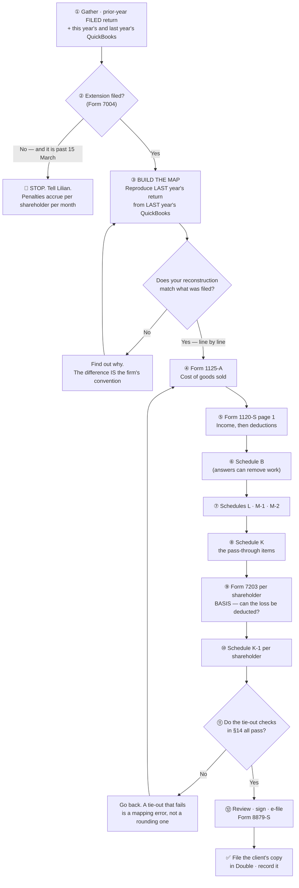

# Preparing a Form 1120-S (S-corporation return) — from QuickBooks to a filed return

> **Status:** 🟡 **DRAFT — in review with Lilian.** Written 2026-08-14 while preparing the
> firm's first 1120-S with a session assisting, and shaped by what a first-time preparer
> actually needed to be told. **Remove this note when Lilian signs it off.** ·
> **Owner:** Lilian · **Last updated:** 2026-08-14

> **Client data lives in the firm's systems, not here.** Names, EINs, figures, balances and
> filled-in worksheets belong in Google Drive / Double / QuickBooks. This SOP carries the
> **procedure and the line map** only — every amount below is a placeholder.

> **Who this is written for.** Someone preparing an S-corporation return **for the first
> time**, who knows bookkeeping but has not filled in a 1120-S. It explains *where each
> number comes from*, not just which box it goes in — because the boxes are the easy part.

---

## The process at a glance



---

## §0 · What this return actually is

**An S-corporation normally pays no federal income tax.** It files an information return that
says: *this is what the business earned, and here is how it splits between the owners.* Each
owner then reports their share on their own 1040, through a **Schedule K-1**.

Three consequences a first-time preparer needs to hold on to:

1. **The point of the whole exercise is line 21 of page 1** — *ordinary business income
   (loss)* — plus the handful of items that must travel to the owners **separately** rather
   than inside line 21. Everything else is bookkeeping around those.
2. **Some income and expenses never enter line 21.** Interest income, dividends, capital
   gains, §179, charitable contributions and a few others are **separately stated**: they go
   on **Schedule K** and straight to the K-1s, because each owner's own tax treatment of them
   differs. Sweeping them into line 21 is the classic beginner error.
3. **A loss is not automatically deductible by the owner.** It is limited by that owner's
   **basis** — §12. This is where a return that "looks finished" is often wrong.

> 🔑 **THE RULE THAT GOVERNS EVERYTHING BELOW: the return is not a copy of the P&L.**
> It is the P&L **regrouped** into the form's fixed categories, **plus** the adjustments where
> tax law and bookkeeping disagree. Every dollar in the books lands somewhere on the return —
> but almost never in the order QuickBooks shows it.

---

## §1 · Gather this before you start

You cannot prepare from the current year alone. **Half of this list is about the prior year**,
and that is deliberate — see §3.

- [ ] **The prior year's FILED return** (the whole package: federal, any state, the K-1s).
      Get it from the client's `Tax Return Filed` folder in Double.
      ⚠️ **Read it through the redactor** — `tools/redact-doc/` — never open the PDF directly.
      One year only. The rule and its limits are in the
      [`double-mcp`](../../.claude/skills/double-mcp/) skill.
- [ ] **This year's Profit & Loss** from QuickBooks — full year, **accrual** unless the client
      is on cash basis.
- [ ] **This year's Balance Sheet** as of the last day of the year.
- [ ] **LAST year's Profit & Loss and Balance Sheet.** Not optional. §3 is built on them.
- [ ] **The depreciation schedule** — the prior year's Form 4562 detail, or the fixed-asset
      register: cost, date placed in service, method, life, and depreciation taken so far.
- [ ] **Each shareholder's ownership percentage**, and whether it changed during the year.
- [ ] **Whether the shareholders put money in or took money out** during the year, and whether
      those were **capital contributions** or **loans** — they are not the same thing (§12).
- [ ] **Confirmation that Form 7004 (the extension) was filed**, if you are past 15 March.

### Intake questions for the client

Ask these **before** you start, not when you are stuck:

1. Did the business **buy or sell any equipment or vehicles** this year?
2. Did any shareholder **put money in or take money out**? Was it a loan or a contribution?
3. Are there **loans to or from the company** — and did they change?
4. Did the company **take a physical inventory count** at year end?
5. Did anything change about the **business itself** — a new state, a new line of business, a
   closed location, a shareholder joining or leaving?
6. Are there **financial accounts outside the United States**?
7. Were **Forms 1099** required, and were they filed?

---

## §2 · Gate: the extension

**Check this first, because it cannot be fixed later.**

The 1120-S for a calendar year is due **15 March** of the following year (the next business day
if that is a weekend or holiday). **Form 7004** extends it **six months**, to **15 September**.

- The firm files 7004 for **most clients as a matter of course** *(Lilian, 2026-08-14)* — but
  **confirm it for this client**, do not assume.
- ⚠️ **The extension extends the FILING, not the paying.** An S-corp usually owes no federal
  tax, so this is rarely a money problem — but it is not a rule you get to ignore.
- 🛑 **If no extension was filed and the deadline has passed, stop and tell Lilian.** The
  late-filing penalty on an S-corp is charged **per shareholder, per month** and climbs fast.
  Confirm the current rate against the IRS instructions rather than quoting one from memory.

---

## §3 · 🔑 BUILD THE MAP FROM THE PRIOR YEAR — before you fill in anything

**This is the most important section in this SOP, and it is the step a beginner skips.**

Every firm, and every client, has conventions about how the books map onto the form: which
QuickBooks account feeds which line, what gets grouped, what is netted. **Those conventions are
not written down anywhere. They are encoded in last year's filed return.**

So before touching this year:

1. Open **last year's P&L and Balance Sheet**, and **last year's filed return**.
2. **Reconstruct last year's page 1 from last year's P&L**, on paper or in a spreadsheet.
3. **Compare, line by line, against what was actually filed.**
4. **Every difference is information.** Do not "fix" it and do not average it — find out *why*
   it is different. That reason is the convention you must repeat.
5. Only when your reconstruction reproduces the filed return do you have a trustworthy map.

**What this catches, in one real example (Kolo Florida, 2026-08-14).** The ending-inventory
line on the return did not equal the QuickBooks `Inventory` account. It equalled
`Total for Other Current Assets` — the `Inventory` account **plus a Shopify Clearing Account**.
Using the Inventory account alone broke the cost-of-goods schedule and drove **purchases
negative**, which is impossible. Nobody could have guessed that convention; reproducing the
prior year revealed it in ten minutes.

> ⚠️ **A number that reconciles is not the same as a number that is right.** Reproducing the
> prior year proves your **map** is right. It does not prove the underlying figures are — the
> client's cost basis, their inventory count, their classifications are separate questions.

> 🛑 **Reproducing the prior year is NOT auditing it.** A filed return is closed. You are
> reading it as an answer key to learn the conventions, not to find fault with it. If you do
> spot something that looks wrong, raise it with Lilian — do not change this year's approach on
> your own initiative, because consistency between years is itself a tax position.

---

## §4 · Form 1125-A — cost of goods sold

**Fill this in first.** Its line 8 feeds page 1, and the form says so on its own face:
*"Enter here and on Form 1120-S, page 1, line 2."* Skip it entirely if the client sells no
goods.

| Line | What it is | Where the number comes from |
|---|---|---|
| **1** | Inventory at beginning of year | **Line 7 of LAST year's 1125-A.** The prior return governs — never a system, never a recalculation |
| **2** | Purchases | Usually the figure that makes the schedule balance — see below |
| **3** | Cost of labor | Direct production labour only. Most retail and e-commerce clients have none |
| **4** | Additional section 263A costs | Almost always blank for a small business taxpayer |
| **5** | Other costs | Anything the firm's convention puts in cost of sales that is not purchases |
| **6** | Total (lines 1–5) | Arithmetic |
| **7** | Inventory at end of year | The **balance sheet** — but read the trap below |
| **8** | **Cost of goods sold** (line 6 − line 7) | Arithmetic. Carry to page 1 line 2 |

### The identity — and how to use it

```
line 1  +  line 2  −  line 7  =  line 8
```

You will usually **know three of the four** and solve for the fourth. Which one is the unknown
depends on how the client's books work:

- **Purchases recorded to an asset account** (perpetual): you know 1, 2 and 7 → line 8 falls out.
- **Purchases expensed, cost of sales estimated** (periodic): you know 1, 7 and 8 → line 2 falls
  out.

🛑 **If the figure you solve for comes out NEGATIVE, your map is wrong.** Negative purchases are
not a thing. Go back to §3 — you are almost certainly reading the wrong account into line 7.

### ⚠️ The line 7 trap

**"Inventory at end of year" is not automatically the account called `Inventory`.**

On some clients the return's inventory line is a **subtotal** covering more than that one
account. The Kolo example above is `Inventory` **plus** the Shopify Clearing Account, which the
QuickBooks balance sheet already presents as one line: `Total for Other Current Assets`.

**Read line 7 off the balance sheet section that the PRIOR RETURN used** — §3 tells you which
one. Do not decide it from the account's name.

### Line 9 — the checkboxes

- **9a — the valuation method.** Cost, lower of cost or market, or other. **Copy what was
  ticked last year.** Changing it is a change of accounting method, which is a formal
  election, not a preference.
- **9b–9d** — subnormal goods, LIFO. Normally all "no" for these clients.
- **9e — do the §263A rules apply?** Normally **no** for a small business taxpayer.
- **9f — did the method of determining quantities, cost or valuation change?** If you answer
  "yes" here you have a problem to escalate, not a box to tick.

---

## §5 · Form 1120-S page 1

### 5A · Header

| Box | What goes in it | Source |
|---|---|---|
| Name, address | The company | Prior return |
| **A** | S election effective date | Prior return |
| **B** | Business activity code | Prior return |
| **C** | Schedule M-3 attached? | No, for any client this size |
| **D** | Employer identification number | Prior return, or the client's Double record |
| **E** | Date incorporated | Prior return |
| **F** | **Total assets** | Balance sheet — total assets at year end |
| **H(1)** | 🛑 **Final return** | **Only tick this if this is the LAST year the company exists.** A company that closes *next* year is not a final return *this* year. Ticking it early tells the IRS the entity is gone |
| **H(2)–(5)** | Name change · address change · amended · S election termination | Normally all unticked |
| **I** | Number of shareholders | Count the K-1s |

### 5B · Income — lines 1 to 6

| Line | What it is | Where it comes from |
|---|---|---|
| **1a** | Gross receipts or sales | Total sales revenue. Discounts given at the point of sale reduce it |
| **1b** | Returns and allowances | Refunds to customers |
| **1c** | Balance (1a − 1b) | ✅ Should equal the P&L's total income |
| **2** | Cost of goods sold | Form 1125-A line 8 |
| **3** | Gross profit (1c − 2) | ✅ Should equal the P&L's gross profit |
| **4** | Net gain (loss) from Form 4797 | Gain or loss on selling business equipment. Zero in most years |
| **5** | Other income (loss) | **Trade-or-business income only.** See the warning below |
| **6** | Total income | Arithmetic |

> ⚠️ **Line 5 is NOT "everything else on the P&L".** Interest income, dividends and capital
> gains are **portfolio income** and go on **Schedule K**, not here. If you put bank interest
> on line 5 you have understated Schedule K and overstated ordinary income.

### 5C · Deductions — lines 7 to 21

**The mapping rule, which is the whole skill:** lines 7 to 18 are **named categories the IRS
wants to see separately**. Line 19 is **everything left over**. So you work **top down** — place
each expense that has its own line, then group the remainder.

| Line | Category | Typical QuickBooks accounts |
|---|---|---|
| **7** | Compensation of officers | Salaries paid to shareholder-employees. Over $500k of receipts this needs Form 1125-E |
| **8** | Salaries and wages | Everyone else's wages |
| **9** | Repairs and maintenance | |
| **10** | Bad debts | |
| **11** | Rents | Office, warehouse, storage, equipment rental |
| **12** | Taxes and licenses | **Payroll taxes + business licences + local taxes.** Not income tax |
| **13** | Interest | Loan and credit-card interest. Often sits under "other expenses" in the P&L |
| **14** | Depreciation | **From Form 4562** — see §5D |
| **15** | Depletion | Rare |
| **16** | **Advertising** | ⚠️ Has its own line. Do not leave it in "other deductions" |
| **17** | Pension, profit-sharing plans | |
| **18** | Employee benefit programs | Health insurance, other benefits |
| **19** | **Other deductions** | **The remainder** — attach a statement itemising it |
| **20** | Total deductions | Arithmetic |
| **21** | **Ordinary business income (loss)** | Line 6 − line 20. **This is the number the return exists to produce** |

**How to build line 19 without missing anything:**

```
total expenses per the P&L
  −  everything you placed on lines 7–18
  −  the non-deductible portion of any expense (see §9)
  =  line 19
```

Then **itemise** it in the attached statement. If your line 19 does not equal that subtraction,
you have either double-counted or dropped an account.

### 5D · Depreciation — line 14

- Comes from **Form 4562**, which you prepare from the client's depreciation schedule.
- **A full year for an asset placed in service last year is larger than its first part-year.**
  A beginner expecting "the same as last year" will understate the deduction.
- **No new assets this year means no new elections** — no §179 and no bonus depreciation
  decisions to make. Just continue the existing schedule.
- ⚠️ **If the books recorded no depreciation at all**, the deduction still belongs on the
  return. It becomes a book-to-tax difference on **Schedule M-1** (§9).

---

## §6 · Schedule B — the questions

⚠️ **The question numbers move between tax years. Find each one by its wording, not its
number.**

Most are yes/no facts about the company. Three are worth calling out:

1. **Accounting method** — accrual or cash. Read it off the footer of the QuickBooks reports;
   they say which basis they were run on.
2. 🟢 **"Are total receipts AND total assets both under $250,000?"** If **yes**, you are **not
   required** to complete **Schedule L** or **Schedule M-1**.
   - **The firm's practice is to complete them anyway** when the prior year did, because they
     give continuity between years and the balance sheet is your best proof that nothing was
     mapped wrong.
   - ⚠️ **Being excused from Schedule M-1 does not remove the adjustments themselves.** A
     non-deductible expense still changes line 21 whether or not you disclose the
     reconciliation.
3. **Were Forms 1099 required, and were they filed?** Answer honestly; the firm usually knows
   because it prepares them.

---

## §7 · Schedule K — what travels to the owners

Schedule K is the company's **total** of every item the owners report themselves. Each K-1 is
one owner's slice of it.

| Line | Item | Where it comes from |
|---|---|---|
| **1** | Ordinary business income (loss) | Page 1, line 21 |
| **2–3** | Rental income | Rare for these clients |
| **4** | Interest income | The P&L's interest income — the one you kept OFF page 1 line 5 |
| **5** | Dividends | |
| **7–8** | Capital gains | |
| **11** | Section 179 deduction | Only if elected this year |
| **12a** | Charitable contributions | |
| **16c** | **Non-deductible expenses** | The disallowed half of meals, fines, and similar. ⚠️ Easy to forget — it reduces basis and AAA |
| **16d** | Distributions | Money paid out to shareholders during the year |
| **17** | **§199A / QBI information** | Attach the statement. **A loss year still produces QBI information** — a negative amount that carries forward for the owner |

---

## §8 · Schedule L — the balance sheet

Two columns: **beginning of year** and **end of year**.

1. 🔑 **The beginning column is COPIED from last year's filed return. It is never
   recalculated.** If it does not match, stop — you have found either a mapping change or an
   error, and both need Lilian before you go on.
2. **The end column comes from the year-end balance sheet.** Total assets must agree with it
   to the dollar.
3. 🔑 **The heading says "per Books" and it means it.** If the books did not record something —
   depreciation, an accrual — Schedule L shows the books' figure, and the difference goes on
   **Schedule M-1**. Do not "correct" the balance sheet to tax figures.
4. **Equity mapping is a convention, not a calculation.** How the client's capital accounts are
   split between *capital stock*, *additional paid-in capital* and *retained earnings* on the
   form is whatever the prior return did. **Repeat it**, or the two years cannot be compared.

---

## §9 · Schedule M-1 — where the books and the return disagree

This is the bridge: **book net income in at the top, taxable ordinary income out at the
bottom.** If you understand this schedule, you understand why the return is not a copy of the
P&L.

| Line | What it does |
|---|---|
| **1** | Net income (loss) **per books** — straight off the P&L |
| **2** | Income on the return that the books did not record |
| **3** | **Expenses in the books that the return does not allow** — the common one is **3b, the 50% of meals that is not deductible** |
| **4** | Subtotal |
| **5** | Income in the books that is not on the return |
| **6** | **Deductions on the return that the books did not record** — the common one is **6a, depreciation** the bookkeeping never posted |
| **7** | Subtotal |
| **8** | **Result — must equal page 1, line 21** |

**The two adjustments you will meet on nearly every small return:**

- **Meals at 50%.** Half of meals expense is not deductible. It adds back on line 3b **and**
  appears on Schedule K line 16c as a non-deductible expense.
- **Depreciation the books never recorded.** It deducts on line 6a.

> 💡 **A quick sanity check on the prior year:** the gap between last year's book net income and
> last year's line 21 *is* last year's M-1. If that gap is roughly half the prior year's meals,
> you have just confirmed both the convention and your understanding of it.

---

## §10 · Schedule M-2 — the AAA

The **Accumulated Adjustments Account** tracks the income the company has been taxed on but not
yet distributed. It matters when distributions are made — it decides whether they are tax-free.

1. **Beginning balance = last year's ending balance**, from the filed return. Copy it.
2. Add the year's income, **or** subtract the year's loss.
3. Subtract **non-deductible expenses** (the same figure as Schedule K line 16c).
4. Subtract **distributions**.
5. **AAA can go negative from losses.** It cannot be driven negative *by distributions*.
6. ⚠️ **Shareholder capital contributions do NOT increase AAA.** They increase *basis* (§12).
   Two different accounts that beginners merge.

---

## §11 · Schedule K-1 — one per shareholder

Each K-1 carries that shareholder's **percentage share** of every Schedule K line.

- **The percentage is ownership**, and if it changed during the year the allocation is done
  **per day, per share** — get help before attempting that by hand.
- ⚠️ **The S-corp K-1 has no capital account analysis** (that is the partnership K-1). Do not
  go looking for it.
- Box 16c and the §199A statement travel to the owner too — an owner whose K-1 is missing the
  QBI statement cannot complete their own return.

---

## §12 · Form 7203 — basis, and why a loss may not be deductible

**This is the part of an S-corp return that beginners omit, and it is often the part that
changes the answer.**

A shareholder can only deduct losses up to their **basis** in the company. Roughly:

```
  what they put IN (stock purchased + capital contributed)
+ their share of income in profitable years
−  their share of losses already deducted
−  distributions they received
=  basis
```

A loss beyond that is **suspended** — carried forward until basis is restored, not deducted now.

**Form 7203 is required** when a shareholder claims a loss, receives a distribution, disposes of
stock, or receives a loan repayment from the company.

### The two questions to settle before you compute it

1. **Was money the shareholder put in a CAPITAL CONTRIBUTION or a LOAN?** Both can support
   losses, but they are tracked separately (stock basis vs debt basis) and restored in a
   different order. The books may not distinguish them — **ask**.
2. **Are the shareholders' contributions proportionate to their ownership?** If one owner
   funded the business and the other did not, **their basis is very different even at identical
   ownership percentages** — so the same loss allocation can be fully deductible for one and
   partly suspended for the other. Check each shareholder separately. Never assume symmetry.

---

## §13 · State

- **Florida does not tax S-corporations' income**, so there is normally no Form F-1120 for a
  Florida S-corp with no federal taxable income. **Confirm per client** rather than assuming.
- The **Florida Annual Report** is a completely separate filing on its own calendar and is not
  part of this return.
- If the company operated in **another state**, that state may require a return regardless.
  Check where the business actually had activity, not just where it is registered.

---

## §14 · Before you file — the tie-out checks

**Do not file until every one of these passes.** A check that fails is a mapping error, not a
rounding difference.

- [ ] 1125-A: **line 6 − line 7 = line 8**
- [ ] 1125-A line 8 **equals** page 1 line 2
- [ ] Page 1: **1a − 1b = 1c**, and 1c equals the P&L's total income
- [ ] Page 1: **1c − 2 = 3**, and 3 equals the P&L's gross profit
- [ ] Page 1: **6 − 20 = 21**
- [ ] Line 19 equals total expenses **less** everything placed on lines 7–18 **less**
      non-deductible amounts
- [ ] Schedule L: the **beginning column matches last year's filed ending column exactly**
- [ ] Schedule L: **total assets = total liabilities and equity**, and total assets equals the
      year-end balance sheet
- [ ] Schedule M-1 **line 8 equals page 1 line 21**
- [ ] Schedule M-2 beginning balance matches last year's ending balance
- [ ] The **K-1 percentages add to 100%**, and each Schedule K line equals the sum of that line
      across all K-1s
- [ ] **A Form 7203 exists for every shareholder who needs one** (§12)
- [ ] **Form 8879-S signed** before e-filing

---

## §15 · Common pitfalls

Each of these has bitten a real return.

1. 🛑 **Treating the P&L's net income as line 21.** It is not. The difference is Schedule M-1,
   and on a small return it is usually the meals disallowance and unrecorded depreciation.
2. 🛑 **Reading "inventory" as the account called Inventory.** §4's trap. Check what the prior
   return used.
3. 🛑 **Leaving advertising, rent or interest inside "other deductions."** They have their own
   lines. The return is still arithmetically correct, but it does not match the prior year and
   nobody can compare the two.
4. 🛑 **Putting bank interest on page 1 line 5** instead of Schedule K.
5. 🛑 **Recalculating the Schedule L beginning column** instead of copying it.
6. 🛑 **Correcting the books on Schedule L** — it is "per books" on purpose.
7. 🛑 **Skipping Form 7203** because the loss "obviously" flows through. It may not (§12).
8. 🛑 **Ticking "final return" a year early** because the client is winding down.
9. 🛑 **Zero officer compensation without a decision.** A shareholder who works in the business
   is expected to take a reasonable salary. It may be defensible not to in a heavy loss year —
   but that must be a documented decision, not an oversight. See the
   [`reasonable-compensation`](../../.claude/skills/reasonable-compensation/) skill.
10. 🛑 **Changing a method because it looks wrong.** Valuation method, equity mapping, the
    grouping of accounts — consistency with the prior year is itself a tax position. Raise it
    with Lilian; do not fix it silently.

---

## §16 · Where things live

| What | Where |
|---|---|
| The client's prior-year filed return | Double → `JK Accounting Group > Tax Return Filed > <year>` |
| Reading that return safely | [`tools/redact-doc/`](../../tools/redact-doc/) — never open the PDF directly |
| The rules for reading client documents at all | [`double-mcp`](../../.claude/skills/double-mcp/) skill |
| What the firm knows about this client | [`projects/client-intelligence/clients/`](../client-intelligence/clients/) |
| Blank IRS forms and instructions | [irs.gov](https://www.irs.gov) — search the form number |
| A Shopify client's inventory figure | the [`shopify-year-end-inventory`](../../.claude/skills/shopify-year-end-inventory/) skill — **the number Shopify reports is usually not a cost basis** |
| Owner salary questions | the [`reasonable-compensation`](../../.claude/skills/reasonable-compensation/) skill |
| Which clients are ready to prepare | the [`tax-season-readiness`](../../.claude/skills/tax-season-readiness/) skill |

---

## Appendix A · Intake sheet

Copy this into the client's folder in Drive or Double and fill it in there. **Filled copies
never come back to the repo.**

```
CLIENT: <name>                              TAX YEAR: <year>
PREPARER: <name>                            DATE STARTED: <date>

EXTENSION
  Form 7004 filed?            [ ] yes  [ ] no      date: ______
  Original deadline: 15 Mar   Extended: 15 Sep

DOCUMENTS IN HAND
  [ ] prior-year filed return (year: ____)
  [ ] P&L this year          [ ] P&L last year
  [ ] Balance sheet this year [ ] Balance sheet last year
  [ ] depreciation schedule
  [ ] accounting basis:  [ ] accrual  [ ] cash

SHAREHOLDERS
  name ______________________  ownership ____%  contributed this year? ______
  name ______________________  ownership ____%  contributed this year? ______
  Contributions are:  [ ] capital  [ ] loans  [ ] not established — ASK

CLIENT ANSWERS (§1)
  equipment bought/sold? ______   money in/out? ______   loans changed? ______
  physical inventory count? ______   business changes? ______
  foreign accounts? ______   1099s required/filed? ______

MAP VERIFIED AGAINST PRIOR YEAR (§3)
  [ ] page 1 reproduced from last year's P&L and matches what was filed
  differences found and explained: ________________________________________

OPEN ITEMS BLOCKING THE RETURN
  1. ______________________________________________________________________
  2. ______________________________________________________________________

TIE-OUT CHECKS (§14)        [ ] all pass        date: ______
```

---

## Appendix B · The QuickBooks → 1120-S line map

The quick reference. **Confirm it against the prior year (§3) before you rely on it** — the
right-hand column is the firm's usual convention, not a rule of the form.

| QuickBooks account (typical name) | Goes to |
|---|---|
| Sales / product income | Page 1, line 1a |
| Discounts given | Reduces line 1a |
| Customer refunds / returns | Page 1, line 1b |
| Cost of goods sold + channel selling fees | Form 1125-A line 8 → page 1 line 2 |
| Inventory (balance sheet) | 1125-A line 7 — ⚠️ check the subtotal used, §4 |
| Wages & salary — shareholders | Page 1, line 7 |
| Wages & salary — staff | Page 1, line 8 |
| Payroll tax | Page 1, line 12 |
| Business licences & fees, local taxes | Page 1, line 12 |
| Rent — any kind | Page 1, line 11 |
| Interest charge / loan interest | Page 1, line 13 |
| Advertising & promotional | Page 1, line 16 |
| Depreciation | Page 1, line 14 — from Form 4562, **not** from the books |
| Meals | Page 1, line 19 at **50%**; the other half → M-1 line 3b + Sch K 16c |
| Everything else | Page 1, line 19 + itemised statement |
| Interest income | **Schedule K line 4** — never page 1 |
| Gain/loss on equipment sold | Page 1, line 4 (via Form 4797) |
| Bank accounts (balance sheet) | Schedule L, cash |
| Credit cards payable | Schedule L, accounts payable — per the prior year's mapping |
| Sales tax payable | Schedule L, other current liabilities |
| Fixed assets, accumulated depreciation | Schedule L lines 10a / 10b — **per books** |
| Shareholder capital accounts | Schedule L equity — **per the prior year's mapping**, §8 |
