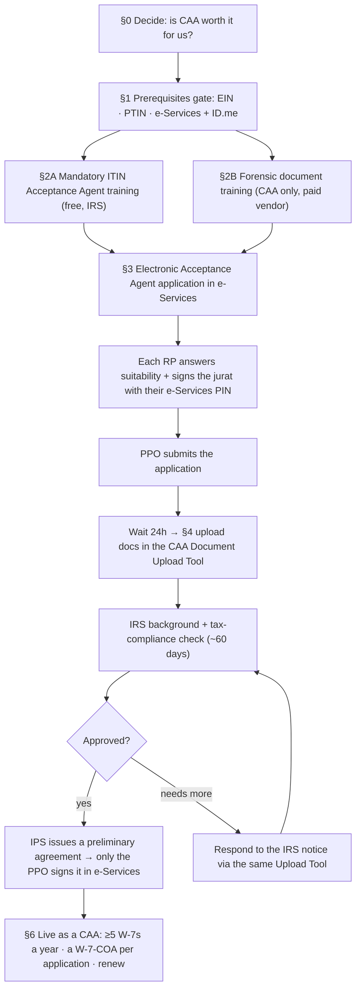

# SOP: Becoming an IRS Certifying Acceptance Agent (CAA) for ITINs

> **Status:** Draft · **Owner:** Julia · **Last updated:** 2026-08-13
>
> 🔍 **In review (Aug 2026):** written while Julia was studying for the forensic
> document training. The **application steps inside e-Services are described from
> IRS documentation, not yet from a screen walkthrough** — every section marked
> ⚠️ **verify on screen** must be confirmed and corrected the first time we
> actually run it. Remove this note once the application has been submitted and
> the screens are verified.

The complete procedure for getting JK Accounting Group **authorized by the IRS
as a Certifying Acceptance Agent (CAA)**, so the firm can prepare Form W-7 ITIN
applications and **authenticate the client's identity documents itself** —
instead of the client mailing their original passport to Austin, Texas and
waiting weeks to get it back.

> **Where client data goes:** this SOP covers *our own* authorization. Once the
> firm is approved, an ITIN applicant's passport, birth certificate, visa,
> address, and the filled-in Forms W-7 / W-7-COA are **sensitive** and belong in
> **the firm's client systems** (Google Drive / Double) — **never** in this repo.
> The firm's own EIN, e-Services credentials, and agreement number likewise stay
> in the vault, referenced by link.

---

## The process at a glance

Two trainings, one electronic application, one document upload — then a wait and
a signature. **The trainings come first: the application cannot be submitted
until every responsible party has completed both.**



---

## 0. First — decide whether this is worth doing

**What we gain.** Today an ITIN applicant who is not a CAA client has to mail
their **original passport** to the IRS ITIN Unit in Austin and live without it
for weeks. *(There is a third route worth knowing: an appointment at a designated
**IRS Taxpayer Assistance Center**, where documents are reviewed and returned
immediately — appointments only, 1-844-545-5640. It is a real alternative for a
client near one, and it is not a reason to skip the program: it is the IRS's
schedule, not ours, and it does nothing for a client who is not near a
designated office.)* As a CAA we:

1. **Authenticate identity documents in our office** and send only *copies* with
   the W-7 — the client keeps their passport. (Limits apply to dependents: §6.)
2. **Can call the Austin ITIN Unit** for the status of W-7s we submitted.
3. **Can email the ITIN Policy Section (IPS)** for technical questions.
4. **Receive a copy of every ITIN notice** the IRS sends our applicant.

For this firm's client base — Ukrainian- and Russian-speaking owners, spouses
and dependents who frequently need ITINs and cannot be without a passport — this
is the whole point of the program.

**What it costs us** (§7): the forensic training fee per responsible party, the
staff time, and the standing obligations in §6 — most importantly **at least
five Forms W-7 a year**, or the IRS opens a review of our participation.

**Decision to record before starting:** who will be the **responsible
parties (RPs)**. Every RP must complete *both* trainings, register with
e-Services, and pass the checks — so naming three people triples the training
cost and the renewal work. Name the minimum who will actually do ITIN work.

---

## 1. The prerequisites gate — have all of this BEFORE applying

Nothing below can be improvised mid-application. Confirm each one first:

1. **A valid EIN** for the firm, matching the **exact legal name** registered
   with the IRS. Every participant in the program must have an EIN.
2. **An active PTIN** for each responsible party (we are a tax-preparation firm,
   so this is the credential route that applies to us).
3. **Professional credential documentation** for each RP — CPA license, attorney
   license, Enrolled Agent number, or tax-preparer status. This gets uploaded in
   §4.
4. **An IRS e-Services account for every person on the application** except
   plain "contacts". The IRS states this positively for the **PPO** (Principal,
   Partner or Owner) and **every RP**; it is silent on whether a **Principal
   Consent (PC)** also needs one. ⚠️ **Assume they do and set it up** — an
   account nobody needed costs nothing, a missing one blocks the submission.
5. **An ID.me account** for the PPO and every RP. e-Services sign-in runs through
   ID.me identity verification, which takes its own time — start it early.
6. **Each RP is at least 18** and a **legal resident of the U.S.**
7. **The firm and every RP are current on filing and paying their own taxes.**
   The IRS runs a tax-compliance check as part of the application; an unfiled
   personal return will stop the firm's application.

> ⚠️ **Do NOT put the firm's EFIN on this application.** An EFIN is *not*
> required for the Acceptance Agent Program, and entering it — or using a trade
> name instead of the exact legal name tied to the EIN — is a documented cause of
> application errors.

---

## 2. The two trainings — both required, both before submitting

### 2A — Mandatory ITIN Acceptance Agent training

- Free, published by the IRS on IRS.gov (Publication 5726).
- **Every responsible party must complete it**, not just one person.
- **There is no certificate to upload any more.** You now *attest* that you took
  the training when you sign the jurat on the electronic application (§3). Keep
  your own dated record that each RP did it.

### 2B — Forensic document identification training (CAAs only)

This is the course Julia is studying — how to recognize fraudulent passports,
birth certificates, visas, national IDs and driver's licenses by their security
features. It is required **only** for Certifying Acceptance Agents, and again
**every RP must complete it**.

- **SPEC partners** (VITA/TCE sites) get this training free through their SPEC
  relationship manager. **We are not a SPEC partner** — a for-profit firm buys
  the course from a private vendor.
- The IRS keeps a list of forensic-training providers and **reviews them
  periodically** to confirm the course content is current. ⚠️ **Confirm the
  provider is currently recognized before paying** — an unrecognized provider's
  certificate is wasted money.

**The certificate is rejected unless it meets every one of these** — check the
one you receive against this list *before* you need it:

1. **Original**, on the **vendor's letterhead** — not a facsimile or a scan of a
   scan.
2. Shows the **vendor's contact information**: **name, address, telephone number
   and the course title**.
3. Shows the **participant's name** — **one person per certificate**. A single
   certificate listing several responsible parties is rejected.
4. Shows the **date completed**.
5. Carries an **embossed seal**.
6. Does **not** show the same person as both instructor and student.
7. Was **not issued by the firm applying to the program** — we cannot train
   ourselves into the program.
8. Is **less than four years old** at the date the application is submitted.

> **The four-year clock is the one to diarize.** A forensic training certificate
> is valid for **four years**. It is the training that expires, not just the
> agreement — and both have to be alive at renewal time (§7).

---

## 3. The electronic application (e-Services)

⚠️ **Verify on screen** — this section is built from IRS documentation and the
Acceptance Agent Application Tutorial, not yet from our own run.

**Paper is gone.** Form 13551 is no longer accepted by mail; the application is
completed and submitted **electronically through IRS e-Services**. Form 13551
still exists as the reference for **what is asked** — read it before starting so
the questions aren't a surprise.

> ⚠️ **But do not follow the PDF's instructions.** The posted Form 13551 is
> **Rev. 6-2019**, from the paper era, and it contradicts current rules in at
> least four places: it says processing takes **up to 120 days** (now 60), that a
> renewal should go in **six months before expiry** (renewals are now accepted
> only *during* the expiration year), that a **fingerprint card** must be
> attached (not currently required), and that the **training certificate must be
> signed and attached** (the mandatory training is now attested on the jurat).
> Use it for the field list only; the current process is the
> [Acceptance Agent Application Tutorial](https://www.irs.gov/pub/irs-wi/acceptance-agent-application-tutorial.pdf)
> and this SOP.

**Order of operations (this is the part that trips people up):**

**Step A — the PPO opens the application.** Log in to e-Services → select
**Acceptance Agent Application** from the menu. Only a **Principal, Partner or
Owner with authority to act for the firm** can submit it.

**Step B — identify everyone on it.** The application distinguishes:

- **PPO** — Principal, Partner or Owner (submits and later signs the agreement)
- **PC** — Principal Consent
- **RP** — Responsible Party (the people who will actually handle ITIN work and
  who took both trainings)
- **Contacts** — as needed; contacts do *not* need e-Services accounts

**Step C — set the application type to Certifying Acceptance Agent**, not plain
Acceptance Agent. ⚠️ **verify on screen.**

Then set the **"organization status"**. Form 13551 line 1 lists the categories:
Financial Institution · Educational Institution · Casino · Partnership ·
Government Agency or Military Organization · **Corporation · LLC · Sole
Proprietorship** · Other — pick the one matching **the firm's actual legal
form**. ⚠️ **Do not pick `VITA`.** The IRS instructs SPEC partners to select it
precisely *because* it routes the application into the SPEC streamlined process,
which a for-profit firm does not qualify for. *(That we don't qualify is
documented; exactly what the system does if the wrong value is chosen is not —
so avoid it rather than test it.)*

**Step D — each RP must complete their own part before the PPO can submit.**
Every RP logs in to e-Services separately and:

1. Answers **each suitability question**
2. Reads the **training certification statement, Privacy Act notice and jurat**
3. **Checks the box** attesting they completed the required training
4. **Enters their e-Services PIN**

**Step E — the PPO submits.** The application is not with the IRS until this
happens. One RP who has not finished Step D blocks the whole submission.

**Answer the "how many W-7s?" question honestly and realistically.** The
application asks how many Forms W-7 the business plans to submit in a 12-month
period. **If the number entered is under five, the IRS opens a case to review the
application** — because five a year is the minimum to stay in the program (§6).

---

## 4. Upload the supporting documents

**Wait 24 hours after submitting the application**, then open the **CAA Document
Upload Tool** and upload:

1. **The forensic training certificate** for each responsible party
2. **Professional credentials** for each RP (CPA / attorney / EA / preparer)
3. **Citizenship documentation** where required
4. A **non-profit exemption letter** — not applicable to us

> ⚠️ **Do not upload the application itself through this tool** — the application
> goes through e-Services. The Upload Tool is only for supporting documents and
> for **responding to IRS notices** about the application later.

---

## 5. What happens next

1. **The IRS runs a background check and a tax-compliance check** on the firm and
   on every responsible party. **Fingerprint cards are not currently required**
   — but this can change, and an applicant with preparer penalties, a criminal
   conviction, unfiled personal returns or unpaid tax liabilities can be asked
   for a fingerprint card and an FBI background check.
2. **Allow up to 60 days** for processing a properly submitted application. (This
   is the modernized timeline; it used to be 120 days.)
3. **If the IRS asks for anything**, respond through the **CAA Document Upload
   Tool** — not by mail.
4. **If approved, the ITIN Policy Section issues a *preliminary* agreement for
   signature.** Being approved is **not** the end: **only the PPO can sign it**,
   in e-Services → open the application → **View agreement summary** → **Sign**
   from the action menu. **The firm is not a CAA until that signature is in.**

---

## 6. Once we are approved — the standing obligations

These are the rules we live under, and several of them determine whether the
program is worth keeping. Written here so the decision to apply is made with them
in view. **The day-to-day procedure — how an ITIN application is actually
prepared — is its own SOP:
[`itin-w7-application.md`](./itin-w7-application.md).**

**1. At least five Forms W-7 per year.** All acceptance agents must submit a
minimum of five W-7 applications a year to remain in the program.

**2. An in-person interview with every applicant** — primary, secondary **and
each dependent**. **Video conferencing may be used for the interview only** —
and the IRS attaches a hard condition to it: **the CAA must have the original
identification documents, or issuing-agency certified copies, physically in
their possession during the interview**, in order to see the security features
and authenticate them.

> ⚠️ **A client holding a passport up to a webcam does not satisfy this**, and it
> is exactly the non-compliance the condition exists to prevent. Remote interview,
> yes; remote *documents*, no — the documents have to reach our hands first.

**3. An original Form W-7 (COA), Certificate of Accuracy, attached to every
single W-7 we submit.** On it we certify that we reviewed the documentation
evidencing identity and foreign status, that we keep a record of it, and that to
the best of our knowledge it is authentic, complete and accurate. The COA states
**which type of document was authenticated**.

**4. What we may authenticate — and the dependent trap:**

| Applicant | What a CAA may authenticate | What must still go to the IRS as an original or issuing-agency certified copy |
|---|---|---|
| **Primary** | All identity documents **except foreign military ID cards** | Foreign military ID cards |
| **Secondary** | All identity documents **except foreign military ID cards** | Foreign military ID cards |
| **Dependent** | **Passport and birth certificate only** | **Every other document** — medical records, school records, visas, national IDs, everything |

> **This is the single most misunderstood rule in the program.** For a dependent,
> "I'm a CAA" does not mean "the client keeps their documents". Only a passport
> and a birth certificate can be authenticated in our office; anything else must
> physically travel to the IRS as an original or as a copy certified by the
> agency that issued it.

**5. We keep a record of the documentation we authenticated.** The COA certifies
that we maintain that record — so the file has to exist, in the client's folder
in the firm's systems.

**6. The IRS reviews us.** The ITIN Policy Section runs compliance reviews, both
**on-site visits** (via a Stakeholder Liaison) and **correspondence reviews**.
Findings are graded **Warning · Probation · Termination**.

**7. ITIN facts to state correctly to every client** — these come up in every
conversation and getting them wrong is a client-trust problem:

- An ITIN is for **federal tax reporting only**.
- An ITIN is **not valid for employment**.
- An ITIN does **not** make anyone eligible for the **Earned Income Tax Credit**.

---

## 7. What we pay, and the calendar

**What we pay**

1. **The IRS application — no fee.** The mandatory ITIN Acceptance Agent training
   is also free.
2. **Forensic document training — the only real cost, and it is per responsible
   party.** A private vendor sets the price; confirm it, and confirm the provider
   is currently recognized by the IRS, before paying. Budget it **once per RP
   every four years**.
3. **Staff time** — the trainings (the course Julia is taking is estimated at
   ~5 hours), the e-Services and ID.me setup for each person, and the
   application itself.

**Bottom line:** the money is small and the gating item is *time* — ID.me
verification and getting every RP through both trainings before the PPO can
submit anything.

**The calendar**

| What | When |
|---|---|
| **Agreement expires** | **December 31 of the 4th year following the approval date** |
| **Renewal window** | Renewal applications are accepted **only during the expiration year** — diarize January of that year, not December |
| **Forensic training certificate** | Valid **four years**; must be under four years old at the date any application (including a renewal) is submitted |
| **W-7 volume check** | **≥ 5 per year**, ongoing |
| **Processing time** | Up to **60 days** from a properly submitted application |

> ⚠️ **The two four-year clocks are not the same clock.** The agreement runs to
> December 31 of the fourth year after *approval*; the forensic certificate runs
> four years from the *training date*. Track both, or a renewal gets blocked by
> an expired certificate.

---

## 8. Common pitfalls

1. **Applying before the trainings are done.** Both trainings must be complete
   *before* the application is submitted, for *every* responsible party.
2. **One forensic certificate listing several people.** Rejected. One certificate
   per person.
3. **A certificate that fails any of the eight checks in §2B.** The usual
   offenders: a photocopy, a missing embossed seal, a missing course title, or
   two responsible parties named on one certificate.
4. **Putting the EFIN on the application.** Not required, and a documented cause
   of errors. *(Confusingly, once the agreement is approved the IRS derives our
   **Office Code** from the EFIN — the EFIN preceded by two zeros. That is the
   IRS's own bookkeeping after approval; it is not a reason to type the EFIN into
   the application.)*
5. **Using the firm's trading name instead of the exact legal name on the EIN.**
   Same result.
6. **Selecting `VITA` as the organization status** — that value exists to route
   SPEC partners into a streamlined process a for-profit firm does not qualify
   for. Pick the firm's actual legal form instead (§3 Step C).
7. **Assuming approval is the finish line.** The PPO still has to sign the
   preliminary agreement in e-Services.
8. **Answering "fewer than five W-7s a year"** on the application — it triggers a
   review case.
9. **Telling a client with dependents that they keep all their documents.** Only
   passport and birth certificate for a dependent (§6).
10. **Forgetting an RP's own tax compliance.** One responsible party with an
    unfiled personal return can hold up the firm's application.
11. **Letting the renewal year pass.** Renewals are only accepted *during* the
    expiration year.

---

## 9. Contacts & links

| For | Where |
|---|---|
| Program overview + the four steps | [ITIN Acceptance Agent Program](https://www.irs.gov/individuals/itin-acceptance-agent-program) |
| Application questions answered | [Acceptance agent application FAQs](https://www.irs.gov/individuals/acceptance-agent-application-frequently-asked-questions) |
| The form behind the application (reference) | [Form 13551](https://www.irs.gov/pub/irs-access/f13551_accessible.pdf) |
| Screen-by-screen application walkthrough | [Acceptance Agent Application Tutorial](https://www.irs.gov/pub/irs-wi/acceptance-agent-application-tutorial.pdf) |
| Mandatory ITIN training | [Publication 5726](https://www.irs.gov/pub/irs-pdf/p5726.pdf) |
| The Certificate of Accuracy | [Form W-7 (COA)](https://www.irs.gov/pub/irs-pdf/fw7coa.pdf) |
| The agent's operating guide | [Publication 4520](https://www.irs.gov/pub/irs-pdf/p4520.pdf) |
| Document upload | CAA Document Upload Tool — `apps.irs.gov/app/digital-mailroom/caa/` |
| e-Services sign-in | [irs.gov/e-services](https://www.irs.gov/e-services) |
| The internal rules the IRS runs on | [IRM 3.21.264](https://www.irs.gov/irm/part3/irm_03-021-264r) |
| W-7 line-by-line | [Instructions for Form W-7](https://www.irs.gov/instructions/iw7) |

---

## Appendix — blank application tracker

Copy this into the firm's Drive folder for the application and fill it in there.
**Do not fill it in inside this repo.**

```
CAA APPLICATION TRACKER — JK ACCOUNTING GROUP

FIRM
  Legal name exactly as registered to the EIN : ______________________
  EIN                                          : ____ (vault)
  PPO (submits + signs)                        : ______________________

RESPONSIBLE PARTIES                     RP 1        RP 2
  Name                                : ________    ________
  Age 18+ / US legal resident         : ☐ / ☐       ☐ / ☐
  Active PTIN                         : ________    ________
  Credential (CPA/EA/attorney/preparer): ________    ________
  e-Services account created          : ☐           ☐
  ID.me verified                      : ☐           ☐
  Own tax filings current             : ☐           ☐
  Mandatory ITIN training completed   : __/__/__    __/__/__
  Forensic training completed         : __/__/__    __/__/__
  Forensic certificate checks (§2B 1–8): ☐          ☐
  Forensic certificate EXPIRES        : __/__/__    __/__/__
  Suitability answered + jurat signed : ☐           ☐

APPLICATION
  Application type = Certifying Acceptance Agent : ☐
  Organization status (NOT "VITA")               : ______________________
  EFIN left blank                                : ☐
  W-7s planned per 12 months (≥5)                : ______
  Submitted by PPO on                            : __/__/__
  Documents uploaded (24h later) on              : __/__/__

OUTCOME
  IRS notices received / responded            : ______________________
  Preliminary agreement received on           : __/__/__
  Agreement SIGNED by PPO on                  : __/__/__
  AGREEMENT EXPIRES 12/31/______  → renew during that year
```
