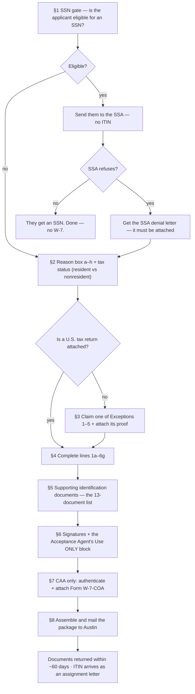

# SOP: Preparing an ITIN application (Form W-7)

> **Status:** Draft · **Owner:** Julia · **Last updated:** 2026-08-13
>
> 🔍 **In review (Aug 2026):** written from the IRS source material while Julia was
> studying for the CAA forensic training — **Publication 5726** (the mandatory
> Acceptance Agent training), **Publication 1915**, Publication 4327, Publication
> 519 and Publication 901. It is a **procedure from the publications, not yet from
> a filed application**. Correct it the first time we actually prepare a W-7.
> Remove this note then.

How the firm prepares and submits a **Form W-7, Application for IRS Individual
Taxpayer Identification Number** — the eligibility gate, the reason box, the
documents, the signatures, and the errors that get an application rejected.

**This is the companion to
[`irs-certifying-acceptance-agent.md`](./irs-certifying-acceptance-agent.md)**,
which covers getting the firm *authorized*. Sections marked **CAA only** apply
once that authorization is signed; everything else applies whether we are acting
as a Certifying Acceptance Agent or simply helping a client file.

> **Where client data goes:** the applicant's passport, birth certificate, visa,
> addresses, dates of birth, the filled-in W-7 and W-7-COA are **sensitive** and
> belong in the client's folder in **Google Drive / Double** — **never** in this
> repo. This file keeps only the procedure.

---

## Start here — if you have never done one of these

**Use the walkthrough tool, not this document, on your first application.**
It is in the Knowledge Hub under *Interactive tools* → **ITIN Application
Walkthrough** (source: [`tools/itin-w7-walkthrough.src.html`](./tools/itin-w7-walkthrough.src.html)).
It asks plain questions — *is this a dependent? which country? how old? do we
have the passport?* — and works out the reason box, the documents, whether
residency proof applies, who may sign, and what goes in the envelope. Then it
prints a **preparation sheet for that one applicant**. It also carries a
**field-by-field reference to every line of Form W-7**, searchable, to keep open
while you fill the form in.

**This SOP is the reasoning behind the tool.** Read it once so you understand
*why* the tool asks what it asks, then work from the tool.

### The job in six sentences

1. Someone needs a U.S. taxpayer number and **cannot get a Social Security
   Number** — that is the only reason an ITIN exists.
2. We check they really cannot get an SSN, because **anyone eligible for one is
   not eligible for an ITIN**.
3. We fill in **Form W-7**, whose hardest question is a single checkbox: *why*
   they are applying.
4. We attach their **tax return** — or, in five defined situations, proof that
   no return is due yet.
5. We attach **documents proving who they are and that they are foreign** —
   originals, unless the firm is a Certifying Acceptance Agent, in which case we
   verify them ourselves and send copies.
6. It all goes to **one address in Austin, Texas**, and the ITIN comes back as a
   letter.

### The words you will meet

| Word | What it actually means |
|---|---|
| **ITIN** | The number itself. Nine digits, looks like an SSN, does nothing an SSN does except let the IRS process a tax return. |
| **Form W-7** | The application for that number. |
| **W-7(SP)** | The same form in Spanish. |
| **Form W-7-COA** | The **Certificate of Accuracy** — the page a Certifying Acceptance Agent signs to say "we looked at the real documents". Renamed in Aug 2025; older publications call it *Form W-7 (COA)*. |
| **AA / Acceptance Agent** | A firm authorized to help people apply. Sends the **originals** to the IRS. |
| **CAA / Certifying Acceptance Agent** | An Acceptance Agent that may also **authenticate** documents, so the client keeps the originals. What JK is applying to become. |
| **Responsible party (RP)** | The specific named person at the firm who is allowed to sign as the agent. Not "anyone senior". |
| **Delegate** | The form's word for someone signing *instead of* the applicant — a parent, a court-appointed guardian, or a power-of-attorney holder. |
| **Primary / secondary** | On a joint return, the first-named taxpayer and the spouse. |
| **Exception** | One of five situations where an ITIN is issued **without** a tax return attached. |
| **Substantial presence test** | The day-count that decides whether a foreigner is a *resident* for tax purposes even though they are not a resident for immigration purposes. |

---

## The process at a glance

The first question is not "how do we fill this in" — it is **"is this person even
allowed to have an ITIN?"** An individual eligible for a Social Security Number
is **not** eligible for an ITIN.



---

## 0. What an ITIN is — and the three things to tell every client

An ITIN is a **tax processing number** issued by the IRS to certain resident and
nonresident aliens, their spouses and dependents, who need a taxpayer
identification number for federal tax purposes but **cannot get an SSN**.

Say these three out loud, every time — clients routinely believe otherwise:

1. An ITIN is for **federal tax reporting only**.
2. An ITIN **does not authorize work** in the U.S. and **does not change
   immigration status**.
3. An ITIN does **not** make anyone eligible for the **Earned Income Tax Credit**.

**Two operational facts that surprise people:**

- **A return cannot be e-filed with an ITIN in the year the ITIN is received.**
  If the applicant receives their ITIN this year, no return using it — including
  prior-year returns — can be e-filed until next year.
- **Spouses and dependents should not apply for, or renew, an ITIN** unless they
  are filing their own return or are **claimed for an allowable tax benefit**,
  and are listed on an attached return with the schedule or form that carries
  that benefit.

---

## 1. The SSN gate — settle this before touching Form W-7

**We are responsible for determining whether the applicant is eligible for an
SSN before completing Form W-7.** An individual eligible for an SSN is **not**
eligible for an ITIN.

1. **If they are eligible** → send them to the **Social Security Administration**
   to apply (Form SS-5).
2. **If the SSA will not issue one** → they must obtain a **denial letter**, and
   it is **attached to the Form W-7**. Without it the application is rejected.
   *(This applies to people holding a visa from the U.S. Department of State that
   would enable them to obtain an SSN.)*
3. **Unsure?** Check `ssa.gov` before proceeding.

**Two groups who do NOT have to go to the SSA first:**

- **Students on an F, J or M visa** who will not be employed and are in the U.S.
  only to study.
- **People receiving only honoraria payments.**

For these, a letter from the **Designated School Official (DSO), Responsible
Officer (RO) or Authorized School Official** is submitted instead of an SSA
letter.

---

## 2. The reason box (a–h) and the applicant's tax status

**Tax status first.** Someone who is a "nonresident alien" for immigration
purposes may be a **resident alien for tax purposes**. Work it out before
choosing the box — the two authorities are:

- **Publication 519**, *U.S. Tax Guide for Aliens* (residency, the substantial
  presence test)
- **Publication 901**, *U.S. Tax Treaties* (whether a treaty benefit applies, and
  which article)

**Then check the box (a–h) that best describes the reason.** If more than one
could apply, check the **one that best explains** why they are applying — not
several. Checking invalid combinations (for example **a and b** together) is the
IRS's **#1 most common error**.

**The eight boxes, as printed on the form (Rev. 12-2024):**

| Box | Who checks it | What else it forces |
|---|---|---|
| **a** | Nonresident alien claiming a **tax treaty benefit** | **Must also check box h**, and fill the treaty country + article number |
| **b** | Nonresident alien **filing a U.S. return** | **Line 3 foreign address is mandatory** |
| **c** | **U.S. resident alien by days present** filing a return | **Date of entry on Line 6d** |
| **d** | **Dependent** of a U.S. citizen / resident alien | The **relationship** on the dotted line, **plus** the name and SSN/ITIN below; date of entry on 6d |
| **e** | **Spouse** of a U.S. citizen / resident alien | The U.S. person's **full name and SSN/ITIN** on the dotted line |
| **f** | Nonresident alien **student, professor or researcher** | **Lines 6a, 6c, 6d and 6g** all mandatory; passport with a valid U.S. visa (except Canada, Mexico, Bermuda). If claiming an exception, **also check h** |
| **g** | **Dependent or spouse of a nonresident alien** holding a U.S. visa | Attach a **copy of the visa**; date of entry on 6d |
| **h** | **Other** | Write the exception on the line beside it |

**Three rules on top:**

- **Boxes d and e share a dotted line** that asks for the **full name and SSN or
  ITIN of the U.S. citizen / resident alien**. It is mandatory, and it is not
  information the applicant necessarily has with them — ask for it *before* the
  appointment.
- **Box "h" (Other)** is for anything not covered by a–g. Enter the **exception
  number, its alpha subsection and the category** on the line beside it — e.g.
  `Exception 1d-Pension Distributions`. **"Exception 1" alone is not a valid
  designation.** ⚠️ **This is required whenever box h is checked — including
  under reason a, and including when a tax return *is* attached.** Box h is not
  only for the no-return case.
- **If a treaty is claimed, the treaty country must match the country on Line 3.**

---

## 3. The five Exceptions — when no tax return is attached

Normally a **valid U.S. federal income tax return must be attached** to the
Form W-7. There are five exceptions; if one applies, **proof of the exception is
submitted in place of the return**.

| Exception | What it covers |
|---|---|
| **1** | **Passive income — third-party withholding or treaty benefits.** Each subsection has its own proof: **1(a)** the portion of the **partnership or LLC agreement** (name, EIN, the applicant's name and signature, showing they are a partner in a partnership doing business in the U.S.) · **1(b)** an original signed letter **from the bank** for a **business** deposit account · **1(c)** the same letter **from the bank** for an **individual** deposit account · **1(d)** an original document or signed letter **from the withholding agent** — covering **pensions, annuities, rental income, royalties, dividends**, not only pensions. |
| **2** | **Other income**, in four subsections. **2(a)** wages/salary/compensation/honoraria with treaty benefits — an original **letter of employment**, employment contract, or speaking-engagement request, plus **Form 8233** to the payer · **2(b)** scholarship/fellowship/grant **with** treaty — an original letter or notification from the awarding institution, plus **Form W-8BEN** to the withholding agent · **2(c)** the same **without** treaty — plus the **SEVP school-official certification letter**, required for *each* W-7 (primary, spouse, every dependent), **without which the application is denied** · **2(d)** gambling winnings with treaty — processed **only** through a gaming official acting as an authorized Acceptance Agent. |
| **3** | **Third-party reporting of mortgage interest** — a first-time filer securing a home loan whose lender reports on Form 1098. Attach evidence of the home mortgage loan. |
| **4** | **FIRPTA** — disposition by a foreign person of a U.S. real property interest. A completed **Form 8288, 8288-A or 8288-B**, **and** *either* a copy of the **real estate sales contract**, the **Settlement Statement (HUD-1)** or the **Closing Disclosure**, *or* documents evidencing a transaction covered by a notice of non-recognition under Reg. §1.1445-2(d)(2). |
| **5** | **T.D. 9363** — a non-U.S. representative of a foreign corporation meeting an e-filing requirement. The designation on the dotted line is the literal string `Exception 5, T.D. 9363`. |

> **Exception documentation is not a substitute for identity documents.** It
> replaces the *tax return*, nothing else — the supporting identification
> documents in §5 are still required. It is attached by **both** AAs and CAAs, and
> it is **not** described on the W-7-COA — with one carve-out: **partnership
> agreement information when Exception 1(a) is claimed.**

Detailed exception tables and completed examples are in **Publication 1915**.

---

## 4. Line by line — the lines that get people rejected

| Line | What goes in it |
|---|---|
| **Application type** | New ITIN **or** renewal. If **renewal**, lines **6e and 6f** must be completed. |
| **1a — Legal name** | Exactly as it appears on the identifying documents, and **the same name on any attached tax return**. Watch for **two surnames, hyphens and apostrophes** — common in our client base and a frequent source of mismatch. |
| **1b — Name at birth** | Only if different from 1a. If the name changed by marriage but the surname is again the birth surname, leave it blank. On a **renewal with a changed legal name**, attach the marriage certificate or court order. |
| **2 — Mailing address** | Where the IRS **returns the original documents** and sends all ITIN correspondence. **P.O. boxes:** only if the U.S. Postal Service will not deliver to the physical location, and it must be a **USPS** box — never one rented from a private mailbox company. If the client moves before the ITIN arrives, file **Form 8822** immediately. |
| **3 — Foreign address** | **Complete non-U.S. address, even if identical to Line 2.** If they no longer have a permanent foreign residence, enter **only the country** where they last resided. **No P.O. Box, no "c/o".** If a treaty is claimed, this country must match the treaty country. Reason **"b"** always requires a complete foreign address here. |
| **4 — Birth information** | Date as **MM/DD/YYYY**. Country of birth must be **recognized by the U.S. Department of State**. City / state / province if available. |
| **5 — Gender** | The Dec-2024 revision offers **three** boxes: Male, Female, **Other**. Guidance that says "male or female" predates this form. |
| **6a — Citizenship** | Full country name, **never abbreviated**. Dual citizenship: both, separated by `/`. |
| **6b — Foreign tax ID** | If their country of residence issued one (e.g. a Canadian Social Insurance Number). |
| **6c — U.S. visa** | Type, number and expiration: `B-1/B-2, 123456, 12/31/2020`. **Attach any I-20 / I-94.** If issued for duration of stay, enter **`D/S`**. |
| **6d — ID documents submitted** | The **printed form gives only four tick-boxes** — Passport · Driver's license/State I.D. · USCIS documentation · **Other** — even though thirteen document types are acceptable; anything else is written in under *Other*. Then **issuer, document number, expiration date (MM/DD/YYYY)**. **Use only the first document's details here** — the others go on an attached sheet in the same format. Also carries the **date of entry into the United States**; if they have never entered, write **"Never entered the United States"**. |
| **6e / 6f — Previous ITIN or IRSN** | If they were ever issued either, tick **Yes** on 6e and give the number and the name it was issued under on 6f. Otherwise **No / Do not know**. |
| **6g — College / university / company** | Only when box **"f"** was checked. Name of the institution, city and state, and the length of stay — or the equivalent for a company if they are here temporarily on business. |

---

## 5. Supporting identification documents

Documents prove **foreign status**, **identity** and, where required,
**U.S. residency**. They must be:

- **Original**, **or**
- **Certified copies from the issuing agency** — or certified by a U.S. embassy
  or consulate abroad.

> ⚠️ **A certified copy from the issuing agency is NOT the same as a notarized
> copy. Notarized documents are not accepted.** The single exception is below.

**Current means current:** birth certificates have no expiry and are always
current; a **passport or national ID card showing an expiration date is only
acceptable if it has not expired before the date the W-7 is submitted**.

### The 13 acceptable documents

1. **Passport** — *the only stand-alone document* (proves both identity and
   foreign status)
2. USCIS photo identification
3. Visa issued by the U.S. Department of State
4. U.S. driver's license
5. U.S. military identification card
6. Foreign driver's license
7. Foreign military identification card
8. National identification card *(current, with name, address, photograph, date
   of birth and expiration date — e.g. the Mexican Matrícula)*
9. U.S. state identification card
10. Foreign voter's registration card
11. Civil birth certificate †
12. Medical records *(dependents under 6 only)* †
13. School records *(dependents under 24 only, if a student)* †

† *May establish foreign status only if the document is foreign.*

**If no passport is provided:** at least **two** documents, **one bearing a
recent photograph** — except **a dependent** under 14 (under 18 if a student).
The exemption is scoped to dependents; a non-dependent minor still needs a
photograph.
**An original civil birth certificate is required if the applicant is under 18
and has not provided a valid passport** — an age rule, whether or not they are a
dependent.

**Copies of a passport must include the U.S. visa pages** if a visa is required
for the application. If a document has information on **both sides**, the copy
must show **both sides**. Foreign-language documents may be asked for a
**certified English translation**.

### The dependent rules — the part that gets missed

**One carve-out governs both consequences below.** The Instructions for Form W-7
state it twice — once for the stand-alone passport and once for residency — in
*identical* words:

> "…unless the dependents are dependents of **U.S. military personnel stationed
> overseas** or the dependents are **from Canada or Mexico and are claimed for
> any allowable tax benefit other than the credit for other dependents (ODC)**."

So, **the carve-out** is:

- a dependent of **U.S. military personnel stationed overseas** — whatever
  benefit they are claimed for; **or**
- a dependent **from Canada or Mexico *and*** claimed for an allowable tax
  benefit **other than** the Credit for Other Dependents (ODC).

**Consequence 1 — the stand-alone passport.** A dependent's passport **without a
U.S. date of entry** is **not** accepted as a stand-alone document, unless the
carve-out applies.

**Consequence 2 — proof of U.S. residency.** A dependent must **also prove U.S.
residency**, unless the carve-out applies — **or** a **passport is submitted
with a date of entry into the United States**, which satisfies it on its own.

> ⚠️ **A Canadian or Mexican dependent claimed *only* for ODC does not meet the
> carve-out** — in either consequence. The ODC condition is part of the
> Canada/Mexico branch, not a separate rule attached to residency.
>
> *This paragraph was wrong in the first version of this SOP: it said the ODC
> condition applied to residency only, which would have had us tell a preparer
> that an ODC-only Mexican dependent's entry-dateless passport stood alone. It
> does not. Corrected against the Instructions for Form W-7 (12/2024), Line 6d
> and Supporting Documentation Requirements.*

**Proof of U.S. residency, by age:**

| Dependent's age | Acceptable proof of U.S. residency (in addition to the passport) |
|---|---|
| **Under 6** | U.S. medical record · U.S. school record · U.S. state ID card · U.S. visa |
| **6 to under 18** | U.S. school record · U.S. state ID card · U.S. driver's license · U.S. visa |
| **18 and older** | U.S. school record (under 24 only) · U.S. state ID card · U.S. driver's license · U.S. visa · U.S. bank statement · U.S. rental statement · U.S. utility bill from a U.S. property showing the applicant's name and U.S. address |

**A dependent must be a U.S. citizen or resident alien, or reside in Mexico or
Canada** — submitting a W-7 for a dependent who is neither is a top-10 error.

**What a medical record must contain** (dependents under 6):

- An official document — a shot/immunization record, or a **dated, signed** letter
  from the medical provider **on official letterhead**
- The applicant's **name, date of birth and address** (a **U.S.** address if U.S.
  residency must be proved)
- **Date of medical care within 12 months** before the W-7 date
- The **doctor's name and the facility's address** (U.S. address if residency
  must be proved)
- A **combination** of official documents may be used to cover all of it

**What a school record must contain** (dependents under 24, students):

- An official document — a report card, transcript, or a **dated, signed** letter
  from a school official **on letterhead**
- The applicant's **name and address** (U.S. if residency must be proved)
- **Record of attendance or coursework with grades**
- The **school's name and address** (U.S. if residency must be proved)
- **School term dates ending no more than 12 months** from the W-7 date
- A **combination** of official documents may be used

**The one notarized-copy exception:** spouses and dependents of **U.S. military
personnel** may submit **notarized copies**, provided a **copy of the
servicemember's U.S. military ID** is included and the applicant is applying
**from an overseas or APO/FPO address**. (Military spouses use box **"e"**;
dependents use box **"d"**.)

---

## 6. Signatures

The form's word for anyone signing instead of the applicant is **delegate**, and
it offers exactly **three** relationship boxes: **Parent · Power of attorney ·
Court-appointed guardian**. Print the delegate's name and tick one.

| Situation | Who may sign |
|---|---|
| **The applicant signs** | The signature must match the name on **Line 1a** — not a shortened or anglicised version of it. |
| **Under 18** | The applicant, the applicant's **parent**, or a **court-appointed guardian** (attach the court-appointment papers). |
| **18 or older** | The applicant, a **court-appointed guardian**, or a **parent**; anyone else needs **Form 2848**. |
| **Cannot sign at all** | They sign their **mark** (an "X" or a thumbprint) **in the presence of a witness**; the **witness signs and is identified as a witness**. |

> ⚠️ **A spouse cannot sign for a spouse** unless the **Power of attorney** box is
> ticked and **Form 2848** is attached. Being married is not authority to sign,
> and it catches people every time.

**A substitute Power of Attorney** must contain every element of Form 2848, and a
foreign-language POA needs a **certified English translation**.

> ⏱ **The five-day rule.** The application is dated when signed, and must be
> **signed and submitted by the AA or CAA within five (5) business days.** Do not
> let a signed W-7 sit in a folder.

### The "Acceptance Agent's Use ONLY" block

The printed block has **nine** fields, and none of them are improvised — every
one comes from the firm's approved Acceptance Agent application:

1. **Signature** of the Responsible Party
2. **Date signed**, MM/DD/YYYY
3. **Phone**
4. **Fax**
5. **Name and title** of the person signing
6. **Name of company** — the business name under which we were established as an
   Acceptance Agent
7. **EIN**
8. **PTIN**
9. **Office code** — an **8-digit number assigned by the ITIN Policy Section**
   once the agreement is approved. *(The IRS derives it from our EFIN, preceded
   by two zeros — which is why it looks familiar. That is the IRS's bookkeeping
   after approval; the EFIN itself never goes on the Acceptance Agent
   application.)*

> ⚠️ **Only a responsible party named on the firm's Acceptance Agent application
> may sign this block.** Nobody else in the office can, however senior.

---

## 7. CAA only — authenticating documents and Form W-7-COA

> **The form was renamed.** The current version is **Form W-7-COA (Rev. August
> 2025)**; it used to be styled **Form W-7 (COA)**, and Pub 1915, Pub 5726 and
> Pub 4520 still call it that. Same document — use the current form.

**The difference between the two agent types** (Rev. Proc. 2006-10):

- An **Acceptance Agent (AA)** reviews the documents and **attaches the originals
  or issuing-agency certified copies** to the Form W-7.
- A **Certifying Acceptance Agent (CAA)** **reviews and validates** the documents
  and identifies them on **Form W-7-COA** — so the client keeps the originals.

**What a CAA may authenticate:**

| Applicant | May authenticate | Must still be original / issuing-agency certified |
|---|---|---|
| **Primary** | All supporting identification documents **except the foreign military identification card** | Foreign military ID card |
| **Secondary** | Same | Foreign military ID card |
| **Dependent** | **Passport and birth certificate only** | **Every other document** |

### What goes on the Form W-7-COA

Filling it in, top to bottom:

1. The **responsible party's name**, and the **CAA business name**
2. **The date the Acceptance Agent Agreement was entered into** — if nobody in
   the office knows this date, find the firm's agreement paperwork *before* the
   first application, not during it
3. The **Form W-7 applicant's name**
4. The **document table**, which has **two tick columns — Identity and Foreign
   Status**. Tick under *each* category the document actually supports; a
   passport is ticked under both, a foreign birth certificate under both, a U.S.
   driver's licence under identity only
5. **Signature of the responsible party**, the **date signed**, and the
   Acceptance Agent's **EIN, office code and PTIN**

**It certifies two things:** that the applicant is **not eligible for an SSN**,
and that the documentation shown supports **identity, foreign status and — where
it applies — residency**, and is **authentic, complete and accurate** per the
procedures in our signed agreement.

**Copies of the documents go with it** — for the primary and secondary applicant,
and for the dependent's passport and birth certificate.

> ⚠️ **The COA is not a wrapper for the whole package.** The form says so
> plainly: **all supplemental documentation — residency support, Exception
> criteria, and any SSA denial letter — must still be attached to the Form W-7
> itself.** The COA describes identity and foreign status, nothing else.

**And it commits us to retention in writing.** The CAA "shall retain copies of
all relevant documents **including signed copies of the Forms W-7** submitted to
the IRS on behalf of the applicant" that we relied on to certify identity and
foreign status. Those copies live in the client's folder in Drive or Double.

---

## 8. Assembling and mailing the package

**What goes in the envelope:**

1. **Form W-7** (or **W-7(SP)**) — always the **most current revision**
2. The **valid U.S. federal income tax return**, *or* the **exception
   documentation** in its place
3. The **supporting identification documents** — originals / issuing-agency
   certified copies, or (CAA) copies with the **W-7-COA**
4. The **SSA denial letter**, if applicable
5. **I-20 / I-94**, if applicable
6. **Form 2848 / guardianship papers**, if anyone but the applicant signed

**Where it goes:**

```
Internal Revenue Service
ITIN Operation
P.O. Box 149342
Austin, TX 78714-9342
```

Private delivery service (street address):

```
Internal Revenue Service
ITIN Operation
Mail Stop 6090-AUSC
3651 S. Interregional, Hwy 35
Austin, TX 78741-0000
```

> ⚠️ **If the tax return is attached to the W-7, do NOT use the mailing address
> from the tax return's instructions**, and do not send a copy of the return to
> any other IRS office.

**After mailing:**

- **Original documents are returned within ~60 days.** No return envelope is
  needed; the applicant may include a **prepaid Express Mail or courier envelope**
  for faster return. **Copies are not returned.** If originals have not come back
  in 60 days, call the IRS.
- The ITIN arrives as an **assignment letter**.
- **As a CAA we can call the Austin ITIN Unit for status**, and we **receive a
  copy of every ITIN notice** sent to the applicant.

---

## 8A. Tracking one client's case

An ITIN application is not a sitting; it runs for **days or weeks** — the client
fetches a document, the SSA is asked, the package is posted, Austin takes ~60
days. So the question *"where is this client up to?"* needs an answer that
survives the session, the laptop, and the person.

**Two homes, on purpose — the same split this repo uses everywhere else.**

| | Holds | Why there |
|---|---|---|
| **The walkthrough tool** (*Case tracker* tab) | The live checklist you tick, a note per step, a running log | Instant to use. The checklist is **tailored to that applicant** — only the steps their situation actually produces |
| **The client's running case note in Double** | The durable copy — the readable status **and** a code block the tool can read back | Where client data belongs, where the team already looks, and what survives a cleared browser |

**How it works in practice:**

1. Run the walkthrough for the client, then press **"Track this as a case"** on
   the preparation sheet. Give it a reference.
2. Tick items as they happen. Each tick date-stamps itself; add a note on any
   step ("client emailed 13 Aug, waiting") and log events as they occur.
3. **At the end of a working session, press "Copy the case note for Double"** and
   paste it into the client's case note. The tool marks the case saved; until you
   do, it shows *"changes not yet copied"*.
4. To pick a case up — on another machine, or because someone else started it —
   paste the note back in under **"Open a case from a Double note"**.

> ⚠️ **The browser copy is convenience; the Double note is the record.** Cases
> live in one browser on one machine. If it is cleared and you have not pasted
> the note, the case is gone. That is why step 3 is not optional.

**The case note follows the firm's existing convention** ([`double-mcp`](../../.claude/skills/double-mcp/) §7):
**one note per case, rewritten in place — never a second note**, and updating it
is part of the work rather than a separate request.

**What the case carries — and what it must not.** A reference you choose, which
steps are done, the dates, your notes and the log. **Not** passport numbers,
dates of birth or addresses — those stay in Double and Drive under the
two-data-homes rule. The block is safe to paste into a note the whole team reads.

> **A size limit that bites:** Double blocks a note body at around **8,000
> characters** — it returns an error rather than trimming. The tool shows a
> character count and warns before you cross it; if a long-running case gets
> close, trim the oldest log entries.

---

## 9. Renewals and expiration

- An ITIN **not included on a U.S. federal tax return at least once in the last
  three consecutive tax years expires on December 31 of that third year** and must
  be renewed before it is used again.
- **ITINs assigned before 2013 that were never renewed have expired.**
- **Renew only when there is a federal tax filing purpose.** A renewal is a
  Form W-7 with the return attached (unless an exception applies) and the
  identification documents again — same package, same address.
- On a renewal, complete **lines 6e and 6f**, and attach documentation for any
  **legal name change**.

---

## 10. The IRS's top 10 Form W-7 errors

Check every one of these before the envelope closes — an application with any of
them is **suspended or rejected**.

1. **Not checking the right alpha box (a–h)**, or checking an **invalid
   combination** (e.g. a *and* b).
2. **Not attaching supporting identification documentation** proving identity,
   foreign status or U.S. residency. **At least one document must carry a recent
   photograph — except a dependent under 14 (under 18 if a student).** *(Pub 5726
   restates this loosely as "under 18"; use the Form W-7 instructions' age above,
   which is narrower and is the rule that will be applied.)* *(CAAs: the W-7-COA
   plus document copies — and only passport and birth certificate for
   dependents.)*
3. **Not attaching a valid U.S. tax return** to show a tax purpose, without
   meeting one of Exceptions 1–5.
4. **Attaching documents that are not on the 13-document list.**
5. **A W-7 for a dependent who is not shown on the attached return**, or not
   claimed for an allowable tax benefit.
6. **A W-7 for a dependent who is not a U.S. citizen or resident alien and does
   not reside in Mexico or Canada.**
7. **No foreign address on Line 3** where one is required (always for reason
   "b"); if there is no current foreign residence, the **most recent** one.
8. **Incomplete birth information on Line 4.**
9. **Line 6d incomplete** — in particular the **date of entry into the U.S.**
10. **The form was not properly signed** — the applicant did not sign as their
    name appears on Line 1, or the signer was not an eligible signer for the
    applicant's age (see §6).

---

## 11. Contacts & links

| For | Where |
|---|---|
| The mandatory Acceptance Agent training | [Publication 5726](https://www.irs.gov/pub/irs-pdf/p5726.pdf) |
| The main ITIN reference — exceptions, examples, FAQs | [Publication 1915](https://www.irs.gov/pub/irs-pdf/p1915.pdf) |
| The agent's operating guide | [Publication 4520](https://www.irs.gov/pub/irs-pdf/p4520.pdf) |
| Bilingual client-facing ITIN brochure (EN/ES) | [Publication 4327](https://www.irs.gov/pub/irs-pdf/p4327.pdf) |
| Resident vs nonresident, substantial presence | [Publication 519](https://www.irs.gov/pub/irs-pdf/p519.pdf) |
| Treaty benefits, article by country | [Publication 901](https://www.irs.gov/pub/irs-pdf/p901.pdf) |
| Who qualifies as a dependent | [Publication 501](https://www.irs.gov/pub/irs-pdf/p501.pdf) |
| Form W-7 line-by-line | [Instructions for Form W-7](https://www.irs.gov/instructions/iw7) |
| The Certificate of Accuracy | [Form W-7 (COA)](https://www.irs.gov/pub/irs-pdf/fw7coa.pdf) |
| SSN eligibility | [ssa.gov](https://www.ssa.gov) |
| IRS help (U.S.) | 1-800-829-1040 |
| IRS help (outside the U.S., not toll-free) | 1-267-941-1000 |
| Taxpayer Assistance Center appointments | 1-844-545-5640 |

---

## Appendix — pre-submission checklist

Copy into the client's folder and work through it before the package is sealed.

```
ITIN W-7 CHECKLIST — <applicant>

GATE
☐ SSN eligibility determined      ☐ SSA denial letter attached (if applicable)
☐ Tax status determined (resident / nonresident) — Pub 519
☐ Treaty benefit? ☐ No ☐ Yes → article ______ · country matches Line 3 ☐

THE FORM
☐ New ☐ Renewal (→ lines 6e + 6f completed)
☐ ONE reason box a–h checked · no invalid combination
☐ Box h used? → exception number + subsection + category written on the line
☐ Line 1a name matches the documents AND the attached return
☐ Line 3 complete foreign address (no P.O. Box, no c/o)
☐ Line 4 birth date + country recognized by the Dept. of State
☐ Line 6c visa type/number/expiry · I-20 or I-94 attached
☐ Line 6d issuer + number + expiry + date of entry into the U.S.

DOCUMENTS
☐ Passport (stand-alone)
   OR ☐ two+ documents, one with a recent photograph
        (photo not required for a dependent under 14 — under 18 if a student)
☐ Dependent: civil birth certificate present (unless passport)
☐ Dependent TEST 1 — passport shows a U.S. date of entry?
   ☐ Yes  ☐ No, but from Canada/Mexico or a dependent of US military overseas
☐ Dependent TEST 2 — residency proof needed?  (skip only if a dependent of US
   military overseas, or from Canada/Mexico AND claimed for a benefit other
   than ODC)   ☐ Not needed  ☐ Provided for the age band
☐ All originals or issuing-agency certified copies (NOT notarized)
☐ Nothing expired as of the submission date
☐ Both sides copied where the document is two-sided
☐ Passport visa pages included where a visa is required

RETURN OR EXCEPTION
☐ Valid U.S. federal tax return attached
   OR ☐ Exception ___ claimed + its proof attached

SIGNATURES
☐ Signed by an eligible signer for the applicant's age
☐ Form 2848 / guardianship papers attached if not the applicant
☐ Witness signature if signed by mark
☐ Acceptance Agent's Use ONLY: RP signature + title · date · business name ·
  phone/fax · EIN · 8-digit Office Code

CAA ONLY
☐ Form W-7-COA completed, signed by an approved Responsible Party
☐ Document types named on the COA
☐ Copies attached (primary/secondary: all; dependent: passport + birth cert only)
☐ Anything we may NOT authenticate sent as original / issuing-agency certified

SEND
☐ Signed and submitted within 5 business days of the signature date
☐ Mailed to the ITIN Operation, Austin (NOT the tax return's address)
☐ Copy of the whole package filed in the client's folder
```
