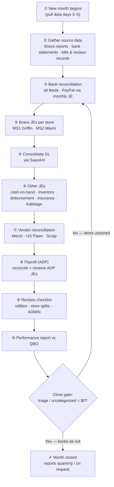

# Magnum 152 — Monthly Bookkeeping & Close Runbook

> **Status:** Active · **Client:** MAGNUM 152, INC (QBO via Double) · **Owner of SOP:** Maria · **Last updated:** 2026-07-21
>
> **⏳ In review (2026-07-21).** First draft, built from Maria Fernanda's Drive
> "doc guide" as the exemplar for the six Maria-owned clients. **Reviewer: Julia.**
> Remove this note once she signs off on the shape.
>
> This file holds the **procedure and rules only**. Working papers with client
> figures (bank statements, Bravo reports, JE workbooks, reconciliations,
> logins/passwords) live in the firm's client systems (Google Drive / Double /
> QuickBooks) — **never in this repo**. Where a value is sensitive, the SOP points
> to where it lives (a Drive link) instead of printing it.

## The process at a glance

A month is "closed" once every feed is reconciled, all journal entries are booked
and consolidated, the reclass checklist is done, and the triage/uncategorized
accounts read $0. Reports go to the client **quarterly / on request** — not every
month.



## §0. Before you start (intake & scope)

Confirm these before touching the books — they shape the whole close:

1. **Which stores are active this period?** Currently **two — MS1 (Griffin) and
   MS2 (Miami)**. MS3 was sold in 2024 and **MS4 in 2025**, but old MS4 costs
   (rent, a payroll-benefit split) still surface — expect legacy items.
2. **Do we have all logins?** Bravo, SaasAnt, ADP, and each bank. If access is
   lost (a recurring problem — see §7), request it from Julia before starting.
3. **Reporting expectation:** Magnum is the **slowest** of the pawn group to
   close and does **not** need a monthly report — **quarterly or on request**.
   Pull Bravo reports in the **first 3–5 days** of the next month and start early.
4. **Entity & tax:** S-corp, files **Form 1120-S**; **1099 preparation** is part
   of the engagement. Sales tax **N/A**.

## §1. Systems & where access lives

All credentials live in **Maria's doc guide** in Drive (see §8) — never copy them
here.

| System | What it's for |
|---|---|
| **QuickBooks Online** (via Double) | The books / general ledger |
| **Bravo (Bravo Pawn Systems)** | Store POS + inventory — the monthly source reports |
| **SaasAnt** | Bulk-import / consolidate the store GL into QBO |
| **ADP (RUN / Accountant Connect)** | Payroll (run by the owner group) → we reconcile it |
| **Banks & cards** | Statements + reconciliation (see §2) |

## §2. The accounts & feeds

Reconcile **every** account below. Referenced by last-4 only — full numbers and
logins stay in Drive.

- **PayPal 1015** — ⚠️ **feed sync is broken → booked via a monthly journal
  entry**, not a live feed.
- **TD Bank ×5** — 5100, US1 2873, US2 5093, US3 5085, US4 3178.
- **Amex** credit card.
- **Chase ×2** — 2054, 2055.
- **Capital One ×2** — 4850, 1395.

## §3. The monthly close, step by step

### Step 3A — Bank reconciliation
Reconcile each feed in §2. **PayPal is not a live feed** — record it with the
**monthly PayPal JE** instead of matching. Bank-feed handling rules live in §7
(read them — they prevent the recurring errors on this client).

### Step 3B — Bravo reports → per-store journal entries
1. Log in to **Bravo** and download each active store's reports; **save them to
   the client's Drive folder**.
2. Create the **monthly journal entries per store** (MS1 Griffin, MS2 Miami).

### Step 3C — Consolidate the GL with SaasAnt
Use **SaasAnt** to import / consolidate the per-store general ledger into QBO
(the consolidation worksheet is in Drive).

### Step 3D — Other journal entries
Book the remaining recurring JEs (details in §4): miscellaneous / disbursement,
cash-on-hand adjustment, inventory adjustment, Pirate Shipping, insurance, and
the Kabbage loan.

### Step 3E — Vendor reconciliation
Reconcile the vendor accounts: **Merch adj**, **US Pawn adj**, **Scrap adj**.

### Step 3F — Payroll (ADP)
Payroll is **run by the owner group in ADP — not by JK.** Our job is to
1. **reconcile ADP** into the books, and
2. **rename the ADP journal entries** to the house naming (e.g. `ADP MM-DD-YY`
   and the matching `MM-DD-YY PayrollClear`).

### Step 3G — Reclass checklist
Work the standing reclasses in §5.

### Step 3H — Performance report vs QBO
Produce the **Performance Report vs QBO** (worksheet + output folder in Drive) as
the final tie-out that the store numbers agree with the books.

## §4. Recurring journal entries (the monthly set)

| JE | Notes |
|---|---|
| **PayPal (1015) monthly JE** | Because the feed sync is broken (§2) |
| **Per-store Bravo JEs** | One per active store (MS1, MS2) |
| **Cash-on-Hand adjustment** | From the store cash counts |
| **Inventory adjustment** | From Bravo inventory |
| **Miscellaneous / Disbursement JE** | Owner disbursement expenses |
| **Pirate Shipping** | Shipping costs |
| **Insurance** | From the insurance documents in Drive |
| **Kabbage loan** | Loan activity (uses the Amex login) |
| **ADP payroll JEs** | Reconciled + renamed (§3F) |

> _(Note: one "Alla Trost" JE is **on hold** pending information — do not book it
> until Julia confirms.)_

## §5. Standing reclass checklist

Run every month. **Store class** (MS1 / MS2 / ADMIN) is confirmed at month-end
from the admin assistant's bills.

- [ ] **Comcast** — reclass using the account number.
- [ ] **FPL** — check the FPL site against the TD statements, then reclass.
- [ ] **Bravo** — split across the active stores.
- [ ] **ReadyRefresh** — distribute between **MS1 and MS2**.
- [ ] **Waste Management** — split between MS1 and MS2 (two separate bills).
- [ ] **Gearfire** — split between MS1 and MS2.
- [ ] **Rent** — code to the correct store/landlord.
- [ ] **Automobile, Meals, Interest, Dues & Subscriptions** → **ADMIN** class.
- [ ] **Amex — Amazon / Dollar General / Publix** → reclass to the store that
      incurred the charge (check who/where).
- [ ] **Large disbursement repairs / store signage** → **Leasehold Improvement**.
- [ ] **Payroll-benefit health insurance** → split by class.

## §6. Reporting cadence & the close gate

- **Close gate (do not skip):** the triage / **Uncategorized** accounts must read
  **$0** before the month is called closed. A balance there means something is
  still unsorted. (A $0 triage is necessary, **not** sufficient — coding still has
  to be *right*, per §7.)
- **Reports to the client:** **quarterly / on request** — Magnum does **not** get
  a monthly report.

## §7. Common pitfalls (lessons the hard way)

- **Don't match open JE balances for vendors against payments — always
  categorize.** Matching hides the real activity on this client.
- **TD Bank check images don't attach in QBO.** Pull the image from the bank and
  use the **vendor** to decide the account. The **store class** for a check is
  known only at month-end, once the admin assistant sends the bills.
- **Amex *payments*** → book as a **credit-card payment from TD Bank**, then match
  in TD Bank (filter by date, match the most recent payment).
- **Amex *expenses*** → determine which store they belong to. Meals,
  subscriptions, and automobile → **ADMIN** always (most already have rules);
  Amazon-type purchases need the store identified by who made them.
- **PayPal 1015 has no working feed** — never wait for it to sync; it's a JE.
- **Recurring Bravo access loss** — the person who managed access left; if login
  fails, request it from Julia rather than stalling the close.

## §8. Contacts & links

Personal names, emails, phones, and all logins live in **Double / Drive** — open
them live when a task needs a value; never printed here.

| For | Where |
|---|---|
| Client record (contacts, properties) | [Double client 706693](https://app.doublehq.com/close?cid=706693) |
| Sensitive vault (statements, workbooks) | [MAGNUM 152 Drive folder](https://drive.google.com/drive/folders/1dLNC_dbkASqtwMJNkna8zv-dDvcNTbxM) |
| **Full process guide + all credentials** | [Maria's Magnum doc guide (Drive)](https://docs.google.com/document/d/1XGUch-7eAhLEGBFM4e5ashmp8Wz8q-j1bwwWnlnJkpg/edit) |
| Client Intelligence (facts about this client) | [`../client-intelligence/clients/magnum-152.md`](../client-intelligence/clients/magnum-152.md) |
| Sister client (same owner group) | [`../client-intelligence/clients/sunoma-inc.md`](../client-intelligence/clients/sunoma-inc.md) |

## §9. Reference material (Drive) — step folders & tutorials

Maria organized the process into numbered step folders (screenshots) under
[Magnum Tutorials](https://drive.google.com/drive/folders/1ejnEIkjPrR1aU4aV36DbP7w1RsLwpESt):

- `0. Bank Feed – categorizing`
- `1. Bank Reconciliation`
- `2. Bravo reports`
- `3. Other JE`
- `4. Vendor reconciliation`
- `5. Performance Report vs QBO`
- `6. ADP reconciliation`
- `7. Reclass records`
- `8. Rename ADP JEs`
- `9. Monthly Check List`

## Appendix — monthly close checklist (copy into the client's folder)

Copy this into Drive/Double for the period; the filled-in copy never returns to
the repo.

```
MAGNUM 152 — Monthly close — Period: __________  ·  Bookkeeper: __________

Active stores this period: [ ] MS1 Griffin   [ ] MS2 Miami   Legacy MS4 items? [ ]

[ ] Bravo reports downloaded + saved to Drive (per store)
[ ] Bank reconciliation — PayPal 1015 (JE) / TD ×5 / Amex / Chase ×2 / Cap One ×2
[ ] Per-store Bravo JEs booked (MS1, MS2)
[ ] GL consolidated via SaasAnt
[ ] Other JEs: cash-on-hand / inventory / disbursement / Pirate Shipping / insurance / Kabbage
[ ] Vendor reconciliation: Merch / US Pawn / Scrap
[ ] ADP reconciled + JEs renamed
[ ] Reclass checklist complete (see §5)
[ ] Performance Report vs QBO produced
[ ] CLOSE GATE: triage / Uncategorized = $0
[ ] Reports (quarterly / on request only) — sent? ________
Open items / notes: ______________________________________________
```
