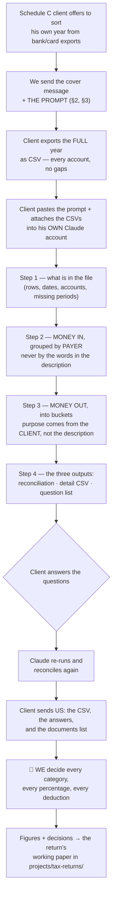

# SOP: Client-run Schedule C triage from a bank CSV — the prompt we send

> **Status:** Draft · **Owner:** Julia · **Last updated:** 2026-09-18
>
> **Where client data goes:** the client's CSV, the classified output, and the
> answers he writes back are **client records** — they live in the client's
> **Drive / Double** folder, never in this repo. This file keeps only the
> reusable prompt and the procedure around it.
>
> ⓘ **Pending:** this SOP has **no Atlas render and no Knowledge Hub card yet**
> (the [`sop-authoring`](../../.claude/skills/sop-authoring/) standard). Build
> both when the prompt has been used once and its wording has settled.

When a Schedule C client offers to sort out his own year — *"I'll send you the
bank statements, I can put them in categories"* — this is what we send him.
It is a **prompt he pastes into Claude** together with his CSV exports. What
comes back is not a set of expense figures. It is a **reconciled, payer-grouped
worklist plus the question list only he can answer** — which is the part of the
job that otherwise consumes the firm's hours.

---

## The process at a glance



---

## §0 · When to send this — and when not to

**Send it when:**

1. The client is a **sole proprietor / single-member LLC** whose business lands
   on **Schedule C**, and
2. he has **no bookkeeping** for the year — no QuickBooks, no ledger — only
   bank and card activity, and
3. he **wants to do the sorting himself**, or has already started building a
   spreadsheet of his own.

**Do NOT send it when:**

1. The client is a **bookkeeping client** of ours — the books are the source,
   and a parallel CSV triage only creates a second version of the truth.
2. The return is an **entity return** (1120-S, 1065). A company return runs off
   its **ledger**, not a bank export.
3. The client has **already sent** us a file and is waiting on us — read what he
   sent first (*look before you ask*,
   [`method.md`](../pre-return-review/method.md) rule 1).

---

## §1 · What this can produce — and what it can never produce

**It produces:** every transaction of the year sorted, counted and reconciled;
inflows grouped **by payer** with year totals; a clean separation of the money
that is not income and the money that is not a deduction; and a **numbered
question list** with the payee names and year totals already attached, so the
client can answer it in one sitting.

🛑 **It does NOT produce deductible expenses**, and the prompt says so to the
client in its own words. The reason is the gate the
[`personal-card-reimbursement`](../../.claude/skills/personal-card-reimbursement/)
skill is built around: **a bank description is not a business purpose.** A CSV
records that money moved and what the bank called the payee. It never records
**why** — so a file without a purpose column can be **triaged, not categorised**.

Four more things a bank CSV can never answer, all of which the prompt routes to
us instead of guessing: the **vehicle** (mileage vs actual, and the method
election), the **home office** (exclusive use, and simplified vs actual),
**meals** (the per-meal elements), and **anything bought that lasts beyond a
year** (capital, not a supply).

---

## §2 · The message that goes with it

**English — email or WhatsApp:**

> Hi [NAME],
>
> Here is the easiest way to do this. Export your [2025] bank and credit-card
> activity for the **whole year** as **CSV** files — one per account, every
> account you used for the business, January through December.
>
> Then open Claude (claude.ai), attach the files, and paste the text below as
> your message. It will sort everything, add it up, and come back to you with a
> list of questions. Answer the questions in the same chat and it will update
> the files.
>
> Send us: the final CSV it produces, its list of questions **with your
> answers**, and anything it asks you to dig out. We make all the tax decisions
> from there — you do not have to decide what is deductible.
>
> One thing to watch: it will ask you *why* you spent money in certain places.
> That is the whole point of the exercise. The bank only tells us where the
> money went, never what it was for, and without the "what for" we cannot
> deduct it.

**Russian — same message:**

> Здравствуйте, [ИМЯ]!
>
> Проще всего сделать так. Выгрузите операции по всем счетам и картам за
> **весь [2025] год** в формате **CSV** — по одному файлу на счёт, все счета,
> которые вы использовали для бизнеса, с января по декабрь.
>
> Затем откройте Claude (claude.ai), прикрепите файлы и отправьте текст, который
> я привожу ниже, в качестве сообщения. Он разложит все операции по категориям,
> всё посчитает и вернётся к вам со списком вопросов. Ответьте на вопросы в этом
> же чате — и он обновит файлы.
>
> Нам пришлите: итоговый файл CSV, список его вопросов **с вашими ответами** и
> всё, что он попросит вас найти. Дальше все налоговые решения принимаем мы —
> вам не нужно решать, что подлежит вычету, а что нет.
>
> Один момент, к которому стоит подготовиться: он будет спрашивать, **с какой
> целью** были те или иные расходы. В этом и смысл всей работы. Банк показывает
> только, куда ушли деньги, но никогда — на что именно; а без ответа «на что» мы
> не можем поставить расход в вычет.

---

## §3 · THE PROMPT — everything between the lines goes to the client

```text
Please help me get my business records ready for my accountant. Talk to me in
[English / Russian / Ukrainian — keep one, delete the rest].

BACKGROUND
- I am a sole proprietor in the United States. My business profit is reported on
  Schedule C (Form 1040) for tax year [2025].
- I am attaching CSV exports covering the whole year for these accounts:
  [list them, e.g. "Chase business checking, Chase Ink card, personal Amex"].
- My business is: [one or two sentences — what you actually do, and for whom].
- My accountant makes every final decision. You are not preparing a tax return
  and you are not deciding what is deductible.

WHAT I NEED FROM YOU
Sort every transaction of the year into categories my accountant can use, add it
all up so that nothing is lost or counted twice, and give me a list of the
questions only I can answer. "I don't know, ask the client" is a correct answer.
A wrong category is not.

HOW TO WORK — these rules apply to every step
1. Read the files with code, not by eye. Every single row must be counted, and
   every total must be computed from the data. Keep the cents.
2. Never drop, merge, round or net a transaction. If I paid one place 40 times,
   the detail file still has 40 rows.
3. Never decide what a transaction was from the bank's own description. Words
   like PAYROLL, DIRECT DEP, DEPOSIT, ZELLE, TRANSFER, or a shop's name tell you
   that money moved, not what it was for. Businesses also change how they label
   payments in the middle of a year, so the same thing can appear under two
   different descriptions. If I have not told you what something was, it goes in
   the "ask the client" pile.
4. Never apply a percentage, never split a payment between business and personal,
   never estimate. Those are my accountant's decisions, not yours and not mine.
5. Do the four steps below in order. Stop at the end of each one and wait for me.

STEP 1 — TELL ME WHAT IS IN THE FILE, before classifying anything
Report, and then wait:
 a. For each file: the account, the column names, the number of rows, the first
    and last date, and how you can tell a debit from a credit in that file
    (negative amounts, or separate debit/credit columns). Tell me the convention
    you detected and ask me to confirm it.
 b. Total money in and total money out, per account and overall.
 c. Any month with no transactions, any gap of more than a week, and whether the
    year is complete from 1 January to 31 December. Say so plainly if a file
    stops early.
 d. Rows with no description, a garbled description, or a zero amount.
 e. If a file has a running-balance column, say so — never treat a balance as an
    amount.
Then ask me these intake questions:
 - Is each account business, personal, or mixed?
 - Are there any accounts, cards, cash, PayPal/Zelle/Venmo/Cash App or Stripe
   accounts used in the year that are NOT in these files?
 - Did I get paid in cash at all?
 - Do I have another job where I get a W-2, and which employers?
 - Do I run more than one kind of business?
 - Do I sell physical products, or is it a service business?
 - Do I have 1099-NEC or 1099-K forms for the year, and from whom?

STEP 2 — MONEY IN. Group it by WHO paid me, never by what the bank called it
 a. Normalise each deposit's description to a payer name, then build one row per
    payer: payer, number of deposits, first and last date, total for the year.
    Sort by total, largest first.
 b. Do NOT classify a deposit as business income because it looks like one.
    Put every payer into one of these, and only from what I tell you:
    I1 — BUSINESS INCOME: customers and clients who paid me for my work
         (Schedule C line 1, gross receipts).
    I2 — REFUNDS I GAVE BACK to a customer (Schedule C line 2).
    I3 — NOT INCOME AT ALL: transfers between my own accounts; money I put into
         the business myself; loan, credit-line or advance proceeds; credit-card
         cash advances; refunds and chargebacks from a shop or supplier (these
         reduce the expense, they are not income); gifts and money from family;
         tax refunds; reimbursements of something I paid for someone else.
    I4 — WAGES from an employer, i.e. a job with a W-2. This is never Schedule C
         income. Check every payer against the employer names I gave you in
         step 1, including deposits that do not have the word "payroll" in them.
    I5 — UNKNOWN: ask me. Name the payer, give the year total and the number of
         deposits, and ask me who they are and what the money was for.
 c. Flag any payer that both paid me and was paid by me, and ask which direction
    was the business.
 d. Give me total money in, split across I1 to I5, and a month-by-month total of
    I1, so I can see at a glance if a month is missing.

STEP 3 — MONEY OUT. One bucket per transaction, and nothing is dropped
Use exactly these buckets. Where a bucket names a Schedule C line, that is the
2025 form's own wording.

 A — BUSINESS EXPENSES, once I have told you the business reason:
     8   Advertising
     10  Commissions and fees
     11  Contract labor (people I paid who are not employees)
     14  Employee benefit programs
     15  Insurance (other than health)
     16a Interest — mortgage (paid to banks, etc.)
     16b Interest — other
     17  Legal and professional services (includes accounting fees)
     18  Office expense
     19  Pension and profit-sharing plans — for EMPLOYEES, not for me
     20a Rent or lease — vehicles, machinery and equipment
     20b Rent or lease — other business property
     21  Repairs and maintenance
     22  Supplies
     23  Taxes and licenses
     24a Travel (flights, hotels, out-of-town trips for work)
     25  Utilities
     26  Wages paid to employees through payroll
     27b Other expenses — each item needs its own short description
     If I sell physical products, also: cost of goods — purchases for resale,
     cost of labour, materials and supplies, other costs (Schedule C Part III).

 B — FOR MY ACCOUNTANT TO COMPUTE. Collect these in their own pools with the
     full detail, and do NOT put them on a Schedule C line and do NOT total them
     as if they were deductions:
     - VEHICLE: car payments, fuel, insurance, repairs, tolls, parking,
       registration. (A loan payment is not a deductible expense; only parts of
       it can be. The accountant also has to choose between mileage and actual
       costs, and needs evidence of business miles.)
     - HOME: rent, mortgage, home utilities, home internet — anything for the
       place I live. (This is a home-office computation on a separate form, if
       it qualifies at all.)
     - MEALS: list each one with date, place and amount, and add two empty
       columns for me to fill in — who was there, and what the business reason
       was.
     - EQUIPMENT AND ANYTHING THAT LASTS LONGER THAN A YEAR: computers, phones,
       furniture, tools, a vehicle. Flag every single purchase of $2,500 or more
       for review as well. These are written off over time, not as supplies.
     - PHONE AND INTERNET: only a business share can be claimed, and I have to
       establish it.
     - HEALTH INSURANCE premiums for me and my family — these go elsewhere on
       the return, not on Schedule C.
     - RETIREMENT contributions for myself (SEP-IRA, solo 401(k)) — also not
       Schedule C.
     - Anything used for both business and personal.

 C — MONEY OUT THAT IS NOT A BUSINESS EXPENSE. List it anyway, with totals — my
     accountant needs to see it:
     - Money I moved to myself, owner draws, transfers to my personal accounts.
     - Transfers between my own accounts.
     - Payments TO a credit card that is also in these files. The purchases on
       that card are already counted; counting the payment too is double
       counting.
     - Loan and financing repayments. Show the total, and note that interest may
       be deductible if a year-end statement from the lender separates it.
     - Estimated tax payments to the IRS or a state — list every one with its
       date and amount.
     - Fines, traffic tickets and penalties of any kind, and legal costs to
       fight them.
     - Entertainment: sports, concerts, clubs, golf.
     - Charitable donations.
     - Personal and family spending, groceries, medical, shopping.

 D — UNKNOWN. Anything where I have not given you a business reason. Group these
     by payee with the year total and the number of transactions.

Also do these checks and report what you find:
 - DOUBLE COUNTING: the same bill reaching the same place by two routes — for
   example rent paid both directly and through a rent-financing app, or a charge
   on a card that also appears as a bank payment. Flag it; never net it out.
 - Identical amounts to the same payee within a few days across two accounts.
 - Any payee I paid $600 or more in total over the year who looks like an
   individual or a small unincorporated business. List them with year totals —
   I may owe them a 1099 form and my accountant has to know.

STEP 4 — THE OUTPUT. Give me all of this:
 1. A RECONCILIATION that proves nothing was lost:
    - rows in the files = rows classified;
    - total money in = I1 + I2 + I3 + I4 + I5;
    - total money out = A + B + C + D.
    If either does not balance to the cent, say so and show me the difference.
 2. A SUMMARY TABLE: every bucket, its number of transactions and its total.
 3. A MONTH-BY-MONTH table of money in and money out.
 4. A DETAIL FILE I can download as CSV, containing every original row with its
    original columns, plus these added columns: account, payee (normalised),
    bucket, Schedule C line (blank where there is none), business purpose (blank
    where I have not given one), confidence (high / medium / ask me), and the
    number of the question that covers it.
 5. THE QUESTION LIST, numbered, grouped by subject, in plain language — no tax
    terms. Attach the payee name, the year total and the number of transactions
    to each question so I can answer without going back to the file. Do not ask
    me about anything I have already told you.
 6. A LIST OF DOCUMENTS my accountant will need (for example: a year-end
    statement from the car lender, 1099 forms, receipts for equipment, a
    phone bill, statements for any period missing from these files).

AFTER I ANSWER
Update the classification and the detail file, run the reconciliation again, and
show me what changed. Do not ask me the same question twice. Then give me the
final files to send to my accountant, and tell me plainly what is still
unresolved — a short honest list of open items is worth more to my accountant
than a confident guess.
```

---

## §4 · What comes back, and what we do with it

| What arrives | What it is worth | What we do |
|---|---|---|
| The **detail CSV** | Every row of the year, sorted and reconciled | Read it as **triage**, never as categories. No expense is accepted on it alone |
| The **payer-grouped income list** | 🔴 **The most valuable part.** Income the firm never knew about surfaces here, by name and year total | Check **every payer** against the W-2 employers and the 1099s already on the return before a dollar goes on line 1 |
| The **answered question list** | The business purposes, in the client's own words | This is what converts a triaged row into a deduction |
| The **"not income" and "not deductible" piles** | What we do **not** have to chase | Skim for anything misfiled into them |
| The **$600+ payee list** | The 1099 exposure, before we answer Schedule C lines I and J | Establish the year total **per person**, then decide |

🛑 **Nothing keyed straight from the file.** Every figure taken from it is
recorded in the return's working paper in [`projects/tax-returns/`](../tax-returns/)
with the source that established it — the client's answer, a statement, a form —
never "the client's spreadsheet said so".

---

## §5 · The pitfalls this prompt exists to prevent

Each of these is from a **real 2025 Schedule C return** where the client built
his own full-year extraction of four bank and card accounts before we asked him
to (Sept 2026; the named record is in that return's working paper).

1. 🔴 **A deposit is not revenue, and the income side is where a client file does
   the real damage.** His tool keyed on the literal word `PAYROLL` in the bank
   description. One employer changed its descriptor from `DIRECT DEP` to
   `PAYROLL` mid-year, so **the same employer's pay landed in two different
   piles** — and a block of **W-2 net pay already on the return** ended up in the
   "unclassified inflow" pool. He then confirmed those payers as *"work income"*,
   which in his vocabulary means *"money I earned by working"* — **not a
   statement about which schedule a dollar belongs on.** Putting it on Schedule C
   would have reported the same wages twice **and** converted them into
   self-employment income. ✅ **Hence: group by payer, check every payer against
   the employer list, and never read a client's own label as a tax category.**
2. 🔴 **A bank description is not a business purpose.** His workbook had no
   purpose column, and its own honest verdict on itself was that **well under 1%**
   of the year's outflow was a high-confidence deduction candidate; everything
   else was a "review pool". ✅ **Hence: the purpose comes from the client, and
   "ask the client" is a required output, not a failure.**
3. ⚠️ **The same expense can arrive twice by different routes** — rent paid partly
   direct and partly through a rent-financing app, a card charge plus the bank
   payment to that card. ✅ **Hence: flag, never net.**
4. ⚠️ **A percentage asserted after the fact is not evidence** — "80% business
   use", "85% of the phone". ✅ **Hence: the prompt forbids percentages outright
   and routes the vehicle, the home office, the phone and meals to us.**
5. ⚠️ **An export can stop before the year does.** One of his files ended on
   **1 December** — in his busiest month. ✅ **Hence: step 1 checks the period
   before anything is classified.**
6. ⚠️ **A loan payment is not an expense**, but the interest inside it may be, and
   only a lender's year-end statement separates them. ✅ **Hence: it is listed,
   with the document named.**
7. ⚠️ **Contractors he paid surfaced in the same file** — referrals, leads, a
   paralegal — with **Schedule C line I still answered "No"**. ✅ **Hence: the
   $600 sweep is part of the prompt, not an afterthought.**

---

## §6 · Where the client's output goes

1. The CSV and the answers go to the **client's folder in Drive / Double** — they
   are client records, and **never into this repo**.
2. What the firm **decided** from them — which figure, which line, why, and what
   the client actually said — goes into the return's **working paper** in
   [`projects/tax-returns/`](../tax-returns/).
3. Anything durable we learn about the client along the way (a second business, a
   licence, contractors he pays every year) goes into their
   [**Client Intelligence**](../client-intelligence/) file in the same session.

---

## Reference

- **Schedule C line numbers and captions** are quoted from the **2025 Form 1040
  Schedule C** PDF on irs.gov, read 2026-09-18. ⚠️ **Re-read them off the
  current-year PDF each season** — the numbering moves: on the 2025 form
  `Other expenses` is **27b**, and **27a** is the energy-efficient commercial
  buildings deduction.
- The purpose gate: [`personal-card-reimbursement`](../../.claude/skills/personal-card-reimbursement/) §0.
- The return procedure this feeds: [`form-1040-preparation.md`](./form-1040-preparation.md) → M2 · Schedule C.
- The review that runs before preparation: [`organizer-review`](../../.claude/skills/organizer-review/).
